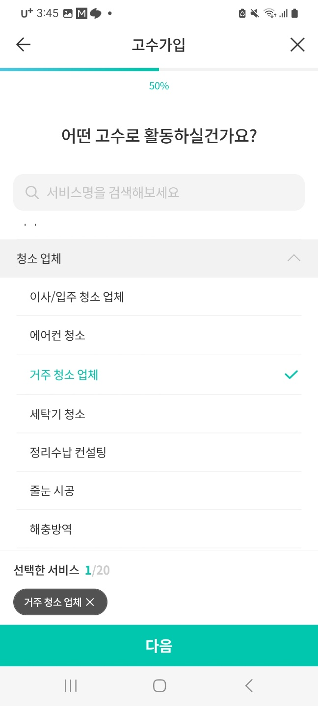
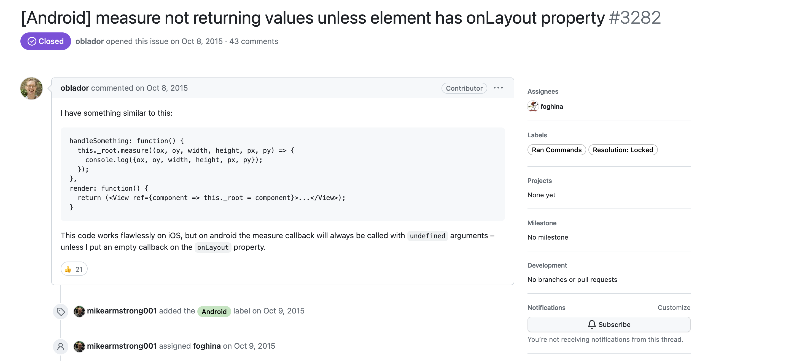
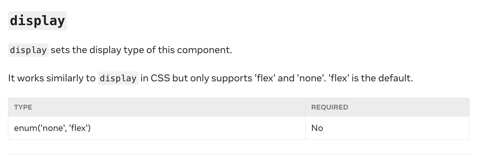

시간이 너무 빠르게 흘러 글을 쓰는 지금은 벌써 5월 5일 어린이날이다. 휴일을 맞아 4월 한달간 했던 업무들을 돌아보고 내가 발전했던 점, 부족했던 점들에 대해 작성해보고자 한다.


## 😆 드디어 배포된 나의 작업들

 4월에 스쿼드에서 작업한 내용들은 두가지로, 회원가입 퍼널을 개선하는 작업과 대시보드에서 커뮤니티로 진입할 수 있게 하는 진입점을 추가하는 작업이었다. 각각의 작업들에 대해 정리해보려 한다.


### 1. 고수 회원가입 퍼널 개선

고수 회원가입 퍼널 개선 업무는 3월부터 진행해 4월 13일에 배포되었다. 클래스 컴포넌트로 2년이 넘었던 레거시 코드였기 때문에 코드 베이스를 우선 이해하는데 많은 시간이 걸렸다. 코드 베이스 중 가장 어려웠던 부분은 단연코 `ViewPager`와 스크롤 이벤트였다.

[현재 PROD에 배포된 고수회원가입 카테고리 선택 화면 ]




#### 기기에서만 보였던 ViewPager 에러

View Pager는 하나의 스크린 컴포넌트에서 ViewPager로 감싸둔 자식 컴포넌트들을 순서대로 페이지 전환 효과를 줄수 있게 도와주는 라이브러리로 현재 모바일 챕터에서 사용하는 패키지는 `https://github.com/callstack/react-native-pager-view` 이다.

당시에 시뮬레이터에서는 정상동작하다가 빌드버전을 확인했을 때 viewPager로 설정해둔 컴포넌트들의 순서가 뒤섞이는 문제가 발생했다. 시뮬레이터에서 문제상황을 재연할 수 있어야 디버깅이 가능한데 시뮬레이터에서는 정상적이고 빌드 버전, 실 기기에서만 나타나는 이슈였기 때문에 디버깅에 큰 어려움을 겪었다. 

이슈를 해결하기 위해 챕터에 공유했고 챕터원 분중에서 react-native 경험이 많으신 웨인께서 `먼저 조건부로 랜더링하는 부분`이 있게 되면 viewPager에서 에러가 발생할 수 있다고 이야기 해주셨고, 히께서 같이 디버깅해주시면서 문제점이 웨인께서 말씀해주신 `조건부로 랜더링되던 부분에서 viewPager의 화면전환을 위한 렌더링 타이밍과 부딪혀 생긴 이슈`라는 것을 함께 찾아주셔서 다행히 해결할 수있었다. (너무 감사했다...)

기존의 조건부 랜더링을 했어야 했던 이유는 위 이미지의 헤더문구와 검색바는 고정시키고 아래 카테고리만 스크롤이 되게하는 요구조건을 구현하기 위해서였다. 해당 스크린 컴포넌트 자체가 상속을 통해 전체 UI가 스크롤되게 감싸져있는 상태였기 때문에 헤더부분을 따로 분리해야 했고, 이부분을 ViewPager  바깥에서 조건부로 헤더를 랜더링하게 구현했다.


```tsx
class SignupProScreen {
    //...
    render() {
        return (
            <>
                {currentIndex === 'Category설정 페이지' && < 고정 헤더 UI/>}
                <PagerView style={styles.pagerView} initialPage={0}>
                    {/*...*/}
                    {/*// 페이지로 하나씩 슬라이드 될 컴포넌트들*/}
                </PagerView>
            </>
        )
    }
}
```


이부분을 해결하기 위해서 먼저 원인이 되었던 viewPager 밖에서 조건부 랜더링하던 부분을 제거했다. 제거 이후에는 ViewPager를 올바르게 사용하기 위해서 좀 더 사용법에 대해 알아보기 시작했다. 

ViewPager에서 가장 중요한 것은 `바로 아래 자식 컴포넌트`다. 아래 코드와 같이 `<PagerView/>`로 감싸진 바로 아래 자식컴포넌트들이 하나의 페이지처럼 동작하기 때문에 `<></>`로 감싸지던지 아니면 다른 Provider 컴포넌트로 감싸지면 정상 동작을 하지 못한다는 것을 새롭게 알게 되었다.

[react-native-pager-view의 예시 코드]

```tsx
import React from 'react';
import { StyleSheet, View, Text } from 'react-native';
import PagerView from 'react-native-pager-view';

const MyPager = () => {
  return (
    <PagerView style={styles.pagerView} initialPage={0}>
      <View key="1">
        <Text>First page</Text>
      </View>
      <View key="2">
        <Text>Second page</Text>
      </View>
    </PagerView>
  );
};

const styles = StyleSheet.create({
  pagerView: {
    flex: 1,
  },
});
```


기존 헤더를 고정시킨 UI와 스크롤이 되어야하는 카테고리를 구현하면서 ViewPager로 함께 동작할 수 있게 구현하기 위해 두가지 컴포넌트를 감싸는 추가적인 컴포넌트를 만들었다. 다행히 내 예상대로 `PagerView` 바로 아래 자식으로 컴포넌트를 전달함으로써 요구조건을 만족시키면서 ViewPager를 이용할 수 있게 구현할 수 있었다. `PagerView` 밖에서 조건부 랜더링을 지양해야한다는 사실을 새롭게 알게된 이슈였다.


[react-native-pager-view의 예시 코드를 활용해 구현한 개선한 코드]

```tsx
import React from 'react';
import { StyleSheet, View, Text } from 'react-native';
import PagerView from 'react-native-pager-view';

const SignupProScreen = () => {
  return (
    <PagerView initialPage={0}>
      ...
      <SignupCategoryComponent key='2'/>
      ...
    </PagerView>
  );
};

const SignupSelectServices:React.FC<props>=(props)=>{
  return(
      <>
  		<고정된 헤더 UI/>
    	<기존 카테고리 선택 컴포넌트/>
      </>  
  )
}

```


#### 컴포넌트 위치 찾기

검색화면에서 원하는 서비스 클릭시, 서비스 선택화면으로 이동하고 해당 서비스로 스크롤이 될 수있게 설정해야 했다. 이 조건을 위해서 선택된 서비스가 랜더링된 위치값을 구해야 했는데 이를 위해 react-native의 위치를 구하는 메소드들에 대해 공부하는 기회가 되었다.


##### measure(callback)

measure는 부모 컴포넌트를 기준으로 좌표값을 가져오는 메소드다. measure가 가장 간단했기 때문에 먼저 시도했지만 문제는 `AOS에서 measure로   해당 위치를 가져올 수 없는 문제`가 존재했다.


[measure를 사용하는 예제]

```tsx
const MyComponent = () => {
  const ref=useRef<View>(null)
  const scrollRef=useRef<ScrollView>(null)
  
  const scrollToItem=()=>{
    ref.current.measure((x, y, width, height, pageX, pageY)=>{
      scrollRef.current.scrollTo({ x: x, y: y, animated: true })
    })
  }
  
	<ScrollView ref={scrollRef}>
  	<View ref={ref}>...</View>
  </ScrollView>
}

```


AOS에서 measure로 좌표 값을 받을 수 없는 문제는 나만 겪은 문제가 아니라 RN 레포의 이슈에도 남아있던 오래된 문제로 보였다. 


[[RN 레포에서 찾은 이슈 ](https://github.com/facebook/react-native/issues/3282)]




해당 이슈의 해결방법은 2가지가 있었는데 `Collapsable={false}`로 수정하는 방법,  `measureLayout`메소드를 사용하는 방법이었다. 둘중에 선택한 방법은 measureLayout을 이용하는 방법이었다.

 `Collapsable={false}` 방법은 기존의 AOS가 성능 최적화 목적으로 view를 계층에서 제거하기 때문에 좌표를 반환하지 않는 것을 계층에서 제거하지 않게 막는 방법이다. 결국 성능 문제와 관련 있기 때문에 최대한 지양해야 한다고 생각되었다. 그래서 두번째 방법 measureLayout 메소드를 이용했다.


##### measureLayout(relativeToNativeComponentRef, onSuccess, onFail)

measureLayout은 measure와 다르게 ref값을 `findNodeHandle` 를 이용해 네이티브 뷰의 요소를 전달하고, 성공했을 때와 실패했을 때 실행할 콜백함수를 각각 전달할 수 있다. measureLayout을 이용해서 기존 measure코드를 수정했고 다행히 AOS/IOS 모두 동일하게 새롭게 추가한 서비스로 정확하게 스크롤이 되는 것을 확인할 수 있었다.


[해당 이슈의 답변으로 제시된 예제 코드]

```tsx
import { findNodeHandle, ScrollView, View } from 'react-native'

class SignupProScreen {
    //...
    render() {
        this.VIEW_REF.measureLayout(
            findNodeHandle(this.SCROLLVIEW_REF),
            function(x, y) {
                console.log(x, y);
            },
            function(error) {
                console.log(error);
            }
        );
        
        return (
            <ScrollView ref={ref => SCROLLVIEW_REF = ref}>
                <View ref={ref => VIEW_REF = ref}>
                    {/*...*/}
                </View>
            </ScrollView>
        )
    }
}

```


[개선된 서비스 선택-> 페이지이동-> 스크롤 로직]

<table>
  <tr>
<th>AS-IS</th>
<th>TO-BE</th>
</tr>
  <tr>
<td><video src="https://user-images.githubusercontent.com/80830981/232484796-71d72623-2d21-414f-aea9-6e000ad62223.mov" width="300" />
</td>
<td><video src="https://user-images.githubusercontent.com/80830981/232484583-968acbe9-f71d-4c11-880f-fd5b28ca8e6f.mov" width="300" />
</td>
</tr>
</table>


크고 작은 이슈들과 QA들을 거쳐 드디어 첫 작업이 배포되었고 어려웠지만, RN에 대해서, 회사 코드 베이스에 대해서 깊이 이해할 수 있는 기회가 되어서 많이 성장할 수 있는 기회가 된 작업이었다. 현재 실험상으로는 아직 기존 고수 회원가입 화면이 더 결과가 좋아서 롤백이 될 수도 있지만... 내가 한 작업이 의미있는 작업이었길 바래본다 🙏


### 2. 고수 대시보드 커뮤니티 진입점 추가 작업

고수 대시보드 커뮤니티 진입접 작업은 기존에 없던 고수 대시보드에 커뮤니티 큐레이션 카드들을 보여줄 수 있는 섹션을 추가하는 작업이었다. 이전에 했던 고수 회원가입 퍼널 개선 작업보다 상대적으로 적은 스크린 이동과 상태관리의 요구조건으로 편하게 작업할 수 있었다.  

[고수 대시보드화면에 추가된 커뮤니티 진입점]


#### RN에는 display:inline이 없어


위 사진에서 보이는 `얼마에요`에 해당하는 UI를 만드는 과정이 조금 어려웠다. 왜냐하면 React와 다르게 RN에서는 `display`에는 inline속성이 없다.

[RN 공식 display 속성 설명]



그렇기 때문에 기본적인 가로 전체 영역을 가지고 있어 inline으로 text길이 만큼만 영역이 표시될 수 있게 방법을 찾아야 했다. 방법은 생각보다 간단했는데 `flexDirection`을 'row'로 설정하게 되면 기본적으로 inline처럼 영역을 차지하게 되는 것을 확인할 수 있었다.

#### API는 전달받은 대로 호출만 하기

커뮤니티 작업을 하면서 코드리뷰를 통해 배울 수 있었던 부분 중 가장 기억이 남는 부분은 `API에 로직이 포함되지 않게하기 `이다.  모바일 팀은 Repository 패턴을 사용하고 있다. Repository 패턴을 쓰는 이유는 전달 받아 Repository를 사용하는 곳에서는 어떻게 데이터를 받아오는 지에 대해 모르게 계층을 추가하기 위해서다. 그래서 컴포넌트에서 직접 API를 호출하지 않고 Repository를 통해 필요한 API를 호출한다.

커뮤니티 작업을 위해서는 기존 API 메소드에 새로운 인자를 추가적으로 전달해야 했고, 해당 인자의 유무에 따라 다른 param으로 API를 호출해야 했기 때문에 API 메소드에서 분기처리를 하는 코드를 작성했다.

코드리뷰를 통해 `API는 repository 의 요청을 수행하기만 하게, 어떤 진입점에서, 어떤 param에서 호출이 되는지 알 필요가 없을 것 같다`는 피드백을 받을 수 있었다. API는 로직을 포함하지 않고 Repository에서 호출한 내용만 수행하게 수정하는 것이 더 적절하다는 점을 알게 되면서 Repository 패턴에 대한 이해가 할 수 있었다.


[코드리뷰 받기 전 API에 분기점을 추가했던 예시 코드]

```tsx
export class API {
    getData = (params: {
        id: ID,
        //...
    }): Promise<ResponseDto> => {
        const baseConfig = {...}
        return this.apiClient
            .get<ResponseDto>('api주소', {
                params: isNotNil() ? {...baseConfig, id} : baseConfig,
            })
            .then((result) => result.data)
            .then((response) => response.response)

    }
}
```


[코드 리뷰 받은 후 Repository에 분기점을 추가한 예시 코드]

```tsx
export class Repository{
	getData = (
    ...
    id
	): Promise<ResponseType[]> => {
    const baseConfig = { ... };
    return new Api()
        .getCuration(isNotNil(location) ? { ...baseConfig, id } : baseConfig)
        .then((result)=>result)
  }
}

export class API{
  getData = (params: {
        //...     
    }): Promise<ResponseDto> => {
        return this.apiClient
            .get<ResponseDto>('api주소', {params})
            .then((result) => result.data)
            .then((response) => response.response)
	}
}
```


## 😄 새롭게 사용했던 Git 명령어들

4월 동안 작업하면서 새롭게 사용한 Git 명령어는 `rebase --onto` 와 `reset`으로 각각에 대해 정리해보려 한다.

### rebase --onto

rebase는 다양한 option을 전달함으로써 여러 상황에서 사용할 수 있다. 그중에서 부모 브랜치를 바꿔야할 때  `rebase --onto` 를 사용할 수 있다. 

- 사용법: `git rebase --onto <newbase> <upstream> [<branch>]`

기존 `git rebase` 의 경우 예시와 같이 featureA 브랜치 작업내용에 대해 PR를 작성하고 featureA에서 featureB로 브랜치를 만들어 작업하면서 자주 사용했다. featureA PR에서 변경점 (F~G)이 생기고 변경점에 대한 내용이 featureB에서 사용해야 될 때 rebase를 이용하면 브랜치가 만들어진 지점을 C가 아닌 G로 바꿔 해당 작업을 반영할 수 있다.

[예시]

```text
Before                         		After
A---B---C---F---G (featureA)   		A---B---C---F---G (featureA)
         \                              		  \
          D---E (featureB)                   	           D'---E' (featureB)
```


`rebase --onto`는 위보다 조금 더 많은 브랜치가 있을 때 부모 브랜치를 바꿀 때 사용될 수 있다. 아래 예시에서 featureB를 부모 브랜치로 가지고 있는 featureC 브랜치의 작업을 featureA로 바꾸고 싶은 상황이다. 

그냥 rebase를 사용하게 되면 기존 부모 브랜치의 커밋들도 함께 rebase되어 아래 예시에서 D'~I'으로 커밋이 featureA에 추가되게 된다. 우리가 하고 싶은것은 featureC에서 featureB 작업을 제외하고 featureA로 rebase 시키고 싶은 것이므로 이때는 `git rebase --onto featureB featureC` 를 이용할 수 있다.


```text
Before                         		 rebase														  After
A---B---C---F---G (featureA)   		 A---B---C---F---G (featureA)  			A---B---C---F---G (featureA)
         \                              	  \	      \					 \       \
          D---E (featureB)                 	    D---E      D'---E'			           D---E   \		 
               \						      \					    H---I (featureC)
                H---I (featureC)			               H'---I'
```


### git reset

git reset의 경우 커밋한 작업을 되돌릴 때 사용할 수 있는 방법으로 연결리스트의 HEAD를 이전 커밋으로 돌려 기존 커밋들의 연결을 끊어버리는 방법을 사용한다. 옵션에 따라 되돌려진 커밋들의 변경내용을 아예 없애거나 working directory 또는 staging area 상태로 변경내용을 남길 수 있다.


[Git reset b 를 적용한 모습]

<table>
  <tr>
    <th>AS-IS</th>
    <th>TO-BE</th>
  </tr>
  <tr>
    <td>
    </td>
    <td>
    </td>
  </tr>
</table>


## 🥹 마치며

4월 한달도 많은 것을 배우고 느꼈고 내가 목표로 했던 작업들도 다 해볼 수 있어서 나름 성공(?)한 한달이었던 것 같다. RN Debugger의 react devtools를 다시 사용할 수 있게 했던 작업들은 5월에 발표자료와 함께 정리해볼 예정이다. 고수 회원가입 퍼널 개선이라는 큰 작업을 하면서 작업단위를 너무 크게 잡아서 코드 리뷰를 받을 때 PR를 더 작게 만드는 게 좋겠다는 점과 내가 반복해서 놓치는 팀 컨벤션에 대한 피드백을 받았다. 이러한 부분은 내가 더 신경쓰면 고쳐질 수 있는 부분이라 생각하고 부족함을 많이 느끼기도 했다. 다음 달은 내가 맡은 도메인, 내가 작성한 코드에 대해서 더 잘 이해할 수 있기를 바라본다.

