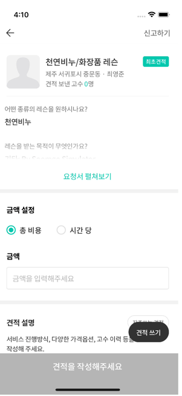
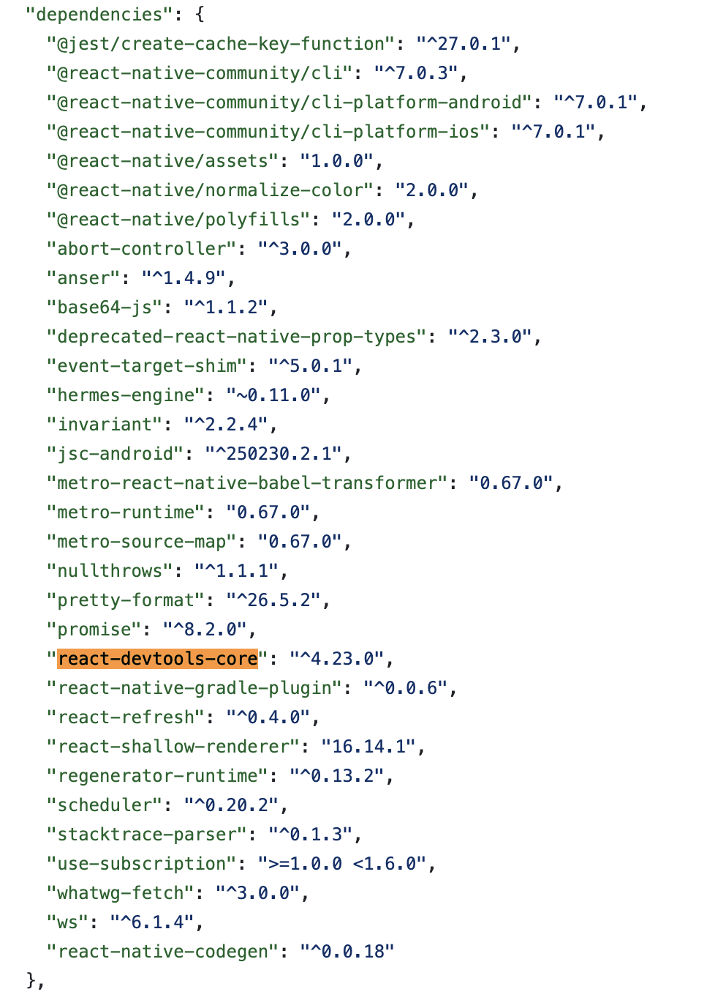

5월은 이전 두달과 달리 더욱 다이나믹 했던 것 같다. 개인적인 일로는 수습기간이 끝나고 정식으로 입사하기도 했고, 큰 일감들이 배포된 이후 장애가 발생해 급하게 핫픽스를 하는 등 정말 많은 걸 배우고 느낄 수 있었던 한달이었다. 그중에서 내가 느꼈던 일하는 방식과 기술적 이슈들에 대해 정리해보고자 한다. 


###  드디어 출시된 요청 견적서 작업 

원래 우리 스쿼드는 사용성을 주로 담당하는 업무를 해왔지만 이번에 새로운 시도로 견적발송과정을 개선하는 실험을 진행했다. 우리가 개선하려하는 부분은 견적발송을 위한 기존 플로우 `요청서 상세 진입점 -> 요청서 상세 -> 견적발송` 에서 요청서 상세화면에서 바로 견적을 발송할 수 있게 하는 작업을 진행했다.

견적발송은 우리 서비스의 핵심적인 부분이기 때문에 다양한 useCase들이 섞여있는 화면이다. 예를 들면 요청서 상세의 경우 요청서가 만료되었는지 여부 등을 확인해해야 하고, 견적발송화면에서는 `본인인증을 한 고수`만 발송할 수 있기 때문에 본인인증 여부를 확인해주는 등의 여러가지 useCase들이 존재했다. 기존 useCase들 중에서 새로운 화면에 필요한 부분들을 확인하고 적용이 필요했고, 두가지 화면에서 관리하고 있던 상태를 하나의 화면에서 관리할 수 있게 관리가 필요했다. 

두 페이지에 흩어져있던 정보들을 한 화면에 보여주기 위해서 FAB 버튼을 이용한 스크롤 적용해 한 화면에서 `요청서 상세 정보를 보면서 견적서 작성`이 가능하게 해 사용성을 높일 수 있었다. 아직 실험중이지만 높아진 사용성을 통해서 좀 더 견적 발송률이 증가되는 결과를 보이고 있다.

[완성된 요청 견적서 화면]




#### 피쳐 플래그

작업하면서 배포가 5월 18일로 예정되어 있었고 그사이에 배포될 건이 없을 것이란 예상이 되었기 때문에 지속적 통합 (CI)를 고려해서 스쿼드 브랜치에 해당 작업들을 병합하고 있었다. 하지만 갑작스럽게 이전에 작업했던 고수 회원가입 작업에서 버그픽스가 필요했고 비정기 배포로 나갈 부분이었기 때문에 스쿼드 브랜치에 해당작업이 반영되어야했다. 

이경우에 할 수 있는 선택은 두가지가 존재했다. 하나는 기존 작업했던 부분을 Revert를 하거나, 기존 작업했던 것을 보이지 않게 숨기는 `피쳐 플래그` 기능을 이용해서 함께 배포할 수 있다. 나는 두가지 선택지 중에서 피쳐플래그 기능을 이용해 기존 작업을 포함시켜 배포하는 선택을 했다.


피쳐플래그는 특정기능을 새로운 코드 추가없이 켜고 끄고 할 수 있는 기술을 의미한다. 다음 예시 코드는 ChatGPT를 이용해 간단하게 작성된 피쳐플래그 코드다.

```tsx
import React from 'react';

const FeatureFlag = {
  newFeature: true, // 새로운 기능을 활성화하려면 true로 설정
  experimentalFeature: false, // 실험적인 기능을 활성화하려면 true로 설정
};

function NewFeatureComponent() {
  return <div>New Feature Component</div>;
}

function ExperimentalFeatureComponent() {
  return <div>Experimental Feature Component</div>;
}

function App() {
  return (
    <div>
      {FeatureFlag.newFeature && <NewFeatureComponent />}
      {FeatureFlag.experimentalFeature && <ExperimentalFeatureComponent />}
    </div>
  );
}

export default App;
```

위 코드를 보면 `FeatureFlag`의 값에 따라 조건부 랜더링이 가능한데 `FeatureFlag`를 전역 상태로써 관리하고 내부적으로 스위치 버튼을 추가해 켜고 끄고가 가능하게 연결해 활성화되어있을 때만 화면에 보일 수 있게 설정할 수 있다. 

피쳐플래그 덕분에 기간이 길게 필요한 큰 작업도 지속적 통합을 하면서 작업을 진행할 수 있었고, 갑작스럽게 배포가 필요할 때에도 기존 작업을 revert하지 않고 배포 할수 있었다.


[피쳐 플래그]


#### 내가 만든 B급 장애...

요청서상세와 견적발송 두가지 화면을 합치면서 문제가 발생했다. 푸시 알림을 통해 진입한 경우 견적발송이 되지 않는 문제로. 코드적 원인은 요청서 상세와 견적발송 두가지에서 비슷하게 명시된 요청서정보 변수로 인해 딥링크로 접근시에는 올바른 요청서 정보를 전달하지 못하고 있어서 생긴 것으로 확인되었다. 개발자 테스트에서 딥링크로 진입했을 때 견적발송까지 하는 과정을 놓쳤고, 기본 앱에서 견적발송 케이스만 확인했던 점이 부족했던 부분이었다. 

장애가 해결하고 나서 챕터내, 팀내에서 어떻게 프로세스적으로 보완할 지, 어떤 점이 문제가 되었는지 분석하고 회고하면서 더 보완할 방법을 함께 고민하기도 했지만 개인적으로 부족함을 많이 느꼈다. 나 혼자 다 책임져야할 부분은 아니지만 개발자로써 먼저 잡아낼 수 있는 부분이었다는 아쉬움이 항상 존재하는 것 같다. 늘 다음에는 더 잘해야지, 다음에는 더 꼼꼼하게 해야지 하지만 늘 부족한... 내가 부끄럽기도 했다. 부끄럽고 후회하는데에서 멈추지 말고 성장할 수 있기를... 다음에 누군가가 내가 만든 코드 작업을 하실 때에 내가 놓쳤던 부분을 챙겨드릴 수 있기를 바라본다. 


### 첫 배포

웹과는 다르게 모바일에서의 `배포`는 좀 더 고려해야할 부분이 많다. 왜냐하면 웹과 달리 `하위 버전`이 존재하기 때문이다. 만약 2.0.0 버전을 배포하려 할 때 1.0.0 버전을 사용하던 유저 모두가 2.0.0 버전으로 강제로 업데이트 시켜야하는지 아니면 유저가 선택적으로 업데이트 하게 하는지 고려해야 한다. 강제로 업데이트 시키는 경우 사용자는 앱에 이용하기 위해서 앱스토어 또는 플레이 스토어에 다시 돌아가 업데이트를 하게 되어 이 과정속에서 이탈하는 유저가 늘게된다. 이를 챕터 내에서  `강제 업데이트` 또는 `자율 업데이트`로 부르고 있다. 

모바일 배포의 기본 배포방식은 앱스토어와 플레이스토어에 제출하고 심사를 받은 뒤에 배포되는 방식이다. React Native의 장점은 여기서 코드푸쉬 기능을 이용해 스토어에 올라간 앱을 다시 검수를 거치지 않고, 코드를 추가하는 소프트 업데이트가 가능하다는 점이다. 이를 챕터내에서 `하드 업데이트`와 `소프트 업데이트`로 부르고 있다.

이러한 총 강제/자율, 하드/소프트에 따라 총 4가지 배포방식이 존재하고 Native적인 변경점이 생길 때 보통 하드버전을 올리게 되는데 내가 배포 담당자가 되는 날에는 하드배포가 나가게 되었다.

처음하는 배포였기 떄문에 도움을 많이 받아 진행하게 되었고, 도움을 받아 진행하면서 IOS와 AOS의 테스트 버전을 등록하고 심사를 받는 과정, QA분들이 test버전을 확인하시는 과정과 배포가 되기까지를 배울 수 있게 되었다.


### RN Debugger의 React Devtools 되살리기

React Native를 이용해 디버깅을 하기 위한 디버거로 우리 챕터는 [RN-Debugger](https://github.com/jhen0409/react-native-debugger)를 사용하고 있다. RN debugger는 Redux devtools와 React-devtools, 크롬의 개발자 도구 등을 사용할 수 있게 도와주는 디버깅 툴이다. 그중에서 React-devtools를 우리 챕터가 사용하고 있지 못하고 있다는 것을 발견했다. 웹에서 react-devtools를 사용할 때 해당 state, props등을 코드 변경없이 바꿀 수 있고, profiler를 통해 성능 측정도 가능하다는 것을 알고 있었기 때문에 이부분을 다시 사용할 수 있다면 챕터내의 도움이 되지 않을까 생각해 조사하기 시작했다.


#### 삽질의 시작

우리 프로젝트의 React-native 버전은 `0.67`이고 가장 최신 release된 RN-debugger버전은 `0.13.0`이란 점을 확인했다. 업데이트된 RN-Debugger에 따라 맞춰주는 작업들이 PR에 발견되었었지만 어느 시점부터 사용할 수 없었던 것으로 보였다. 

[우리 레포의 package.json]

```json

    {
    "dependencies": {
        "react": "17.0.2",
        "react-native": "0.67.5"
      },
      "devDependencies": {
        "react-devtools": "4.19.1",
        "react-devtools-core": "4.25.0"
      }
    }
```


 [react-devtools를 사용할 수 없는 문제 상황]


우선은 호환이 가능한 RN-Debugger 버전을 찾기 위해서 github issue를 확인하기 시작했고 그중에서 v0.11.7 (dev-tools 4.10.1) 이용하는 방법을 발견했다. ([이슈 답변](https://gist.github.com/bvaughn/4bc90775530873fdf8e7ade4a039e579#react-native-debugger))


발견한 버전으로 설치 이후 다시 프로젝트를 실행했을 때 컴포넌트 정보를 받아올 수 있지만, `react-devtools-core`의 backend,js 에서 에러가 발생해 state, props 정보를 볼 수 없는 상황이었다. 해결책은 되지 않았지만 `0.11.7`을 기준으로 체크하기 시작했다.

[컴포넌트 정보까지 불러오는 것은 성공]


#### 어디까지 되는 걸까

`0.11.7`버전 이후 모든 버전을 다 확인했을 때 `0.11.8`부터는 backend.js의 에러도 없이 state와 props가 정확히 뜨는 걸 확인할 수 있었고 `0.12.1`버전까지 문제없이 사용할 수 있었다. 

문제는 가장 최신 버전인 `0.13.0`부터 나타나기 시작했고, `0.13.0`버전의 변경점을 확인했더니 `React-devtools-core` 패키지가 `4.14.0`에서 `4.25.0`으로 변경된 한줄의 변경점([RN-Debugger 0.13.0의 변경점](https://github.com/jhen0409/react-native-debugger/commit/9696bb186ff2fc130c9e154b6b4de8a57bdfeaa6) )만 존재했다.

`4.25.0 ` 어디서 많이 본 숫자인데 분명 우리 package.json에서도 동일하게  `React-devtools-core` 패키지가 `4.25.0`으로 설치되어있었다. 하지만 왜 사용하지 못하고 있을까 궁금증이 들었고, React-native 내부 코드를 확인하기 시작했다.


#### 이래도 사용할 수 없었구나

React native의 코드를 찍먹(?)해보았을 때 자체적으로 `react-devtools-core` 패키지를 불러오고 있었다. 이때 불러오는 패키지에 따라 RN Debugger에서 사용될 패키지 정보가 달라지겠다는 생각이 들어 React Native 0.67버전의 peer dependency를 확인해보기로 했다.

```tsx
'use strict';

if (__DEV__) {
  let isWebSocketOpen = false;
  let ws = null;

  const reactDevTools = require('react-devtools-core');
 	// 여기서 어떤 버전인지 궁금해
	// ...
}
```

확인 해보았을 때 RN 0.67에서는 `react-devtools-core`를 `4.19.0`버전을 사용하고 있었고, 다음 버전인 0.68에서 `4.23.0`으로 올라간 것으로 확인할 수 있었다. 그렇기 때문에 현재 우리 레포에 `react-devtools-core`에 `4.25.0`을 설치하더라도 peer로 설치된 `4.19.0`을 사용하기 때문에 오류가 발생했다.

<table>
<tr>
<th>RN 0.67의 package.json</th>
<th>RN 0.68의 package.json</th>
</tr>
<tr>
<td>

</td>
<td>

</td>
</tr>
</table>

#### 그럼 어떻게 하면 좋을까?

위에 조사한 내용으로 총 3가지 방법이 떠올랐다. RN을 0.68이상으로 업그레이드하거나, RN Debugger client 버전을 downgrade해서 `0.12.1`로 사용하는 방법, 마지막으로 outdated된 패키지들 정리 후에 react-devtools-core 4.23.0 버전도 설치하는 방법이다. 이중에서 우선 가장 적은 비용으로 사용가능한 `0.12.1`버전으로 사용하는 방법을 공유했다.


사실 큰 작업은 아닐 수 있지만 5월 한달 목표로 잡았던 DX 개선 작업중 하나인 RN Debugger의 React-devtools를 사용할 수 있게 하는 작업의 결론을 낼 수 있었고, 기술 공유시간에 발표도 할 수 있어서 좋은 기회가 되었다.


### 이제는 왜 하는지 알겠어, 테스트!

나에게 있어서 테스트는 거리가 멀어보이는 주제였다. 하면 좋지만 왜 해야하는지 아직 이해가 되지 않았기 때문에 미루고 있었던 주제였지만 버그픽스 작업을 하면서 테스트의 중요성을 느끼는 기회가 주어졌다.

내가 해야했던 작업은 신규 유저에게 주어지는 상품에 대해 얼마나 남았는지 보여주는 타이머 컴포넌트였는데, 간헐적으로 1분 미만의 시간에서 3일 1분으로 보여지는 문제가 발생했다. 이 문제의 가장 어려운 점은 재현되는 조건에 대해 알기 어려웠다는 점이었고, 초 단위가 아니라 `3일`이 추가되는 게 이해되지 않았다. 페어프로그래밍의 주제로 제안해 hee와 함께 해결해 보게 되었다.

간단한 확인들은 이미 진행했었기 때문에 hee께서 제안해주신 것은 테스트 코드를 이용해서 10초 내에서 어떻게 결과값이 나오는지 ms단위로 총 1000번의 시간이 어떻게 출력되는지 확인했고, 테스트에서 놀랍게도 문제상황이 재현될 수 있었다. 문제는 시간을 계산하는 라이브러리의 메소드에서 소숫점 단위가 달라지면서 생긴 이슈로 판명되어 해결될 수 있었다.

일일히 확인했다면 포기할 수 밖에 없었을 이슈였지만, 테스트를 통해 확인할 수 있었고, 왜 테스트가 필요하는지를 느끼는 좋은 경험이 되었다. 이후 테스트를 공부하기로 마음먹어 개인 프로젝트에서 작은 컴포넌트들에 대한 테스트를 작성해보고 있고, 다음달부터 작은 부분부터 도입하는 것을 목표로 하고 있다. 새로운 접근법과 필요성을 느끼는 중요한 경험이 되어 행복했다.


### 마치며

나 하나는 부족하지만 팀으로 일하는 법, 도움을 주고 받고, 어떻게 질문하고 커뮤니케이션 하는 지 등 많은 것을 배워가고 있다. 배워서 나도 돌려드릴 수 있게 계속해서 성장하고, 다음달 6월의 목표로 삼은 테스트를 어떻게 작성하고 도입해봤는지 다음달 회고에 꼭 작성할 수 있게 더 노력하려 한다.
