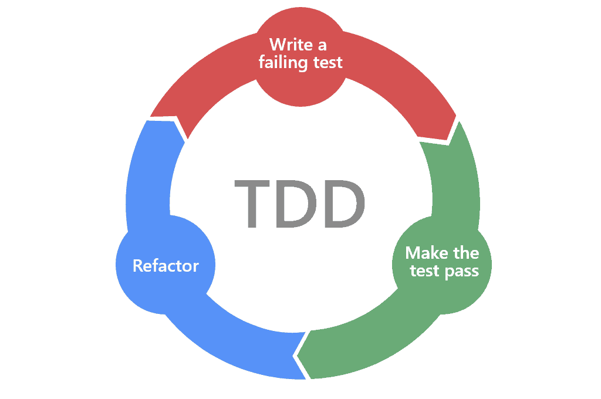
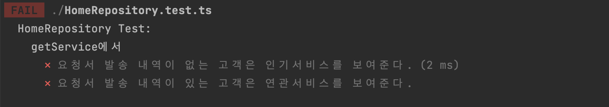
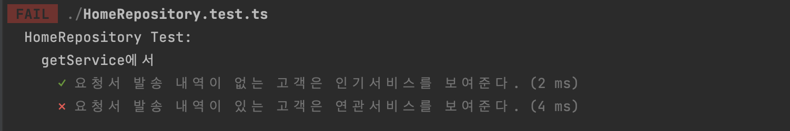
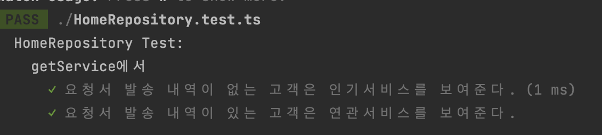

6월은 다양한 기술적 주제에 대해 고민이 더 많았던 것 같다. 5월 회고 때 다짐했던 목표 중 하나였던 테스트에 대해 공부하고 실 작업에서 TDD로 개발했던 경험을 간단한 10분정도 세션으로 발표하기도 했고, 디바이스 설정에 따라 앱의 UI가 깨지는 것을 해결하기 위해 방법들을 조사하고, 앱의 하드 버전을 체크하기 위한 작업을 하기도 했다. 그리고 특이한(?) 경험으로 원티드의 인터뷰를 하러가기도 하고, 토스 슬래쉬 발표를 들으며 우리 프로젝트에 적용하면 좋을 기술적 키워드들에 대해 고민하기도 했다. 한달간 했던 기술적 고민과 다양한 경험들을 정리해보고자 한다.


### 😎 배웠으면 써먹어봐야지, 테스트를 해보자!

   저번달 페어프로그래밍을 통해 테스트의 필요성을 느끼면서 직접 스쿼드 기능 개발을 하면서 테스트 코드를 작성해봤다. 컴포넌트 단위의 유닛테스트부터 하기보다, 간단하게 Repository 계층의 전달 받을 데이터에 대해 테스트를 짜고 적용했다. 테스트 코드를 작성하는 방식으로 `TDD`을 이용했는데, 이유는 먼저 스쿼드 내에서 기술 명세서, API가 어떤 데이터 (input) 줄지가 의논을 통해 어느정도 정해져 있었기 때문에, 해당 데이터를 이용해서 어떻게 UI에 이용할 지를 먼저 고민하다보니 자연스럽게 <b>TDD</b>방식을 선택하게 되었다. 

#### TDD란

TDD는 `Test-Driven-Development`로 테스트를 먼저 작성하고 해당 테스트를 통과할 수 있게 개발해나가는 개발 방식을 의미한다. TDD가 거창하고 멋있어 보이는 것도 있었지만, 나에게 가장 좋았던 점은 내 자신에게 `테스트코드 작성을 의무화`할 수 있었기 때문이었다. 

[ TDD 프로세스]



TDD에서의 개발 순서는 다음과 같다.

1. 실패하는 테스트 코드를 먼저 작성한다.
2. 테스트를 통과할 수 있을 만큼의 코드를 작성한다.
3. 통과한 코드를 리팩토링한다.

이러한 1~3번까지의 방식을 계속해서 반복하는 과정을 통해 개발해나가는 방식으로 <b>요구사항</b> 대해 먼저 고민하고 코드를 작성하고, 테스트 자체를 통해 <b>명세서</b> 역할을 할 수 있게 도울 수 있다는 장점을 느꼈다. 

TDD로 개발한 경험에 대해서 기술 논의 시간에 해당 내용을 mimic한 간단한 예제에 대해서 발표했다. 


#### 간단한 TDD 예시:  HomeRepository의 getServices

HomeRepository를 통해 홈화면의 서비스들에 대한 정보를 받아오는 요구사항에 대한 작업에 대한 예시를 준비했다. 

- 요구 조건:

1. 요청 발송 이력이 없는 고객은 인기 서비스를 보여준다.
2. 요청 발송 이력이 있는 고객은 추천 서비스를 보여준다.

위 요구사항을 위해 HomeRepository는 API 응답을 전달받고 스크린에 필요한 데이터를 전달해주려 한다. API 응답 데이터와 스크린에 필요한 데이터의 interface는 다음과 같다.


```typescript
// 서버 데이터에 대한 타입
interface GetServicesResponse = {
    service: {
        id: number;
        name: string;
        imageUrl: string;
    }[];
    type: 'recommend' | 'popular';
};

// 스크린에 전달할 타입
interface HomeServices {
    isRecommendation: boolean;
    services: {
        id: number;
        name: string;
        featureImage: string;
    }[];
}
```


#### 0. 테스트세팅

테스트 세팅으로는 Repository만을 테스트하기 위해서는 실제 API 층을 테스트에 이용하는 것이 아니라 Mocking데이터와 가짜 API 층이 필요하다. 그 이유는 실제 데이터 통신이나 다른 계층이 사용될 경우에 Repository 테스트가 실패했을 때 원인을 찾기 어렵고, Repository만의 테스트가 되지 않기 때문이다. 

가짜 API 클래스를 전달하기 위해서는 `Dependency Injection`을 이용해서 interface를 구현하는 API층을 전달하게 하고 특정한 모듈을 의존하는 것이 아니라 interface를 의존하게 해 전달한 모듈이 interface를 만족시키는 지만 알게 해 `의존성 역전`을 적용할 수 있다. 

이를 위한 가짜 API 클래스의 getServieces 메소드의 타입과 mock 서비스 데이터는 다음과 같다. 


```typescript
// 가짜 API 클래스를 통해 구현할 interface
export interface HomeAPI {
    getServices: (hasSentRequest: boolean) => GetServicesResponse;
}

//Mocking 데이터
export function mockServices(): GetServicesResponse['service'] {
    return [1, 2, 3, 4].map((num) => ({
        imageUrl: `test${num}.jpg`,
        name: `test${num}`,
        id: num,
    }));
}


```


이제 해당 interface를 구현하는 가짜 API 클래스와 가짜 API를 주입받을 HomeRepository를 구현해보자. 가짜 API 클래스는 간단하게 객체로 HomeRepository는 클래스로 만들었다. TDD는 테스트가 먼저이기 때문에 메소드만 만들고 기능에 관한 코드는 추가하지 않았다.


```typescript
const fakeHomeApi = {
        getServices: jest.fn((hasSentRequest: boolean): GetServiceResponse => {
            if (hasSentRequest) {
                return {
                    type: 'recommend',
                    service: mockServices(),
                };
            } else {
                return {
                    type: 'popular',
                    service: mockServices(),
                };
            }
        }),
    };

export class HomeRepository {
    constructor(private homeApi: HomeAPI) {}
    getServices(hasSent: boolean): HomeServices | null {
     
    }
}
```


#### 1-1. 테스트 작성하기

이제 TDD의 첫 스텝 테스트를 작성해보자. 테스트는 요구사항에 대한 분석으로 부터 시작된다. 앞서 정리한 요구사항에 맞는 테스트에 대해 작성하면 다음과 같다. 

```typescript
describe('HomeRepository Test:', () => {
    // HomeAPI를 mocking하기 위한 부분
    const fakeHomeApi = {
        getServices: jest.fn((hasSentRequest: boolean): GetServiceResponse => {
            if (hasSentRequest) {
                return {
                    type: 'recommend',
                    service: mockRecommendServices(),
                };
            } else {
                return {
                    type: 'popular',
                    service: mockPopularServices(),
                };
            }
        }),
    };
  
    //1. test
    describe('getRecommendService에서', () => {
        test('요청 발송 내역이 없는 고객은 인기서비스를 보여준다.', () => {
         		expect('').toBe('hi')
        });

        test('요청 발송 내역이 있는 고객은 연관서비스를 보여준다.', () => {
            expect('').toBe('hi')
        });
    });
});

```

이제 앞서 세팅해둔 HomeRepository와 가짜 API를 통해 첫번째 테스트 케이스부터 채워나가면 다음과 같이 코드를 작성할 수 있다.

```typescript
describe('HomeRepository Test:', () => {
    // HomeAPI를 mocking하기 위한 부분
    const fakeHomeApi = {
        getServices: jest.fn((hasSentRequest: boolean): GetServiceResponse => {
            if (hasSentRequest) {
                return {
                    type: 'recommend',
                    service: mockRecommendServices(),
                };
            } else {
                return {
                    type: 'popular',
                    service: mockPopularServices(),
                };
            }
        }),
    };
    //1. test
    describe('getRecommendService에서', () => {
        test('요청서 발송 내역이 없는 고객은 인기서비스를 보여준다.', () => {
            const repository = new HomeRepository(fakeHomeApi);
            const hasSent = false;
            const result = repository.getServices(hasSent);
            const expectedService = mockPopularServices().map((item) => ({
                id: item.id,
                name: item.name,
                featureImage: item.imageUrl,
            }));
            expect(result).toEqual({
                isRecommendation: false,
                services: expectedService,
            });
        });

        test('요청서 발송 내역이 있는 고객은 연관서비스를 보여준다.', () => {
            expect('').toBe('hi')
        });
    });
});
```

테스트 코드만 작성했기 때문에 당연히 아래와 같이 테스트 실패가 된다. 

[실패한 테스트들]



#### 1-2. 테스트를 통과시키는 최소한의 기능 구현하기

이제 테스트를 통과시키기 위한 코드를 Repository에 작성할 차례이다. 

```typescript
export class HomeRepository {
    constructor(private homeApi: HomeAPI) {}
    getServices(hasSent: boolean): HomeServices | null {
        const result = this.homeApi.getServices(hasSent);
        return {
            isRecommendation: false,
            services: result.service.map((service) => ({
                id: service.id,
                name: service.name,
                featureImage: service.imageUrl,
            })),
        };
    }
}

```

해당 코드를 작성하고 나서 테스트를 통과한 모습이다.


[통과한 첫번째 테스트 케이스]




#### 1-3. 리팩토링하기

이제 우린 통과한 테스트 케이스가 있기 때문에 마음 놓고 리팩토링 할 수 있다. 여기서 리팩토링은 아주 간단하게 ES6 문법을 적용하는 것을 해보려한다.

```typescript
export class HomeRepository {
    constructor(private homeApi: HomeAPI) {}
    getServices(hasSent: boolean): HomeRecommendService | null {
        const result = this.homeApi.getRecommendation(hasSent);
        return {
            isRecommendation: false,
            services: result.service.map(({id,name,imageUrl}) => ({
                id,
                name,
                featureImage:imageUrl,
            })),
        };
    }
}
```

리팩토링을 해도 테스트를 통과하는 것을 볼 수 있다.

[리팩토링 이후 통과한 테스트 결과]


#### 이후 작업

이후에는 1~3을 똑같이 두번째 테스트 케이스에 적용해 나간다. 

#### 2-1. 테스트 작성

```typescript
describe('HomeRepository Test:', () => {
    // HomeAPI를 mocking하기 위한 부분
    const fakeHomeApi = {
        getServices: jest.fn((hasSentRequest: boolean): GetServiceResponse => {
            if (hasSentRequest) {
                return {
                    type: 'recommend',
                    service: mockServices(),
                };
            } else {
                return {
                    type: 'popular',
                    service: mockServices(),
                };
            }
        }),
    };
    //1. test
    describe('getRecommendService에서', () => {
        test('요청서 발송 내역이 없는 고객은 인기서비스를 보여준다.', () => {
            const repository = new HomeRepository(fakeHomeApi);
            const hasSent = false;
            const result = repository.getServices(hasSent);
            const expectedService = mockServices().map((item) => ({
                id: item.id,
                name: item.name,
                featureImage: item.imageUrl,
            }));
            expect(result).toEqual({
                isRecommendation: false,
                services: expectedService,
            });
        });

        test('요청서 발송 내역이 있는 고객은 연관서비스를 보여준다.', () => {
          const repository = new HomeRepository(fakeHomeApi);
            const hasSent = true;
            const result = repository.getServices(hasSent);
            const expectedService = mockServices().map((item) => ({
                id: item.id,
                name: item.name,
                featureImage: item.imageUrl,
            }));
            expect(result).toEqual({
                isRecommendation: true,
                services: expectedService,
            });
        });
    });
});
```

당연히 두번째 테스트 케이스에 대한 코드가 작성되어 있지 않으므로 여전히 테스트는 실패한다.

[두번째 테스트 작성 이후 결과]


#### 2-2. 테스트를 통과시키는 최소한의 기능 구현하기

이제 두번째 테스트를 통과시키기 위한 코드를 Repository에 작성할 차례이다. 

```typescript
export class HomeRepository {
    constructor(private homeApi: HomeAPI) {}
    getServices(hasSent: boolean): HomeServices | null {
        const result = this.homeApi.getServices(hasSent);
        if(result.type==='recommend'){
            return {
                isRecommendation: true,
                services: result.service.map(({ id, name, imageUrl }) => ({
                    id,
                    name,
                    featureImage: imageUrl,
                })),
            };
        }
        return {
            isRecommendation: false,
            services: result.service.map(({ id, name, imageUrl }) => ({
                id,
                name,
                featureImage: imageUrl,
            })),
        };
    }
}

```

해당 코드를 작성하고 나서 테스트를 통과한 모습이다.


[모든  테스트 케이스를 통과한 결과]




#### 2-3. 리팩토링하기

우린 통과한 테스트 케이스가 있기 때문에 더 마음 놓고 리팩토링 할 수 있다.😆  코드 중복을 제거하고 더 간단하게 만들어보자.

```typescript
export class HomeRepository {
    constructor(private homeApi: HomeAPI) {}
     getServices(hasSent: boolean): HomeServices | null {
        const result = this.homeApi.getServices(hasSent);
        return {
                isRecommendation:result.type==='recommend',
                services: result.service.map(({ id, name, imageUrl }) => ({
                    id,
                    name,
                    featureImage: imageUrl,
                })),
            };
        }
    }
}
```

리팩토링을 해도 테스트를 통과하는 것을 볼 수 있다.

[리팩토링 이후 모든  테스트 케이스를 통과한 결과]


테스트를 적용하면서 요구사항에 대해서 더 고민할 수 있었고, 테스트 덕분에 더 맘편하게 리팩토링을 할 수 있다는 큰 장점을 느끼는 경험이었다. 비록 시간이 없어서 간단하게 Repository에만 적용해봤지만, 이후에 Unit Test를 이용한 컴포넌트 테스트들에도 적용해 나가려 한다.


### 스토어에 올라온 하드버전을 체크해보자🙏

챕터 업무로 스토어에 올라온 하드 버전과 현재 버전을 체크해, 더 높은 버전을 스토어에서 설치할 수 있게 하는 방법에 대한 작업을 맡게 되었다. 

#### 1. 앱스토어/플레이스토어 API 이용하기

 작업을 위해 가장 먼저 조사한 것은 스토어에 올라온 우리 앱에 대한 정보를 API가 있는지였다. 조사한 바로 AppStore(IOS)의 경우에 해당 앱의 정보를 받을 수 있는 API가 존재했지만 PlayStore(AOS)는 자체적인 API를 제공하고 있지 않았다. 앱에 대한 정보에 대한 보안으로 API를 제공하지 않는다고 한다. 

라이브러리들에 대해서도 조사했을 때 안드로이드만을 위한 라이브러리나 [react-native-version-check](https://github.com/kimxogus/react-native-version-check/tree/master) 의 코드를 까보았을 때 플레이스토어 페이지에 Html파일을 받아온 후에 버전정보에 대해서 찾는 크롤링 방식을 이용하고 있었다. 크롤링 방식은 페이지 정보가 바뀌게 되면 아예 사용할 수 없는 방식이 되고 해당 정보 뿐 아니라 페이지를 구성하는 다른 정보들을 다 받아오면서 비용이 많이 들기 때문에 배제하는 게 좋을 것 같았다.


```typescript
// AppStore의 앱정보에 대한 API
fetch(`https://itunes.apple.com/lookup?bundleId=${bundleIdentifier}`)
        .then((response) => response.json())
        .then((data) => {
            const appStoreVersion = data.results[0].version; 
            if (appStoreVersion > currentVersion) {
                console.log('새로운 버전이 있습니다!');
            } else {
                console.log('최신 버전을 사용 중입니다.');
            }
        })
        .catch((error) => {
            console.log('앱 정보를 가져오는 중에 오류가 발생했습니다:', error);
        });

//react-native-version-check의 PlayStore.js
class PlayStoreProvider implements IProvider {
  getVersion(option: PlayStoreGetVersionOption): Promise<IVersionAndStoreUrl> {
    const opt = option || {};
    try {
      if (!opt.packageName) {
        opt.packageName = getVersionInfo().getPackageName();
      }

      opt.fetchOptions = {
        headers: { 'sec-fetch-site': 'same-origin' },
        ...opt.fetchOptions,
      };

      const storeUrl = `https://play.google.com/store/apps/details?id=${opt.packageName}&hl=en&gl=US`;

      return fetch(storeUrl, opt.fetchOptions)
        .then(res => res.text())
        .then(text => {
          const match = text.match(/Current Version.+?>([\d.-]+)<\/span>/);
          if (match) {
            const latestVersion = match[1].trim();

            return Promise.resolve({ version: latestVersion, storeUrl });
          }

          const matchNewLayout = text.match(/\[\[\["([\d-.]+?)"\]\]/);
          if (matchNewLayout) {
            const latestVersion = matchNewLayout[1].trim();

            return Promise.resolve({ version: latestVersion, storeUrl });
          }

          return Promise.reject(error(text));
        });
    } catch (e) {
      if (opt.ignoreErrors) {
        console.warn(e); // eslint-disable-line no-console
      } else {
        throw e;
      }
    }
  }
}

export default new PlayStoreProvider();

```


API를 이용하는 방식을 고민하면서 앱을 배포하는 과정을 보면 마켓의 심사를 받고 승인을 받는데에는 상대적으로 PlayStore에 올라가는 시간이 빠르고 AppStore에 올라가는 시간이 오래걸리기 때문에, AppStore를 기준으로 버전을 비교하게 하더라도 안드로이드 유저가 없는 버전을 다운받기 위해 PlayStore로 이동하지는 않을 것 같다고 생각했다. 내가 모르는 다른 방법이 있을 수 있으므로 API를 이용하는 방법는 보류했다.


#### 2. AppCenter API 이용하기

코드 푸시 및 앱의 버전 관리를 위해 사용하는 Appcenter에 관련된 API가 있지 않을까 생각했고, `https://api.appcenter.ms/v0.1/apps/{owner_name:}/{username}/deployments`라는 API를 발견했다. 우리가 원하는 응답값을 얻을 수 있는 장점이 있었지만 문제는 해당 API를 호출하기 위해서는 Auth token을 전달해야하는데, Auth Token은 Appcenter에 인증되어있는 팀 계정의 Token이기 때문에 API호출을 위해 토큰 값을 같이 배포할 경우 모든 사용자들의 기기에 우리의 토큰이 들어가는 보안문제가 있었다.

```json
[
  {
    "name": "Production",
    "key": "~",
    "latest_release": {
      "target_binary_range": "1.0.0",
      }
    }
  },
]
```


#### 3. S3의 Flag값 이용하기

세번째로 고민한 방법은 s3에 json 하드버전을 기록한 파일을 추가하고, 하드배포시 json의 하드버전을 높이는 방법이 있었다.하지만, 하드배포버전을 올리는 시점과 마켓의 심사가 모두 완료되었을 때 시점이 달라 누군가가 수동으로 결국 관리해야하는 비용문제 발생했다.


이렇게 총 세가지 방법에 대해서 고민하고 공유했을 때 결국 1번 방법이 가장 문제가 적은 방법으로 고려되어, AppStore API를 이용해 스토어에 올라온 하드버전을 비교하는 로직을 구현했고, 이번 작업을 통해 빠르게 새롭게 배포된 버전을 설치할 수있게 유도하는데 도움이 되면 좋겠다.


### 원티드에서의 인터뷰 😋

6월 12일 원티드에서 나를 인터뷰이로 초대하는 메일이 왔다. 이전에 참여했던 프리온보딩 인턴십 수료 후 취업한 사람을 대상으로, 취업준비생들에 대한 조언과 현재 개발자로써 쌓아나아 가는 커리어 스토리에 대한 내용의 인터뷰였다. 나를 인터뷰하고 싶다는 메일을 받은 것에 대해 신기했고, 내가 어떤 이야기를 할 수 있는 사람인지를 생각했을 때, 운이 좋아서 지금 좋은 회사에서 여러 경험을 쌓아나가고 있다고 생각이 들어 망설이는 맘도 들었다.

고민을 계속하면서 합격하고 나서 세웠던 다음 목표가 떠올라 인터뷰를 보기로 했다. 취업을 준비할 때는 빨리 취업을 하는 것에 목표가 있었다면, 취업을 하고 나서는 개발자 커뮤니티에 기여하고, 나와 같이 어떻게 하는 게 공부하는 게 맞는 건지 고민하고 힘들어했던 분들에게 도움이 될 수 있는 멘토가 되고 싶은 목표를 다음 목표로 잡았었다. 이런 공식적인 인터뷰를 통해서 내 이야기가 누군가에게 희망이 되고 도움이 될 수 있기를 바라며 인터뷰를 하기로 결정했다.

인터뷰를 위해 원티드를 방문했는데, 엄청나게 높은 잠실 롯데타워 35층에 위치하고 있었다. 나의 인터뷰를 담당하시는 마케터분과 편하게 여러가지 질문들을 주고 받으면서 내가 왜 개발자가 되기로 결심했는지 부터 현재 어떻게 일하고 있는지 등에 대해서 인터뷰 하며 '아, 내가 정말 짧은 시간에 많은 게 바뀌었구나'라는 생각이 들었다. 

단순히 개발자가 되겠다는 목표를 세웠던 2021년 10월부터, 졸업 후 1년간 일하면서 계속 준비했던 2022년, 그리고 수많은 회사에 떨어지고 드디어 개발자가 된 2023 2월, 개발자로써 어떤 삶을 살고 있는지 인터뷰를 하게된 2023년 6월까지 목표로 했던 것을 이루고, 감사한 생활들이 이어지고 있다는 생각이 들었다.

아직 어떻게 글이 나오고 있는지는 전달 받지 못했지만, 이를 기점으로 더 많은 것을 나눌 수 있게 내 자신을 더 채워나가야 겠다는 좋은 자극이 되었다.

[마케터님이 자랑해주신 원티드 회사 뷰]


### 마치며

6월에는 상대적으로 스쿼드 일은 적었지만, 그만큼 더 깊이 고민하고 다양한 기술 주제들에 대해서 관심을 갖고 성장하려 노력했다. 대외 활동인 인터뷰를 하고, 회사 내 기술 공유시간에 발표도 하고, 토스의 슬래시 발표도 보면서 내가 가진 더 많은 것을 전달할 수 있는 사람이 되고 싶다는 욕심이 든다. 앞으로 더 깊이 있는 사람으로 내 자신을 만들어가는 시간들로 채워나가야겠다.  
