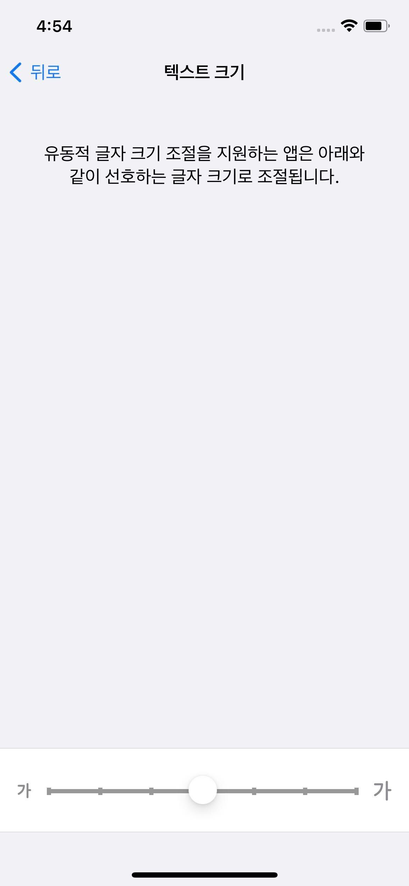
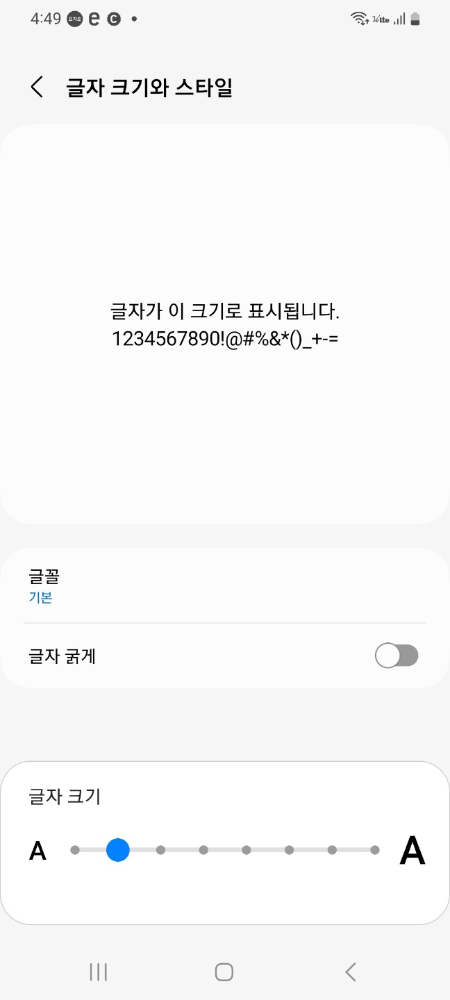
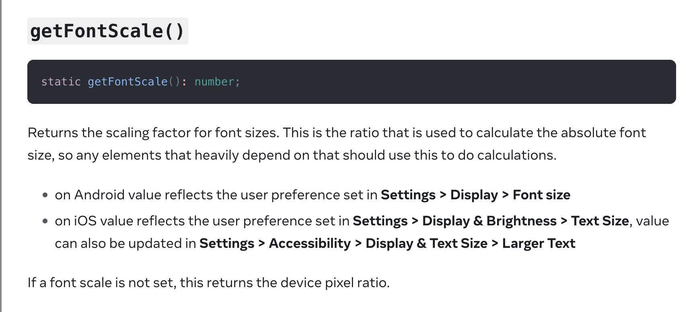

7월의 기억남았던 작업은 이전에 디바이스 서체 설정에 따라 잘리는 것을 막는 방법을 조사했던 것을 일감화해서 직접 트래커를 찍어서 우리 실 사용자들이 어떤 크기로 사용하고 있는지 확인하기도 했고, 받은 요청 화면에서 필터링을 추가해 기능을 더하기도 했다. 또한 7월이 되면서 챕터내의 3분기 일감들을 함께 정하고 그중에 에러/예외처리에 대한 고도화 작업을 위한 로드맵을 세우기도 했다. 여러가지 일들에 대해 기록하고 과정 속에서 아쉬웠던 점, 좋았던 점을 기록해보려 한다.

### 😃 앱의 완성도를 높여보자, 디바이스 서체 설정 제한하기

어플은 웹과 다른 단위를 사용해서 UI를 구현한다. Android는 DP(Density Independent Pixel) 와 SP(Scale Independent Pixel)을 IOS는 PT(point)를 사용하는데 이렇게 서로 다른 단위를 사용하는 이유는 바로 <b>디바이스마다 화소(pixel)의 밀도 </b>가 다르기 때문이다.

화소밀도, PPI(Piexls Per Inch)는 1제곱인치 면적에 들어가는 픽셀 수를 의미하는데 디바이스가 발전하면 발전할 수록 스크린 사이즈는 그대로이지만 PPI는 증가하게 된다.

PPI가 증가하면 같은 면적에서도 pixel양이 달라지기 때문에 Pixel단위로 표현하지 않고 디바이스 별로 같은 비율로 보일 수 있게 DP,SP/PT 와 같은 단위로 디자인을 표현한다,

우리 앱에서 사용하고 있는 react-native에서 raw 값으로 전달하면 자동으로 두가지 플랫폼에 맞는 상대값으로 변환해서 전달된다.

React-native가 자체적으로 계산해주지만 여기서 또 중요한 점은 <b>사용자가 설정한 기기의 디바이스 서체 설정</b>이다.

아래 사진은 각각 IOS 16버전과 Android 13버전 설정할 수 있는 크기 설정 화면이다. 크기 설정에 따라 현재 변환된 글자크기에 해당 비율을 곱해주는 방식으로 글자크기를 크거나 작게 만들 수 있다.

<table>
<tbody>
<tr>
<th>IOS 16버전</th>
<th>Android 13 버전</th>
</tr>
  <tr>
<td width="400">

</td>
<td width="400">

</td>
</tr>
</tbody>
</table>

조사 당시 우리 앱은 해당 디바이스별 크기 설정에 대한 디자인적인 대응이 되지 않아,  QA분과 디자이너분께서 조사해주신 결과  Android는 다섯번째 크기이상, IOS는 여섯번째 크기이상으로 설정시에 앱을 사용하기 어려울 정도로 UI가 깨지는 것을 알게 되었다. 이를 해결하기 위해 스쿼드의 일감으로 발전시켜 UI가 깨지지 않으면서 최대한 크기를 키워줄 수 있는 기준으로 <b>Android는 네번째 크기로, IOS는 다섯번째 크기</b>로 서체크기를 제한하기로 결정했다.

크기 제한을 작업을 하기 위해서 다음과 같은 작업이 필요했고 각 스텝에 따라 정리해보려 한다.

1. 사용자 디바이스의 글자 크기 설정 알아내기
2. 각 플랫폼별로 글자 크기 설정에 따른 비율 알아내기
3. 사용자 디바이스 글자 크기가 기준을 넘어갈 시 기준 비율로 보여주기

#####  1. 사용자 디바이스의 글자 크기 설정 알아내기

우리 앱을 사용하는 사용자 디바이스 글자 크기를 알아내기 위해서 알아낸 방법은 React native 자체적으로 지원하는 **PixelRatio** API을 이용하는 방법이었다.

PixelRatio API가 지원하는 메소드 중 **getFontScale**을 이용하면 디바이스의 서체 설정에서 정한 비율을 알 수 있었다.

##### 2. Android, IOS 글자 크기 설정 별 비율 알아내기

앞서 알아낸 pixelRatio 모듈의 getFontScale을 통해서 디바이스의 서체 설정을 알아낼 수 있으므로 이를 이용해 각 지점마다의 비율이 얼마나 되는지를 조사했다.

|        기준별 크기         | IOS 16 | Android 13 |
| :------------------------: | :----: | :--------: |
|             1              | 0.823  |    0.8     |
|             2              | 0.882  |    0.9     |
|             3              | 0.941  |     1      |
|             4              |   1    |    1.1     |
|             5              | 1.118  |    1.3     |
|             6              | 1.235  |    1.5     |
|             7              | 1.353  |    1.7     |
| 8 ( IOS의 더크게 조절부터) | 1.786  |     2      |
|             9              | 2.145  |            |
|             10             | 2.643  |            |
|             11             | 3.143  |            |
|             12             | 3.571  |            |

 

##### 3. 서체크기 제한하기

우리가 타겟하는 비율은 **IOS는 1.118 보다 클 경우 AOS는 1.1보다 클 경우** 각각 1.118배와 1.1배로 제한해서 크기 설정을 해주면 되는데 이를 위한 방법으로는 두가지 방법이 있었다.

첫 번째 방법은 공통으로 사용하고 있는 텍스트 컴포넌트를 감싸서 fontSize를 변환해주는 컴포넌트를 만들어서 적용하는 방법으로 부분 적용이 가능하지만 일일히 공통 컴포넌트를 교체해줘야하는 비용이 드는 방법이다.

두 번째 방법은  React native의 Text 컴포넌트의 `maxFontSizeMultiplier`설정을 이용하는 방법으로 우리 기준 값만 플랫폼에 따라 적용해 전체 적용하는 방법이다.

두가지 방법 중 우선은 첫번째 방법으로 고객 홈 화면을 시작으로 스쿼드 내 일감으로 담당 도메인에 적용하고 이후에 디자인적인 보완을 더해서 전체 적용하는 방법으로 일감을 진행하기로 결정되었다.

계속해서 작업해서 앱 전체의 완성도를 높이는 데 계속해서 기여하고 싶다. 😎

 

<table>
<tbody>
  <tr>
<th><b> IOS 크기 설정 7 AS-IS</b></th>
<th><b> IOS 크기 설정 7 TO-BE </b></th>
</tr>
  <tr>
<td>

</td>
<td>
 
</td>
</tr>
  <tr>
<th><b>AOS 크기 설정 7 AS-IS</b></th>
<th><b>AOS 크기 설정 7 TO-BE</b> </th>
</tr>
  <tr>
<td>
  
    <!-- <video src="" width="300" /> -->
</td>
<td>
 
</td>
</tr>
</tbody>
</table>

 

### 🤩 받은 요청화면의 필터링 기능

이번에 스쿼드에서 구현한 기능은 받은 요청의 필터링 기능으로 기존 고수가 받아온 다양한 요청서를 원하는 필터와 정렬방식에 맞게 보여주는 기능이었다. 해당 기능을 구현하면서 겪었던 어려움 두가지에 대해 정리해보려 한다.

#### 😬앱 종료시까지 데이터를 유지하는 방법

우리가 정한 필터/정렬 정책은 **앱을 종료하기 전까지** 해당 유저가 선택 했던 데이터를 저장한다였다. 요구사항을 만족시키기 위해서 우리 프로젝트 내에서 앱 종료시까지 데이터/상태를 보관하는 방법에 대해 고민해봤고 내 나름 세 가지 방법이 떠올랐다.

##### Async Storage

앱의 로컬 스토리지와 같은 Async storage에 해당 필터 정보를 보관하는 방법이다. 하지만 Async Storage는 앱을 종료해도 정보를 기억하고 있어야하는 자동 로그인을 위한 유저정보 등과 같은 상황에 사용하는 것이 더 적절하지 앱 종료 전에 저장하고 다시 불러오는 방법은 용도에 부적합해 보였다.

##### 전역 상태 이용하기

우리 프로젝트 내에서 전역상태를 위한 라이브러리로 사용하고 있는 Recoil을 이용해서 상태관리를 하는 방법이 있다. 전역상태이기 때문에 필터/ 정렬 조건이 바뀔 때만 해당 atom 내 상태가 업데이트 되고 navigation stack과 별도로 해당 데이터를 보관할 수 있기 때문에 적합한 방법이라 생각되었다.

##### 로컬 상태와 자체 로컬 storage 만들기

자체 로컬 storage를 만드는 방법은 필터/ 정렬 스크린이 mount되었을 때 이전 로컬 storage에 저장된 필터/정렬 데이터를 지역 상태에 업데이트하고, unMount되었을 때 지역 상태 값을 로컬 storage에 보관하는 방식으로 관리하는 방식으로 이 방법도 적합해 보였다.

세가지 방법중에서 **전역상태**와 **자체 local storage**를 구현하는 방식에 대해서 고민했고, 둘 중에 **전역상태를** 선택했다. 개인적으로는 자체 local Storage를 구현하는 방식이 챕터 컨벤션에 더 맞지 않을까 고민했다. 왜냐하면 전역상태를 추가하는 방식은 구현은 간단하지만 하나의 스크린에서 변화가 일어나면 다른 화면에서도 불필요한 리렌더링이 일어날 수 있는 위험은 늘 가지고 있기 때문이고, 자체 local Storage를 구현하면 다른 스크린에서도 사용할 수 있겠다는 기대도 되었다.

챕터내의 컨벤션도 중요하기 때문에 챕터원 분들과 해당 부분에 대해서 이야기를 해보았을 때 대부분 **전역상태로** 관리하는 게 좋을 것 같다는 의견을 주셨다. 그이유는 만들려는 기능이 받은 요청화면과 필터 설정을 위한 모달 스크린 화면, **두가지 스크린이 하나의 상태**에 대한 정보를 바라봐야하기 때문에 동기화가 필요하하는 것이 중요한 상황이며, 앞서 내가 우려한 부분에 대해서는 페이지별로 사용을 제한하는 방향으로 사용하면 해결할 수 있을 것 같다는 의견을 주셨기 때문이었다.

챕터내 의견을 종합해서 고민해보았을 때 자체 local Storage의 경우 데이터를 업데이트하고 읽는 시점에 대한 추가적인 고민이 필요하고 챕터원 분들의 의견들을 종합했을 때 전역상태로 관리하기로 선택했다.

### 😞 애니메이션과 성능 이슈

받은 요청 화면에서 구현이 필요했던 애니메이션은 리스트 화면에 Sticky 헤더를 구현하는 것이었다. Sticky 헤더 자체는 Flash list를 이용해 간단하게 구현할 수 있지만 문제가 되는 것은 스크롤을 내릴 때/ 올렸을 때/ 스크롤을 최상단으로 올렸을 때 총 세가지 조건에 따라 다른 header가 되어야한다는 점이었다.

[IOS에서 정상적으로 동작하는 모습]

IOS에서는 정상적으로 구현되어서 안심했지만... 문제는 Android에서 발생하기 시작했다. Android에서는 스크롤 방향에 따라 최상단 헤더가 흔들리고 내릴 때 헤더 위치가 올릴 때 헤더위치 처럼 되는 등 애니메이션 구현의 어려움을 겪었다.

원인으로 생각되는 부분은 스크롤을 내릴때 header가 translation으로 올라가게 되는데 그러면서 생긴 빈 공간을 매꾸기 위해 리스트 컴포넌트의 **margin이 변하게 구현했기** 때문으로 생각이 들었다. React native의 Animated API를 이용해 구현했을 때 margin을 변경하는 애니메이션에 대해서 useNativeDriver를 사용할 수 없는데 이로 인해 네이티브의 UI thread에서 처리가 되지 못하고 JS Thread에서 처리하게 되고, margin의 변화는 layoutShift가 발생하는 부분이기 때문에 IOS에 비해 성능이 떨어지는 Android에서 버벅임 현상이 나타나게 되는 것이 아닐까 생각이 들었다.

이러한 구현상 문제로 스크롤을 내릴때와 올릴때의 UI를 통일시켜서 배포하는 방향으로 결정했다. 요구사항과 사용성 모두를 만족시키고 싶었는데.. 내 부족함으로 요구사항을 변경해야하는 상황이 나온 것은 아닐까라는 아쉬움을 가지는 스프린트였다.

### 😆 내가 진행하게 된 에러/예외 처리 고도화 일감

모바일 챕터의 3분기 목표 일감들이 정해졌다. 다양한 주제들이 의논되었는데 내가 발제한 부분은 **에러/예외처리 핸들링**에 대한 부분이었다. 그 이유는 최근 기술 논의 시간에 우리 프로젝트에서 어떻게 에러가 처리가 되고 있는지 발표를 들을 수 있었고, 이에 따라 앱의 안전성과 보다 빠른 에러에 대한 대처를 위한 조사및 대처의 필요성을 많이 느꼈기 때문이었다.

챕터원분들도 많이 공감을 해주셨고 이에 따라 일감의 진행을 내가 책임을 맡게 되었다. 큰 일감을 담당하고 진행하는 것은 처음이라 어떻게 에픽/스토리/티켓의 구조들을 잡아가면 좋을지 어떻게 분배해서 일을 같이 진행하면 좋을지에 대해서 고민했고 큰 그림을 그려보게 되었다.

참고한 자료는 카카오 페이에서 발표해주시고 정리해주신 [Sentry를 이용한 에러 추적기, React의 선언적 에러 처리](https://www.youtube.com/watch?v=012IPbMX_y4)와 토스에서 발표한 [프론트엔드 웹 서비스에서 우아하게 비동기 처리하기](https://www.youtube.com/watch?v=FvRtoViujGg&t=46s)를 참고해서 어떻게 큰 그림들을 그려가면 좋을 지 아이디어를 얻을 수 있었다.

일감을 크게 두가지 스텝으로 **의미있는 에러 로그를 쌓기 위한 에러 로깅 고도화**와 **고도화된 에러 로깅을 바탕으로 에러/예외처리를 위한 컨벤션 세우기**로 분류했다.

먼저 의미있는 에러 로그를 쌓기 위한 에러 로깅 고도화를 위해서는 우리 프로젝트에서 사용하고 있는 에러 로그를 쌓고 모니터링을 하는 툴인 **Bugsnag**을 잘 사용하기 위한 조사와 우리 프로젝트는 로그들을 쌓고 있는지 조사하는 게 필요해보였고, 프로젝트내 컨벤션으로 에러의 위계를 정하고 Error Boundary를 이용한 선언적코드, custom lint룰 추가 등의 일감을 이후에 진행하려고 계획했다.

챕터내 큰 일감을 진행하는 것에 걱정도 되지만 프로젝트에 많은 기여를 할 수 있는 기회로 생각되어 기대도 된다. 큰 목표를 잡고 작은 일부터 천천히 진행해 완성하는 것까지 꼭 볼 수 있게 중간에 흐지부지 되지 않게 꾸준히 진행하려 한다.

### 마치며

이제 개발자로 일한 지 6개월이 가까워지고 있다. 개발자로 일하는 것에 큰 기쁨을 느끼고 재밌지만 그에 따라 조금씩 더 맡는 부분이 생기고, 큰 일감도 생기는 것 같다. 주체적으로 일할 수 있는 환경에 감사하고 함께 고민할 수 있는 좋은 사람들이 많이 있다는 것에 감사함을 느낀다. 새로운 기술적 주제들을 던져주고 새로운 문제들을 해결하면서 내가 나아지고 있음을 느끼는 것 같다.

개발자는 문제를 해결하는 사람이라는 말에 크게 공감하는 한달이었다. 서체 크기 제한을 하면서는 꼭 코드적으로 많은 것을 작성하지 않아도 정책을 정함으로써 사용성과 완성도를 높일 수 있다는 것을 느꼈고, 받은 요청에 필터/정렬 기능을 더하면서 아직 내가 부족하다는 점도 느꼈다. 에러/예외처리 일감을 만들면서 큰 그림을 그리고 거기에 작은 스토리들, 더 작게는 티켓들을 만들면서 일을 기획하고 수행할 수 있는 단위로 쪼개는 것의 중요성도 느낀다.

내가 쌓아온 경험은 아직 너무 미미하지만 더 의미있는 작업들로 많은 기여를 할 수 있기를 기대해본다.

