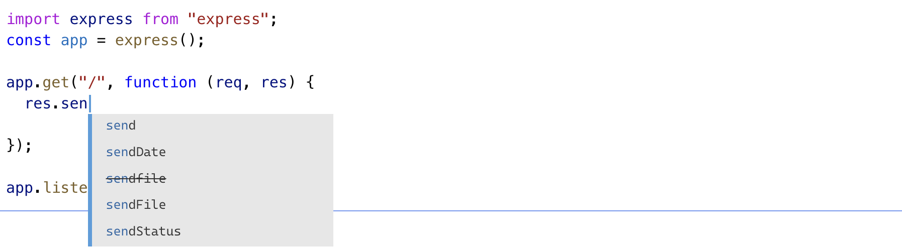

## 🧐 타입스크립트를 아세요?

타입스크립트는 내가 매일 사용하지만 나에게 "타입스크립트를 잘아세요?"라고 한다면 나는 "그... 쓸줄은 알아요"라고만 말할 수 있을 것 같다. 그러면 잘하려면 어떻게 해야할까를 고민해 봤을 때, 나에게 들었던 생각은 "고개를 들어 **공식문서를**를 보게하라"였다. 공식문서 한번 읽지 않고 얼마나 잘할 수 있을까, 책보다도 더 빠르게 업데이트되고 누가 봐도 잘 설명할 수 있게 고민의 흔적이 담긴 문서는 공식문서였다. 그래서 한번도 읽지 않았던, 공식문서를 읽고 한번 정리해보려 한다. 영어를 해석하다 보니 오역도 있을 수 있고 쓰다보면 내 맘대로 쓰는 말들도 많겠지만, 이왕 마음먹은 거 하루에 한페이지씩 끝까지 꼭 작성해보려 한다.

### The Basics

타입스크립트는 왜 필요할까? 그냥 사람들이 많이 쓰고 현업에서 많이 사용하니까라고 대답해도 틀린 답은 아닐 것이다. 하지만 내가 느꼈던 타입스크립트의 필요성은 **개발자의 생산성**이었다.

개발자의 생산성이란 말과 타입이 추가되는 것이랑 무슨 상관인지... 오히려 코드량은 더 많고 세팅도 늘어나는 데, 뭘 더 빠르게 해준다는 거지 싶었지만 쓰면 쓸수록 이해할 수 있었다.

타입스크립트 핸드북 첫장의 내용도 동일했다. javascript만으로는 변수에 담긴게 함수인지 객체인지 어떤 것도 알 수 없다고, 개발자가 결국 값에 뭐가 담겼는지 확인해야 하는 불편함을 말하고 있었다.

```typescript
function fn(x) {
  return x.flip()
}
```

자바스크립트 적으로 아무 문제 없는 위 코드의 param인 x가 flip이라는 속성에 함수를 가지고 있지 않다면 **Type error**가 발생하게 될 것이다. 만약 인자가 어떤 타입인지 알았다면 과연 이대로 사용했을까?

타입스크립트는 추가적으로 타입을 추가적으로 작성해줘야 하지만, 개발자가 변수에 대한 타입을 **일일이 기억하지 않아도 되게** 도와주고, 런타임에서 작성되는 자바스크립트 코드에 동작/배포 전에 에러를 잡아줌으로써 생산성을 높여주게 된다.

[히히 못가..]


### Non-exception Failures

자바스크립트는 다양한 에러를 만들 수 있는데, 이러한 에러들을 타입스크립트가 먼저 코드를 작성하는 시점에 개발자에게 알려줄 수 있다.

- 없는 속성에 접근했을 때

자바스크립트는 객체의 없는 속성에 접근하게 되면 `undefined`을 반환한다. 그렇기 때문에 자바스크립트만으로는 아무 문제 없이 지나가게 되고 우리가 예상하지 못했던 에러를 마주하게 된다.


- 오타가 발생했을 때

자바스크립트는 오타를 발생해도 알지 못한다. 왜냐면 있을지도(?) 모르기 때문이다. 타입이 없기 때문에 어떤 값을 가지고 있을지 몰라 오타인줄 모른다.


- 함수가 호출되지 않았을 때

함수자체는 참조값으로 저장된다. 호출되지 않고 값으로 사용될 수 있는 상황이라면 우리가 예상하지 못한 일이 펼쳐진다.


### Types for Tooling

위에 언급한 에러들은 자바스크립트로 코드를 작성할 때 흔히 발생할 수 있는 상황이다. 이러한 문제상황을 해결하는 중요한 방법중 하나는 바로 `애초에 문제상황을 만들지 않는 것`이라고 할 수 있다.

타입스크립트는 개발 당시에 타입을 이용해 어떤 값에 접근할 수 있는지를 보여줄 수 있기 때문에 이러한 에러를 먼저 방지하는 데 큰 도움을 준다.



### tsc

tsc는 타입스크립트로 우리가 작성한 코드의 타입을 체크할 수 있게 해주는 compiler를 의미한다. 실제 현업에서는 tsc를 이용과 github action 또는 husky를 이용해서 코드가 병합되기 전 타입에러가 없는지 검사한다.

- --noEmitOnError

이러한 tsc는 다양한 컴파일 옵션을 가지고 있는데 그중 noEmitOnError는 타입 에러가 있을 경우에 컴파일하지 않는 옵션이다.

### Explicit Types

이제 타입스크립트로 타입을 인자에 할당해보자.

```typescript
function greet(person: string, date: Date) {
  console.log(`Hello ${person}, today is ${date.toDateString()}!`)
}

greet("Maddison", Date())
```


위 코드를 보았을 때는 언뜩보면 아무문제 없어 보이지만 `Date()`를 통해 반환된 결과값이 `string`이기 때문에 에러가 발생한 것을 볼 수 있다.

타입스크립트가 `Date()`를 자동으로 추론해줌으로써 발생할 수 있는 에러를 미리 알려줄 수 있었다.

### Erased Types

```javascript
function greet(person, date) {
  console.log(
    "Hello ".concat(person, ", today is ").concat(date.toDateString(), "!")
  )
}
greet("Maddison", new Date())
```

위 코드를 컴파일 해보면 javascript코드로 우리가 작성된 코드와 다르게 컴파일된 결과를 볼 수 있다.

이는 TSC가 우리가 설정한 ECMAScript 버전에 맞게 컴파일 한 것으로 만약 es2015으로 설정한다면 우리가 작성한 그대로 컴파일 될 수 있다.

```typescript
function greet(person, date) {
  console.log(`Hello ${person}, today is ${date.toDateString()}!`)
}
greet("Maddison", new Date())
```

### TSC의 옵션 몇가지

마지막으로 basics 페이지의 내용은 tsc의 세가지 옵션에 대해 설명한다.

- Strictness: tsconfig.json의 `"strict": true`로 설정시 strict 모드로 코드를 작성하게 한다.
- noImplicitAny: 타입 설정 중 암묵적으로 any가 할당되는 것을 방지하는 옵션으로 주로 함수의 타입이 정해지지 않은 인자와 같은 코드를 에러로 잡아주는 옵션이다.
- strictNullChecks: null과 undefined은 둘다 falsy한 값이 지만 다른 결과를 만들기도 하기 때문에 둘을 정확히 핸들링 할 수 있게 에러로 잡아주는 옵션이다.
