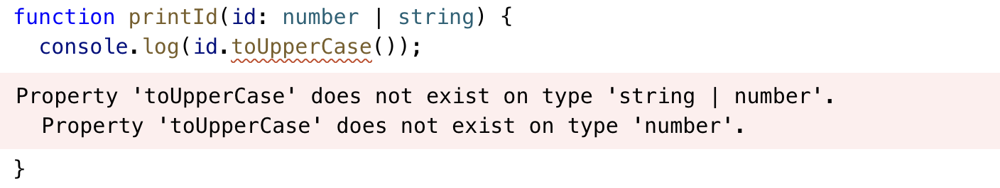
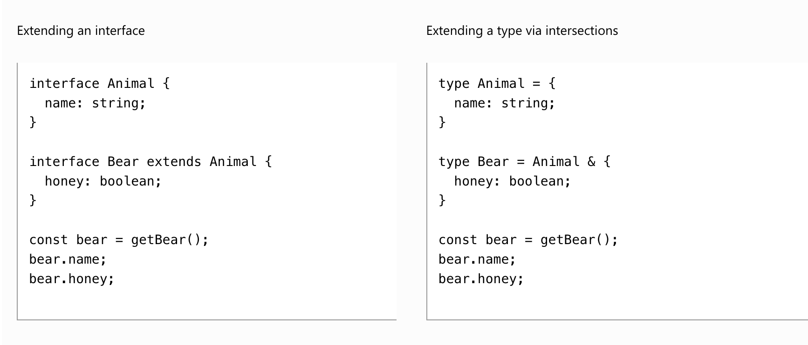
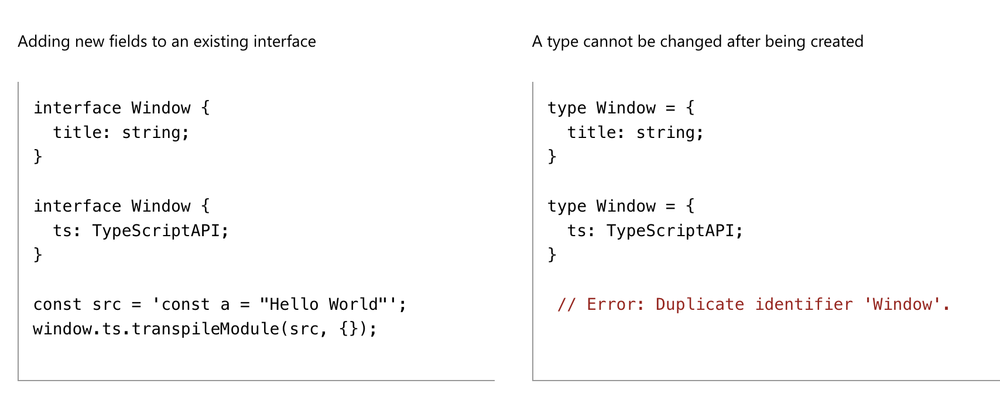
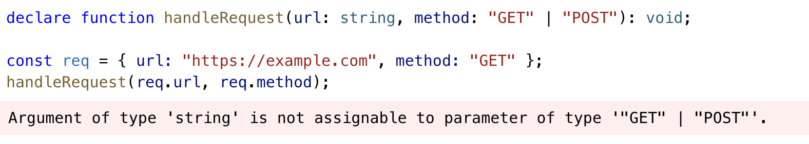

## Everyday Types 😊

이제 기본적인 타입스크립트의 타입들에 대해 알아보자. 대부분 기본적인 부분이라 크게 정리할 부분은 없었다.

### Primitive

자바스크립트의 기본 타입들인 `string, number, boolean`이 동일하게 타입스크립트에서 사용된다.

### Arrays

배열은 두가지로 표현할 수 있는데 `[1,2,3]`과 같은 number 배열의 경우 `number[]`와 `Array<number>` 두가지로 나타낼 수 있다.

### any

any는 타입스크립트를 사용하면서 **가장 쓰지 말아야하는 타입**으로 유명한데, 그 이유는 any는 모든 타입을 감싸는 **가장 큰 집합**에 해당되기 때문에 어떤 타입을 넣어도 타입체크를 통과할 수 있다. 그러므로 any를 지양하자.

### Type annotation

타입스크립트는 똑똑해서 우리가 할당한 변수의 값에 따라 타입에 따라 타입을 추론할 수 있는데, 덕분에 primitive 타입의 값들은 굳이 타입을 정하지 않아도 적절하게 부여할 수 있다.

```typescript
/ No type annotation needed -- 'myName' inferred as type 'string'
let myName = "Alice";
```

### Functions

자바스크립트의 함수는 타입스크립트에서 필요한 타입 정보는 두가지, **인자와** **반환값**이다.

인자의 타입을 전달하지 않고 `noImplicitAny` 옵션이 켜져있을 경우에 타입에러가 뜨게 되니 함수의 인자에 타입을 정해주자. 타입은 각 인자 뒤에 정해주면 된다.

```typescript
// Parameter type annotation
function greet(name: string) {
  console.log("Hello, " + name.toUpperCase() + "!!")
}
```

반환값은 특별한 인자를 감싸는 `()` 다음에 타입을 넣어주자. 반환값이 없다면 자동으로 `void`타입으로 추론된다.

```typescript
function getFavoriteNumber(): number {
  return 26
}
```

Anonymous function의 경우는 특이하게 인자에 타입을 전달하지 않아도 타입스크립트가 자동으로 타입을 추론해준다. 이러한 게 가능한 이유는 *contextual typing*을 이용하기 때문으로, 콜백함수로 어떤 값이 전달 될 지 충분히 추론할 수 있기 때문이다.

```typescript
const names = ["Alice", "Bob", "Eve"]

// Contextual typing for function - parameter s inferred to have type string
names.forEach(function (s) {
  console.log(s.toUpperCase())
})

// Contextual typing also applies to arrow functions
names.forEach(s => {
  console.log(s.toUpperCase())
})
```

### Object

자바스크립트에서 primitive 타입을 제외하면 모두 객체라고 할 수 있다.

```typescript
// The parameter's type annotation is an object type
function printCoord(pt: { x: number; y: number }) {
  console.log("The coordinate's x value is " + pt.x)
  console.log("The coordinate's y value is " + pt.y)
}
printCoord({ x: 3, y: 7 })
```

타입스크립트에서의 `?`는 옵셔널 속성으로 없을 경우에 runtime에러가 나는 것이 아니라 undefined으로 반환될 수 있게 타입을 허용한다.

```typescript
function printName(obj: { first: string; last?: string }) {
  // ...
}
// Both OK
printName({ first: "Bob" })
printName({ first: "Alice", last: "Alisson" })
```

### Union Type

이제 타입스크립트만의 타입을 소개하려 한다. Union type은 두가지 타입의 **합집합**으로 볼 수 있다.


위의 코드가 에러가 난 이유는 toUppserCase는 string만이 가지는 메소드인데 number|string은 가지고 있지 않기 때문이다. 이러한 타입에러를 해결하기 위해서는 인자에 대한 타입을 좁혀줌으로써 해결할 수 있다.

```typescript
function printId(id: number | string) {
  if (typeof id === "string") {
    // In this branch, id is of type 'string'
    console.log(id.toUpperCase())
  } else {
    // Here, id is of type 'number'
    console.log(id)
  }
}
```

### Type Alias

Type Alias는 우리가 변수처럼 타입을 원하는 대로 이름을 정하고 정의하는 방법이다.

```typescript
type Point = {
  x: number
  y: number
}

// Exactly the same as the earlier example
function printCoord(pt: Point) {
  console.log("The coordinate's x value is " + pt.x)
  console.log("The coordinate's y value is " + pt.y)
}

printCoord({ x: 100, y: 100 })
```

### Interface

Interface는 Object 타입을 우리가 원하는대로 정의하기 위한 또다른 방법이다.

자주 혼용해서 사용되는 두가지 **Type alias**와 **Interface**에 대해 정리해보면 다음과 같은 차이점을 가진다.

- 타입은 새로운 속성을 확장할 때 **intersection**을 이용해야하고 interface는 **extends**를 이용한다.



- 타입은 중복이 불가능하지만 interface는 중복선언이 가능하다.



각각의 목적을 위한 방법들을 가지기 때문에 생각보다 큰 차이가 없다고 느껴졌다.

### Type Assertion

Object.keys() 문이나 try/catch문으로 받은 error를 다루거나 할때 우리는 unknown타입을 마주한다. 이럴 때 필요한 타입으로 좁혀주어야할 경우가 현실적으로 필요하다. 이럴 때 사용할 수 있는 방법이 Type Assertion이다.

Type assertion이 무서운 이유는 런타임에 우리가 예측한 타입과 다른 값이 실제로 들어올지 모른다는 점 때문이다. 꼭 필요할 때만 사용하자.

```typescript
const myCanvas = document.getElementById("main_canvas") as HTMLCanvasElement
```

### Literal Type

값을 이용해서 타입을 정하는 방법으로 타입이 하나의 값으로 고정되기 때문에 주로 Union type으로 여러가지 값을 이용해 정의한다.

```typescript
function printText(s: string, alignment: "left" | "right" | "center") {
  // ...
}
printText("Hello, world", "left")
```

객체를 이용할 때는 그 값이 가지는 타입으로 속성을 타입을 정의하지 값으로 정의하지 않는다.



위 코드가 에러가 난 이유는 method의 타입이 `"GET"|"POST"` 값의 union 타입으로 정의되어있는데 req의 method는 `"GET"`값으로 타입이 추론된 것이 아니라 string으로 추론되었기 때문이다.

### Null과 Undefined

- strictNullChecks: null을 반드시 거를 수 있게 하는 옵션이다.
- Non-null Assertion Operator(!): null과 undefined이 아니라 단언하는 operator로, 단언이기 때문에 지양하자.
