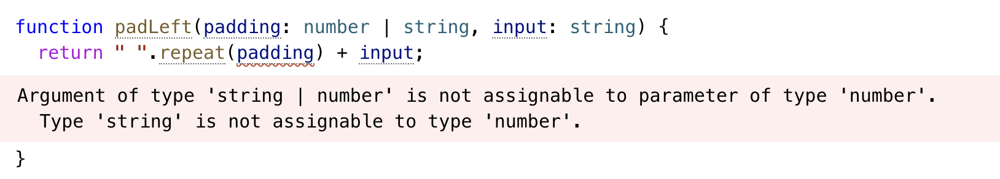
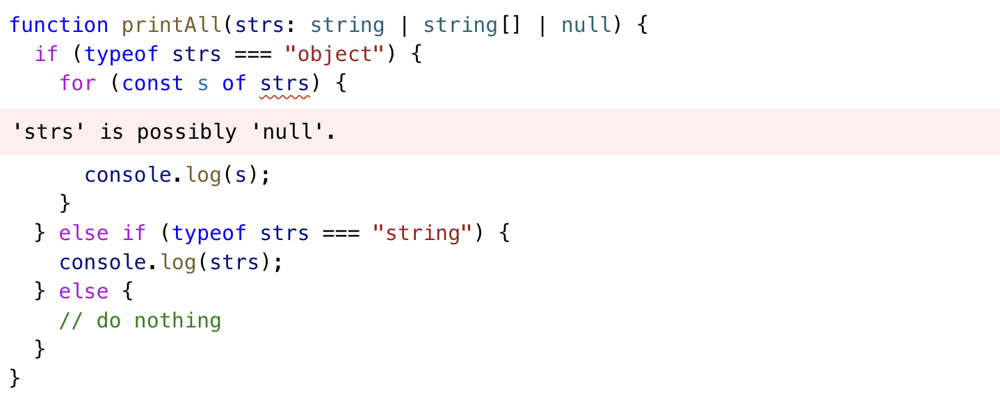
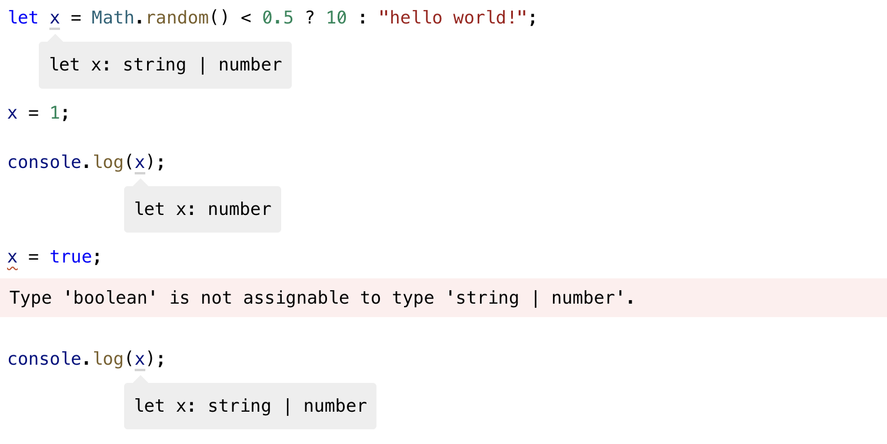
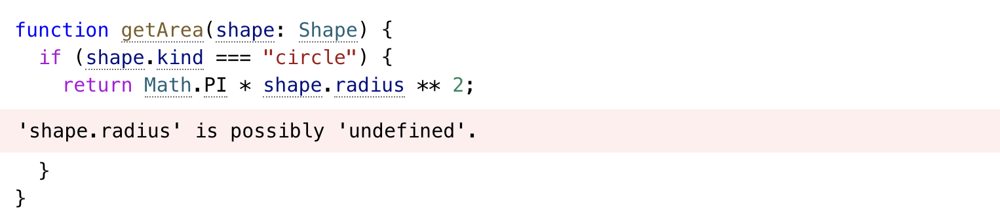

## 타입 좁히기😎

타입스크립트를 이용하면서 다양한 타입을 사용하다보면 확장성을 고려하거나 다양한 타입이 될 수 있다고 정의하는 경우가 많다. 이때 너무 넓은 타입으로 정의될 경우에는 공통된 속성과 메소드만 사용할 수 있기 때문에 이를 방지하기 위해 전달 받을 때는 넓히돼, 사용할 때는 우리가 원하는 타입으로 좁혀줘야 한다.


위의 예제는 `string`은 repeat 메소드를 가지고 있지 않기 때문에 발생한 타입오류다. 우리가 원하는 대로 사용하기 위해서는 타입을 좁혀줘야 한다.

```typescript
function padLeft(padding: number | string, input: string) {
  if (typeof padding === "number") {
    return " ".repeat(padding) + input
  }
  return padding + input
}
```

### typeof

typeof는 자바스크립트 문법으로 자바스크립트가 기본적으로 가지는 7가지 타입에 대한 확인이 가능한 키워드다.

- `string, number, bigint, boolean, symbol, undefined, object, function`

여기서 주의할 점은 `null`은 `object`이기 때문에 object 타입에 포함되어진다는 점이다.



### Truthiness Narrowing

자바스크립트에서 조건문등에서 boolean타입으로 형변환이 일어날 때 **Truthy/Falsy**한 값이 있다.

- Falsy한 값
  - `0`
  - `NaN`
  - `""` (the empty string)
  - `0n` (the `bigint` version of zero)
  - `null`
  - `undefined`

```typescript
function printAll(strs: string | string[] | null) {
  if (strs && typeof strs === "object") {
    // null과 ""가 제외
    for (const s of strs) {
      console.log(s)
    }
  } else if (typeof strs === "string") {
    // "" 빠진 string
    console.log(strs)
  }
}
```

위 코드는 이러한 점을 이용해서 null과 undefined을 조건문에서 제외했다. 하지만 주의할 점은 **빈 문자열**도 falsy로 되기 때문에 원하지 않은 예외사항이 생겼다.

### Equality Narrowing

자바스크립트에서 비교연산자로 4가지가 존재한다.( `==`, `===`, `!=`, `!==` )

이중 `===`, `!==`는 값뿐만 아니라 타입까지 비교하기 때문에 타입을 좁히는데 사용될 수 있다.

```typescript
function example(x: string | number, y: string | boolean) {
  if (x === y) {
    // x와 y 모두 string
    x.toUpperCase()
    y.toLowerCase()
  } else {
    console.log(x) // x: string | number
    console.log(y) // y: string | boolean
  }
}
```

이를 이용해서 기존 Truthiness에서 분리가 까다로웠떤 null타입을 직접 타입을 비교하므로써 제거할 수 있다.

```typescript
function printAll(strs: string | string[] | null) {
  if (strs !== null) {
    if (typeof strs === "object") {
      for (const s of strs) {
        console.log(s) // (parameter) strs: string[]
      }
    } else if (typeof strs === "string") {
      console.log(strs) //(parameter) strs: string
    }
  }
}
```

### The `in` operator narrowing

`in` operator는 object나 prototype chain 상에 존재하는 속성인지 체크하는 연산자다.

```typescript
type Fish = { swim: () => void }
type Bird = { fly: () => void }

function move(animal: Fish | Bird) {
  if ("swim" in animal) {
    // Fish만 해당
    return animal.swim()
  }

  return animal.fly()
}
```

### `instanceof` narrowing

`instanceof`는 자바스크립트에서 prototype chain위에 해당 객체가 있는 지 확인하는 연산자다.

```typescript
function logValue(x: Date | string) {
  if (x instanceof Date) {
    console.log(x.toUTCString()) // (parameter) x: Date
  } else {
    console.log(x.toUpperCase()) // (parameter) x: string
  }
}
```

### Assignments

let으로 선언된 값의 경우 타입이 union으로 정해지고 나서 다른 타입의 값으로 재할당할 경우 타입정의가 변하기 때문에 기존 타입의 값을 할당할 수 없다.

```typescript
let x = Math.random() < 0.5 ? 10 : "hello world!" // let x: string | number
x = 1 // let x: number
x = "goodbye!" // let x: string
```

union 타입의 경우 각 타입의 합집합이기 때문에 포함하고 있는 number와 string 타입의 값은 할당할 수 있다.

```typescript
let x = Math.random() < 0.5 ? 10 : "hello world!" // let x: string | number
x = 1 // let x: number
x = "goodbye!" // let x: string
```


위 예시는 string|number로 타입이 선언된 이후에 x에 기존 union 타입이 포함하지 않는 다른 값을 할당할 경우 발생하는 타입에러를 보여준다.

### Control flow analysis

앞서 설명했던 방법들을 통해 우리가 원하는 타입들로 좁혀갔다. 이렇게 특정타입이 어디까지 도달할 수 있는지를 *control flow analysis*라고 부른다.

```typescript
function example() {
  let x: string | number | boolean

  x = Math.random() < 0.5

  console.log(x) // boolean

  if (Math.random() < 0.5) {
    x = "hello"
    console.log(x) // string
  } else {
    x = 100
    console.log(x) // number
  }

  return x //  string | number
}
```

### Using type predicates

우리가 정의한 타입 가드를 통해 원하는 타입으로 좁힐 수 있는 것을 *type predicate*라고 부른다. 이때 `is`가 많이 쓰이는데 우리가 원하는 타입이 맞다는 것을 의미한다. 타입가드로 실무에 잘 쓰이는 부분이다.

```typescript
function isFish(pet: Fish | Bird): pet is Fish {
  return (pet as Fish).swim !== undefined
}
```

위 예제에서 pet이 `Bird`타입이라면 swim이라는 속성이 없어 undefined이 될 것이므로 이점을 이용해 undefined이 아니라면 `Fish`타입으로 좁혀줄 수 있다. 이 타입가드를 이용하면 다음과 같이 코드를 작성할 수 있다.

```typescript
// Both calls to 'swim' and 'fly' are now okay.
let pet = getSmallPet()

if (isFish(pet)) {
  pet.swim()
} else {
  pet.fly()
}
```

참고로, 클래스 에서는 this를 우리가 원하는 타입으로 좁혀줄 수 도 있다.

```typescript
class FileSystemObject {
  isFile(): this is FileRep {
    return this instanceof FileRep
  }
  isDirectory(): this is Directory {
    return this instanceof Directory
  }
  isNetworked(): this is Networked & this {
    return this.networked
  }
  constructor(public path: string, private networked: boolean) {}
}
```

### Discriminated unions

아마 내가 타입을 좁히는 방법중 자주 사용하는 방법중 하나라고 생각된다. `Discrimited unions`은 타입간의 공통 속성을 이용해 타입을 분리하는 방법이다.

```typescript
interface Shape {
  kind: "circle" | "square"
  radius?: number
  sideLength?: number
}
```

우리는 이제 kind에 타입에 따라 circle일 경우 radius가 있고, square일 경우는 sideLength가 있을 것을 생각하면서 타입을 위와 같이 정의했다. 하지만 문제점은 이렇게 정의해두면 타입스크립트는 circle일때 **radius를 가지는지 undefined인지 알 수 없다**는 점이다.


이러한 문제를 해결하기 위해서 **공통된 속성**을 가진 두가지 타입을 만들고 공통된 타입값에 따라 어떤 속성을 가지는 지를 정의할 수 있다.

```typescript
interface Circle {
  kind: "circle"
  radius: number
}

interface Square {
  kind: "square"
  sideLength: number
}

type Shape = Circle | Square
```

위와 같이 정의하게 되면 kind값에 따라 shape타입을 Circle과 Square으로 좁혀줄 수 있다.

```typescript
function getArea(shape: Shape) {
  switch (shape.kind) {
    case "circle":
      return Math.PI * shape.radius ** 2 // shape: Circle
    case "square":
      return shape.sideLength ** 2 //  shape: Square
  }
}
```

### Never 타입

never타입은 존재하지 않을 타입으로 **가장 작은 집합**을 의미한다. 이를 이용해서 switch문에서 default문 내부에 존재하지 않을 타입을 나타낼 수 있다. 실제로 코드리뷰에서 단순히 default 문에서 에러를 던지는 코드를 작성했었는데, 변수에 never로 타입을 좁혀서 사용하면 좋을 것 같다는 말씀을 해주셨는데 이제야 정확히 이해할 수 있었다.

```typescript
type Shape = Circle | Square

function getArea(shape: Shape) {
  switch (shape.kind) {
    case "circle":
      return Math.PI * shape.radius ** 2
    case "square":
      return shape.sideLength ** 2
    default:
      const _exhaustiveCheck: never = shape
      return _exhaustiveCheck
  }
}
```
