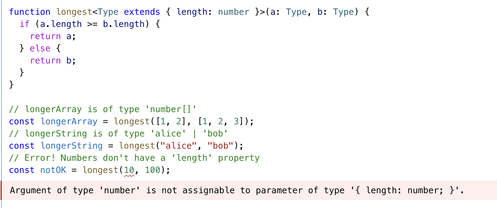
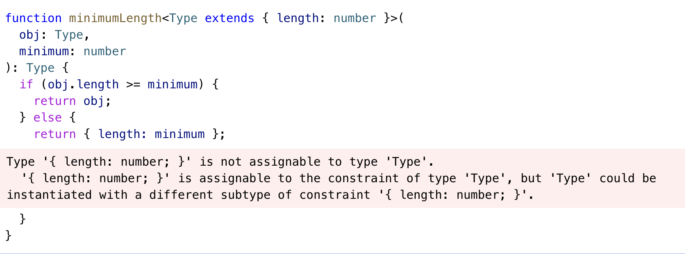
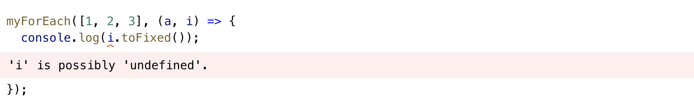
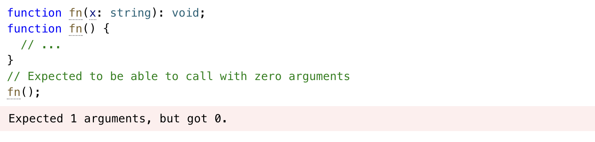
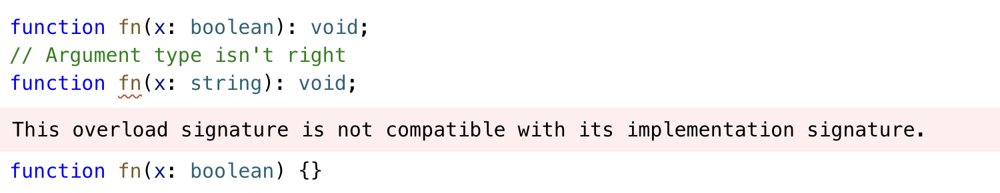
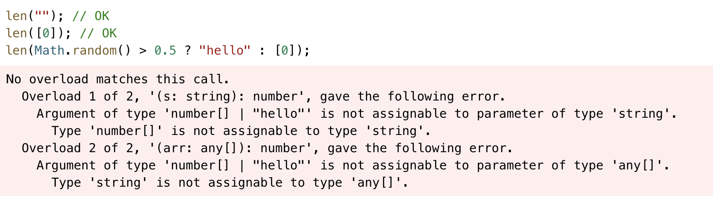
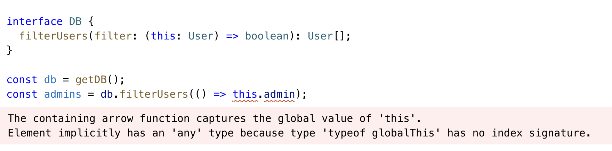
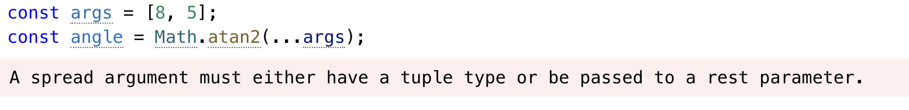

## More On Functions😃

타입스크립트에서 함수를 다루는 법을 알아보자


### Function Type Expressions

타입스크립트에서 fuction을 표현할 때 기본적으로 **parameter**와 **return** 값에 대해 타입으로 표현한다. Parameter type의 경우 타입을 정해주지 않으면 any로 정해진다.

```typescript
function greeter(fn: (a: string) => void) {
  fn("Hello, World");
}
 
function printToConsole(s: string) {
  console.log(s);
}
 
greeter(printToConsole);
```


### Call Signatures

자바스크립트에서 함수는 **객체**다. 이점이 중요한 점은 함수가 속성을 가질 수 있다는 의미이기 때문인데, **function type annotation**에서는 속성을 할당하지 못하게 한다. 속성을 할당하고 싶다면 해당 속성에 대한 call signature를 할당해야 한다.

```typescript
type DescribableFunction = {
  description: string;
  (someArg: number): boolean;
};
function doSomething(fn: DescribableFunction) {
  console.log(fn.description + " returned " + fn(6));
}

function myFunc(someArg: number) {
  return someArg > 3;
}
myFunc.description = "default description";

doSomething(myFunc);
```


### Construct Signatures

자바스크립트에서 함수 선언문으로 정의된 함수는 모두 **생성자 함수**로 쓰일 수 있기 때문에 new 키워드가 사용될 수 있다.` new `키워드를 이용한 타입 정의를 통해 construct signature를 정의할 수 있다.

```typescript
type SomeConstructor = {
  new (s: string): SomeObject;
};
function fn(ctor: SomeConstructor) {
  return new ctor("hello");
}
```


### Generic Functions

보통 param의 타입과 반환값의 타입은 관련이 있거나 param들간의 타입이 관계가 있다. any를 사용하지 않고 우리가 원하는 타입으로 좁혀서 재사용하는 방법으로 **generic**을 이용할 수 있다.

```typescript
function firstElement<Type>(arr: Type[]): Type | undefined {
  return arr[0];
}

// s is of type 'string'
const s = firstElement(["a", "b", "c"]);
// n is of type 'number'
const n = firstElement([1, 2, 3]);
// u is of type undefined
const u = firstElement([]);
```


#### inference

inference는 타입을 직접 정하는 것은 아니지만 typescript를 통해 **추론**되는 타입을 의미한다.

```typescript
function map<Input, Output>(arr: Input[], func: (arg: Input) => Output): Output[] {
  return arr.map(func);
}
 
const parsed = map(["1", "2", "3"], (n) => parseInt(n)); // parsedsms number[]이야
```


#### Constraints와 오류

generic을 이용해서 연관있는 input 타입들의 관계를 정의했지만 어느정도 우리가 원하는 타입으로 좁힐 수 있다. 좁힐 때는 **extends**를 통해 해당 속성을 가지고 있는 타입 등으로 좁힐 수 있다.



이런 Generic을 이용한 타입 좁히기는 유용할 수 있지만 조심해야할 부분이 있다.



위 코드에서 에러가 난 이유는 우리 Generic으로 전달한 인자의 타입이 반환값으로 그대로 반환될 것라고 선언했다. 하지만 else문 안에는 좁혀진 범위의 객체를 반환하기 때문에 기존과 다른 타입이기 때문에 타입에러가 났다. 타입스크립트에서 큰 집합은 작은 집합에 할당될 수 있지만, 그렇다고 큰집합이 작은 집합이라고 할 수는 없다. 

`사자는 동물에 포함된다` 라는말은 사자가 동물에 포함되기 때문에 맞지만, `사자와 동물은 같다`라는 말에는 오류가 있는 것과 같다.  


#### Guidelines for Writing Good Generic Functions

Generic 함수를 잘 작성하는 방법 3가지를 정리해보자.

- Push Type Param Down: param을 더 구체적인 값으로 사용한다.

```typescript
function firstElement1<Type>(arr: Type[]) {
  return arr[0];
}
 
function firstElement2<Type extends any[]>(arr: Type) {
  return arr[0];
}
 
// a: number (good)
const a = firstElement1([1, 2, 3]);
// b: any (bad)
const b = firstElement2([1, 2, 3]);
```

- Use Fewer Type Parameters: 더 적은 타입의 param으로 이용한다.

```typescript
function filter1<Type>(arr: Type[], func: (arg: Type) => boolean): Type[] {
  return arr.filter(func);
}
 
function filter2<Type, Func extends (arg: Type) => boolean>(
  arr: Type[],
  func: Func
): Type[] {
  return arr.filter(func);
}
```

filter2의 경우는 어떤 함수 타입인지 일일이 정해줘야하므로 사용처에서 불편함이 존재한다.

- Type Parameters Should Appear Twice: 재사용이 필요한 상황에만 제네릭을 쓰자.

```typescript
function greet<Str extends string>(s: Str) {
  console.log("Hello, " + s);
}
 
greet("world");


function greet(s: string) {
  console.log("Hello, " + s);
}
```

훨씬 간단하게 사용할 수있는 방법을 고민해보고, 반복되는 타입에 한해서 재사용을 위해 제네릭을 쓰자.


### Optional Parameters

param이 없을 수 있는 경우를 위해 `?`를 이용할 수 있다. 이렇게 사용하게 되면 `T|undefined` 로 타입이 할당된다. 

```typescript
function f(x?: number) {
  // ...
}
f(); // OK
f(10); // OK

```

또는 param이 없을 때를 위한 기본 값을 parameter default로 정의할 수 있다.

```typescript
function f(x = 10) {
  // ...
}
```

주의할 점은 callback을 이용할 때의 의미는 optional한 parameter는 필요없이 호출 될 수 있음을 의미하는 것이니까 불필요하게 사용하지 말자. 


### Function Overloads

함수 오버로드는 평소에 잘 사용하지 않던 부분이다 보니 이해하는데 어려움이 있었다. **함수 Overload**는 같은 이름의 함수에 param이 다르게 정의하는 방법이다.

```typescript
function makeDate(timestamp: number): Date;
function makeDate(m: number, d: number, y: number): Date;
function makeDate(mOrTimestamp: number, d?: number, y?: number): Date {
  if (d !== undefined && y !== undefined) {
    return new Date(y, mOrTimestamp, d);
  } else {
    return new Date(mOrTimestamp);
  }
}
const d1 = makeDate(12345678);
const d2 = makeDate(5, 5, 5);
```


Overload 함수를 작성하는데에는 몇가지 규칙이 있다.

- 인자가 없을 때의 어떤 함수인지 구현이 필요하다.




위 예제에서 에러가 발생한 이유는 param이 없을 때의 함수가 **어떻게 구현될지** 정의되지 않았기 때문이다.

아래와 고치면 타입에러가 사라지는 것을 볼 수 있다.

```typescript
function fn(x: string): void;
function fn():void;
function fn() {
  // ...
}
// Expected to be able to call with zero arguments
fn();
```

- Overload 끼리 compatible해야한다.



위 예제에서 같은 param 갯수를 가지는 overload 함수를 작성했다. 타입에러가 발생한 이유는 먼저 작성한 overload 함수 param 타입이 `boolean`으로 정의된 상황에서 같은 param 갯수를 가지는 두번째 overload 함수에서 boolean타입과 compatible 하지 않은 string 타입으로 정의했기 때문이다.


-  Overload 함수는 조건부로 쓰이면 안된다.

```typescript
function len(s: string): number;
function len(arr: any[]): number;
function len(x: any) {
  return x.length;
}
```

위 예제는 string과 array를 param으로 받을 수 있는 함수 overload가 정의된 상황이다. 



위 타입에러는 조건에 따라 다른 타입의 param을 전달하는 상황이기 때문에 발생했는데, 그 이유는 타입스크립트는 하나의 overLoad에서만 함수를 호출하기 때문이다. 이럴때는 param을 정의할 때 union type으로 정의하는 게 더 올바른 방법이다.

```typescript
function len(x: any[] | string) {
  return x.length;
}
```


### this 다루기

javascript에서의 this 처럼 typescript의 this도 동적으로 정의된다. 

```typescript
const user = {
  id: 123,
  admin: false,
  becomeAdmin: function () {
    this.admin = true;
  },
};
```

위 예제에서 **this**는 암시적 바인딩에 의해 호출되는 위치에 따라 다른 값을 의미하게된다.

이러한 this를 상대적으로 쉽게(?) 정의하는 방법으로 **화살표함수**를 이용하는 방법이 있다. 화살표 함수는 함수 선언식과 다른 특징이 있는데 그중 생성자 함수로 쓰일 수 없다는 점이 있다. 그렇기 때문에 자체적인 this를 가지지 않고 화살표 함수에서 this는 상위 스코프의 this를 참조하는 규칙 가진다.


위 코드에서 타입 에러가 발생한 이유는 화살표함수로 정의된 메소드의 this는 상위 스코프인 globalThis이기 때문이다.


### Other Types to Know about

몇가지 앞서 소개되지 않았던 타입들에 대해 정리해보자.

- Void

함수에서 반환하는 값이 없을 때를 위한 타입으로, return 문이 없을 때 자동으로 undefined이 반환되지만 타입스크립트에서는 따로 void로 정의한다.

- unknown

any와 유사하지만, any와 달리 어떤 속성을 가지는 지 알 수 없기 때문에 속성에 접근할 수 없다. 주로 try-catch 문으로 에러를 받을 때 **unknown**으로 반환되기 때문에 비즈니스 에러로 적절하게 타입을 정의한 후 `instanceOf` 를 이용해 에러 객체를 정의하는 방식으로 현업에서 사용하고 있다.

- never

never는 어떤 것도 포함될 수 없는 타입을 의미한다. union이나 switch문에서 더이상 없다는 것을 의미한다.

```tsx
function fn(x: string | number) {
  if (typeof x === "string") {
    // do something
  } else if (typeof x === "number") {
    // do something else
  } else {
    x; // has type 'never'!
  }
}
```


### Rest Parameters and Arguments

Rest Parameter는 인자가 **동적으로** 들어올 때의 param을 의미한다. arguments로 받을 param의 타입들을 정의할 수 있다.

```typescript
function multiply(n: number, ...m: number[]) {
  return m.map((x) => n * x);
}
// 'a' gets value [10, 20, 30, 40]
const a = multiply(10, 1, 2, 3, 4);
```

rest parameter를 생길 수 있는 타입에러로는 배열과 튜플의 타입 차이에서 발생할 수 있다. 



위 예제에서 `Math.atan2(...)`메소드는 **딱 두개의 인자**를 받지만 args는 `number[]`로 타입이 되어있기 때문에 몇개의 값이 더 들어올지 모르는 타입을 의미해 생긴 타입 에러다.

이를 해결하기 위해서는 배열이 아니라 몇개의 요소로 되어있는 타입인지 정의된 **tuple**을 이용하면 해결할 수 있다.

```typescript
const args = [8, 5] as const;
// OK
const angle = Math.atan2(...args);
```


### Parameter Destructuring

객체 param을 전달할 때 각 속성에 대한 타입을 정의해서 전달할 수 있다.

```typescript
type ABC = { a: number; b: number; c: number };
function sum({ a, b, c }: ABC) {
  console.log(a + b + c);
}
```


### Assignability of Functions

void를 반환타입으로 가지는 함수들 끼리 가지는 특이한 특징이 있다. void 자체는 해당 함수들이 반환하는 타입에 대해 강하게 타입을 따지지 않기 때문에 반환 타입이 무시된다.

```typescript
type voidFunc = () => void;
 
const f1: voidFunc = () => {
  return true;
};
 
const f2: voidFunc = () => true;
 
const f3: voidFunc = function () {
  return true;
};
```

위 예제에서 `f1,f2,f3` 다 반환하는 타입이 boolean이지만 voidFunc로 정의해도 타입에러가 발생하지 않는다.


```typescript
function f2(): void {
  return true; // 에러 발생
}
```

하지만 직접 정의할 때 void를 반환한다고 정의할 시에 타입 에러가 걸리게 된다.
