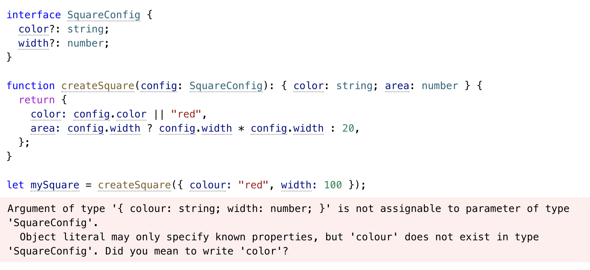

## Object Types

자바스크립트에서 object는 정말 자주 쓰이는 자료구조로, 함수의 param의 타입이나 interface, type alias를 이용해서 타입을 지정해서 자주 사용한다.

```typescript
function greet(person: { name: string; age: number }) {
  return "Hello " + person.name;
}

interface Person {
  name: string;
  age: number;
}

type Person = {
  name: string;
  age: number;
};
 
function greet(person: Person) {
  return "Hello " + person.name;
}
```


### Property Modifier

object 타입 속성을 정의할 때 modifier를 통해 추가적인 속성들을 정의해줄 수 있다.

- Optional

```typescript
interface PaintOptions {
  shape: Shape;
  xPos?: number;
  yPos?: number;
}
 
function paintShape(opts: PaintOptions) {
  // ...
}
 
const shape = getShape();
paintShape({ shape });
paintShape({ shape, xPos: 100 });
paintShape({ shape, yPos: 100 });
paintShape({ shape, xPos: 100, yPos: 100 });
```

자바스크립트에서 object의 속성에 접근했을 때 값이 없다면 에러가 나는게 아니라 **undefined**으로 정의되기 때문에 이때 default값을 설정해줄 수 있다. 

```typescript
function paintShape({ shape, xPos = 0, yPos = 0 }: PaintOptions) {
  console.log("x coordinate at", xPos);
  console.log("y coordinate at", yPos);
  // ...
}

```


- readonly

readonly로 정의한 속성의 경우 다른 값으로 수정할 수 없다.


이때 중요한 것은 readonly로 정의한 속성에 객체로 할당되었다면, 해당 객체의 속성에는 접근이 가능하다. 이는 자바스크립트의 객체는 참조값으로 할당되기 때문이다. 위 예제에서 resident 속성 자체를 바꾸는데 타입에러가 발생하지만 resident의 내부 속성은 수정할 수 있는 것을 볼 수 있다.


```typescript
interface Person {
  name: string;
  age: number;
}
 
interface ReadonlyPerson {
  readonly name: string;
  readonly age: number;
}
 
let writablePerson: Person = {
  name: "Person McPersonface",
  age: 42,
};
 
// works
let readonlyPerson: ReadonlyPerson = writablePerson;
 
console.log(readonlyPerson.age); // prints '42'
writablePerson.age++;
console.log(readonlyPerson.age); // prints '43'
```

readonly를 사용하면 개발 환경에서 항상 속성을 변경하는 것을 막을 수 있다고 생각할 수도 있지만 그렇지는 않다. 위 예제 처럼 서로 compatible한 타입을 가진 두가지 변수에 같은 객체를 할당할 경우, 같은 참조값을 가지기 때문에 readonlyPerson의 속성을 바꾸면 writablePerson의 속성 값이 변하는데, 이때 타입에러가 발생하지 않는 것을 볼 수 있다.


- Index Signature

```typescript
interface StringArray {
  [index: number]: string;
}
 
const myArray: StringArray = getStringArray();
const secondItem = myArray[1];
```

index signature는 동적인 속성을 할당해야할 때 사용할 수 있는 타입으로, 값으로 정의할 수 있는 타입은 **string, number, symbol**만 가능하다.


이때 주의할 점은 index signature로 정의한 타입의 값은 해당 타입만 가능하기에 위의 예제에서 타입 에러가 발생한 것을 볼 수 있다.

```typescript
interface NumberOrStringDictionary {
  [index: string]: number | string;
  length: number; // ok, length is a number
  name: string; // ok, name is a string
}
```

이를 해결하기 위해 앞서 설명한 값으로 정의할 수 있는 타입은 string, number, symbol만 가능하지만 세 종류 타입의 union 타입 또한 허용되기 때문에 union으로 정의해 해결할 수 있다.


### Excess Property Checks

타입스크립트에서 속성을 체크할 때, 속성 값이 존재하는지 오타인지를 자동으로 체크해주는 것을 excess property checking 라고 부른다. 


위 예제에서 color가 아니라 colour 속성을 가진 객체가 할당되었기 때문에 에러가 발생한 것을 볼 수 있다. 이것을 회피하는 방법이 있지만 굳이 회피하지 말고 정확하게 사용하자.


### Extending Types

interface로 정의한 타입은 `extends`로 상속할 수 있다.

```typescript
interface BasicAddress {
  name?: string;
  street: string;
  city: string;
  country: string;
  postalCode: string;
}

interface AddressWithUnit {
  name?: string;
  unit: string;
  street: string;
  city: string;
  country: string;
  postalCode: string;
}

// 대신
interface AddressWithUnit extends BasicAddress {
  unit: string;
}


```

위 예제에서 공통적인 속성을 다시 작성하기보다 extends로 중복을 제거했다. 클래스에서 다른 클래스를 상속하는 것과 동일하게 느껴진다.


```typescript
interface Colorful {
  color: string;
}
 
interface Circle {
  radius: number;
}
 
interface ColorfulCircle extends Colorful, Circle {}
 
const cc: ColorfulCircle = {
  color: "red",
  radius: 42,
};
```

클래스와 달리 타입은 extends를 이용해 여러개의 타입을 상속할 수도 있다.


### Intersection Types

intersection Type은 두가지 type의 교집합을 의미하므로 두가지 타입을 모두 만족하는, 모두의 속성을 가지는 객체의 타입을 의미한다.

```typescript
interface Colorful {
  color: string;
}
interface Circle {
  radius: number;
}
 
type ColorfulCircle = Colorful & Circle;

function draw(circle: Colorful & Circle) {
  console.log(`Color was ${circle.color}`);
  console.log(`Radius was ${circle.radius}`);
}
 
// okay
draw({ color: "blue", radius: 42 });
```


### Generic Object Type

Object 타입을 정의할 때 속성 타입을 변수처럼 다양한 타입을 전달해야할 때가 있다. 이러한 요구사항을 만족하기 위해서 다음과 같은 방법들을 사용할 수 있다.

- any와 unknown, 또는 assertion 사용하기

```typescript
interface Box {
  contents: any;
}

interface Box {
  contents: unknown;
}
 
let x: Box = {
  contents: "hello world",
};
 
// we could check 'x.contents'
if (typeof x.contents === "string") {
  console.log(x.contents.toLowerCase());
}
 
// or we could use a type assertion
console.log((x.contents as string).toLowerCase());
```

타입을 `any`나 `unknown에 assertion`을 이용하면 어떤 값이나 다 넣어도 되기 때문에 요구사항은 만족시킬 수 있지만 런타임 에러를 미리 알 수 있는 장점을 모두 잃어 버린다.

- 필요한 속성 타입에 따라 다른 타입 정의하기

```typescript
interface NumberBox {
  contents: number;
}
 
interface StringBox {
  contents: string;
}
 
interface BooleanBox {
  contents: boolean;
}

function setContents(box: StringBox, newContents: string): void;
function setContents(box: NumberBox, newContents: number): void;
function setContents(box: BooleanBox, newContents: boolean): void;
function setContents(box: { contents: any }, newContents: any) {
  box.contents = newContents;
}
```

이렇게 정의하게 되면 같은 타입에도 여러개의 타입이 중복적으로 선언되는 단점이 존재하고 함수를 정의할 때는 overload를 통해 정의해야한다. 

- Generic 이용하기

```typescript
interface Box<Type> {
  contents: Type;
}

interface Apple {
  // ....
}
 
// Same as '{ contents: Apple }'.
type AppleBox = Box<Apple>;

function setContents<Type>(box: Box<Type>, newContents: Type) {
  box.contents = newContents;
}
```

Generic은 앞선 예제들이 각각 가지고 있던 Type narrowing과 중복코드를 발생이라는 두가지 단점을 한번에 해결하는 방법이다. 

```typescript
interface Box<Type> {
  contents: Type;
}

type Box<Type> = {
  contents: Type;
};

 
type OneOrMany<Type> = Type | Type[];
 
type OneOrManyOrNull<Type> = OrNull<OneOrMany<Type>>; 

// type OneOrManyOrNull<Type> = OneOrMany<Type> | null
           
type OneOrManyOrNullStrings = OneOrManyOrNull<string>;
               
// type OneOrManyOrNullStrings = OneOrMany<string> | null
```

Generic은 interface와 type alias 두가지 모두에 적용할 수 있고, 특히 Type alias는 Generic 타입끼리 엮어서 generic helper type을 정의할 수 있다.


### Array Type

```typescript
interface Array<Type> {
  /**
   * Gets or sets the length of the array.
   */
  length: number;
 
  /**
   * Removes the last element from an array and returns it.
   */
  pop(): Type | undefined;
 
  /**
   * Appends new elements to an array, and returns the new length of the array.
   */
  push(...items: Type[]): number;
 
  // ...
}
```

배열을 정의할 때 사용할 수 있는 Array 타입은 generic type을 통해 정의할 수 있다. 실제로 프로젝트에서는 `Array<T>`와 `T[]`를 혼용해서 자주 사용한다.

- ReadOnlyArray


자바스크립트에서 배열 또한 object이기 때문에 참조값으로 저장되고 이때 배열의 값을 접근해 변경할 수 있다. ReadonlyArray는 몇개의 값을 가지고 있을지는 모르지만 더이상 배열에 새로운 item을 추가 삭제할 수 없게 막을 수 있다.


- Tuple

```typescript
type StringNumberPair = [string, number];

// 아래와 같이 볼 수 있다.
interface StringNumberPair {
  // specialized properties
  length: 2;
  0: string;
  1: number;
 
  // Other 'Array<string | number>' members...
  slice(start?: number, end?: number): Array<string | number>;
}

function doSomething(pair: [string, number]) {
  const a = pair[0]; // const a: string 
       

  const b = pair[1]; // const b: number

  // ...
}
 
doSomething(["hello", 42]);
```

Tuple 타입은 배열 내부 item들의 길이와 타입을 알고있는 배열을 의미한다. 정의된 길이 밖의 값에 접근할 수 없는 특징을 가진다. 프로젝트를 진행하면서 보통 동적인 값을 다룰 때 배열을 사용하기 때문에 길이가 정해져있지 않아서 잘 사용해보지는 못했다.

```typescript
type Either2dOr3d = [number, number, number?];
 
function setCoordinate(coord: Either2dOr3d) {
  const [x, y, z] = coord; // const z: number | undefined
  console.log(`Provided coordinates had ${coord.length} dimensions`); 
//(property) length: 2 | 3                                          
}

function doSomething(pair: readonly [string, number]) {
  // ...
}

type StringNumberBooleans = [string, number, ...boolean[]];
type StringBooleansNumber = [string, ...boolean[], number];
type BooleansStringNumber = [...boolean[], string, number];

const a: StringNumberBooleans = ["hello", 1];
const b: StringNumberBooleans = ["beautiful", 2, true];
const c: StringNumberBooleans = ["world", 3, true, false, true, false, true];

function readButtonInput(...args: [string, number, ...boolean[]]) {
  const [name, version, ...input] = args;
  // ...
}
```

tuple을 사용할 때 `?`를 이용해 optional한 요소 타입을 정해주거나 readonly 속성을 넣어줄 수 있고, 일부의 타입만 알고 있을 경우의 나머지 타입은 rest parameter처럼 정의해줄수도 있다.

