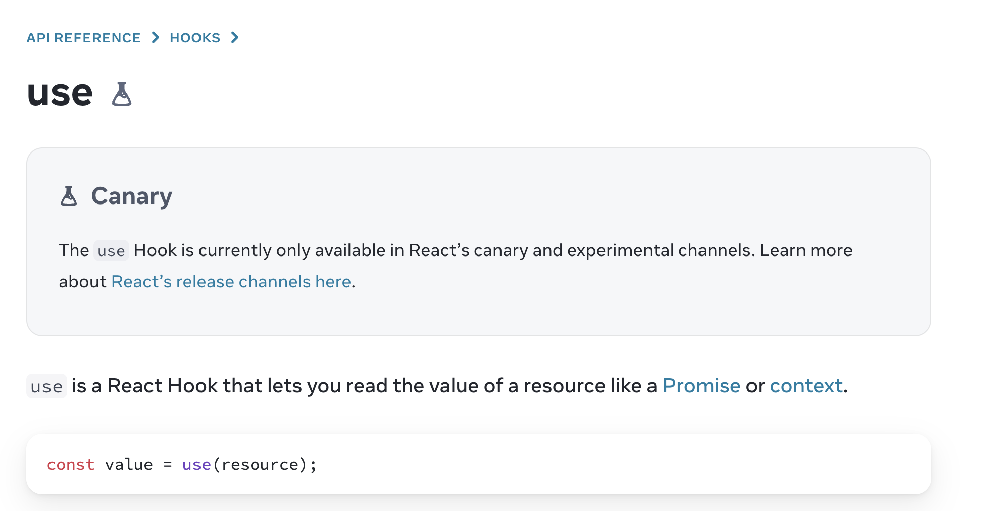

10월은 9월과 유사하게 스쿼드 업무보다는 챕터 업무에 주된 시간을 보냈던 한달이었지만, 보다 기술적으로 많이 배울 수 있는 시간이었다. 성능 측정을 위한 유틸을 구현해기도 하고, 측정된 데이터를 통해서 더 개선될 수 있는 작업해 주요 도메인을 개선하는 작업에 참여했다. 업무 외적으로 프론트엔드에서 가장 큰 행사인 **FECONF**에 엠버서더로 참여하는 기회가 있었다. 지난 한달과는 또 다른 한달을 보낸 10월에 대해 정리해보려한다.  


### 😍드디어 참여해본 컨퍼런스, FEConf

 10월 21일 국내 최대 Front-end 컨퍼런스인 **FEConf**에 숨고의 엠버서더로써 참여했다. 나는 모바일 엔지니어이지만 기술 스택으로 `React-Native`을 사용하고 있기 때문에 함께 참여할 수 있는 기회가 있었다. 엠버서더로써 행사를 준비하면서 부스에 오실 분들을 위한 굿즈들에 대한 아이디어 회의에 참여하고, 나는 채용경험이 없어서 참여하지 않았지만, 프론트엔드 챕터분들과 웹 경력이 있으신 모바일 엔지니어 분들은 사전에 전달받은 이력서들에 대한 코칭을 위한 준비 등 숨고를 알리기 위해 준비를 했다. (그래서 사실 내가 한 일은... 현장에서 홍보가 주된 일이었다.)

 엠버서더로 참여했지만 타임별로 나눠서 일을 진행했기 때문에 남는 시간들에 다양한 세션들을 들을 수 있었다. ABC로 나뉜 공간에서 각각의 세션이 따로 진행되기 때문에, 전부를 들을 수는 없어 내가 관심있는 주제들에 대한 세션들을 들을 수 있었다. 내가 들었던 세션은 토스의 프론트엔드 분들이 일하는 방식을 설명해주신 **토스 후원사 세션**, 데브 시스터즈 분께서 발표해주신 **use 훅이 바꿀 리액트 비동기 처리의 미래 맛보기**, 숨고를 대표해서 발표해주신 홀란드의 **vue에서 Next JS로 마이그레이션 세션**, 그리고 RN 개발자로써 가장 기대했었던 토스의  **React Native, Metro를 넘어서** 세션까지 총 4가지 세션에 참여해서 들었고, 마지막 타임에는 우리 회사가 준비한 **이력서 세션**에서 다른 개발자분들과 네트워킹하는 시간에 참여했다.

 토스 후원사 세션에서는 토스 계열사들의 각각 팀 리드분들과 팀원분들이 나오셔서 어떻게 일하는 지에 대해 전달받을 수 있었고, 어떻게 일하는지 새롭게 추가된 토스 플레이스라는 계열사가 어떤 문제를 해결하기 위해 기획이 된 팀인지 등 소개해주는 시간이었다. 회사 소개에 가까워 조금 더 사내 문화 등에 대해 알려줬으면 하는 아쉬움도 있었다.

 use훅이 바꿀 리액트 비동기 처리의 미래는 현재 리액트에서 실험단계에 있는 **use** 훅에 대해 발표해주셨다. use 훅은 context나 promise를 읽을 수 있게 하고 기존 hook들과 달리 조건부로 호출도 가능한 특징이 있었다. RN과 비동기 처리에 대해서 관심이 많은 나에게 `비동기를 잘 다루는 것`에 대해 나뿐만 이 아니라 많은 분들이 관심을 갖고 해결하고자 하는 문제라는 점과 리액트에서 시도하고 있는 다양한 해결방법들에도 더 관심을 가져야 겠다는 생각이 들었던 세션이었다. 

[use 훅에 대한 리액트 공식문서 설명]



 우리 회사 대표로 홀란드께서 준비해주신 vue에서 next로 마이그레이션 과정에 대한 발표는, 현재도 계속해서 프론트엔드 챕터에서 진행중인 마이그레이션과 함께, 새로운 기능들을 추가하고, 점진적으로 마이그레이션할 수 있는 방법들에 대해 담고 있었다. 사내 리허설때 한번 들은 적이 있었지만 얼마나 연습하셨는지 발표내용이 더 명료해져 잘 이해할 수 있었다. 나도 1년 뒤에는 다양한 경험을 쌓아, 여러가지 문제를 해결한 경험을 발표할 수 있기를 바래보기도 했다.

 토스의 발표 세션은 번들러에 대한 기본적인 과정과 RN에서 필수적으로 사용중인 metro 번들러 대신 esBuild를 이용함으로써 빌드시간 단축과, 번들 사이즈를 줄인 과정을 담고 있었다. RN 개발자로써 우리 팀 내에서도 많은 관심을 가지고 있던 주제였고, 팀원분들이 시도했지만 다른 번들러로 전환하기에 아직 어려움을 겪고 있어서 이번 발표로 우리 제품에도 적용하면 좋겠다는 생각을 가지고 있었다. 하지만 주된 내용은 번들러에 대한 기본지식을 전달하는 내용이었고, 실제 metro에서 어떻게 esBuild 번들러를 어떻게 적용했는지에 대해서는 공개되지 않은 부분이 많아 아쉬웠다. 이후 팀원중 한분이 여쭤봤을 때 esBuild는 HMR을 지원하지 않기 때문에 실제 개발시에 실시간으로 반영이 되지않는 단점을 가지고 있어 토스팀에도 현재는 PROD를 위해서 이용중이라는 답변을 얻을 수 있었다. 발표내용을 우리 제품에 적용할 수 있을지는 모르겠지만 나에게는 모호했던 **번들러**라는 것이 어떤 일을 하는지에 대한 이해도를 높일 수 있는 좋은 시간이었다. 

 마지막으로 우리 회사의 이력서 코칭 세션에는, 좋은 이력서에 대해서 이야기하고 마지막에 각 테이블별로 네트워킹 시간을 가졌다. 내가 참여한 테이블에는 세분이 계셨고, 각각 회사를 다니고 계시는 분들로 이력서 코칭 내용들에 대해 이야기도 하고, 회사에서 어떻게 일하고 계신지에 대해 이야기하는 시간을 가졌다. 회사-집만 반복하는 나에게 다른 회사 개발자분들의 경험을 들을 수 있는 좋은 기회였다.  

들을수 있는 모든 세션을 듣고 중간중간 홍보도 하면서 많은 사람들이 프론트엔드 개발자로 일하고 있고, 다양한 회사들이 정말 세상의 많은 문제들을 해결하기 위해 애쓰고 있다는 생각이 들었다. 작년만해도 지망생에서 일을 많이 하지는 않았지만 이제는 회사 엠버서더로, 개발자로 같이 있다는 게 좋고 많이 자극을 받을 수 있는 시간이었다. 

[회사 굿즈였던 숨식이 스티커]


[뭐 듣고 있는지는 모르겠지만 혼자 심각하게 듣다가 찍힌 나]


### 🤩 Firebase Peformance를 이용해 견적발송을 개선해보자 

이번 테크팀의 OKR로 우리 제품의 핵심 도메인인 견적발송과 요청서 작성에 안정성과 개선점들을 찾고 실행하는 작업을 진행하게 되었다. 기존 스쿼드에서 맡아서 하던 업무의 중요 도메인이 견적발송이었기 때문에 자연스럽게 챕터내에서 담당하게 되었고, 다행히 작업하면서도 개선할 수 있을 것 같은 포인트들을 어느정도 생각하고 숙원사업들중 하나여서 나에게는 챕터방향과 개인적인 방향이 잘 맞아 떨어져 감사한 부분이었다.

#### 그러면 기존에는 어땠을까? 🤔

기존 요청서 상세- 견적발송으로 이어지던 퍼널 하나의 페이지로 줄이는 실험을 진행하면서 두가지에 필요한 정보를 모두 하나의 화면에서 확인하고 있었다. 그 당시에 도메인을 잘모르고 매출의 아주 중요한 도메인인 견적발송을 맡아서 진행한다는 부담감과, 부족한 도메인 지식들로 인해 거의 대부분 작성되어있던 코드를 그대로 사용해 구현해 일정에 맞게 실험을 진행했다. 

다시 보게된 견적발송 화면의 코드들 중에서 가장 많이 눈에 보였던 점은 견적 발송 API를 호출하기 전 **견적발송 가능여부**를 체크하는 부분이었다. 다른 useCase들에 대한 확인하기 위해 API를 호출하는데 확인해보니 똑같은 API들에 대해서 중복해서 호출하고 있었다. `중복적으로 호출하고 있는 API에 대해서 하나로 합쳐보면 견적발송 시간이 줄지 않을까?` 라는 생각으로 첫번째 목표로 삼아 일감을 진행했다.

[간략하게 나타낸 기존 견적발송 코드]

```ts
function use_견적발송(...arg){
  try{
    if(견적발송_가능여부_체크_useCase1()===false){
      return 
    }
  	...

   if(견적발송_가능여부_체크_useCaseN()==false){
      return 
   }
    
    const 견적발송결과=await 견적발송(...)
    
    await 견적발송_후작업(견적발송결과)
    
  } catch(e){
      if(e instanceof 견적발송실패_에러케이스1){
        견적발송실패_에러케이스1에대한_예외처리1()
      }
      ...
      if(e instanceof 견적발송실패_에러케이스N){
        견적발송실패_에러케이스N에대한_예외처리N()
      }
  }
}

```


#### 일단 데이터를 쌓자 🤥

바로 개선 작업에 들어가기 유저 디바이스에서 진행했을 때 걸리는 시간의 before/after에 대해 기록해보기로 했다. 그러면 어떤 툴을 이용해서 시간을 측정할지를 고민했을 때 두가지 방법이 있어보였다. AB테스트로 데이터를 수집하는데 이용하고 있는 **Amplitude**를 이용하는 방법, 마지막으로 제품에서 FPS와 TTI를 측정하기 위해서 사용하고 있던 **Firebase Performance**가 있었다. 첫번째 방법인 Amplitude의 데이터는 테크팀에서만 보는 지표가 아니라 프로덕트 팀과 함께 보는 지표이다보니, 추가적인 데이터를 쌓는 것에 어려움이 있었고, 두번째 방법은 모바일 챕터 only로 데이터를 쌓을 수 있는 부분이었기 때문에 두번째 툴을 선택하게 되었다.

 **Firebase Performance**는 리액트 네이티브에서 이용하기 위해서 [React-native-firebase](https://github.com/invertase/react-native-firebase)를 이용할 수 있다. 기존 우리 프로젝트는 안드로이드와 ios 프로젝트로 구분해서 데이터를 쌓고 있었고, 기존 화면 렌더링 속도를 측정하기 위해 존재하던 유틸과 React-native-firebase docs를 참고해 코드를 작성하려했다. 

[React native Firebase의 Custom Tracing 설명과 예제]


[처음 구현한 견적 발송 측정 util]

```typescript
import perf from '@react-native-firebase/perf';

const trace = perf().newTrace('견적발송');

const startTrace = async () => {
    await trace.start();
    trace.putMetric('start', new Date().getTime());
};

const stopTrace = async () => {
    trace.removeMetric('start');
    await trace.stop();
};

const addCheckPoint = async (name: string) => {
    const startTime = trace.getMetric('start');
    trace.putMetric(name, new Date().getTime() - startTime);
};

export const 견적발송Trace = {
    start: startTrace,
    stop: stopTrace,
    addCheckPoint,
};
```

 위 코드는 기존 유틸과 거의 동일하게 구현한 방식으로 **중간지점을 기록**하는 `addCheckPoint`함수를 추가했다. 중간 지점을 기록하기 위해서 시작한 시간에 대한 정보를 가지고 있어야했고, 중간지점에 대한 기록도 함께 남기기 위해서 Firebase Performance가 가지는  **Attribute**와 **Metric** 두가지  metadata에 대해 알게 되었다. **attribute**는 사용기기, OS와 같은 정보를 기록할 수있고 **metrics**은 시간이나 숫자에 대한 정보를 기록하는데 용이해보였다. attribute보다 metric이 대시보드에서 탭으로 바로 바로 볼수 있는 장점이 있어 metric에 중간지점을 기록할 수 있게 구현했다. 


[성능 측정코드가 추가된 견적발송 코드]

```ts
function use_견적발송(...arg){
  try{
    await 견적발송Trace.start();
    if(견적발송_가능여부_체크_useCase1()===false){
      return 
    }
  	...

   	if(견적발송_가능여부_체크_useCaseN()===false){
      	return 
   	}
    
   	await 견적발송Trace.addCheckPoint('견적발송_가능여부_체크');
    
    const 견적발송결과=await 견적발송(...)
    
    await 견적발송_후작업(견적발송결과)
    
    await 견적발송Trace.stop();
    
  } catch(e){
     	if(e instanceof 견적발송실패_에러케이스1){
        견적발송실패_에러케이스1에대한_예외처리1()
      }
      ...
      if(e instanceof 견적발송실패_에러케이스N){
        견적발송실패_에러케이스N에대한_예외처리N()
      }
  }
}

```

 구현한 유틸은 정상적으로 작동되는 것처럼 보였지만 예상치 못한 문제상황이 발생했다. 문제상황은 두가지로 항상 첫번째 데이터만 쌓이게 된다는 점과 측정시도 도중에 실패했을 경우에 `stop`이 호출되지 않아 다시 시도했을 때 성공할 때까지의 시간이 측정된다는 점이었다. 첫번째 문제는 원하는 데이터가 덜 쌓이는 문제가 있고, 두번째 문제는 데이터가 뒤죽박죽이 되어 신뢰도를 떨어뜨렸다. 

 두가지 문제점의 원인을 찾기위해서 RN Debugger의 로그로 찾아보려했지만 Firebase Performance와 관련된 로그를 볼수 없어 어려움을 겪었다. 여러가지를 찾아보다 안드로이드 스튜디오의 **LogCat**을 이용해 안드로이드 시뮬레이터에서 확인할 수 있는 Firebase Performance 로그를 분석했다.


 LogCat으로 확인해본 결과, 첫번째 기록에 대한 로그는 정상동작했지만 실제로 두번째 견적발송 시도시에는 아무 기록이 되지 않는 것을 볼 수 있었다. 계속해서 시도하면서 Trace데이터의 특징을 발견하게 되었다. 

- 한번 시작된 Trace는 stop을 할때까지 기록이 된다.
- stop된 Trace는 다른 데이터를 기록할 수 없다. 

 이러한 특징 때문에 내가 구현했던 유틸은 하나의 Trace에 계속해서 기록하려하다보니 첫번째 성공한 데이터만 기록이 되고, 실패한 경우에는 계속 같은 데이터에 기록이 되고 있으므로 성공할 때까지 시간이 측정되는 문제가 발생했다.

 디버깅을 하고나서 문제 해결방법은 간단했는데 측정시작시 **매번 새로운 Trace로 측정을 시작하는 것**이었다. 현재 코드 구조상에는 매번 새로운 Trace를 이용하기 위해서 let이용해서 매번 새로운 Trace를 할당할 수도 있었지만, Firebase Performance 측정과 관련 데이터와 메소드를 하나의 클래스로 표현하는 게 좀 더 응집도를 높인 코드가 될 수 있을 것 같았다.

[새롭게 구현한 성능측정 유틸]

```typescript
export class 견적발송Trace {
    constructor(private trace: null | FirebasePerformanceTypes.Trace = null, private startTime = 0) {}
    async start() {
        if (this.trace === null) {
            this.trace = perf().newTrace('견적발송');
        }
        await this.trace.start();
        this.startTime = new Date().getTime();
    }

    async stop() {
        if (this.trace === null) {
            return;
        }
        this.trace.putAttribute('result', value);
        await this.trace.stop();
    }

    addCheckPoint(name: string) {
        if (this.trace === null) {
            return;
        }
        this.trace.putMetric(name, new Date().getTime() - this.startTime);
    }
}

export const 견적발송Tracker = 견적발송Trace.getInstance();

```

 위의 코드는 클래스로 다시 구현한 성능측정 유틸이다. instance에 접근가능한 스코프 내에서만 사용할 수 있는 한계점이 생길 수 있어, 싱글톤 패턴을 이용해 하나의 instance를 export해서 사용하게 구현했다. 앞서 겪었던 문제점을 해결하기 위해 start시 새로운 Trace를 할당하고, stop시에는 Trace를 삭제해 불필요한 메모리를 차지하지 않게 구현했다. 구현한 코드는 이후 코드리뷰를 통해서 좀 더 범용성 높은 유틸로 개선되어 프로젝트에서 사용하게 되었다.


#### 이제 진짜 개선 작업을 시작해볼까 😎

측정작업을 선배포 후에 데이터를 쌓는 동안에 개선작업에 들어갔다. 개선작업 동안에 견적발송이 실패하는 모든 유스케이스들을 확인하면서 실제로 중복된 API들에 대해 조사할 수 있었다. 견적발송이라는 아주 핵심적인 도메인에 서비스가 커지면서 생긴 여러가지 정책들이 useCase로 여러가지 파일로 나뉘어 들어가다보니 반복되는 API라는 점을 체크되기 어려웠겠다는 생각이 들었다. 여러가지 useCase들에 필요한 API들을 한번만 호출해서 각 useCase 함수에 param으로 전달함으로써 중복된 호출부를 제거했다. 또한 필요한 API들은 `Promise.All() `을 이용한 병렬 호출로 데이터를 가져와 응답시간을 단축시켰다.

[개선한 견적발송 코드] 

```typescript
function use_견적발송(...arg){
  try{
    const [필요정보1,...,필요정보N]=await Promise.all([...필요정보_조회_API들])
    
    await 견적발송Trace.start();
    if(견적발송_가능여부_체크_useCase1(필요정보)===false){
      return 
    }
  	...

   	if(견적발송_가능여부_체크_useCaseN(필요정보)===false){
      	return 
   	}
    
   	견적발송Trace.addCheckPoint(, '견적발송_가능여부_체크');

    
    const 견적발송결과= await 견적발송(...)
    
    await 견적발송_후작업(견적발송결과)
    
    await 견적발송Trace.stop();
    
  } catch(e){
      if(e instanceof 견적발송실패_에러케이스1){
        견적발송실패_에러케이스1에대한_예외처리1()
      }
      ...
      if(e instanceof 견적발송실패_에러케이스N){
        견적발송실패_에러케이스N에대한_예외처리N()
      }
  }
}

```


이렇게 단축한 결과 현재 기존 90프로 유저가 겪고 있던 시간을 기준으로 다음과 같은 결과를 얻을 수 있었다.

- 견적발송가능여부 체크: 4.5초 -> 0.763초 (**83%**)
- 전체 견적발송 시간: 7.11초 -> 2.98초 (**58%**)

개선 작업자체를 봤을 때 코드적으로 큰 변화가 있었던 것은 아니지만, 개선할 부분을 찾고, 전후 비교를 위한 측정 유틸을 만들어보고, 만드는 과정에서 생긴 문제를 위해서 네이티브영역에서 디버깅하고 의미있는 결과까지 볼 수 있어 개발자로써 뿌듯하고 의미있는 일감이었다.  


### 마치며

10월 한달은 다른 개인 사정(예비군 등)도 많았지만, 여러가지 업무에 참여하면서 의미있는 결과까지 볼 수 있었던 한달이었다. 컨퍼런스에 참여해서 동료가 발표하는 모습을 보면서 나도 내년엔 발표할 수 있을 만큼 많은 기여를 하고싶은 욕심과 열정도 끌어오르기도 했고, 데이터를 이용해 문제점부터 개선까지 보면서 여태까지 중 개발자로써 많은 뿌듯함을 느낀 한달이었다. 개선 작업 과정속에서 많은 동료들과 이야기하고 더 좋은 방법들에 대해 의논하면서 많이 배우고, 내가 가진 부족함을 다른 동료가 채워주는 것을 경험할 수 있었다. 정말 좋은 팀과 환경에서 일하고 있다는 점이 더 열심히 하고 싶은 맘을 갖게 하는 것 같다. 나 또한 그런 동료가 되기 위해 계속해서 채워나가는 하루하루를 보내야겠다고 생각했던 한달이었다.
