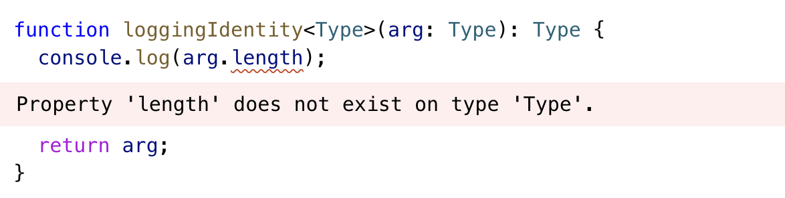
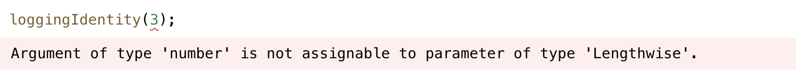

## Generics

**Generic**은 재사용 가능한 타입을 만드는 방법이다. 앞서 정리한 대로 단순히 type을 number나 string으로 정의하게 되면 타입에 맞게 여러개의 반복된 함수나 변수를 만들어야하는 불편함이 발생한다. 이를 해결하기 위해 우리는 Generic을 이용할 수 있다.  

```typescript
// number만 받을 수 있어
function identity(arg: number): number {
  return arg;
}

// number뿐만 아니라 전달한 타입에 따라 다양하게 사용할 수 있어
function identity<Type>(arg: Type): Type {
  return arg;
}

let output = identity("myString"); //output: string
```


### Working with Generic Type Variables


앞서 타입의 유연함과 재사용성을 위해 Generic으로 타입을 지정했다. 하지만 Generic으로 정해줬을 때 전달하는 타입에 따라 공통으로 가지는 속성만 알 수 있기 때문에 발생한 에러인 것을 볼 수 있다. string이라면 가능하겠지만 number라면 불가능하다.

```typescript
function loggingIdentity<Type>(arg: Type[]): Type[] {
  console.log(arg.length);
  return arg;
}
```

이것을 해결하기 위해서는 조금 더 구체적인 타입을 정의함으로써 해결할 수 있다. 전달하는 type이 무조건 length를 공통적으로 가진다는 집합임을 정의해주면 해결할 수 있다. 


 

### Generic Types

 Generic 타입을 함수에 대해 정의할 때 다음과 같은 두가지 특징을 가진다.

- Generic으로 타입으로 정의할 때 다양한 이름으로 Generic으로 정의할 수 있다. 보통 라이브러리들을 살펴보면 `T, P, K`등으로 사용하는 것도 볼 수 있다. 

```typescript
function identity<Type>(arg: Type): Type {
  return arg;
}
 

function identity<Input>(arg: Input): Input {
  return arg;
}
 
```

- Object literal로 함수에 대해 정의할 수 있다. 함수도 또한 object이기 때문이라 생각되었따.

```typescript
interface GenericIdentityFn {
  <Type>(arg: Type): Type;
}
 
function identity<Type>(arg: Type): Type {
  return arg;
}
 
let myIdentity: GenericIdentityFn = identity;
```


### Generic Class

Generic Class는 앞서 알아본 함수들과 유사하게 클래스 내부 멤버의 타입을 정의할 때 이용할 수 있다. 

```typescript
class GenericNumber<NumType> {
  zeroValue: NumType;
  add: (x: NumType, y: NumType) => NumType;
}
 
let myGenericNumber = new GenericNumber<number>();
myGenericNumber.zeroValue = 0;
myGenericNumber.add = function (x, y) {
  return x + y;
};
```


### Generic Constraints

첫번째 예제의 함수에서 length로 접근했을 때 에러가 발생했던 것을 보았다. 해결방법으로 배열로 정의했지만 배열외의 타입에서도 해당 함수가 필요하고 length에 접근가능해야한다는 요구조건을 만족하기 위해서는 어떻게 Generic 타입을 어떻게 좁힐 수 있을까?


간단하게 해당 전달하는 Generic이 무조건 Length를 가지고 있음을 나타내면된다. 그방법은 **extends**로 가능하다.

```typescript
interface Lengthwise {
  length: number;
}
 
function loggingIdentity<Type extends Lengthwise>(arg: Type): Type {
  console.log(arg.length); // Now we know it has a .length property, so no more error
  return arg;
}
```

위 예제로 정의하게 되면 length를 가지지 않는 인자로 함수를 사용하려 했을 때 타입에러를 발생시키고 우리가 원하는 타입을 유연하면서도 좁혀서 사용할 수 있다.



```typescript
loggingIdentity({ length: 10, value: 3 });
```


**extends**를 이용해 타입을 좁혔던 것을 이용해 다음과 같은 예제처럼 전달한 객체의 속성 값만 인자로 받을 수 있게 좁힐 수 있다.

```typescript
function getProperty<Type, Key extends keyof Type>(obj: Type, key: Key) {
  return obj[key];
}
 
let x = { a: 1, b: 2, c: 3, d: 4 };
 
getProperty(x, "a");
```


### Using Class Types in Generics

class의 타입을 Generic을 이용해 정의할 때 class를 통해 만들 인스턴스의 타입도 **new**을 이용해 정의할 수 있어.

```typescript
function create<Type>(c: { new (): Type }): Type {
  return new c();
}

class BeeKeeper {
  hasMask: boolean = true;
}
 
class ZooKeeper {
  nametag: string = "Mikle";
}
 
class Animal {
  numLegs: number = 4;
}
 
class Bee extends Animal {
  numLegs = 6;
  keeper: BeeKeeper = new BeeKeeper();
}
 
class Lion extends Animal {
  keeper: ZooKeeper = new ZooKeeper();
}
 
function createInstance<A extends Animal>(c: new () => A): A {
  return new c();
}
 
createInstance(Lion).keeper.nametag;
createInstance(Bee).keeper.hasMask;
```


### Default Generic Type

Default Parameter처럼 Default Generic Type으로 타입을 전달하지 않았을 때의 타입을 정의해줄 수 있다.

```typescript
declare function create<T extends HTMLElement = HTMLDivElement, U = T[]>(
  element?: T,
  children?: U
): Container<T, U>;

const div = create(); // const div: Container<HTMLDivElement, HTMLDivElement[]>
const p = create(new HTMLParagraphElement()); // const p: Container<HTMLParagraphElement, HTMLParagraphElement[]>
```

