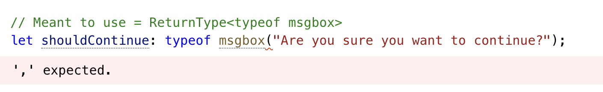

## Keyof

`KeyOf`는 객체 타입의 키값, 속성에 대한 타입으로 string 또는 numeric literal의 union으로 나타내진다.

```typescript
type Point = { x: number; y: number };
type P = keyof Point; // "x"|'y'
```

이때 `string`또는 `number` 인덱스 signature를 가지고 있다면 keyof는 해당 타입을 반환한다.

```typescript
type Arrayish = { [n: number]: unknown };
type A = keyof Arrayish; // number
 
type Mapish = { [k: string]: boolean };
type M = keyof Mapish;// string
```


## TypeOf

`typeof` 연산자는 자바스크립트 자체가 이미 가지고 있다. 표현식에서 사용가능하고 변수의 타입을 추론할 때 쓰일 수 있다.

```typescript
console.log(typeof "Hello world"); // string
let s = "hello";
let n: typeof s; // string
```


typeof는 보다 복잡한 상황에서 자주사용되는데 값으로 사용되는지, 타입으로 사용되는지를 타입스크립트가 이해할 수 있게 전달해줄 때 사용된다.

```typescript
type Predicate = (x: unknown) => boolean;
type K = ReturnType<Predicate>; // boolean

function f() {
  return { x: 10, y: 3 };
}
type P = ReturnType<typeof f>;
```


그렇다고 항상 사용할 수 있는 것은 아니라 값으로 사용되는 변수나 속성에서만 쓰일 수 있어.


## Indexed Access Type

객체의 key값에 접근하듯이 type 또한 key 명을 이용해 타입을 추론할 수 있다.

```typescript
type Person = { age: number; name: string; alive: boolean };
type Age = Person["age"];

type I1 = Person["age" | "name"]; // type I1 = string | number

 
type I2 = Person[keyof Person]; // type I2 = string | number | boolean
 
type AliveOrName = "alive" | "name";
type I3 = Person[AliveOrName]; // type I3 = string | boolean
```


배열은 특별하게 number를 전달하게 되면 아이템이 어떤 타입을 가지는 지 타입을 추론할 수 있다.

```typescript
const MyArray = [
  { name: "Alice", age: 15 },
  { name: "Bob", age: 23 },
  { name: "Eve", age: 38 },
];
 
type Person = typeof MyArray[number];
       
type Person = {
    name: string;
    age: number;
}
type Age = typeof MyArray[number]["age"];
     
// Or
type Age2 = Person["age"];
```

