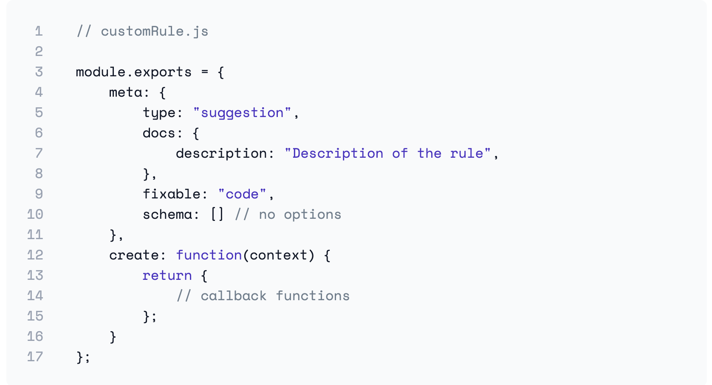
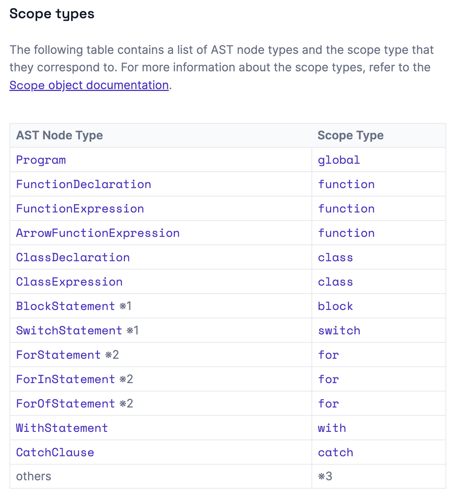
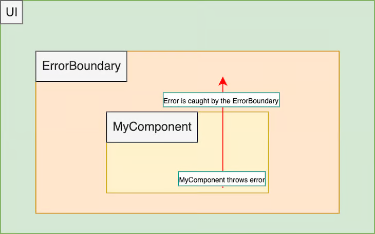
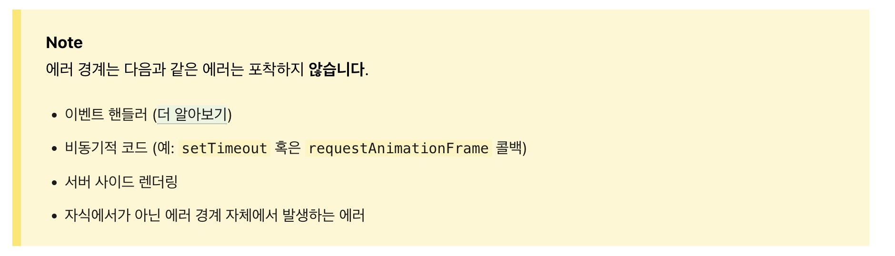

11월은 스쿼드 일감과 함께 챕터업무를 진행한 한달이었다. 에러 예외처리 고도화 일감을 진행하면서 에러바운더리에 대해 공부하고 발표했고, 앞서 10월에 진행하면서 데이터 측정을 위해 구현했던 Firebase Performance util에 대해 소개하며 총 두번의 발표를 했다. 챕터 일감으로 새로운 에러 리포팅 툴인 로그로켓에 대해 검토하고 직접 미팅을 하기도 했다. 다양한 일감을 진행한 11월에 대해 대해 정리해보려한다.


### 비어있는 Catch문 막기 ✋

 여러 도메인들의 코드들의 Catch문에 작성된 에러 핸들링 코드를 보면 다양한 고민의 흔적을 볼 수 있었다. 어떤 분은 TODO를 남겨두셨고, 어떤 분은 로그를 추가해주셨고, 어떤 분은 불필요해보여 따로 처리하시지 않은 부분도 있었다. 개인적으로 try-catch문을 사용하게 되면 에러가 전파되는 것을 막기 때문에, **해당 부분에서 반드시 핸들링 로직을 추가해주어야한다**고 생각한다. 그렇기 때문에 비어있는 catch문이 작성되지 않게 제한할 필요가 있다고 생각이 들었고, 이러한 생각을 챕터에 공유드렸을 때 긍정적으로 받아드려주셔서 커스텀 Lint 룰을 만들어 적용하는 작업을 에러/예외 처리 작업으로 진행하게 되었다.


#### ESLint 이해해보기

 ESLint는 프로젝트의 코드 스타일을 잘 통일해주는 좋은 도구라 생각만 했지, 직접 커스텀 룰을 만들어서 추가하게 될 줄 몰랐다. ESLint에 직접 커스텀 Lint 룰을 추가하기 위해서는 몇가지 개념을 이해할 필요가 있었다.

- meta

  meta는 말그대로 rule에 대한 metadata를 담는 부분이다.

  - type은 `problem, suggestion, layout`으로 구분되어 실제로 문제가 될 수 있는지를 나타낼 수 있다. 
  - docs에는 해당 에러가 발생했을 때 어떻게 안내할 지를 담는 부분으로 추가된 룰에 대한 설명을 담을 수 있다.
  - fixable은 --fix 옵션을 이용해서 고칠 수 있게 할지를 설정할 수 있다,

- create

  create는 실제로 우리가 작성된 코드에서 어떤 것을 report할 지를 정의하는 부분으로 인자로 context를 받을 수 있는데 context는 어떤 상황에 report할지 등을 담은 여러 메소드와 속성이 담긴 객체다.

  

[[ESLint Custom Rule](https://eslint.org/docs/latest/extend/custom-rules) ] 





meta 같은 경우는 아주 간단하게 어떻게 할지를 정의하면 되니까 쉽게 작성이 가능했지만, 내가 원하는 요구사항인 `catch문에 대해 감지해서 비어있을 때 규칙을 어겼다고 보고하기`  위해서는 ESLint가 우리 소스코드를 읽는 방법에 대해 이해가 필요했다.


#### AST (Abstract Syntax Tree)

AST는 ESLint에서 소스코드를 읽은 후 만드는 트리형태의 자료구조를 의미하는데, 자료들을 찾아보면서 토스에서 작성한 [ESLint와 AST로 코드 퀄리티 높이기](https://toss.tech/article/improving-code-quality-via-eslint-and-ast) 글을 통해 도움을 받을 수 있었다.

 console.log()를 https://astexplorer.net/의 acorn 파서를 이용해서 파싱했을 때 얻을 수 있는 AST를 보면 다음과 같다.

[console.log의 AST]

```json
{
  "type": "Program",
  "start": 0,
  "end": 13,
  "body": [
    {
      "type": "ExpressionStatement",
      "start": 0,
      "end": 13,
      "expression": {
        "type": "CallExpression",
        "start": 0,
        "end": 13,
        "callee": {
          "type": "MemberExpression",
          "start": 0,
          "end": 11,
          "object": {
            "type": "Identifier",
            "start": 0,
            "end": 7,
            "name": "console"
          },
          "property": {
            "type": "Identifier",
            "start": 8,
            "end": 11,
            "name": "log"
          },
          "computed": false,
          "optional": false
        },
        "arguments": [],
        "optional": false
      }
    }
  ],
  "sourceType": "module"
}
```

변환된 구조를 보면 어떤 이름의 객체인지, 어떤 속성을 가지고 있는지 등이 트리구조로 변환된 것을 볼 수 있다.

그러면 이번에는 try-catch문을 AST로 변환되었을 때 어떻게 나타나게 되는지 알아보자.


[try-catch문의 AST]

```json
{
  "type": "Program",
  "start": 0,
  "end": 12,
  "body": [
    {
      "type": "TryStatement",
      "start": 0,
      "end": 12,
      "block": {
        "type": "BlockStatement",
        "start": 3,
        "end": 5,
        "body": []
      },
      "handler": {
        "type": "CatchClause",
        "start": 5,
        "end": 12,
        "param": null,
        "body": {
          "type": "BlockStatement",
          "start": 10,
          "end": 12,
          "body": []
        }
      },
      "finalizer": null
    }
  ],
  "sourceType": "module"
}
```

여기서 내가 주요하게 봤던 부분은 `scope 타입이 AST에서 특정되어 구분된다`는 점이었다. 실제로 공식문서를 보았을 때 catch문은 CatchClause로 구분되어 적용할 수 있다.



내가 만들려고 했던 부분중 첫번째 `catch문을 만났을 때`를 다음과 같이 구현이 가능했다.

[Catch문 감지를 위한 eslint rule]

```javascript
    module.exports ={
        meta: {
            /*...*/
        },
        create(context) {
            return {
                CatchClause(node) {
                  // 이제 비어있는 것만 감지하자
                },
            };
        },
    }
```


두번째로 비어있다는 것을 확인할 필요가 있었는데 이것은 catch문의 block 내부를 보면 되는데 앞선 예제에서 CatchClause의 body안의 body 속성 내부가 빈 배열로 작성되어있는 것을 볼 수 있다.


[비어있는 catch문에 대한 AST]

```json
{
  "body": [
    {
      "handler": {
        "type": "CatchClause",
        "body": {
          "type": "BlockStatement",
          "body": []
        }
      }
    }
  ]
}
```

앞서 정리한 두가지 정보를  통해 다음과 같이 rule을 완성할 수 있다.

[완성된 Custom Rule]

```javascript
module.exports = {
    'no-empty-catch-blocks': {
        meta: {
             /*...*/
        },
        create(context) {
            return {
                CatchClause(node) {
                    if (node?.body.body.length === 0) {
                        context.report({
                            node: node.body,
                            message: '비어있는 catch문 대신 에러 로그를 남겨주세요',
                        });
                    }
                },
            };
        },
    },
};
```


마지막으로 만들어진 rule을 .eslintrc.js에서 어떤 심각도로 설정할 지를 정함으로써 우리 프로젝트에 적용할 수 있었다. 간단한 lint 룰을 설정하는 작업이었지만 우리 프로젝트 전반에 추가되는 개발 환경에 새로운 규칙을 추가해 에러 핸들링에 대해 조금 더 관심도를 높이고 신경쓸 수 있게 기여하는 작업이었다.  

  

### 우리 ErrorBoundary 써봐요 😃

에러 핸들링에 대해 관심을 가지고 챕터 업무로 진행하면서 자연스럽게 선언적으로 에러를 핸들링할 수 있는 에러 바운더리를 알 게 되었다. 어떻게 동작하는지 이해하기 위해 많은 발표 자료도 보고 직접 예제들을 만들어 사용하면서 어느정도를 이해를 높일 수 있었고, 우리 프로젝트에 적용하면 좋겠다는 생각이 들었다. 하지만 현재 우리 프로젝트에는 한 곳 정도에서 쓰이고 있었기 때문에 챕터원분들에게 어떤 점이 좋고, 어떻게 적용할 수 있는지, 한계점은 어떤 것인지 알려드리는 게 먼저 필요해 보였다. 기술논의 시간에 내가 직접 겪었던 에러 상황등을 담아 **에러바운더리**에 대해 발표를 진행했다.


#### 에러 바운더리 코드 이해해보기

에러바운더리는 react 16에 도입된 개념으로 UI 렌더링 과정에서 발생한 자식 컴포넌트 트리의 에러를 발생했을 때, 상위로 에러를 던지지지 않고 fallback UI를 보여주는 컴포넌트다. `에러 상태를 담당해주는 Context`로 이해할 수 있다. 


[에러 바운더리를 시각화한 그림 ([참조. Logrocket 에러바운더리 글](https://blog.logrocket.com/react-error-handling-with-react-error-boundary/))]




이제 코드를 보며 알아보자. 에러바운더리는 클래스 컴포넌트로 코드를 통해 4가지 정보를 얻을 수 있다.


[에러 바운더리 컴포넌트]

```jsx
class ErrorBoundary extends React.Component {
  constructor(props) {
    super(props);
    this.state = { hasError: false };
  }

  static getDerivedStateFromError(error) {
    // Update state so the next render will show the fallback UI.
    return { hasError: true };
  }

  componentDidCatch(error, errorInfo) {
    // You can also log the error to an error reporting service
    console.log(error, errorInfo);
  }

  render() {
    if (this.state.hasError) {
      // You can render any custom fallback UI
      return <h1>Something went wrong.</h1>;
    }

    return this.props.children; 
  }
}

// Usage in a component
class App extends React.Component {
  render() {
    return (
      <ErrorBoundary>
        <MyComponent />
      </ErrorBoundary>
    );
  }
}
```

1. `this.state`: 에러상태를 가지는 컴포넌트구나
2. `getDerivedStateFromError`: 렌더링 에러가 발생했을 때, hasError를 fallback UI가 보이도록 업데이트하구나
3. `componentDidCatch`: 에러가 발생했을 때, 버그 리포팅하는 등 수행할 callback을 등록할 수 있구나
4. `render`: 에러발생시 정의한 fallback UI가 노출되구나  

사용할 때는 우리가 원하는 컴포넌트를 감싸서 에러가 발생했을 때 상위 컴포넌트로 전달되는 것을 받아주게 context를 설정해주면 된다.

발표자료를 준비하면서 우리 프로젝트에서도 일부 적용되어 있는 것을 볼 수 있었는데, App.tsx의 최상단에서 에러 발생시 화이트스크린 에러를 로깅을 할 수 있게 `componentDidCatch`가 작성되어 있는 것을 확인할 수 있었다.


#### 에러바운더리의 장점과 한계

그러면 에러바운더리가 가지는 장점은 무엇일까? 내가 정리한 장점은 다음과 같았다.

1. 하나의 컴포넌트 렌더링 에러가 화이트스크린으로 이어지지 않게 막아준다 = 사용자 경험의 향상 (UX👆)
2. 반복적으로 사용되던 에러상태를 위임해 에러를 선언적으로 핸들링 할 수 있다 = 개발자 경험의 향상 (DX👆)


하지만 에러바운더리가 모든 에러를 처리해줄 수는 없는데 리액트 공식문서를 참조하면 다음과 같은 에러들은 감지할 수 없다.

[리액트 공식문서에서 작성된 에러바운더리의 한계점]



그렇기 때문에 렌더링 자체의 문제가 없는 에러들은 에러바운더리로 위임시킬 수 없다. 그러면 에러바운더리가 우리 프로젝트에서 필요한 걸까?


#### 내가 만들었던 에러

 우리가 코드를 작성하면서 `런타임에러나 렌더링 에러가 얼마나 자주 발생하겠어?`라는 생각이 들 수 있지만, 스쿼드에서 일감을 진행하면서 직접 만들었던 예제를 작성해보았다. 

 상황은 총 페이지가 4개였던 스크린을 3개로 줄이는 실험을 진행했다. 이때 기존 스크린에는 AsyncStorage를 통해 작성한 데이터들을 저장하는데 이때 pageIndex에 따라 데이터를 불러온다. 문제가 되는 시나리오는 새롭게 퍼널을 줄인 스크린에서는 이후 페이지의 마지막 페이지를 최대값이라 생각해 최대를 넘으면 에러가 발생하게 코드로 작성해둔 상태였다.  

```tsx

const 실험전_마지막페이지 = 4;
const 실험후_마지막페이지 = 3;

let AsyncStorage의_마지막페이지 = 실험전_마지막페이지;// 예시로 AsyncStorage를 let으로 작성했다.

const getDataFrom = (index: number) => {
    switch (index) {
        case 1:
            return { title: '페이지1', content: '페이지1의 내용' };
        case 2:
            return { title: '페이지2', content: '페이지2의 내용' };
        case 3:
            return { title: '페이지3', content: '페이지3의 내용' };
        default:
            throw new Error('없는 페이지입니다.'); // 실험 후 마지막 페이지는 3이니까 3보다 큰값은 안 들어올거야
    }
};

function ScreenThrowingError() {
    const [index, setIndex] = React.useState(1);
    const pageData = getDataFrom(index);

    const handlePress = () => {
        if (실험후_마지막페이지 === index) {
            return;
        }
        setIndex(index + 1);
    };

    useEffect(() => {
        const AsyncStorage의_데이터불러오기 = true;
        if (AsyncStorage의_데이터불러오기) {
            setIndex(AsyncStorage의_마지막페이지);
        }
    }, []);

    return (
        <View style={{ flex: 1, justifyContent: 'center', alignItems: 'center' }}>
            <View>
                <PagerView data={pageData} />
            </View>
            <TouchableOpacity style={{ position: 'absolute', bottom: 12 }} onPress={handlePress}>
                <Text style={{ fontSize: 32, color: 'teal' }}>{`다음페이지`}</Text>
            </TouchableOpacity>
        </View>
    );
}
```


위와 같은 상황의 코드를 시뮬레이터에서 동작시켜보면 다음과 같이 화이트 스크린이 발생하게 된다.


<br/>

기존 화이트 스크린이 발생하는 상황에서 앞서 작성한 에러바운더리를 적용해 다음과 같이 코드를 작성했다.

```tsx
export class ErrorBoundary extends React.Component<{ hasError: boolean }> {
    constructor(props: { children: ReactNode }) {
        super(props);
        this.state = { hasError: false };
    }

    static getDerivedStateFromError() {
        return { hasError: true };
    }

    componentDidCatch(error: Error) {
        // bugsnag.notify(error);
        console.log(error);
    }

    render() {
        if (this.state.hasError) {
            return (
                <View style={{ justifyContent: 'center', alignItems: 'center', rowGap: 12 }}>
                    <Text style={{ fontSize: 32 }}>에러 발생 ☠️</Text>
                    <TouchableOpacity
                        style={{ borderColor: 'red', borderWidth: 1, padding: 10, borderRadius: 10 }}
                        onPress={() => {
                            AsyncStorage의_마지막페이지 = 실험후_마지막페이지;
                            this.setState({ hasError: false });
                        }}>
                        <Text style={{ fontSize: 30, color: 'red' }}>재시도 하기</Text>
                    </TouchableOpacity>
                </View>
            );
        }

        return this.props.children;
    }
}

function App() {
    return (
        <SafeAreaView style={{ justifyContent: 'center', alignItems: 'center', flex: 1, rowGap: 12 }}>
            <ErrorBoundary>
                <ScreenThrowingError />
            </ErrorBoundary>
        </SafeAreaView>
    );
}
```

<br/>

결과는 다음과 같이 동일하게 런타임 에러가 발생하지만 화이트 스크린은 발생하지 않고, 이전 페이지로 돌아가는 것을 볼 수 있다.


위 예제는 에러 상황 자체를 해결해 줄 수는 없지만, 앱을 종료하고 다시 진입해야하는 유저의 불편함을 크게 해줄 수 있는 에러바운더리의 장점을 잘 보여준다.


#### 그러면 우리가 **자주** **사용하는** **이벤트와** **비동기에서** **사용할** **수** 없을까 🤔

에러바운더리의 장점을 알고 적용하려고 보니 렌더링 에러만 감지할 수 있는 한계점이 있었다. 우리가 자주 사용하는 비동기와 이벤트 핸들러에서 발생한 에러에서도 적용하는 방법은 없을까라는 생각이 든다.[React-Error-Boundary](https://github.com/bvaughn/react-error-boundary)는 이러한 한계를 극복하기 위한 라이브러리로 다음과 같은 사용방법이 있다.


**Fallback**

 에러바운더리로 에러가 전달되었을 때 어떤 컴포넌트를 보여줄지 직접 전달하는 방식이다.

```tsx
function App() {
    return (
        <ErrorBoundary fallback={<Text style={{ fontSize: 32 }}>에러 발생 ☠️</Text>}>
            <MyComponentThatMayError />
        </ErrorBoundary>
    );
}

```


**fallbackRender**

 fallback과 달리 컴포넌트 함수를 전달하는데, 이때 prop으로 **error**와 **resetErrorboundary**를 전달받아 어떤 에러인지에 대한 정보와 에러바운더리를 벗어날 수 있게 연결할 수 있다.

```tsx
function FallBackComponent({ resetErrorBoundary }: Props) {
    return (
        <View style={{ rowGap: 12 }}>
            <Text style={{ fontSize: 32 }}>에러 발생 ☠️</Text>
            <TouchableOpacity
                style={{ borderColor: 'red', borderWidth: 1, padding: 10, borderRadius: 10 }}
                onPress={() => resetErrorBoundary()}>
                <Text style={{ fontSize: 32, color: 'red', textAlign: 'center' }}>재시도</Text>
            </TouchableOpacity>
        </View>
    );
}

function App() {
    return (
        <ErrorBoundary fallbackRender={FallBackComponent}>
            <MyComponentThatMayError />
        </ErrorBoundary>
    );
}

```


**onReset, onError, resetKeys**

onReset은 에러가 reset됐을 때 수행할 callback을, onError는 에러가 발생했을 때 수행할 callback을, resetKeys는 전달된 dependency가 달라졌을 때 fallback UI가 제거되게 할 수 있는 props이다.

```tsx
        <ErrorBoundary
            fallbackRender={FallbackComponent}
            onError={(error) => {
                // 에러 리포트
                console.log(error);
            }}
            onReset={() => {
                // state 초기화
            }}
            resetKeys={['API로 받아올 상태']}>
            <MyComponentThatMayError />
        </ErrorBoundary>
```


**useErrorBoundary**

 useErrorBoundary는 비동기, 이벤트 핸들러 함수에서 에러 발생했을 때 에러바운더리를 보여줄지, 또는 에러바운더리를 벗어나게할지를 조절할 수 있게 하는 훅으로, 앞선 errorboundary가 가지는 한계점을 해결할 수 있게 도와주는 함수다.

```tsx
function MyComponentThatMayError() {
    const { resetBoundary, showBoundary } = useErrorBoundary();

    return (
        <View style={{ rowGap: 12, flex: 1, alignItems: 'center' }}>
            <TouchableOpacity
                style={{ borderColor: 'teal', borderWidth: 1, padding: 10, borderRadius: 10 }}
                onPress={resetBoundary}>
                <Text style={{ fontSize: 30, color: 'teal' }}>리스트 불러오기</Text>
            </TouchableOpacity>
            <TouchableOpacity
                style={{ borderColor: 'red', borderWidth: 1, padding: 10, borderRadius: 10 }}
                onPress={() => {
                    showBoundary(true);
                }}>
                <Text style={{ fontSize: 30, color: 'red' }}>에러발생버튼</Text>
            </TouchableOpacity>
        </View>
    );
}
```


#### 비동기핸들링 예제 리팩토링해보기

소개한 여러가지 사용법을 이용해 간단한 비동기 코드를 리팩토링해보자. 우리 프로젝트의 많은 스크린에서 사용하고 있는 형식으로 에러 상태를 다루고, 에러 상태에 따라 보여줄 화면을 직접 정의해서 보여주고 있다. 로딩 상황, 에러상황에 따라 보여줄 화면에 대한 정의 함께 섞여있어 스크린 코드가 길게 작성되어 있다.


[에러 바운더리 적용 전 예제 코드]

```tsx
function MyComponentThatMayError() {
    const [isLoading, setIsLoading] = React.useState(false);
    const [data, setData] = React.useState({ title: '', content: '' });
    const [error, setError] = React.useState(false);

    const fetchTask = useCallback(async () => {
        try {
            setIsLoading(true);
            const result = await new Promise<{ title: string; content: string }>((resolve, reject) => {
                if (canGetResponse) {
                    resolve({ title: '페이지1', content: '페이지1의 내용' });
                } else {
                    reject(new Error('에러 발생'));
                }
            });
            setData(result);
        } catch (e) {
            canGetResponse = true;
            setError(true);
        } finally {
            setIsLoading(false);
        }
    }, []);

    useEffect(() => {
        fetchTask();
    }, [fetchTask]);

    if (isLoading) {
        return <ActivityIndicator size={'large'} />;
    }

    if (error) { // 에러상황 때 보여줄 화면을 분기문으로 정의
        return (
            <View style={{ rowGap: 12 }}>
                <Text style={{ fontSize: 32 }}>에러 발생 ☠️</Text>
                <TouchableOpacity
                    style={{ borderColor: 'red', borderWidth: 1, padding: 10, borderRadius: 10 }}
                    onPress={() => fetchTask()}>
                    <Text style={{ fontSize: 32, color: 'red', textAlign: 'center' }}>재시도</Text>
                </TouchableOpacity>
            </View>
        );
    }

    return (
        <SafeAreaView style={{ justifyContent: 'center', alignItems: 'center', flex: 1, rowGap: 12 }}>
            <Text style={{ fontSize: 32 }}>{data.title}</Text>
            <Text style={{ fontSize: 32 }}>{data.content}</Text>
        </SafeAreaView>
    );
}
```

<br/>

위 코드를 이제 React-Error-Boundary를 이용해서 에러상태와 fallback UI를 에러바운더리에 위임해보자 😆

[에러 바운더리 적용 후 예제 코드]

```tsx
type Props = {
    error: Error;
    resetErrorBoundary: () => void;
};

let canGetResponse = false;

function MyComponentThatMayError() {
    const [isLoading, setIsLoading] = React.useState(false);
    const [data, setData] = React.useState({ title: '', content: '' });
    const { showBoundary } = useErrorBoundary();

    const fetchTask = useCallback(async () => {
        try {
            setIsLoading(true);
            const result = await new Promise<{ title: string; content: string }>((resolve, reject) => {
                if (canGetResponse) {
                    resolve({ title: '페이지1', content: '페이지1의 내용' });
                } else {
                    reject(new Error('에러 발생'));
                }
            });
            setData(result);
        } catch (e) {
            canGetResponse = true;
            showBoundary(e);
        } finally {
            setIsLoading(false);
        }
    }, [showBoundary]);

    useEffect(() => {
        fetchTask();
    }, [fetchTask]);

    if (isLoading) {
        return <ActivityIndicator size={'large'} />;
    }

    return (
        <SafeAreaView style={{ justifyContent: 'center', alignItems: 'center', flex: 1, rowGap: 12 }}>
            <Text style={{ fontSize: 32 }}>{data.title}</Text>
            <Text style={{ fontSize: 32 }}>{data.content}</Text>
        </SafeAreaView>
    );
}

function FallBackComponent({ resetErrorBoundary }: Props) {
    return (
        <View style={{ rowGap: 12 }}>
            <Text style={{ fontSize: 32 }}>에러 발생 ☠️</Text>
            <TouchableOpacity
                style={{ borderColor: 'red', borderWidth: 1, padding: 10, borderRadius: 10 }}
                onPress={() => resetErrorBoundary()}>
                <Text style={{ fontSize: 32, color: 'red', textAlign: 'center' }}>재시도</Text>
            </TouchableOpacity>
        </View>
    );
}

function App() {
    return (
        <ErrorBoundary fallbackRender={FallBackComponent}>
            <MyComponentThatMayError />
        </ErrorBoundary>
    );
}
```


 개선전 코드에 비해 에러바운더리로 에러상태와 fallback UI를 위임하고 나서, 컴포넌트 내부에 불필요한 분기문이 줄어들었고 성공과 로딩중일때만 작성되어 있어 보다 한번에 읽기 쉬워진 것을 볼 수 있다.  


#### 발표를 마치고

 발표를 준비하면서 우리 앱의 수많은 스크린에 적용할 만하다, 비용(시간) 대비 큰 효과를 얻을 수 있는 작업인지에 대해서 긍정적으로 생각해주실까 고민이 들었다. 그래도 한달정도 관련 여러 자료들을 보고 내 나름 정리하고 발표하는 것만 해도 나에게는 큰 수확이다라고 생각했는데, 다행히 챕터원 분들이 모두 긍정적으로 생각해주셔서 라이브러리를 이용해 조금씩 도입하는 작업을 진행해보기로 정해졌다😊


### 그외의 작업들 

기술적으로 정리할만큼의 큰 작업은 아니지만 11월달에 했던 그외 작업들도 정리해보았다. 

**버그스낵 custom Grouping 도입** 

 기존 사용하고 있던 버그스낵을 좀더 잘 사용하기 위해서, 같은 에러지만 발생한 stackTrace에 따라 나뉘어서 찍히고 있던 문제를 해결하기 위해 Custom Grouping을 Group Hash를 도입해 해결했다. 


**로그로켓 도입 검토**

 기존 사용하던 버그스낵은 에러 발생상황을 알기 위해서는 하나하나 흐름을 직접 따라가고 확인해봐야, 디버깅 할 수 있기 때문에, 에러 발생 전후의 영상이 있으면 좋을 것 같다는 아쉬움이 있었다. 이러한 영상을 제공하는 툴로써 로그로켓을 검토하게 되었다. [로그로켓 공식문서](https://docs.logrocket.com/docs)를 봐도 잘 이해가 안되는 부분들 (소스맵, conditional recording)과 같은 부분들을 해결하기 위해서 직접 로그로켓측과 미팅을 가지고 물어보기도 했다. 결과적으로는 비용문제와 우리 챕터에서 세웠던 조건들을 만족하지 못해 도입은 보류되었다.

 직접 영어로 미팅을 하다보니 내가 조금 더 다양하게 물어보지 못했고, 좀 더 잘 알아보지 못해서 우리팀의 좋은 툴을 놓치는 것은 아닌가 하는 생각이 들어 맘 한편이 아쉽기도 했다.


**Firebase Performance에 대한 발표**

 이전 10월에 작업하면서 유틸을 추가했지만 어떻게 사용하면 좋을지 공유를 하지는 않았었다. 이후 챕터내의 성능 개선 작업을 위한 데이터를 쌓을 수 있게 유틸의 개발 과정과 코드들을    공유면서 코드별로 어떤 문제를 해결하기 위해서 작성되었는지 이후에 또 어떻게 개선하면 좋을지 등을 담아 발표를 진행했다.


**12월 테크팀 세미나 발표 참여**

 12월에 테크팀 자체적인 세미나를 진행하게 되면서, 2023년 동안 어떤 일들을 진행했는지 정리하는 발표를 하면 좋겠다는 생각해 자원하여 참여하게 되었다. 챕터내 발표가 아닌 많은 분들 앞에서 처음으로 발표하는 자리라 잘 준비해서 12월에 잘 발표하고 후기도 남기려 한다.

 

 11월을 돌아보니 생각보다 많은 일들을 동시에 진행했던 것 같다. 시간을 더 효율적으로 사용하는 법, 여러가지 일을 동시에 진행할 때 얼마나 시간을 각각 쓸지 고민하고 관리하면서, 일을 잘하는 방법에 대해서도 관심이 생겼다. 자연스럽게 애자일에 대한 관심도 조금씩 생겨 나중에 정리해보려한다. 더 다양한 관심사와 일감들과 함께 즐겁게 일하는 12월이 되기를 바라며 마쳐본다.
