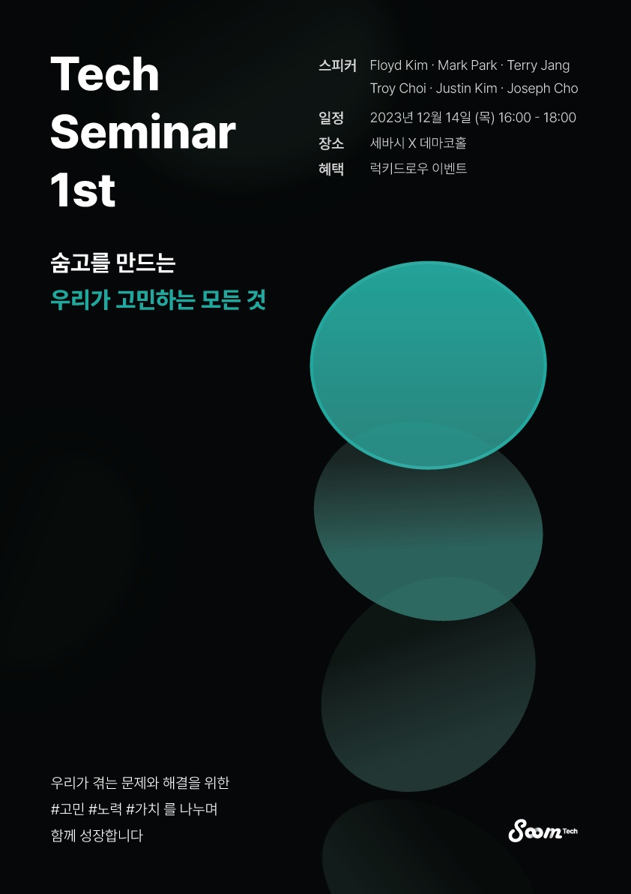
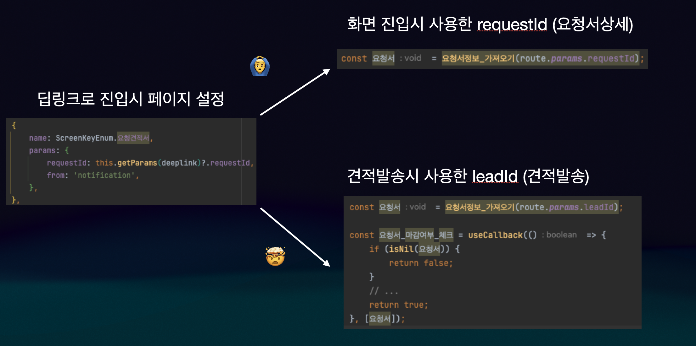
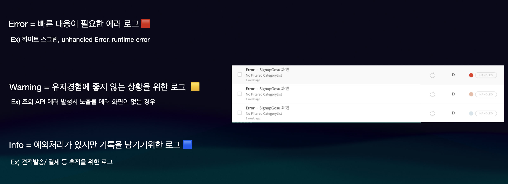
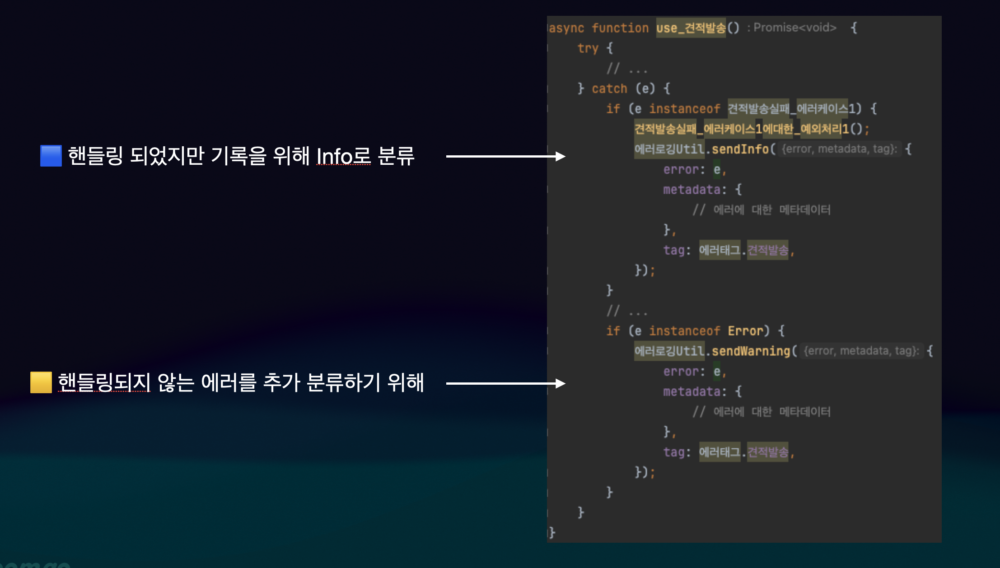
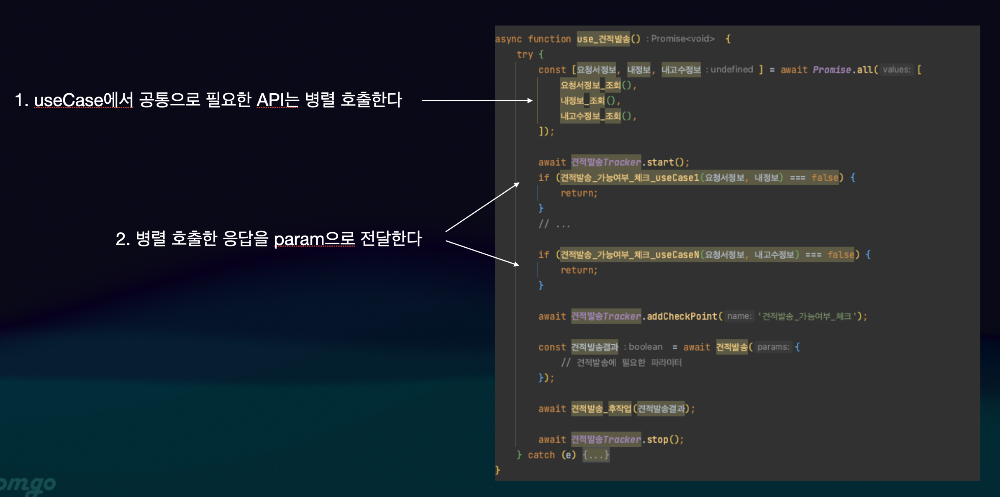
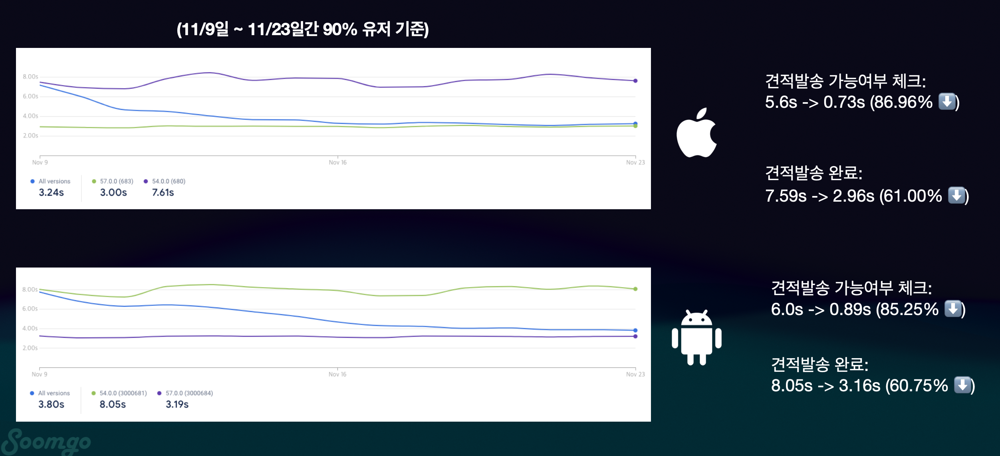
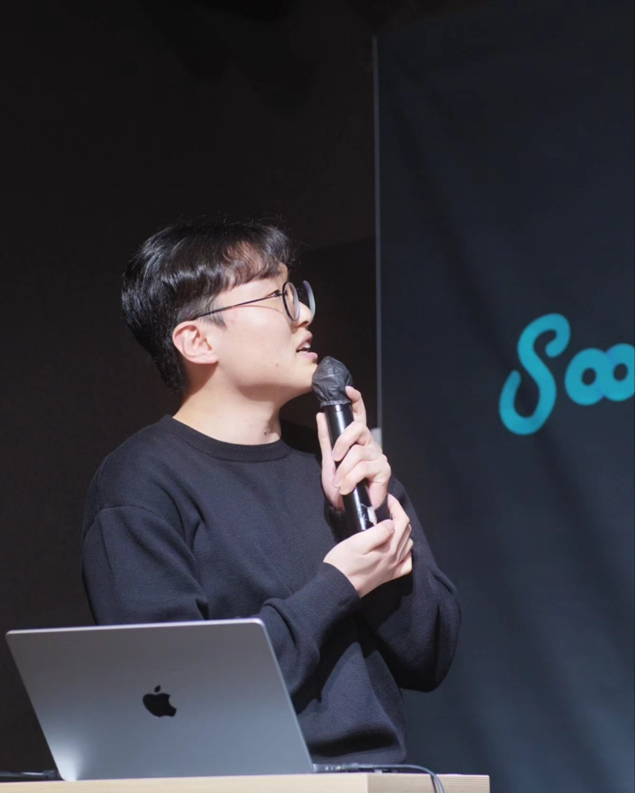
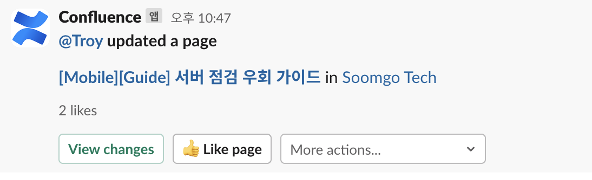

 
12월에는 제 1회 **숨테크** 사내 세미나에서 발표 연사로 참여했고, 내가 속해있던 스쿼드의 마지막 작업으로 바로견적 상세화면을 개선하는 작업을 진행했다. 그리고 마지막으로 새벽점검에 참여해 챕터원 중 가장 많은 새벽점검을 한 챕터원이 되었다.
연말이지만 나름 다사다난했던 12월을 회고해보려한다.


### 🙋‍♂️ 사내 세미나 발표하기
 11월에 참여하겠다고 자신있게 자원했지만... 먼저 주제를 먼저 정하고 발표해보고 싶다고 자원한 게 아니었기 때문에, 내가 너무 성급하게 결정한 게 아닌가 생각이 들었다. 하지만 나는 신입이니까 뭘하든, 앞에서 실수를 많이 하더라도 나에게 도움이 되는 경험이 될 것이란 생각으로 준비해봤다. 
 
 주제에 대해 고민하면서 기술 세미나이기 때문에 기술적으로 깊이가 있는 주제를 정하면 좋겠다고 생각했지만, 숨고에 들어와 주요 도메인중 하나인 견적도메인에 대한 일감들을 진행해온 과정을 대해 정리해 모바일 엔지니어로서의 성장기를 주제로 발표해보고 싶었다. 

 그렇게 정한 주제는 `숨고와 함께 모바일 엔지니어로 자라기`로 1년간 시간 순으로 2Q의 스쿼드, 3Q의 챕터, 4Q의 테크 OKR 작업에 참여하면서 경험과 레슨런들을 정리해 발표했다.

[숨테크 포스터]



#### 2Q. 스쿼드에서 처음 만나게된 견적 도메인
 2Q에는 스쿼드에서 요청견적서 실험을 진행하게 되었다. [5월 회고](https://choi2021.github.io/review/2023/06/05/5%EC%9B%94-%ED%9A%8C%EA%B3%A0/)에서 작성했던 내용처럼 두가지 스크린을 통해 진행되는 견적작성 flow를 하나의 요청견적서 화면으로 합쳐, 요청서 내용을 보면서 견적서를 작성할 수 있게 사용성을 향상시키려한 일감으로, 5월 회고에 작성했던 실험과정에서 생긴 배포 이후 `딥링크로 접근시 견적을 작성할 수 없었던 장애와 디버깅 과정`을 담았다.

 
 당시 처음 견적도메인에 대한 실험을 진행하다 보니 도메인에 대한 이해도가 낮아 leadId와 requestId로 요청서 Id를 다르게 호출하고 있던 이유를 몰랐고, 웹개발 경험만 있다보니 모바일 개발에서 중요한 딥링크에 대한 고려가 부족해 발생했던 장애였다.
 
[디버깅 결과를 정리한 코드]



 이과정을 통해서 내가 얻었던 레슨런은 `모바일 개발의 중요한 포인트인 딥링크에 대한 고려`와 `도메인에 대한 정확한 이해`었다. 이어진 고민으로는 "이러한 장애를 만들지 않기 위해서 노력해도 사람이다 보니 실수를 할 수 있는데 실수가 발생해도 **시스템적으로 빠르게 대응**하기 위해서는 어떻게 할 수 있을까?", "어떻게 하면 **시스템적으로 장애를 빠르게 감지**할 수 있을까"로 이어지게 되었다.

#### 3Q. 에러/예외처리 고도화
 3Q에는 스쿼드 작업과 함께 챕터에서 에러/예외처리 고도화 작업을 시작했다. 블로그 회고로는 [7월 회고](https://choi2021.github.io/review/7%EC%9B%94-%ED%9A%8C%EA%B3%A0/#-%EB%82%B4%EA%B0%80-%EC%A7%84%ED%96%89%ED%95%98%EA%B2%8C-%EB%90%9C-%EC%97%90%EB%9F%AC%EC%98%88%EC%99%B8-%EC%B2%98%EB%A6%AC-%EA%B3%A0%EB%8F%84%ED%99%94-%EC%9D%BC%EA%B0%90)부터 등장한 작업으로 발표에는 시간관계상 에러 분류기준을 새롭게 정하고 견적도메인에 적용한 과정을 담았다. 

 모바일 프로젝트는 에러 로깅 툴로 버그스낵을 사용하고 있는데, 당시 슬랙과 연동되어있는 로깅 알림 채널에 버그스낵으로 로깅되는 모든 에러가 채널에 제보되고 있었다. 에러가 발생했으니 제보받는 것은 맞지만, 에러 핸들링이된 로그들도 모두 찍히다 보니 중요한 에러가 발생해도 한번에 확인이 어려웠다.
 
 이러한 문제점을 해결하기 위해서 분류 기준을 세분화하는 작업을 진행했고, 아래 사진과 같이 기준을 세워 기존 분류를 수정하는 작업과, 새롭게 필요한 부분에 대한 로그를 추가하는 작업을 진행했다.

[에러 분류 기준]


 기준을 세우고 먼저 적용한 도메인은 이전에 장애가 발생했던 견적도메인이었고 아래와 같이 분류를 세분화해 로깅하는 작업을 진행했다.

[에러 분류 기준을 적용한 견적도메인]

 
이러한 분류작업을 하면서 자연스럽게 견적발송 과정에서 사용되는 API들에 대해 조사하게 되었고, 이과정에서 견적발송 가능여부를 체크하는 과정에서 같은 API를 여러번 호출하는 상황을 발견하게 되었다.


#### 4Q. 테크 OKR 견적발송 퍼널 개선
 4Q에는 Tech OKR 작업으로 견적발송 퍼널 개선작업에 참여하게 되었다. [10월 회고](https://choi2021.github.io/review/2023%EB%85%84-10%EC%9B%94%ED%9A%8C%EA%B3%A0/#-firebase-peformance%EB%A5%BC-%EC%9D%B4%EC%9A%A9%ED%95%B4-%EA%B2%AC%EC%A0%81%EB%B0%9C%EC%86%A1%EC%9D%84-%EA%B0%9C%EC%84%A0%ED%95%B4%EB%B3%B4%EC%9E%90)에 작성한 내용으로 기존 앞서 에러/예외처리 고도화작업을 진행하면서 발견한 `중복 API를 줄이면 견적 발송시간을 크게 줄일 수 있지 않을까`라는 가설을 가지고 작업을 진행했다.

 내가 세운 가설을 검증하기 위해서는 기존 실제 우리 유저가 겪고 있는 견적발송 시간에 대한 데이터가 필요했고, 이를 위해 `Firebase Performance`를 적용해 견적발송 시간을 측정하는 작업을 먼저 진행했다. 측정 결과는 11월 9일부터 11월 23일간 90% 유저 기준으로 IOS는 견적발송 가능 여부를 체크하는데 5.6초, 견적발송 완료에는 총 7.59초, Android는 견적 발송 가능여부 체크에 6초 견적발송 완료에는 8.05초가 걸리고 있었다.

 위 데이터를 두가지로 정리해 볼 수 있었는데 먼저, 중복 API가 발생하고 있는 견적발송 가능여부 체크에서 `전체 시간의 70%이상`이 걸리고 있고, 90% 유저 기준이지만 `견적발송이 오래 걸리고 있다`는 점이었다. 데이터를 통해서 중복 API를 줄임으로써 견적발송 시간을 줄일 수 있을 것이라는 가설에 대한 좀 더 높은 확신을 가지고 작업을 진행할 수 있었다.

 개선작업은 두가지 step으로 진행되었는데, 기존 각각 useCase 함수 내부에서 가능여부를 체크하기 위해 별도로 호출하던 API들을 `견적발송 전체 flow를 담당하는 상위함수에서 병렬 호출`하게 했다. 다음은 응답 결과를 각각 useCase에 param으로 전달해주었다.

[개선 작업]

 개선 작업 후 결과를 개선전과 같은 기간 비교해보았을 때 IOS에서 5.6초에서 0.73초로 87%정도 감소했고, 견적발송완료에는 7.59초에서 2.96초로 61프로가 감소했다. Android에서는 견적발송 가능여부 체크에 6초에서 0.89초로 85%정도 감소했고, 견적발송완료에는 8.05초에서 3.06초로 61%정도가 감소했다. 


[견적발송 시간 개선 전/후 비교]


 이러한 결과를 비즈니스적으로 조금 더 풀어보고자 50%, 75%, 85%, 90%, 95% 유저에 대한 두 OS의 데이터를 보았을 때 50%가 넘는 개선이 있었고 한마디로 `유저가 견적을 한번 보낼 시간에 두번 보낼 수 있게 되었다`고 정리해보았다.

작업을 하면서 얻었던 레슨런은 클라이언트에서 API를 어떻게 사용하는지가 유저경험에 어떤 영향을 줄 수 있는지에 느낄 수 있었다. 이어진 고민으로는 어떻게 우리 프로젝트 내부의 불필요한 API 호출을 감지할 수 있을지, 그리고 어떻게 하면 불필요한 API 호출을 줄일 수 있을지에 대해 고민하게 되었다.


#### 발표하고 느낀점
위 내용들과 함께 간단하게 내년에 숨고에서 하고 싶은 일들에 대해서도 공유해보며 발표를 마쳤다. 발표 당일 3시부터 세미나가 시작되었는데 떨려서 그전까지 일이 잘 잡히지 않았다. 발표를 마치고 나서야 간식도 먹고 웃을 수 있었다 🤣 발표를 위해서 꽤 많이 연습했는데, 내 기준에서는 다행히 준비한 내용을 무사히 다 말할 수 있었고 (청중분들은 다르게 느끼셨을 수도...) 누군가 앞에 서서 말한다는 게 얼마나 힘든일인지, 또 얼마나 큰 경험인지도 같이 느낄 수 있었다.
내년에는 조금 더 기술적으로 성장해서 깊이 있는 주제로도 발표해보고 싶다는 마음과 함께 `누군가에게 내 이야기를 전할 수 있는 개발자,  공유할 수 있는 게 많은 개발자`가 되고 싶다는 목표가 생긴 정말 좋은 경험이었다.

[발표하는 모습]



### ‍🥲️ 스쿼드 마지막 작업, 바로견적 상세화면 개선 실험과 서버 점검

 12월을 마지막으로 다음 달부터는 챕터으로 소속을 잠시 옮기게 되었다. 그전에 마지막으로 진행하게된 바로견적 상세화면과 새벽점검에 대해서 간단하게 정리해보려 한다.
#### 바로견적 상세화면 개선 실험
 바로견적은 고수분이 설정한 조건에 맞는 요청서가 작성되었을 때 미리 작성된 내용을 이용해 자동으로 견적서를 매칭시켜주는 기능이다. 고수분들의 일과 중에 늘 앱에 접속해 있으실 수 없기 때문에 자동으로 매칭시킴으로써 편의성을 개선할 수 있는 도메인이다. 이전 지역 개선 작업 이후에 두번째 개선 작업으로 바로견적 상세화면을 개선하게 되었다.

 바로견적은 자동으로 견적을 매칭시키다 보니, 도중에 다양한 실패사유에 의해 멈추게 될 수 있었다. 기존에는 진행/정지/캐시부족 세가지 상태만 보여줬다면 **정확히 어떤 사유로 멈추게 되었는지** 좀 더 명확하게 보일 수 있게 했고, 로띠와 햅틱을 추가해 UX를 개선했다.
 
##### 📳 햅틱이 뭐야?
  
 로띠는 이전에도 사용해본 적이 있었지만 개선작업을 통해 `햅틱`에 대해 새롭게 알게되었다. 햅틱은 유저에게 진동 또는 모션을 적용해 터치하는 느낌을 줄 수 있는 기술로, 예시로 이번에 적용하려는 부분은 정지된 바로견적 캠페인을 다시 재개하게 되었을 때 유저가 `진동을 느끼면서 바로견적이 다시 시작되었다는 것을 알 수 있게 하는 것`이었다.

 이를 구현하기 위해서 [react-native-haptic-feedback](https://github.com/mkuczera/react-native-haptic-feedback) 라이브러리를 사용했고, 사용법은 아래와 같다.
 
```javascript
import HapticFeedback from 'react-native-haptic-feedback';

const options = {
  enableVibrateFallback: true, // 햅틱을 적용할 수 없는 ios 10 이하에서 heavy로 진동하는 설정
  ignoreAndroidSystemSettings: false,
};

HapticFeedback.trigger('impactLight', options);
```
 시각적인 요소(애니메이션) 뿐 아니라 진동을 통한 유저 인터랙션에 대해 새롭게 알고 경험할 수 있는 좋은 기회가 되었다.

#### 🌘 새벽 서버 점검
 세번째로 참여하게 된 새벽 서버 점검 작업으로 챕터원 중 가장 많이 새벽점검에 참여한 사람이 되었다 🤣

 서버 점검이 자주 있는 작업이 아니다 보니, 서버점검에 참여했던 분이 안 계시면 물어볼 분이 없기 떄문에 기존 문서와 달랐진 점들과 내가 직접 겪었던 경험을 바탕으로 가이드라인을 **꼭 문서화해야겠다** 생각했다. 하지만 기존 문제점을 해결하기 위한 뚜렷한 아이디어가 떠오르지 않아 어떻게 하면 좋을지 고민하다가, 가이드라인을 작성하지 못했다.

 서버점검을 위해서 내가 해야한 일은 한마디로 **서버 점검을 우회하고 테스트 할 수 있는 빌드**를 만들어서 전달드리는 것이다. 하지만 test 빌드인지 Prod 빌드인지에 따라 우회 키값이 달라지게 설정되어 있어 test 빌드에서는 Prod 서버를 우회하지 못하고, Prod 빌드는 점검 모달 확인 버튼 클릭시 앱을 종료를 시키기 때문에 test 빌드에 Prod 키값을 하드코딩된 별도의 버전을 전달드려야 하는 상황이었다.
 
 별도의 빌드를 전달드리는 것은 큰일은 아니지만, 서버점검이 배포일자와 항상 유사하게 진행되다보니 QA엔지니어께서 기존 테스트를 하시고 계시던 작업들이 반영되어있는 버전에서 서버점검을 하시고 싶어하셨다.
 
 모바일 엔지니어는 별도의 앱을 빌드하지 않아도 되고, QA엔지니어는 테스트중이던 앱 버전에서 확인할 수 있으니 모두의 효율을 높일 수 있을 것 같아 고민중에, 기존 우회 플래그를 켰을 때 설정도는 키값이 앱빌드가 test인지 Prod인지에 따라 달라지게 되어 있던 부분을, 타겟 서버에 따라 달라지게 하면 test 앱 빌드에서도 Prod 서버를 우회할 수 있을 것 같아 작업을 진행했다.
 
 다행히 해당 작업을 통해 기존 QA 엔지니어께서 테스트 하시던 버전 그대로 테스트 점검과 본 점검 모두 성공적으로 우회할 수 있었고, 해당 작업을 통해 좀 더 간단해진 새벽점검 가이드라인도 작성할 수 있었다.

[컨플에 작성한 가이드 라인]


### 😆 모바일 엔지니어로 2023년을 보내며

 12월의 마지막 날, 2023년을 돌아보니 2월에 입사해 많은 걸 배우려고, 어쩌면 내가 부족한 걸 드러내지 않으려고 애썼던 것 같다. "왜 나는 이걸 모르지"와 "이거 안해봤는데 어떡하지"의 연속이었던 날을 지나, 여전히 잘 모르는 게 많지만 이제는 **질문**을 어떻게 하면 좋을지, 어떻게 **소통**하면 좋을지를 알아가고 있는 것 같다. 
 
 내가 어떤 질문을 하더라도 "왜 저사람은 저런 질문을 하지"보다는 어떤 게 문제인지부터 같이 찾아주려하는 동료들이 있어서, **심리적 안정감**을 갖고 모르니까 더 잘아시는 분께 도움을 요청하면서 배워가고 있다. 

 배울 게 많은 동료들과 일하면서, 왜 내가 "프로그래머, 열정을 말하다" 책에서 "가장 못하는 사람이 되라" (진짜 못하라는 게 아니라 나보다 뛰어난 사람들이 모인 집단에 가라는 뜻)라는 챕터가 가장 좋았는지 이해가 되었다.

 아마 내년에도 모르는 게 많을 거고, 매일 새로운 문제를 풀어가겠지만 그럴수록 더 많은 것을 배우고 성장하는 과정이 될 거라 기대도 된다. 더 많이 채워서 나도 더 나눌 수 있는 한해가 되기를 바라면서 마쳐본다.
