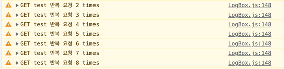

1월에는 스쿼드에서 챕터로 소속이 바뀌면서 업무가 기능개발에서, 성능을 최적화하고 안정성을 높이기 위한 업무들이 주를 이루게 되었다.
크게 집중해서 진행했던 업무는 `App Start`시간을 최적화와 `에러바운더리 적용`이었다. 두 가지 챕터 업무와 함께 **불필요한 API 호출을 감지하는 방법**에 대해 고민하고 해결방법을 찾아 적용해보았다.

1월 업무를 새롭게 배우게 된 점과 느꼈던 점들을 간단히 정리해보려 한다.

### ⚠️ 불필요한 API 호출을 감지해보자
불필요한 API를 줄이는 것은 서비스를 이용하는 고객의 사용성을 높이고, 서버의 부하를 줄일 수 있는 두 가지 장점이 있다.
그 중요성을 저번 견적 발송 시간을 줄이면서 느끼고 개발단계에서 아는 방법이 없을지 고민했고, 이것을 해결하는 방법으로 **axios interceptor**를 이용해보기로 했다.
#### axios interceptor
axios interceptor는 axios의 요청과 응답을 가로채는 기능이다. 이를 이용해 요청과 응답에 대한 로직을 추가할 수 있어 공통적인 요청과 응답에 대해 처리를 할 수 있다.


[axios interceptor 공식문서 예시 코드]
```javascript
// Add a request interceptor
axios.interceptors.request.use(function (config) {
    // Do something before request is sent
    return config;
  }, function (error) {
    // Do something with request error
    return Promise.reject(error);
  });

// Add a response interceptor
axios.interceptors.response.use(function (response) {
    // Any status code that lie within the range of 2xx cause this function to trigger
    // Do something with response data
    return response;
  }, function (error) {
    // Any status codes that falls outside the range of 2xx cause this function to trigger
    // Do something with response error
    return Promise.reject(error);
  });
```
이러한 기능을 이용해 구현한 중복 API를 체크하기 위한 코드는 아래와 같다.

[axios interceptor를 이용한 중복 API 체크 interceptor]
```typescript

const requestMap = new Map<string, { lastTime: number; count: number }>();


const 중복체크_request_interceptor = async (config: InternalAxiosRequestConfig) => {
    const { method, url, params, data } = config;
    const requestKey = `${method?.toUpperCase()} ${url} ${JSON.stringify(params)} ${JSON.stringify(data)}`;

    const request = requestMap.get(requestKey) ?? { lastTime: 0, count: 0 };
    const now = Date.now();
    if (request.lastTime === 0 || now - request.lastTime > 1000) {
        requestMap.set(requestKey, { lastTime: now, count: 1 });
    } else {
        requestMap.set(requestKey, { lastTime: now, count: request.count + 1 });
        console.warn(`${method?.toUpperCase()} ${url} 반복 요청 ${request.count + 1} times`);
    }
    return config;
};
```

위와 같이 interceptor를 통해 들어온 요청 정보를 key로 한 Map에 기록하고 중복 API라고 볼 수 있는 것의 기준은 우선 1초 정도로 정해보기로 했다. 이렇게 구현하고 나면 다음과 같이 warning이 찍히는 것을 볼 수 있다.

[warning으로 찍힌 중복호출 로그]



구현하고 나니, 실제로 발생하고 있는 API들을 찾을 수 있었는데, 중복 API가 발생할 때마다 찍히다 보니 **로그가 너무 많이 찍히는** 문제가 있었다. 이를 해결하기 위해서 간단하게 debounce를 이용해 logging 코드를 감싸주었다.


[debounce를 적용한 중복 API 체크 interceptor]
```typescript
const notify = debounce(({ method, url, count }) => {
    console.warn(`${method?.toUpperCase()} ${url} 반복 요청 ${count + 1} times`);
}, 1000);

const requestMap = new Map<string, { lastTime: number; count: number }>();

const 중복체크_request_interceptor = async (config: InternalAxiosRequestConfig) => {
    const { method, url, params, data } = config;
    const requestKey = `${method?.toUpperCase()} ${url} ${JSON.stringify(params)} ${JSON.stringify(data)}`;
   
    const request = requestMap.get(requestKey) ?? { lastTime: 0, count: 0 };
    const now = Date.now();
    if (request.lastTime === 0 || now - request.lastTime > 1000) {
     requestMap.set(requestKey, { lastTime: now, count: 1 });
    } else {
     requestMap.set(requestKey, { lastTime: now, count: request.count + 1 });
       notify({ method, url, count: request.count });
    }
    return config;
};


```
[하나만 찍히는 로그]


구현 후, 개발과정에서 중복 호출되는 API들을 확인할 수 있었고, 이를 통해 실제로 어떤 화면에서 발생하고 있는지 알 수 있었다.
조금 아쉬운 점은 개발환경에서 인지하고 싶어서 추가한 코드이지만 우리 프로젝트 코드에 추가되기보다 debugger에 표기되는 게 더 좋아 보였다.

이후에 RN 디버거를 분석해보면서 해당 기능을 만들어보는 것도 좋을 것 같다.

### 🛫App Start 시간 줄이기
 챕터로 소속이 변경되고 24년 1분기 모바일 챕터 목표로 **App Start 시간 단축** 일감을 담당하게 되었다. 기존에 측정하고 있던 기준은 최상위 파일인 App.tsx가 렌더링 된 이후 부터 Splash을 거쳐 홈화면에 진입하기까지였다.

#### 측정 기준 잡기
가장 먼저 시도한 방법은 네트워크 적 병목이 있는지 체크함으로써 불필요한 API들은 제거하고 차례로 진행되고 있는 병목지점들을 병렬화함으로써 시간을 단축하려 했다.

홈화면에 들어가기 전에 주요하게 진행해야 할 프로세스는 세 가지로 다음과 같이 정리할 수 있다.
- 앱 버전 체크 및 업데이트
- 인증토큰을 이용한 로그인
- 로그인 후 초기화 작업

위 세 가지가 모두 완료되고 나서 홈 화면으로 이동할 수 있기 때문에 이 세 가지 프로세스가 모두 완료되는 데까지 걸리는 시간을 측정하기로 했다. 그리고 각 스텝의 완료지점에 checkpoint를 주어 얼마의 시간이 걸리는지 정보를 추가했다.

[중요 지점에 체크포인트를 반영된 Splash 화면 코드]
```javascript
const 초기화_실행= async () => {
    try {
       await 토큰가져오기();
       performanceTracker.addCheckPoint('인증토큰 가져오기');
  
       await 업데이트버전체크();
  
       const deepLink = await 딥링크_정보가져오기();
       performanceTracker.addCheckPoint('딥링크 정보 가져오기');

       await 로그인();
       performanceTracker.addCheckPoint('토큰 기반 로그인');
  
       await tracker.stopTrace('기존_trace_측정_완료');
       await 홈_화면으로_이동(deepLink);
       performanceTracker.addCheckPoint('홈 화면 이동');
       
  
       await 초기화작업1();
       // ...
       await 초기화작업N();
       await tracker.stopTrace('새로운 trece_측정_완료');
    } catch (error) {
        에러핸들링_및_로깅()
    }
}
```

위 코드에서 새로운 trace를 추가한 이유는 **초기화가 모두 완료되는 데까지** 시간을 알고 싶었다. 홈 화면으로 이동시키고, 이후에 일부 초기화 작업이 진행되고 있어, 화면전환이 응답속도보다 빠른 경우는 깜빡이거나 layout shift가 발생하고 있다는 점을 발견하게 되어 모두 완료하는 게 유저 경험에 더 좋을 것 같았다.
그래서 우선 전체 초기화를 완료하는 데 필요한 시간을 함께 보고자 했다.

현재 추가한 중간지점들의 데이터를 IOS 90% 유저 기준으로, 다음과 같이 데이터를 쌓아볼 수 있었다.
- 인증토큰 가져오기: 1.6초 (최상위 App.tsx를 렌더링한 후부터 Splash 화면에 진입한 후에 인증토큰을 가져오기까지)
- 딥링크 불러오기: 3초 (버전 체크, 딥링크 정보 불러오기까지)
- 토큰 기반 로그인: 5.8초 (로그인+ 일부 로그인 후 작업까지)
- 홈 화면 이동: 6.3초 (로그인 후 홈 화면으로 이동하기까지)

위 측정결과를 보고 먼저 **딥링크 정보를 불러오고 나서 화면 이동까지**의 시간을 단축해 보려 했다. 이를 위해서 **유저 타입**을 기준으로 초기화 작업을 진행할 수 있게 리팩토링했다.

**유저타입**을 중점으로 생각했던 이유는 두 가지로, 먼저 유저타입별로 초기화 작업을 위한 API 호출 횟수가 달랐다. 비회원/고객/고수 모두가 사용하는 공통 초기화 로직, 고객과 고수만을 위한 초기화 로직, 고수만을 위한 초기화 로직 총 세 가지로 구분할 수 있었고, 유저가 고수라면 세 가지 모두를 진행해야 해서 가장 시간이 오래 걸리는 유저 타입으로 예상되었다.

두번째로는 기존에는 로그인 함수 내부에 일부 초기화 작업이 포함되어있거나 초기화 작업 각각 내부에서 로그인 여부 또는 유저 타입을 체크해 실행하게 되어 있었던 것을 타입별로 묶어 병렬처리할 수 있어보였다.

##### 유저타입별 초기화 리팩토링
설계를 마치고 나서는 **필요하지 않은 API를 찾는 것**과 **필요한 API들의 순서 정하기**는 개별 API를 분류하는 작업을 진행했다. 필요하지 않은 API를 찾는 작업에 앞서 구현한 **중복 API 체크 유틸** 덕분에 어떤 API가 중복되는지 알 수 있었고, 이를 통해 필요하지 않은 API를 찾아 제거하는 작업을 진행했다.

이어서 남은 필요한 API들은 서로의 논리적 전후 관계를 정리해 토큰 불러오기 - 로그인 -유저타입별 초기화 순으로 흐름이 진행될 수 있게 했다.
이렇게 세 가지로 분류된 흐름 속에서 유저 타입별 초기화 작업들을 병렬로 처리해 시간을 단축하려 했다.

[유저타입을 들어낼 수 있게 리팩토링한 초기화 코드]
```javascript
// 유저타입별 초기화
const 유저타입별_초기화 = async (userType: UserType) => {
    await Promise.all([공통_초기화(), 유저_초기화(userType), 고수_초기화(userType)]);
}

const 초기화_실행= async () => {
    try {
       await 토큰가져오기();
  
       await 업데이트버전체크();
  
       const deepLink = await 딥링크_정보가져오기();
       performanceTracker.addCheckPoint('딥링크 정보 가져오기');
     
       const userType= await 로그인();
       performanceTracker.addCheckPoint('토큰 기반 로그인');
       
       await 유저타입별_초기화(userType);
       
       await 홈_화면으로_이동(deepLink);
       performanceTracker.addCheckPoint('홈 화면 이동');
       
       await 로깅();
       await tracker.stopTrace('새로운_측정_완료');
    } catch (error) {
        에러핸들링_및_로깅()
    }
}
```

작업을 완료하고 개발환경과 Prod환경이 다르다 보니 얼마나 줄어들 수 있을지, 예상이 되지 않지만 앞서 초기화 작업이 화면이동보다 늦어져서 layout shift가 일어나는 문제는 해결할 수 있었고, 예외처리도 적용함으로서 보다 안정적으로 홈화면으로 진입할 수 있게 되었다. 현재 배포되지 않은 상황이라 결과가 어떻게 될지 걱정 반, 기대반으로 기다리고 있다.

#### 그외 시간을 줄이기 위한 방법들
앞서 나눠두었던 세가지 측정지점에 따라 다음 방법들에 대해 고민하고 챕터내에서 논의를 진행했다. 먼저 업데이트 버전체크와 딥링크정보를 가져오는 지점을 개선할 수 있어 보였다. 여기서 가장 핵심이 되었던 부분은 **앱버전 업데이트 체크**로 코드푸시의 자체 메소드를 이용해서 App center의 올라와있는 버전과 현재 앱의 버전을 체크하고 있고, 체크하는데 90프로 유저 기준으로 **1.6**초가 소요되고 있었다.

단축하기 위한 방법으로 배포과정에서 해당 버전과 필수 업데이트 필요 여부등을 기록하는 자체 플래그를 만든다면 codepush 메소드를 사용하지 않고 사용이 가능해보였다. 하지만 진실의 원천이라 할 수 있는 App Center의 버전을 체크하지 않고 자체적으로 구현하는 것은 안정성에 대한 우려가 있고, 비용이 큰 작업이 될 것 같아 앞선 개선작업의 결과를 보고 작업해보기로 했다.

마지막 남은 방법으로는 인증 초기화 전까지의 단계, 앱 번들을 불러오고 실행할 때 병목지점을 찾는 것이었다. 이부분은 아직 정확한 지점을 찾지못해 네트워크적인 접근외에도 여러 React native 최적화와 관련된 글과 논의를 보면서 방법을 찾고있다.

Bundle Splitting, Hermes, JSI등에 대해 검토해 보았지만, 이미 우리 앱에서는 Hermes엔진을 사용하고 있고, 현재 우리가 측정기준에 맞춘 최적화가 아니기 때문에 JS 스레드 자체의 부담을 줄일 수 있는 방법에 대해 고민이 필요해 보였다.

가장 기본적인 불필요한 리렌더링을 줄이는 작업을 먼저 진행하고, 이후에 번들의 크기를 줄이는 등의 작업을 진행할 예정이다.

### 🚥 에러바운더리 적용
드디어 에러 바운더리를 적용 작업을 시작했다. 내가 계획한 적용방법은 가장 바깥쪽부터 안쪽으로 에러바운더리를 적용하는 것으로, 최상위 에러바운더리를 시작으로 스크린단위로 적용해 나갈 예정이었다.

필요한 에러바운더리를 최상위에 적용하기 위해 App.tsx를 수정했고, error를 감지할 수 있게 적용했다.

```tsx
class App extends Component<{}, State> {
    state: State = {
        hasError: false,
    };

    constructor(props: Record<string, never>) {
        super(props);
    }
    
    componentDidCatch(error: Error, errorInfo: React.ErrorInfo) {
       에러로깅()
    }

    static getDerivedStateFromError() {
        return { hasError: true };
    }

    handleRestartApp = () => {
        CodePush.restartApp();
    };

    render(): ReactElement {
        const { hasError } = this.state;

        if (hasError) {
            return (
                <FallabckComponent retry={handleRestartApp} />
            );
        }
        return (
            //...
        );
    }
}

export default App;
```
최상위 에러바운더리에 에러가 도달했을 때에 앱을 재시작할 수 있게 도와주는 게 좋을 것 같아, Codepush를 이용한 restart 기능을 추가했다.

구현자체는 어렵지 않았지만, 조금 더 고민이 되었던 것은 어떻게 안내해주는 게 **유저입장에서** 도움이 될 수 있을까였다. 혼자 고민하다가 챕터원분들의 도움을 받아 다양한 시안을 만든 후에, UX writer 분과 플랫폼 디자이너분들의 도움을 받아 완성했다.

`챕터내의 업무인데 다른 챕터분들께 일을 만들어 드리는 건 아닐까`라는 고민이 되었지만 실제로 요청드렸을 때 너무 흔쾌히 도움을 주셨고, 오히려 현재 이번년도 분기 OKR과 연관된 작업이라 개발자분들께 에러 발생시 화면들에 대한 조사를 부탁드리려 했다는 이야기를 들어 함께 협업하는 좋은 계기가 되었다.

나보다 더 잘 아시고, 잘 하시는 분께 **적절한 도움**을 받는게 중요함을 또 다시 느낄 수 있었다.

### 📚그외에 배운점
App Start개선 작업들을 진행하면서 현재 React Native 아키텍쳐 자체에 대한 공부가 필요했다. 해당 내용들을 따로 정리하면서 블로그에 올려보고 new Architecture, JSI등 RN팀에서 많은 노력을 기울이고 있다는 점도 알 수 있었다. 또한 에러바운더리를 적용하면서 실제적으로 제안하고 적용하면서 앱의 안정성에도 기여할 수 있어 좋았던 한달이었다. 

개인적으로 계속해서 자동화나 조금 더 일을 효율적으로 처리하기 위한 방법들도 고민하게 되는 것 같다. 중복 API호출 감지 유틸을 만들기도 하고, App Start 시간을 줄이는 작업을 하면서 JS Bundle 최적화를 위해 Lodash 패키지 전체를 직접 import하지 않게 스크립트를 작성하기도 했다. 유의미한 결과가 나타나게 되면 블로그에 글도 작성해볼 예정이다.

아직 너무너무 배울게 많다고 느껴 버겁게 느껴지기도 하지만, 더 좋은 방법에 대해 치열하게 고민했던 한달이었다. 큰 개선이 되지 않더라도, 치열하게 고민하는 것 자체가 내가 성장해가는 과정이길 바라면서 마쳐본다.


