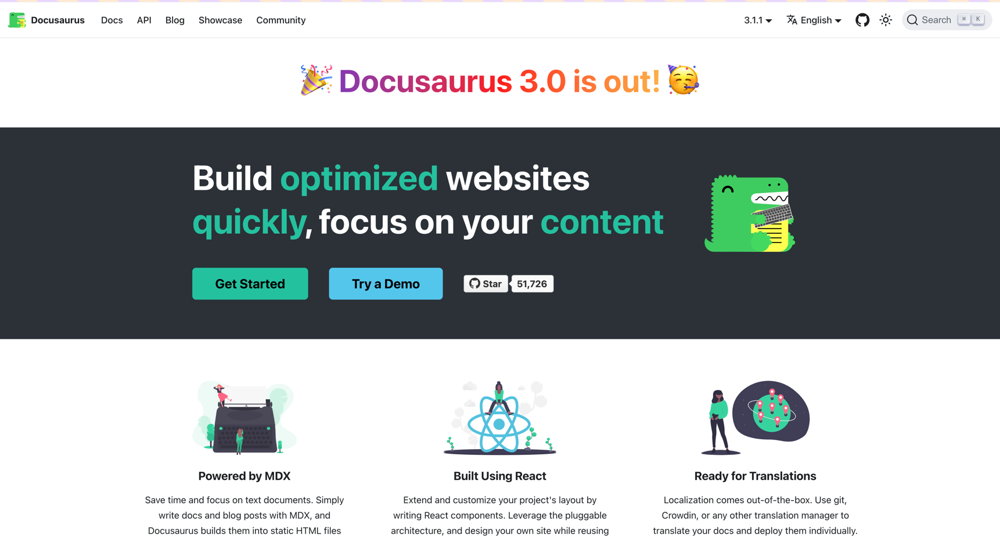
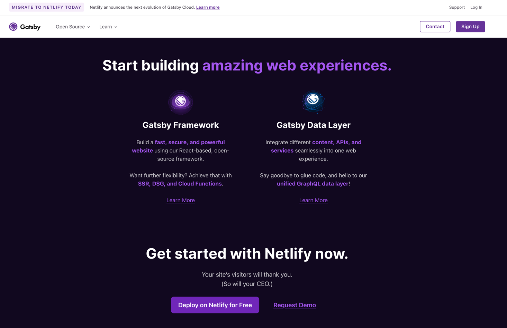
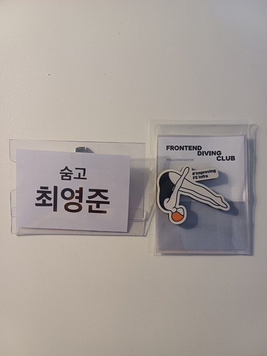

## 🙊 개발자로 일한지 1년이 되다니... 
 2월은 회사에 입사해 만 1년이 되는 달이었다. 벌써 1년이 되다니, 1년간의 시간 동안 내가 어떤 일을 했고, 어떤 성과를 만들었는지 나와 동료, 회사의 평가를 통해 되돌아 볼 수 있었다. 
평가를 되돌아보면 신입개발자로서 열심히 일하고 동료와 좋은 커뮤니케이션을 가지고 있고, 내가 만들었던 성과들에 대해 긍정적인 평가를 받아 기쁘게 생각했다.

1년간의 나를 되돌아보면서 나에 대해서 **리브랜딩**(?) 또한 필요하다고 생각이 들어, 블로그를 이전하고 이력서도 새롭게 작성했고, 이와 함께 더 다양한 시야를 갖기 위해 커뮤니티 활동에 참여하기도 했다. 

1년 중 가장 짧은 달이지만 회사 내외적으로 나름 다사다난했던 2월을 되돌아 보려 한다.

## 😍 Gatsby로 블로그 이전하기
블로그 이전은 사실 오랜기간 고민해왔던 일이었다. 기존에 Jekyll로 만들어진 블로그의 디자인은 괜찮긴 했지만, ruby 언어로 작성되어 직접 손대기에는 학습비용이 추가적으로 드는점과 상대 경로를 제대로 이해하지 못하는 이슈 등이 있어 2024년에는 꼭 이전해야겠다는 목표를 세웠다. 

세웠던 목표는 1년치 계획이었는데... 2월에 회사에 입사한지 1년이 된 겸, 깃허브 프로필에도 걸려있는 블로그가 **내 얼굴**과 같다는 생각이 들어 블로그 이전을 실행에 옮기게 되었다.

블로그 이전은 해야겠는데... 마땅한 플랫폼이 떠오르지 않았다. 내가 직접 만드는 방법은ㄷ 좋은 경험이 되겠지만, `글을 작성하는 것` 자체에 더 초점을 맞출 수 있게 플랫폼을 먼저 알아보자는 맘이 들어 이것저것 찾아보기 시작했다.

다행히 나처럼 고민하시는 분들이 많았는지 개발자 블로그 플랫폼에 대해 비교하는 다양한 글들을 볼 수 있었는데 작성해주신 티스토리, Velog, wordpress 등의 플랫폼들을 보아도, 이전에 이미 작성해놓은 글들을 이전하는 작업에 많은 수고가 필요하다는 점과 내가 직접 커스텀할 수 없다는 단점이 크게 작용해 다른 방법은 없을까 고민하게 된다.

그러던 중 우연히 페이스북에서 만든 리액트를 이용한 문서화 서비스인 [Docusaurus](https://docusaurus.io/)에 대한 글들을 접하게 되었다. Docusaurus는 리액트를 이용하다 보니 기존 내가 알고 있는 지식을 이용해 커스텀이 가능했고, 마크다운 형식으로 작성된 글을 그대로 복사/붙여넣기만 하면 해당 글을 분석해 페이지형식으로 만들어 줄 수 있었다. React Native 공식문서에도 쓰이고 있고, 실제 블로그 마이그레이션 후기 글들도 있어 공식문서를 읽으면서 작업을 시작하게 되었다.

### Docusaurus로 블로그 이전하기

Docusaurus는 markdown으로 작성된 글을 커스텀 디자인, SSG(Static-Site generator)를 이용해 성능이 높은 페이지를 만들어 준다. Docusaurus 내부에는 총 두가지로 컨텐츠를 구분할 수 있는데, 하나는 Docs로 기술 문서를 작성하는 형식으로 버전별 문서관리가 필요하거나, 주제별 하위 컨텐츠 분류 등을 적용할 때 사용할 수 있어 보였고, 다른 하나는 Blog로 블로그 형식의 글을 작성할 수 있게 해준다. 

나는 블로그용으로 사용하려 하기 때문에 Blog에 대한 세팅을 하고 프로젝트에 이전에 작성해둔 마크다운 파일들을 옮겨 개발환경에서 접속해서 세팅을 하는 과정에서 문제가 발생하게 된다.

그것은 Docusaurus 블로그 자체적인 문제로, 시리즈로 연속된 게시물들을 보여주기 어려워 보였고, 각 주제에 따라 몇개의 글이 작성되었는지를 나타내지 않고 시간순으로만 글을 보여준다는 점이 아쉬웠다. 블로그 이전을 참고했던 [parkgang.log님 블로그](https://parkgang.github.io/2021/12/31/2021%EB%85%84-12%EC%9B%94-%ED%9A%8C%EA%B3%A0.html)에서는 회고와 같은 글을 Blog로, 기술적인 내용은 docs로 분류해 주제별 글을 정리해두셨다. 똑같이 적용하기 전 "그래도 내맘에 쏙드는 다른 플랫폼은 없을까" 마지막으로 찾는 과정에서 **Gatsby**를 발견하게 된다.

### Gatsby로 블로그 이전하기

Gatsby 또한 Docusaurus와 같이 SSG를 이용해 정적 페이지를 만드는 데 최적화된 플렛폼으로 리액트로 작성되어있다. Docusaurus와 동일하게 마크다운 파일을 페이지로 만들어 주기 때문에 쉽게 이전이 가능하고, Docusaurus를 블로그로 사용하시는 분들을 찾는 것보다 더 다양한 개발자분들이 사용하고 있는 점도 좋았다. 

`왜 많은 사람들이 Gasby를 블로그로 많이 사용할까?`에 대해 생각해보았을 때, Gasby는 블로그 플러그인을 통한 디자인과 구성을 템플릿으로 사용할 수 있게 제공하는 점이 크게 느껴졌다. Jekyll 블로그 때와 같이 어떤 디자인으로 블로그를 만들면 좋을까 고민하다가 devHudi라는 분께서 만들어 두신 [gatsby-starter-hoodie](https://github.com/devHudi/gatsby-starter-hoodie)라는 플러그인이 마음에 들어 현재 블로그로 이전하게 되었다.

Gatsby로 이전하는 과정에서 블로그 글들을 다시 한번 읽으며 내가 `이때는 이런 걸 어려워했구나`라는 생각도 들었다. 한편 **내가 블로그 관리를 소홀히 했구나**를 여실히 느낄 수 있었는데, 참조로 한 글이나 이미지가 사라져서 보이지 않거나, 상대경로가 잘못되어있는 경우도 보였다...
상대주소와 Jekyll 때 깃허브에 올려서 정리했던 이미지 주소들을 로컬주소로 변경하는 등의 작업을 진행했다.  GA(Google Analytics)와 utterance를 통한 댓글을 적용해보았다. 이후에 방명록, 방문자 수 등 계속해서 나의 성장과정을 잘 보여줄 수 있게 가꿔나가야겠다.

## 🤿 프론트엔드 다이빙 클럽 
2월에는 회사 밖, 커뮤니티 활동에도 관심을 갖고 있었는데 우연히 링크드인 게시글을 보고 토스에서 운영하는 프론트엔드 커뮤니티인 `프론트엔드 다이빙 클럽`에 지원하게 되었다. 사실 이전에도 [토스 블로그의 소개 글](https://toss.tech/article/frontend-diving-club)을 보면서 다양한 회사의 각자의 문제를 풀고 계시는 프론트엔드 개발자분들과 이야기를 나눠보고 싶고, 내가 가진 시야를 넓혀주는 좋은 기회가 되지 않을까라는 생각에 지원했지만 떨어졌었다. 이번엔 정말 운좋게 참여하는 기회를 얻어 `개발환경 개선`이라는 주제로 참여하게 되었다.

가서 어떤 이야기를 하게 될까, 아는 사람이 아무도 없을텐데... 별의 별 고민을 하면서 참여했지만 금새 적응해 편하게 이야기할 수 있었다. 조원분들은 내가 생각했던대로 다양한 회사에서 오셨고, 다양한 관심사를 가지고 계셨다. 신기했던 부분은 대부분 조원분들이 `모노레포`에 대한 관심을 많이 가지고 계셨던 점이었다 모노레포로 된 프로젝트 경험이 없던 나에게는 모노레포가 어떤 문제를 해결하기 위한 기술인지, 왜 좋은 건지 등 배경이 없다보니 같이 많은 이야기를 할 수는 없었지만 **좋은 키워드**를 얻어가는 시간이 될 수 있었다.

조원분들과 신나게 이야기하던 중에 세션시간이 시작되어 2개의 발표를 들을 수 있었다. 첫번째 주제는 **모노레포 파이프라인 최적화**에 대해, 두번째 주제는 **생산성 높게 API 호출하는 방법**에 대한 주제로 발표를 해주셨다. 

첫번째 발표를 들으면서 처음 들었던 생각은 "패키지 관리에 사람들이 정말 많은 관심을 가지고 있구나"였다. 직전에 조원분들간의 이야기 주제도 발표주제도 모노레포로 서비스를 잘 운영하는 방법이다 보니 더 확 느껴졌다. 

발표내용중 놀랐던 점은 yarn을 이용한 **zero install**을 사용해 패키지를 모두 함께 올려두게 되면 repository에 올라와있는 파일 자체가 엄청나게 크기 때문에 이를 clone하고 checkout하는 과정 자체의 시간이 오래걸릴 수 있다는 점이었다. 패키지를 올리지않고 repo를 가져온 다음에 매번 패키지를 설치하는 게 당연했던 나에게 새로운 이야기였다.

이를 해결하기 위해 circle CI의 config등을 통해 병렬화 또는 배포시간 단축 등에 대해 이야기해주셨다. 프론트엔드 플랫폼에 대해서도 `기술적으로 해결하나가야할 재밌는 문제들이 많이 있구나`를 느낄 수 있었고 우리 팀 프로젝트의 CI/CD중에서 내가 개선할 수 있는 부분은 없을까 고민하는 좋은 시간이 되었다.

두번째 발표는 기능을 구현하는 과정에서 겪을 수 있는 서버의 API와 프론트엔드 코드가 강결합이 되어 있을 때 발생할 수 있는 여러가지 문제를 예시로, 프론트엔드 자체적인 interface를 구현해 어떻게 일정에 맞게 또 안전하게 프론트엔드 코드를 지킬 수 있을지에 대한 내용이었다. 들으면서 우리 프로젝트의 아키텍처 구조에서 Repository 패턴이 동일한 역할을 하고 있고 덕분에 API가 나오지 않았을 때도 API 명세만 알면 병렬로 프론트엔드 코드를 작성할 수 있었던 점이 떠올랐다.

발표가 끝나고 나서는 뒷풀이에도 참여해 같은 조가 아니었던 분들과도 이야기하며 다양한 연차와 경험을 가지신 분들의 이야기를 들을 수 있었다. 만나는 분마다 느꼈던 점은 여기에 모이신 분들은 모두 금요일 저녁에 퇴근 후 모여서 개발얘기를 하고 싶을 만큼 **개발을 너무 좋아하시는 분들이라는 것** 그리고 **더 많이 배우고 성장하고 싶어하시는 분**들이라는 것을 느낄 수 있었다. 처음 참석한 커뮤니티 자리였지만 너무 좋은 영향과 열정을 느낄 수 있었던 시간이었다. 

## 😆 마무리
블로그를 이전하면서 기술적인 주제에 대한 이야기와 회사 업무를 진행하면서 해결해간 기술적인 문제에 대한 이야기는 **분리하는 게 좋지 않을까**라는 생각이 들었다. 그래서 앞으로는 회고에는 한달간 공부한 내용들에 대해, 개인적인 이야기를 작성하고, 기술적인 내용은 다른 글로 분리해 조금 더 작성해보려 한다. 앞으로 회고에 쓸 내용이 없으면 어쩌나 고민도 되지만... 오히려 더 부지런하게 기술적 주제에 대한 글을 작성하고 요약하는 방식으로 작성하면 되지않을까 싶다.
그래서 2월동안 진행했던 에러바운더리 적용 작업과 App Start 시간 줄이기 작업에 대한 내용은 다음 글에서 작성해보려 한다. 

2월 한달간도 다양한 경험이 가득한 알찬 시간, 내 자신에 대해 고민하고 다음 1년에 대해 고민하는 좋은 시간이었던 것 같다. 3월은 또 어떤 일이 기다리고 있을지 기대하며 더 열심히 달려보자.
