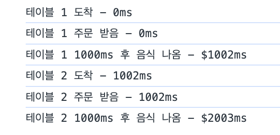
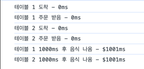
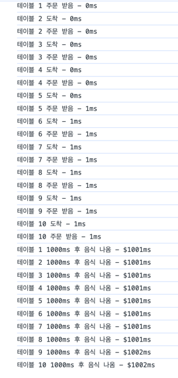
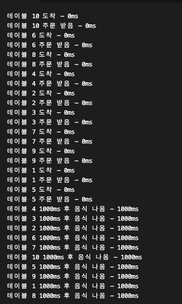

## 🙄 자바스크립트가 병렬처리?
아마 작년 말부터 2월까지 작업했던 작업 중 가장 많이 한 작업 중 하나가 순차적으로 진행되는 비동기 코드를 Promise.all()을 이용해 한번에 동작할 수 있게 최적화하는 작업이었다. 
사람들에게 말할 때는 `병렬처리`라고 표현하곤 했지만 내안에 어색함이 느껴졌다. `자바스크립트는 싱글스레드 언어인데 어떻게 여러가지 일을 동시에 처리하는 걸까`에 대한 질문을 찾아갔던 과정을 정리해보려 한다.

### 🤔 자바스크립트 엔진의 동작 파헤쳐보기
자바스크립트는 싱글 스레드 언어다. 이말의 의미는 한번에 하나의 일만 할 수 있게 설계되어 있는 언어로 이벤트 루프를 이용해 call stack으로 들어온 하나의 일만 한번에 처리할 수 있다. 그러면 어떻게 `Promise.all([...])` 같은 코드를 통해 **동시에 여러가지 일을 동시에 처리하는 것**이 가능할까.

#### Sequence vs Parallel vs Concurrent
자바스크립트에서 여러가지 일을 동시에 처리하는 것에 대해 정확하게 이해하기 위해서는 **Sequence, Parallel, Concurrent**의 차이를 이해해야 한다.

- **Sequence**: 순차적으로 실행되는 것을 의미한다. A -> B -> C 순서대로 실행되는 것을 의미한다.
- **Parallel**: 말그대로 동시에 실행되는 것을 의미한다. A, B, C가 동시에 실행되는 것을 의미한다.
- **Concurrent**: 병렬적으로 실행되는 것처럼 보이지만, 실제로는 동시에 실행되지 않는 것을 의미한다. A, B, C가 동시에 실행되는 것처럼 보이지만, 실제로는 A가 실행되고, B가 실행되고, C가 실행되는 것을 의미한다.

](sequential-concurrent-parallel.png)

따라서 위 정의에 따라 자바스크립트가 여러가지 일을 동시에 처리할 수 있다는 것의 의미가 parallel이라면 실제로 여러가지 일을 동시에 실행하는 것으로, concurrent하다면 순차적으로 진행하지만 빠르게 진행되기에 동시에 진행되는 것처럼 보인다고 할 수 있다. parallel과 concurrent 두가지 동작 중 어떤 게 맞는지 확인하기 위해 예를 들어, 코드와 함께 알아보자.

자바스크립트 스레드를 웨이터로 예를 든다면 다음과 같이 정리할 수 있다.
- **Sequence**: 웨이터가 하나의 테이블에 대해 주문을 받고 음식이 나오면, 다음 테이블에 대해 주문을 받는 것을 의미한다.
- **Parallel**: **여러 웨이터**가 여러 테이블에 대해 동시에 주문을 받고 동시에 음식이 나오는 것을 의미한다.
- **Concurrent**: 한명의 웨이터가 여러 테이블의 주문을 **순서대로** 받고 주문을 넣지만 빠르게 이 과정이 진행되다 보니 여러 테이블의 대한 음식이 `거의 동시`에 나오는 것을 의미한다.

그러면 예제 코드를 이용해 위 세가지 상황에 대해 확인해보자. 아래 코드는 `orderAndServe`라는 함수를 이용해 테이블에 대한 주문을 받고 음식을 서빙하는 코드이다.

```javascript
function orderAndServe(startTime,ms, tableNumber) {
    console.log(`테이블 ${tableNumber} 도착 - ${new Date()-startTime}ms`);
    return new Promise((resolve) => {
        console.log(`테이블 ${tableNumber} 주문 받음 - ${new Date()-startTime}ms`);
        return setTimeout(() => {
            resolve(tableNumber);
        }, ms);
    }).then((number) => {
        console.log(`테이블 ${number} ${ms}ms 후 음식 나옴 - $${new Date()-startTime}ms`);
    });
}


async function sequenceRun(startTime) {
    await orderAndServe(startTime,1000,1);
    await orderAndServe(startTime,1000,2);
}

async function concurrentOrParallelRun(startTime) {
 await Promise.all([orderAndServe(startTime,1000,1), orderAndServe(startTime,1000,2)]);
}
```
만약 자바스크립트가 `Parallel`하게 동작하다면 두가지 가정을 해볼 수 있다.
- 실행할 때 마다 끝나는 테이블의 순서가 다를 수 있다. 독립적인 스레드에서 진행되기 때문에 결과의 순서가 보장되지 않을 수 있다.
- 각 테이블에 도착하는 시간, 주문을 받는 시간, 음식이 나오는 시간이 같다.


<table width="100%" >
    <tr>
        <th>Sequential</th>
        <th>Concurrent</th>
     </tr>
  <tr>
    <td></td>
    <td></td>
   </tr>
  </tr>
</table>

위 사진은 두가지 테이블에 대해서 각 함수를 실행한 결과로, `sequential`처럼 항상 테이블1에서 테이블 2로 같은 순서로 진행되는 것을 볼 수 있다.

위 가정했던 두가지 중 parallel 하다는 가정의 첫번째가 어긋난 것을 볼 수 있다. 하지만 두 번째 가정이었던 테이블별 도착, 주문, 서빙 시간이 같다는 가정은 맞는 것을 볼 수 있다.
그러면 조금 더 많은 테이블을 서빙하게 해보자

```javascript

function orderAndServe(startTime,ms, tableNumber) {
    console.log(`테이블 ${tableNumber} 도착 - ${new Date()-startTime}ms`);
    return new Promise((resolve) => {
        console.log(`테이블 ${tableNumber} 주문 받음 - ${new Date()-startTime}ms`);
        return setTimeout(() => {
            resolve(tableNumber);
        }, ms);
    }).then((number) => {
        console.log(`테이블 ${number} ${ms}ms 후 음식 나옴 - $${new Date()-startTime}ms`);
    });
}
const tables = Array.from({ length: 10 }, (_, i) => i + 1);

async function concurrentOrParallelRun(startTime) {
  await Promise.all(
    tables.map((tableNumber) => orderAndServe(startTime, 1000, tableNumber)),
  );
}
concurrentRun(new Date());
```

아래 사진은 위 10개의 테이블에 대한 코드를 실행한 결과다. 아래결과를 보면 테이블 1부터 10까지 순서가 유지되고, 테이블별 각 동작 완료시간의 차이가 나는 것을 볼 수 있다.



이를 통해 `Promise.all()`은 병렬적(parallelism)으로 처리하는 것이 아니라 자바스크립트의 **동시성**(concurrency)을 이용해 순차적으로 진행하지만 빠르게 진행함으로서 성능의 이점을 얻을 수 있는 메소드임을 알 수 있었다.


## 번외: 병렬을 지원하면 결과가 어떻게 달라질까
내가 했던 parallelism에 대한 두가지 가정이 실제 병렬 처리 지원하는 언어에서 유의미하게 동작하는지에 대해 알아보고자 ChatGPT를 이용해 `Go`언어로 유사한 코드를 작성해보았다.

```
package main

import (
	"fmt"
	"sync"
	"time"
)

func orderAndServe(startTime time.Time, ms time.Duration, tableNumber int, wg *sync.WaitGroup) {
	defer wg.Done() // 이 함수가 끝나면 WaitGroup의 카운터를 감소시킨다.

	fmt.Printf("테이블 %d 도착 - %vms\n", tableNumber, time.Since(startTime).Milliseconds())
	fmt.Printf("테이블 %d 주문 받음 - %vms\n", tableNumber, time.Since(startTime).Milliseconds())
	time.Sleep(ms)
	fmt.Printf("테이블 %d %vms 후 음식 나옴 - %vms\n", tableNumber, ms.Milliseconds(), time.Since(startTime).Milliseconds())
}

func main() {
	startTime := time.Now()
	var wg sync.WaitGroup

	// 10개의 테이블에 대해 병렬로 처리
	for i := 1; i <= 10; i++ {
		wg.Add(1) // WaitGroup의 카운터를 증가시킨다.
		go orderAndServe(startTime, 1000*time.Millisecond, i, &wg)
	}

	wg.Wait() // 모든 고루틴이 완료될 때까지 기다린다.
}
```
위 코드는 go언어로 작성한 코드로, `sync.WaitGroup`을 이용해 병렬로 함수를 진행시켰다. 아래는 위 코드를 실행한 결과다.



결과를 보면 테이블 도착과 주문받음까지 진행 순서가 테이블 1부터 진행하지 않고 (첫번째 가정의 독립적인 스레드), 완료한 시간을 보면 동일하게 처리된 것 (두번째 가정의 같은 시간에 완료)을 볼 수 있었다.
이를 통해 앞선 두가지 가정이 병렬처리가 가능한 언어의 특징을 잘보여주는 가정이었고, Promise.all()은 병렬적으로 처리하는 것이 아니라 자바스크립트의 **동시성**을 이용하는 메소드임을 한번 더 확인할 수 있었다.

[참조]
- [Does Promise.all Execute in Parallel? How Promise.all Works in JavaScript](https://javascript.plainenglish.io/does-promise-all-execute-in-parallel-how-promise-all-works-in-javascript-fffc2e8d455d)
- [Speed up your code with Promise.all](https://dev.to/dperrymorrow/speed-up-your-code-with-promiseall-3d4i)
