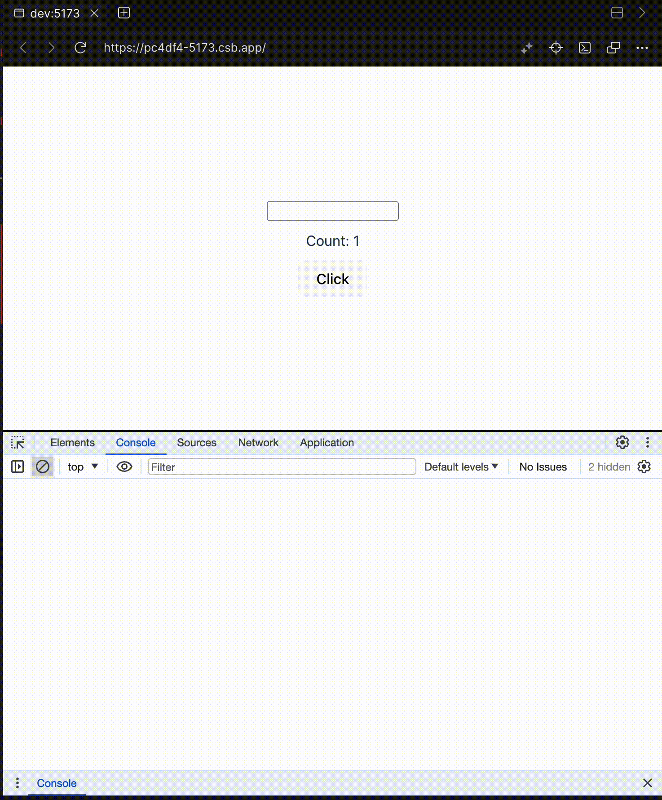
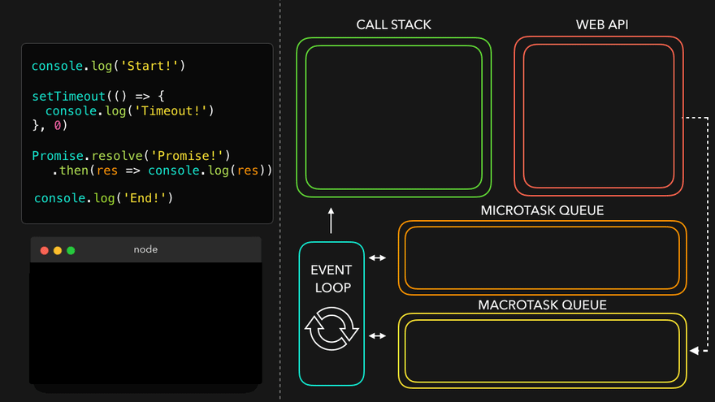
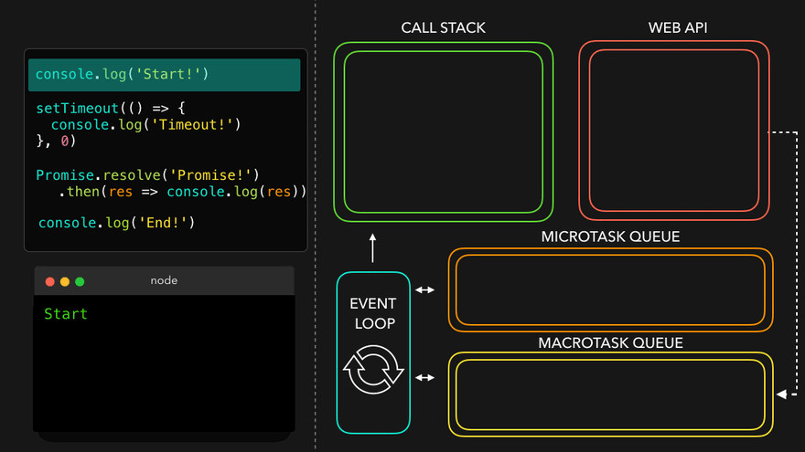
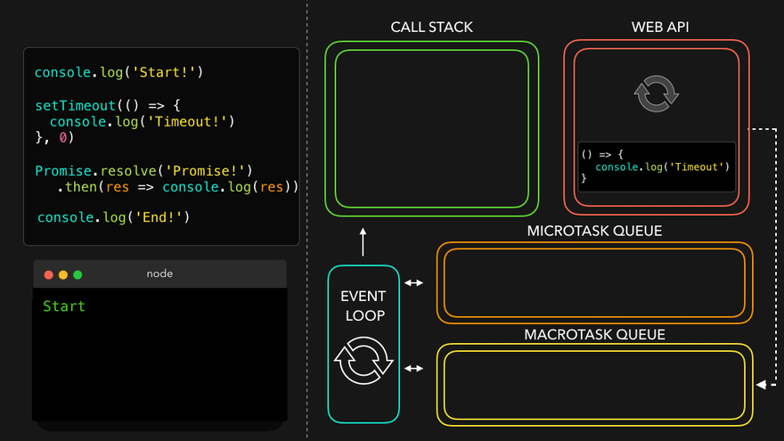
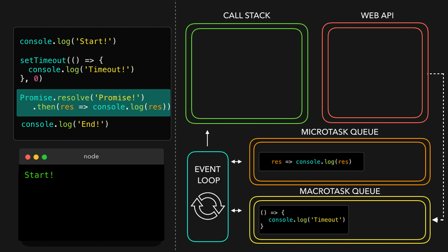
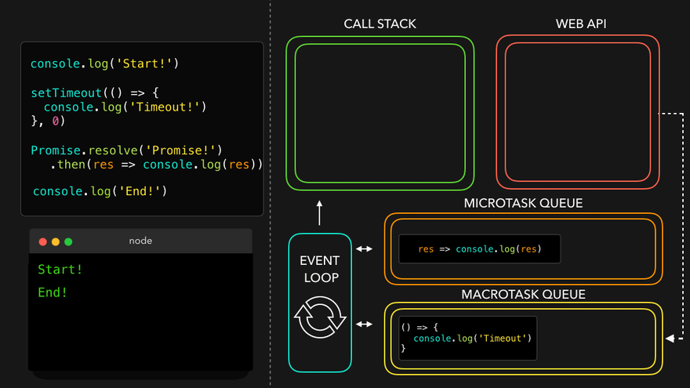
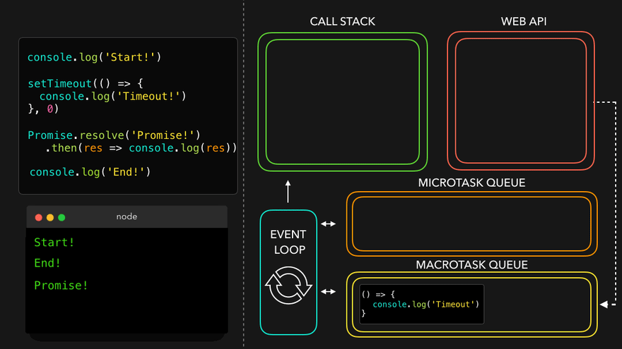
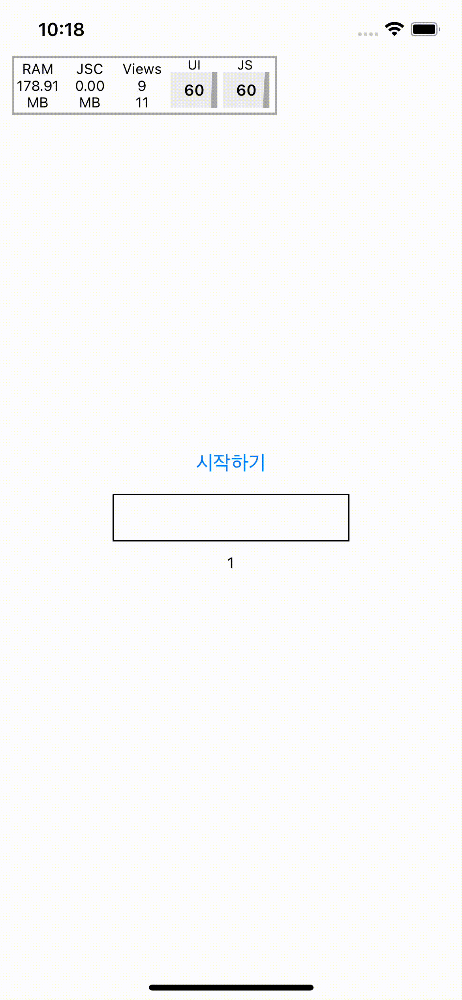

[앞선 글](https://choi2021.github.io/2024-03-03-%EC%9E%90%EB%B0%94%EC%8A%A4%ED%81%AC%EB%A6%BD%ED%8A%B8%EC%9D%98-%EB%8F%99%EC%8B%9C%EC%84%B1-%EC%9D%B4%ED%95%B4%ED%95%98%EA%B8%B0/)을 통해 Promise.all는 자바스크립트의 **동시성**을 이용한 메소드임을 정리해보았다. 
이어서 자바스크립트에서 비동기 처리를 가능하게 하는 기본원리인 **이벤트 루프**를 React와 React Native 예제 코드와 함께 정리해보려 한다.

## 🤔 이벤트 루프란?
이벤트 루프는 자바스크립트에서 코드를 실행하고 이벤트를 처리하는 역할을 하며, **단일 스레드**로 동작하는 자바스크립트에서 **비동기 처리**를 가능하게 한다.
이벤트 루프의 동작을 코드로 같이 정리해보자.

## ⬇️ 동기 처리
```javascript
const foo = () => console.log("First");
const bar = () => console.log("Second");
const baz = () => console.log("Third");

foo();
bar();
baz();
```
위 코드를 실행하면 First, Second, Third 순서로 출력이 된다. 이는 **동기적**으로 실행되는 코드로 자바스크립트는 기본적으로 코드를 위에서 아래로 **순서대로** 읽고 실행한다.

## ⏩ 비동기 처리
그러면 이제 비동기 함수들에 대해서 알아보자.

### ⏩ 비동기 처리: callback 함수
```javascript
const foo = () => console.log("First");
const bar = () => setTimeout(() => console.log("Second"), 0);
const baz = () => console.log("Third");

foo();
bar();
baz();

// 결과
// First
// Third
// Second
```

이러한 결과를 이해하기 위해 아래 시각화된 gif를 통해 함께 이해해보자.

[참조: [✨♻️ JavaScript Visualized: Event Loop](https://dev.to/lydiahallie/javascript-visualized-event-loop-3dif)]


코드는 위에서 아래로 동일하게 위에서 아래로 순서대로 실행되지만,
- foo()함수가 실행되고
- bar()함수가 실행되면서 setTimeout가 실행된다. 이때 브라우저는 **비동기적으로 실행**되는 코드를 **task queue**에 넣는다.
- baz()함수가 실행되고
- 이때 call stack이 비어있으면 이벤트 루프는 task queue에 있는 코드를 call stack으로 옮겨 실행한다.

이벤트 루프는 위와 같이 Network 요청, 이벤트 등과 같은 시간이 오래걸리는 작업을 진행할 때 오랜시간 스레드를 차지해 다음 작업을 처리하지 못하는 것을 방지해준다.


### 🅾️ 비동기 처리: Callback의 무한 loop
그러면 만약 callback 함수가 계속해서 쌓이게 되는 상황을 생각해보자. 이때 React와 React Native에서 이벤트 루프가 어떻게 동작할까?

React에서 콜백을 계속해서 만드는 예제로 두가지 상태를 이용한 예제 코드를 작성해봤다.
- count: 버튼 클릭시 무한 루프로 콜백함수를 task queue에 쌓는 역할
- value: input에 값을 입력해 리렌더링을 일으켜 JS 스레드 blocking을 확인하는 역할

[React 코드]
```tsx

function App() {
    const [value, setValue] = useState<string>("");
    const [count, setCount] = useState<number>(1);

    const makeInfiniteCallback = () => {
        setTimeout(() => {
            setCount((prev) => prev + 1);
            makeInfiniteCallback();
        }, 0);
    };
    const handlePress = () => {
        makeInfiniteCallback();
    };

    const handleChange = (e: React.ChangeEvent<HTMLInputElement>) => {
        console.log(e.target.value);
        setValue(e.target.value);
    };

    return (
        <div
            style={{
                justifyContent: "center",
                display: "flex",
                flexDirection: "column",
                alignItems: "center",
                gap: "10px",
            }}
        >
            <input value={value} onChange={handleChange} />
            <span>Count: {count}</span>
            <button onClick={handlePress}>Click</button>
        </div>
    );
}

export default App;

```

<table >
 <tr>
    <th>React 코드 실행 영상 with JS thread</th>
  </tr>
  <tr>
    <td>
      
    </td>
  </tr>
</table>

영상속 이벤트 루프가 동작하고 있는 순서를 정리해보자.
1. 버튼 클릭시 makeInfiniteCallback 함수가 실행된다.
2. setTimeout이 실행되면서 task queue에 콜백함수가 쌓이게 된다.
3. 이벤트 루프는 callstack이 비어있으면 queue되어 있는 콜백함수를 call stack으로 가져와 실행한다. (count 값이 1씩 증가)
4. 이때 다시 callback 함수가 실행되면서 setTimeout이 실행되고 task queue에 쌓이게 된다. <br/> (무한 루프)
5. 이 사이에 input에 값을 입력하면 이벤트 핸들러에 작성된 코드가 callstack에 추가된다. (동기적으로 쌓기)
6. callStack에 쌓인 작업을 실행하면서 console을 찍고 화면을 리렌더링한다. 
7. 6번과정 이후 call stack이 비어있으면 다시 task queue에 있는 콜백함수를 call stack으로 옮겨 실행한다.
8. 1~7까지의 과정을 반복한다.


이를 통해 확인할 수 있는 것은 이벤트루프는 task Queue에 다른 작업이 queue되어 있더라도 **하나씩 callstack에 가져와서 처리**하기 때문에 JS 스레드가 멈추지 않고 계속해서 작동하는 것을 확인할 수 있다.

추가적으로 RN에서도 확인해보면 리액트와 동일하게 작동하며 RN의 performance tool을 이용해 JS 스레드를 보았을 때도 멈추지않고 동작하고 있는 것을 볼 수 있다. 

[RN 코드]
```tsx
function App(): React.JSX.Element {
  const [value, setValue] = useState('');
  const [count, setCount] = useState(1);
  const makeInfiniteCallback = () => {
      setTimeout(() => {
          setCount((prev) => prev + 1);
          makeInfiniteCallback();
        }, 0);
  };
  const handlePress = () => {
      makeInfiniteCallback();
  };

  const handleChange = (text: string) => {
      console.log(text);
      setValue(text);
  };
    
  return (
    <SafeAreaView
      style={{flex: 1, justifyContent: 'center', alignItems: 'center'}}>
      <StatusBar barStyle={'dark-content'} />
      <Button title={'시작하기'} onPress={handlePress} />
      <TextInput
        style={{
          width: 200,
          height: 40,
          borderWidth: 1,
          borderColor: 'black',
          margin: 10,
          textAlign: 'center',
        }}
        value={value}
        onChangeText={handleChange}
      />
      <Text>{count}</Text>
    </SafeAreaView>
  );
}

export default App;
```
<table width="400">
 <tr>
    <th>RN 코드 실행 영상 with JS thread</th>
  </tr>
  <tr>
    <td>
      
    </td>
  </tr>
</table>

### ⏩ 비동기 처리: Promise

Promise는 비동기 처리를 위한 객체로, 성공과 실패를 나타내는 상태와 성공시 결과값, 실패시 에러를 나타내는 값으로 이루어져 있다.
이러한 상태에는 총 세가지가 있다.
- Pending: 초기 상태
- Fulfilled: 성공 상태
- Rejected: 실패 상태

Promise는 callback과 같이 비동기로 동작하지만 별도의 queue를 통해 동작한다. 이를 microtask queue라고 하며, 이벤트 루프는 task queue보다 먼저 실행된다.

이제 코드를 통해 Promise의 비동기 처리과정을 알아보자.

```javascript
console.log('Start')

setTimeout(() => console.log('TimeOut!'), 0)

Promise.resolve('Promise!').then((res) => console.log(res))

console.log('End')

// 결과
// Start
// End
// Promise!
// TimeOut!
```
위 코드는 앞서 정리했던 콜백함수와 함께 Promise 코드를 처리하는 예제다. 결과를 아래 gif와 함께 분석해보자.

[참조: [⭐️🎀 JavaScript Visualized: Promises & Async/Await](https://dev.to/lydiahallie/javascript-visualized-promises-async-await-5gke)]

#### 1. Start 출력

이벤트 루프는 `console.log('Start')`를 call stack에 쌓고 JS 엔진이 읽어 `start` 로그가 찍힌다.



#### 2. setTimeout 실행
이벤트 루프는 다음줄을 call stack에 쌓고 실행된다. setTimeout의 callback은 task queue에 쌓이게 된다.



#### 3. Promise 실행
이벤트 루프는 Promise를 call stack에 쌓고 실행된다. Promise.resolve로 전달된 `Promise!`가 then 메소드로 전달된다. 이후 then의 callback은 microtask queue에 쌓이게 된다.



#### 4. End 출력

이벤트 루프는 `console.log('End')`를 call stack에 쌓고 JS 엔진이 읽어 `End` 로그가 찍힌다.



#### 5. Promise 출력
이벤트 루프는 call stack이 비어있는지 확인하고 queue된 작업을 call stack으로 가져와 실행한다. 이때 **microtask Queue를 먼저** 확인해 Promise의 then 메소드로 전달된 callback을 call stack으로 가져온다.
이후 콜백이 실행되면 `Promise!`가 출력된다.



#### 6. setTimeout 출력
이벤트 루프는 다시 call stack이 비어있는지 확인하고 queue된 작업을 call stack으로 가져와 실행한다. 이때 microtask Queue가 **완전히 비었는지** 확인한다.
micro task queue가 비었으므로 이제 **task Queue를 확인**해 setTimeout의 callback을 call stack으로 가져오고 실행한다.



이러한 과정을 통해서 이루어지기 때문에 결과가 `Start -> End -> Promise! -> TimeOut!` 순서로 promise가 callback보다 먼저 출력되게 되었다.

### 🅾️ 비동기 처리: Promise의 무한 loop

이제 실제 React와 React Native에서 Promise를 사용하는 예제를 통해 이벤트 루프가 동작하는 것을 확인해보자.
앞서 gif를 이용한 동작과정에 대해 알아보았을 때 Promise는 두가지 특징을 볼 수 있었다.
- 별개의 microtask queue를 통해 동작한다.
- task queue보다 우선순위가 높다.

앞서 언급했지만 이벤트 루프가 Promise를 처리할 때 또다른 특징을 가진다. 이벤트 루프는 microtask queue에 쌓인 **모든 promise를 처리한 후에** 다시 돌기 시작한다.
이를 알아보기위해 무한 loop되는 상황을 만들어 확인해보자.

아래 코드는 위 callback 무한 루프와 동일한 예제로 callback을 Promise로만 바꾸어 동작시켜보려 한다.

[React 코드]
```tsx

function App() {
  const [value, setValue] = useState<string>("");
  const [count, setCount] = useState<number>(1);

  const makeInfinitePromise = () => {
    Promise.resolve().then(() => {
      setCount((prev) => prev + 1);
      makeInfinitePromise();
    });
  };
  const handlePress = () => {
      makeInfinitePromise();
  };

  const handleChange = (e: React.ChangeEvent<HTMLInputElement>) => {
    console.log(e.target.value);
    setValue(e.target.value);
  };

  return (
    <div
      style={{
        justifyContent: "center",
        display: "flex",
        flexDirection: "column",
        alignItems: "center",
        gap: "10px",
      }}
    >
      <input value={value} onChange={handleChange} />
      <span>Count: {count}</span>
      <button onClick={handlePress}>Click</button>
    </div>
  );
}

export default App;
```

아래 영상을 보면 리액트 코드를 동작시켰을 때 다음과 같이 이벤트루프가 동작하게 된다.
1. 버튼 클릭시 makeInfinitePromise 함수가 실행된다.
2. Promise.resolve().then()이 실행되면서 microtask queue에 then 내부 콜백함수가 쌓이게 된다.
3. 이벤트 루프는 callstack이 비어있으면 microtask queue에 있는 함수를 call stack으로 가져와 실행한다.
4. 이때 다시 callback 함수가 실행되면서 Promise.resolve().then()이 실행되고 microtask queue에 쌓이게 된다. <br/> (무한 루프)
5. 1번부터 4번까지의 과정이 반복되면서 더이상 동작할 수 없어 멈추는 것을 확인할 수 있다.

Promise가 microtask queue에 계속해서 쌓이기 때문에 **이벤트루프가 머물러 있게 되어** 다른 작업을 처리하지 못해 발생하게 된다.

<table>
 <tr>
    <th>React 코드 실행 영상 with JS thread</th>
  </tr>
  <tr>
    <td>
      
    </td>
  </tr>
</table>

추가적으로 유사한 코드를 RN에서 어떻게 동작하는지 알아보자.

[RN 코드]
```tsx
function App(): React.JSX.Element {
  const [value, setValue] = useState('');
  const [count, setCount] = useState(1);
  const makeInfinitePromise = () => {
      Promise.resolve().then(() => {
          setCount((prev) => prev + 1);
          makeInfinitePromise();
      });
  };
  const handlePress = () => {
      makeInfinitePromise();
  };

  const handleChange = (text: string) => {
      console.log(text);
      setValue(text);
  };
    
  return (
    <SafeAreaView
      style={{flex: 1, justifyContent: 'center', alignItems: 'center'}}>
      <StatusBar barStyle={'dark-content'} />
      <Button title={'시작하기'} onPress={handlePress} />
      <TextInput
        style={{
          width: 200,
          height: 40,
          borderWidth: 1,
          borderColor: 'black',
          margin: 10,
          textAlign: 'center',
        }}
        value={value}
        onChangeText={handleChange}
      />
      <Text>{count}</Text>
    </SafeAreaView>
  );
}

export default App;
```
Main 스레드와 JS 스레드가 함께 동작하기 때문에 JS 스레드가 무한루프에 빠져도 Main 스레드가 동작하고 있어 TextInput에 값을 입력할수 있다.
하지만 JS 스레드는 동일하게 **microtask queue에 머물러있기 때문에** JS 스레드의 프레임 측정이 불가능해지고 TouchableOpacity의 애니메이션도 돌아오지 않는 것을 볼 수 있다.

<table width="400">
 <tr>
    <th>RN 코드 실행 영상 with JS thread</th>
  </tr>
  <tr>
    <td>
      
    </td>
  </tr>
</table>

이를 통해 Promise는 callback과 다르게 **microtask queue**를 통해 동작하며, 이벤트 루프는 **microtask queue에 쌓인 모든 작업을 처리한 후에 다시 돌기 시작**한다는 것을 확인할 수 있다.
