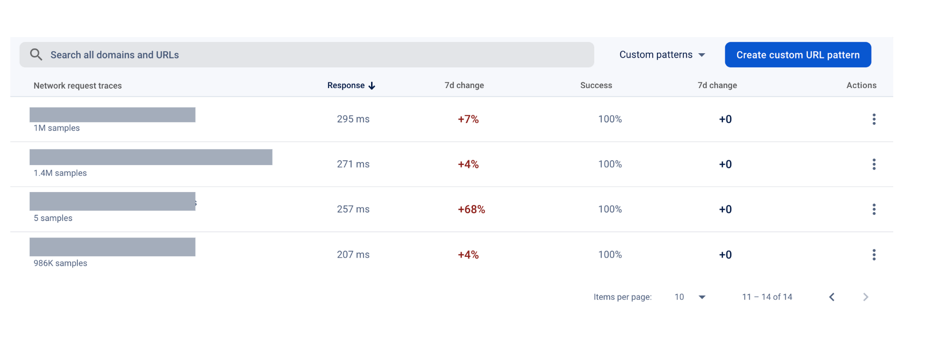
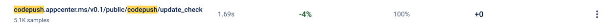
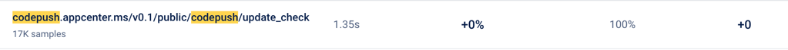
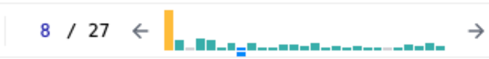
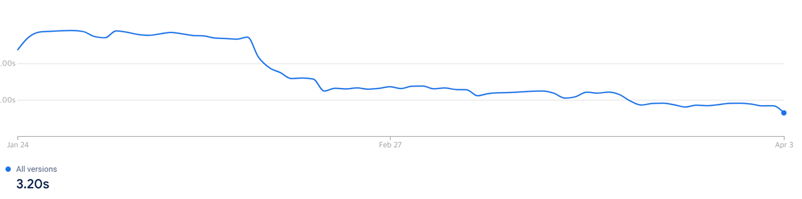
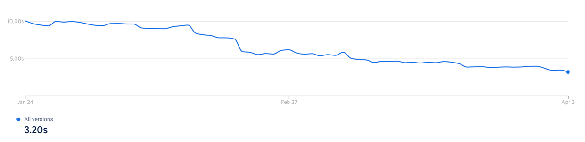
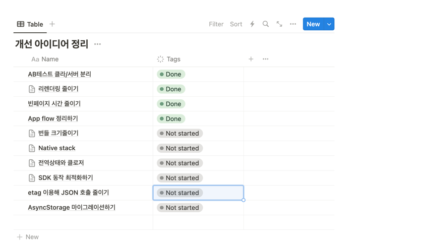

24년 1Q동안은 스쿼드가 아닌 모바일 챕터에 속해, App Start time 줄이기 업무를 담당했다. App Start Time을 줄이기 위해 시도하고 조사하며 겪었던 시행착오들을 기록해보려한다.

## ⚠️ App Start time이란?
앱 시작 시간 (start time)은 **앱을 실행하고 첫 화면이 랜딩되기까지**의 시간을 의미한다. 
시작시간을 줄이는 것에 대한 작업의 비즈니스적 가치는 앱을 이용하는 모든 유저가 필수적으로 거쳐야하는 퍼널을 빠르게 완료함으로서, 앱을 보다 빠르게 이용할 수 있게 해 사용자 경험을 개선하는 것에 있다.

그러면 이제 App Start time을 단축하기 위해 어떤 시도를 했는지 알아보자.

## 📌 App Start time 측정하기

성능을 비교하기 위해서는 항상 기준이 필요하다. 성능 비교를 위해 작년 4Q에 진행했던  [견적발송 개선 작업](https://choi2021.github.io/2023-11-01-2023%EB%85%84-10%EC%9B%94%ED%9A%8C%EA%B3%A0/)과 동일하게 **Firebase Performance**를 이용해 측정했다. 
다행이었던 부분은 이전에 측정을 시도했던 코드가 남아있어 참고해서 작업을 진행할 수 있었다.

기존의 기준은 가장 상위 파일인 **App -> Start화면 -> 고객/고수 홈화면으로 이동**하기까지의 시간이었다.
이미 기준이 잘잡혀 있어 동일한 기준으로 측정하게 되었다.

### 측정 유틸 개선하기
기준을 세운 이후에 데이터를 측정하는데에는 두가지 케이스에 대한 고려가 필요했다.

첫번쨰로 **유저의 타입**으로 앱을 이용하는 유저에 따라 Splash Screen에서 필요한 정보가 달라지기 떄문에 비회원/고객/고수 세가지에 맞게 정리하고 데이터를 필터링 할 수 있어야 했다.

두번째는 코드푸시를 이용한 **필수 업데이트**를 이용하는 경우다. 필수 업데이트를 진행하는 경우에 앱센터에 올라온 새로운 필수 버전이 있는지 체크하고 해당 번들을 설치하게 되는데 이때 설치하는데 추가적인 시간이 소요되기 때문에 이를 고려해야 했다. 

위 두가지 케이스를 위해서 먼저 유저타입은 attribute로 trace에 추가하고, 필수업데이트의 경우는 데이터 측정에서 제외시켜 두가지 케이스를 고려해 측정을 진행했다.

측정 코드는 이전 [견적발송시간 측정](https://choi2021.github.io/2023-11-01-2023%EB%85%84-10%EC%9B%94%ED%9A%8C%EA%B3%A0/)때 구현해둔 Firebase Performance util 모듈에 두가지 케이스를 모두 커버할 수 있게 attribute 추가 메소드와 skip 기능을 추가했다.

[Firebase Performance util]
```typescript

export class PerformanceTracker {
    private constructor(
        private traceMap: Map<keyof typeof PerformanceKey, FirebasePerformanceTypes.Trace> = new Map(),
        private configMap: Map<
            keyof typeof PerformanceKey,
            { startTime: number; isSkipped: boolean; latestTime: number}
        > = new Map(),
    ) {}
    
    async start(name: keyof typeof PerformanceKey) {
        const trace = perf().newTrace(name);
        const startTime = Date.now();
        this.configMap.set(name, { startTime, isSkipped: false, latestTime: startTime });
        this.traceMap.set(name, trace);
        await trace.start();
    }

    async stop(name: keyof typeof PerformanceKey) {
        const trace = this.traceMap.get(name);
        const config = this.configMap.get(name);
        if (isNil(trace) || isNil(config)) {
            return;
        }

        if (config.isSkipped) {
            this.traceMap.delete(name);
            return;
        }

        await trace.stop();
        this.traceMap.delete(name);
    }

    addCheckPoint(name: keyof typeof PerformanceKey, metricName: string) {
        const trace = this.traceMap.get(name);
        const config = this.configMap.get(name);
        if (isNil(trace) || isNil(config)) {
            return;
        }

        const checkPointTime = Date.now() - config.startTime;
        const timeGap = Date.now() - config.latestTime;
        trace.putMetric(metricName, checkPointTime);
        this.configMap.set(name, { ...config, latestTime: Date.now() });
    }
    
    skipTrace(name: keyof typeof PerformanceKey) {
        const config = this.configMap.get(name);
        if (isNil(config)) {
            return;
        }
        this.configMap.set(name, { ...config, isSkipped: true });
    }

    addAttribute(name: keyof typeof PerformanceKey, key: string, value: string) {
        const trace = this.traceMap.get(name);
        if (isNil(trace)) {
            return;
        }
        trace.putAttribute(key, value);
    }
}

```

### 세부 체크포인트 지점 추가하기

이제 구현한 측정 유틸과 전체적인 기준에 각 지점마다의 개선을 보기 위해 **체크포인트**들을 세웠다. 
기준은 4가지로 아래와 같이 정했다.
- App 화면 초기화: 최상위 App화면에서 전역적인 provider들과 전역상태, 이벤트리스너들을 준비하고 기기 내부 storage에서 정보들을 가져오는데 걸리는 시간
- 앱 업데이트 체크: 앱 버전과 코드푸시 업데이트를 체크하는 시간
- 로그인: 인증토큰을 이용해 로그인을 완료하고 일부 후처리 작업까지 걸리는 시간
- 홈화면 이동: 로그인 후 홈화면 이동까지 걸리는 시간

그리고 측정 데이터를 볼 때 **고수**를 기준으로 얼마나 개선되었는지를 보려 했다. 그 이유는 유저 타입별로 호출하는 API 수가 다르기 때문에 데이터의 유저 타입에 의해 결과가 달라지게 되었다. 
이를 개선하기 위해서 가장 많은 API를 호출하는 고수로 데이터를 비교해보려 했다. 

정의한 체크포인트에 따라 App Start time의 데이터를 정리해보면 개선 작업전 1월 24일부터 2월 14일간 90% 고수 유저 기준으로 OS별 데이터는 다음과 같이 정리할 수 있었다.

<Table>
<tr>
    <th>체크포인트</th>
    <th>iOS</th>
    <th>Android</th>
</tr>
<tr>
    <td>App 화면 초기화</td>
    <td>1.6초</td>
    <td>1.8초</td>
</tr>
<tr>
    <td>앱 업데이트 체크</td>
    <td>3.3초 (+1,700ms)</td>
    <td>2.8초 (+1000ms)</td>
</tr>
<tr>
    <td>로그인</td>
    <td>5.9초 (+2,600ms)</td>
    <td>6.2초 (+3,400ms)</td>
</tr>
<tr>
    <td>홈화면 이동</td>
    <td>6.5초 (+600ms)</td>
    <td>6.9초 (+700ms)</td>
</tr>
</Table>

구간별 시간을 통해서 앱 업데이트부터 로그인 + 홈화면 이동 구간, 업데이트 체크, App화면 초기화 순으로 오래걸리는 구간을 우선순위를 높여 작업을 진행하게 되었다.

## 🚀 개선 작업

이제는 App Start time을 단축하기 위해 검토하고 시도해봤던 부분들에 대해 정리해보자.

## 🛜 네트워크 최적화
가장 먼저 실행한 부분은 **네트워크 요청 최적화**로 불필요한 중복 API를 호출하는 경우가 없는지 체크하고 순서와 상관이 없는 요청들은 동시성을 이용해 네트워크 시간을 최적화했다.

###  불필요한 요청 감지하기

불필요한 네트워크를 제거하는 작업은 두가지 효과를 기대할 수 있다.

먼저, **네트워크 응답 시간을 줄일 수 있다**. 1초가 걸리는 요청을 N번 하고 동기적으로 응답을 기다린다면  N초를 기다려야만 한다.

두번째로, **서버의 부담을 줄여줄 수 있다**. 요청이 많다는 것은 그만큼 서버에서 부담해야할 트래픽이 늘어난다는 것이고, 만약 요청이 몰리게 되면 서버에서 처리가 오래걸리게 되거나 타임아웃이 발생할 수 있다. 불필요한 요청을 제거함으로서 서버의 부담을 줄일 수 있다.

측정 시작부터 완료까지 과정에서 호출되는 중복 네트워크 요청들을 조사하기 위해서 Axios interceptor를 이용해 개발환경에서 특정 시간내의 중복 호출을 감지할 수 있는 모듈을 만들어 적용했다. 
또한, Firebase Performance의 metric을 이용해 네트워크 응답 시간과 성공률에 대한 데이터를 쌓을 수 있었다. 

[중복 API 호출 감지 interceptor ]
```tsx
const requestMap = new Map<
    string,
    {
        lastTime: number;
        count: number;
        notify?: (count: number) => void;
    }
>();

const requestCheckDuplicatedRequestInterceptor = async (config: InternalAxiosRequestConfig) => {
    if (isProduction()) {
        return config;
    }

    const { method, url, params, data } = config;
    const requestKey = `${method?.toUpperCase()} ${url} ${JSON.stringify(params)} ${JSON.stringify(data)}`;
    const request = requestMap.get(requestKey) ?? { lastTime: 0, count: 0 };

    const now = Date.now();
    if (request.lastTime === 0 || now - request.lastTime > 1000) {
        const notify = debounce((count: number) => {
            console.warn(`${method?.toUpperCase()} ${url} 반복 요청 ${count} times`);
        }, 1000);

        requestMap.set(requestKey, { lastTime: now, count: 1, notify });
    } else {
        requestMap.set(requestKey, { lastTime: now, count: request.count + 1, notify: request.notify });
        request.notify?.(request.count + 1);
    }
    return config;
};
```

[Firebase Performance network metric]



중복호출 감지 interceptor를 통해 개발 과정에서 중복 호출되고 있는 API들을 체크한 후에, 첫번쨰 호출받은 응답을 두번째에 이용하게 수정함으로서 중복 호출에 대한 최적화를 할 수 있었다. 
네트워크 응답 시간이 오래걸리는 API들은 정리한 후에 백엔드 분들께 전달드려 최적화를 요청해 시간을 단축할 수 있었다.

###  로그인/로그인 후처리 구간 최적화하기

로그인 과정에서 순서가 중요한 작업들을 고려해 flow를 정리해보면 **인증 토큰 가져오기 -> 인증토큰 유효성 검사 -> 로그인 -> 로그인 후처리** 로 정리해볼 수 있다.
API들을 스텝별로 재분류하고 나니 로그인 이후에는 **로그인 후처리** 작업간에는 순서가 상관없기 때문에 `Promise.all` 메소드를 이용해 처리할 수 있어보였다.

그리고 기존에 홈화면 이동 이후에 일부 후처리 작업들이 진행되고 있었지만 모두 완료하고 홈화면으로 랜딩하게 하는 것이 더 합당해보여서 순서를 수정하게 되었다.
아래는 개선한 코드의 일부를 가져와 정리해보았다.

[개선된 Splash 화면 초기화 flow]

```tsx
// 유저타입별 초기화
const 유저타입별_초기화 = async (userType: UserType) => {
    await Promise.all([공통_초기화(), 유저_초기화(userType), 고수_초기화(userType)]);
}

const 초기화_실행= async () => {
    try {
       const token=await 토큰가져오기();
  
       await 업데이트버전체크();

       const deepLink = await 딥링크_정보가져오기();
       
       const userType= await 로그인(token);
       performanceTracker.addCheckPoint('로그인');
       
       await 유저타입별_초기화(userType);
       
       await 홈_화면으로_이동(deepLink);
       await tracker.stopTrace('측정_완료');
    } catch (error) {
        에러핸들링_및_로깅()
    }
}
```

이전에는 초기화 작업중 일부는 홈화면 이동 이후에 진행되고 있었지만, 모두 완료하고 홈화면으로 이동하는 게 더 알맞아 보여 수정하게 되었다. 덕분에 데이터적으로도 홈화면 초기화 이후에 "측정완료"가 찍히지 않게 수정되었다.

###  앱 업데이트 체크 최적화
두 번째로 네트워크 최적화를 진행한 부분은 **업데이트 버전 체크**부분으로 Codepush 버전과 앱 최소/권장 버전으로 두가지 버전에 대한 네트워크 요청이 순서대로 진행되고 있었다.
각각 요청하는 서버가 다르고 서로 다른 데이터이기 때문에 동시성을 이용해 적용했다. 

아래 코드푸시 네트워크 응답 데이터를 보면 90% 유저를 기준으로 **android는 1.35초, iOS는 1.69초**가 걸리는 것을 볼 수 있다.
동시성을 이용하더라도 오래걸리는 응답에 의존하기 때문에, 큰 개선을 기대하기는 어려웠다.

<Table width="100%">
<tr>
    <th>iOS</th>
</tr>
<tr>
    <td>
        
    </td>
</tr>
<tr>
    <th>Android</th>
</tr>
<tr>
    <td>
        
    </td>
</tr>
</Table>

자체적으로 번들을 캐싱하는 방법도 고려해봤지만 생각보다 리소스가 클 것 같아 이후에 적용해보기로 계획하고 당시에는 넘어가게 되었다.

이후 챕터 동료 분의 작업으로 **자체적인 코드푸시 시스템 구축**으로 업데이트를 체크하는데 300ms 내외로 크게 줄어드는 성과가 있었다.


### App화면 초기화 구간 최적화

App화면 초기화 구간은 AB테스트 정보와 피쳐플래그를 조회하는 작업과 함께 AppState, 네트워크 상태 등 외부 시스템과의 연결하는 작업이 진행된다.

코드를 보며 발견했던 문제점은 Socket 연결, FCM 연결 등 실시간으로 동작 여부를 체크하는 네트워크 요청이 불필요하게 여러번 호출되고 있었고, AB테스트 정보는 이후 로그인 구간 이후에 다시 조회되는 중복이 발생하고 있었다.

AppState의 경우, 기존 react-native-community의 useAppState 훅을 이용하는 방식에서 RN 내장 모듈 AppState 이벤트 리스너를 이용하는 방식으로 수정해 불필요한 재실행을 해결했다.

[[RN AppState 이벤트 리스너 예제](https://reactnative.dev/docs/appstate#basic-usage)]
```tsx
  const appState = useRef(AppState.currentState);
  const [appStateVisible, setAppStateVisible] = useState(appState.current);

  useEffect(() => {
    const subscription = AppState.addEventListener('change', nextAppState => {
      if (
        appState.current.match(/inactive|background/) &&
        nextAppState === 'active'
      ) {
        console.log('App has come to the foreground!');
      }

      appState.current = nextAppState;
      setAppStateVisible(appState.current);
      console.log('AppState', appState.current);
    });

    return () => {
      subscription.remove();
    };
  }, []);

```

네트워크 상태는 기존과 동일하게 [react-native-netinfo](https://github.com/react-native-netinfo/react-native-netinfo)를 이용하지만 불필요하게 리렌더링을 일으키는 `useNetInfo`를 이용하는 방식이 아니라 Appstate와 동일하게 이벤트 리스너를 이용하는 방식으로 변경했다.

[react-native-netinfo 이벤트 리스너 예제]
```tsx
// Subscribe
const unsubscribe = NetInfo.addEventListener(state => {
  console.log("Connection type", state.type);
  console.log("Is connected?", state.isConnected);
});

// Unsubscribe
unsubscribe();
```

AB테스트 정보를 가져올 때는 로그인 전/후 전체 정보를 두번 가져오고 있었다. 이를 개선하기 위해서 **기기별로 필요한 클라이언트 AB테스트 정보**와 로그인 후에 **유저별로 필요한 서버 AB테스트 정보**를 조회 요청으로 분리함으로서 불필요한 요청을 줄일 수 있었다.

해당 구간은 [Async Storage](https://github.com/react-native-async-storage/async-storage)를 많이 이용해 값을 조회하기 떄문에 성능이 더 좋은 storage로 마이그레이션하는 방법도 고민했지만 챕터 내에서 시도했다가 이슈가 있어 적용하지 못했던 적이 있어 후순위로 진행해보기로 했다.

이외 작업으로는 기존에 네트워크 요청을 보낼 때 AsyncStorage에 있는 토큰을 매번 조회해서 보냈지만, 토큰을 전역상태로 저장한 후에 조회하는 방식으로 변경하는 작업을 진행하는 소소한 개선작업도 진행했다.


### 결과

이렇게 구간별로 나누어 네트워크 최적화 작업을 진행하고, 2월 14일부터 3월 6일까지 고수 유저의 결과를 보았을 때 os별로 다음과 같은 결과를 얻을 수 있었다.

<Table>
<tr>
    <th>체크포인트</th>
    <th>iOS</th>
    <th>Android</th>
</tr>
<tr>
    <td>App화면 초기화</td>
    <td>1.3초(기존 대비 -300ms)</td>
    <td>1.3초(기존 대비 -500ms)</td>
</tr>
<tr>
    <td>앱 업데이트 체크</td>
    <td>2.1초 (+800ms, 기존 대비 -900ms)</td>
    <td>2.7초 (+1,400ms, 기존 대비 -400ms)</td>
</tr>
<tr>
    <td>로그인</td>
    <td>3.5초 (+1,200ms, 기존 대비 -1400 ms)</td>
    <td>3.7초 (+1000ms, 기존 대비 -2400ms)</td>
</tr>
<tr>
    <td>홈화면 이동</td>
    <td>6.3초 (+2800ms, 기존대비 +2000ms)</td>
    <td>5.9초 (+2200ms, 기존대비 +1500ms)</td>
</tr>
</Table>

결과의 홈화면 이동 이후에 초기화 작업이 진행되지 않기 때문에 이제 측정 완료와 홈화면 이동을 동일하게 볼 수 있다. 결과를 보면 **로그인~홈화면이동** 구간을 제외하고 각 구간에서 개선이 있었다. **로그인~홈화면이동** 구간은 로그인 내부에서 진행하던 작업들을 분리해 후처리 작업을 함께 처리하게 수정했기 떄문에 이전 기록에 비해서 증가했다.

이전기록과 비교했을 때 전체적으로는 **iOS에서 6.5초 -> 6.3초로 0.2초 (3%), android에서는 1초(14%)** 의 개선이 있었다.

OS별로 개선된 정도가 달랐던 이유는 당시에는 몰랐지만 iOS에서만 FCM 메시지 수신과정에서 문제로 고수분들의 로그인이 풀려 다시 로그인하면서 시간이 조금 더 걸리는 이슈가 있었다.
이후에 해결했을 때, 두 OS 모두 유사한 시간으로 측정되었다.


## 🖥️ 렌더링 최적화

렌더링 최적화 작업은 불필요한 리렌더링을 막아, 복잡한 연산이 필요한 UI가 다시 그려지면서 시간이 소요되는 것을 방지할 수 있다. 
또한 컴포넌트 내부에서 API를 호출하는 경우 불필요한 API 호출을 막아 성능을 개선할 수 있다.
이과정에서 몇가지 알게되었던 부분들을 정리해보려 한다.

### 전역상태 조회 최적화
스크린간 공유할 데이터 또는 전역적으로 사용되는 데이터를 관리하는 방법으로 **전역상태**를 이용한다. 우리 프로젝트에서는 Redux를 주로 이용하고 있는데 이때 참조하고 있는 값이 객체인지 primitive한 값인지에 따라 리렌더링이 일어날 수 있다.

예를 들어 아래에 `UserProfile` 컴포넌트는 `userProfile`이라는 전역상태를 참조하고 있다. 그리고 OtherComponent는 특정 경우에 userProfile의 일부 속성을 업데이트한다. 코드는 정상적으로 동작하고 문제가 없어보인다.

[UserProfile 컴포넌트]
```tsx
const UserProfile: React.FC = () => {
    const userProfile = useSelector((state: RootState) => state.userProfile);
    
    return (
    <div>
      <h1>{userProfile.name}</h1>
      {/* 기타 사용자 프로필 정보를 표시 */}
    </div>
  );
};

const OtherComponent: React.FC = () => {
    const dispatch = useDispatch();

    const changeUserProfilePhoneNumber = () => {
        // `userProfile`의 `phoneNumber` 속성을 업데이트합니다.
        dispatch(updateUserProfile({ phoneNumber: '987-654-3210' }));
    };

    return <button onClick={changeUserProfilePhoneNumber}>전화번호 업데이트</button>;
};


```

 하지만 아래 action과 reducer를 보면 `OtherComponent`의 action에 의해, 불변성을 지키기 위해서 `userProfile`의 객체가 새롭게 할당되고, 새롭게 할당된 객체로 인해 `UserProfile` 컴포넌트에 리렌더링이 일어나게 된다.

[action/reducer 코드]
```tsx
// actions/userProfileActions.ts

export const UPDATE_USER_PROFILE = 'UPDATE_USER_PROFILE';

export const updateUserProfile = (updatedProfile: Partial<UserProfile>) => {
    return {
        type: UPDATE_USER_PROFILE,
        payload: updatedProfile,
    };
};


// reducers/userProfileReducer.ts

import { UPDATE_USER_PROFILE } from '../actions/userProfileActions';

const initialState: UserProfile = {
  name: 'John Doe',
  phoneNumber: '123-456-7890',
};

const userProfileReducer = (state = initialState, action: any) => {
  switch (action.type) {
    case UPDATE_USER_PROFILE:
      return {
        ...state,
        ...action.payload,
      };
    default:
      return state;
  }
};

export default userProfileReducer;
```

이를 방지하기 위해서 전역상태를 참조할 때 객체가 아니라 필요한 값을 참조하게 수정했고, 추가적으로 불필요한 전역상태 조회는 제거하는 방식으로 불필요한 리렌더링을 방지할 수 있었다.

[UserProfile 컴포넌트 수정]
```tsx
const UserProfile: React.FC = () => {
    const name = useSelector((state: RootState) => state.userProfile.name);
    
    return (
    <div>
      <h1>{name}</h1>
      {/* 기타 사용자 프로필 정보를 표시 */}
    </div>
  );
};

```

### 조건부 렌더링과 custom hook
조건부 렌더링은 특정 조건에서만 노출되어야하는 컴포넌트가 있을 때 자주 사용하게 된다. 하지만 이를 이용할 때도 불필요한 성능이나 API 호출이 일어날 수 있다.

예를 들어 아래는 업데이트 진행률을 표시하기위한 컴포넌트로 `isProgressVisible`를 prop으로 전달하고 내부에 `isProgressVisible`이 true일때만 해당 컴포넌트가 렌더링되도록 구현되어 있다.

```tsx

const SplashScreen: React.FC = () => {
    const { data, loading } = useFetchData();
    const [isProgressVisible, setIsProgressVisible] = useState(false);
    
    return (
    <View>
        <UpdateProgress isVible={isProgressVisible} />
    </View>
  );
};

const UpdateProgress: React.FC<{isProgressVisible:boolean}> = ({isProgressVisible}) => {
    const { progress } = useVersionInfo();
    
    if(!isProgessVisible) return null;
    return (
        <View>
            <Text>{progress}%</Text>
        </View>
    )
};

const useVersionInfo = () => {
    const [progress, setProgress] = useState(0);

    useEffect(() => {
        const fetchProgress = async () => {
            const progress = await getVersionProgress();
            setProgress(progress);
        };
        
        const interval = setInterval(fetchProgress, 1000);
        
        return () => clearInterval(interval);
    }, []);
    
    return { progress };
};

```

하지만 위 컴포넌트는 문제점을 가지고 있다. UI는 우리가 원한대로 조건부로 보이게 되지만 custom hook은 이와 상관없이 동작하게 된다. 이는 useEffect가 동작하는 사이클과 관련되는데 컴포넌트가 null로 렌더링되더라도 렌더링이 마친것으로 보고 prop과 상관없이 API를 호출하게 된다.
이를 해결하는 것은 간단하다. 컴포넌트의 렌더링 주체를 컴포넌트 내부에서 하지 않고 부모 컴포넌트에서 관리하게 한다. 
```tsx
const SplashScreen: React.FC = () => {
    const { data, loading } = useFetchData();
    const [isProgressVisible, setIsProgressVisible] = useState(false);
    
    return (
    <View>
        {isProgressVisible && <UpdateProgress />}
    </View>
  );
};

const UpdateProgress: React.FC<{isProgressVisible:boolean}> = ({isProgressVisible}) => {
    const { progress } = useVersionInfo();

    return (
        <View>
            <Text>{progress}%</Text>
        </View>
    )
};
```

이렇게 수정하게 되면 `UpdateProgress` 컴포넌트는 `isProgressVisible`이 true일때만 렌더링되기 때문에 불필요한 API 호출을 방지할 수 있고, 부모컴포넌트의 코드만 봐도 어떤 컴포넌트가 렌더링 될지를 예측할 수 있는 장점을 가진다.

이외에도 앞서 네트워크 최적화에서 설명했던 Appstate나 Network 상태에 따라 이벤트를 구독할 때 불필요하게 여러번 동작해 리렌더링을 일으키는 부분도 이벤트 리스너를 이용하는 방식으로 수정해 불필요한 리렌더링을 방지할 수 있었다.


### 결과

렌더링 최적화의 결과를 React Devtools를 이용해 측정해보았을 때 다음과 같은 결과를 얻을 수 있었다.

<Table width="90%">
<tr>
    <th>리렌더링 최적화 Before</th>
</tr>
<tr>
    <td>
        
    </td>
</tr>
<tr>
    <th>리렌더링 최적화 After</th>
</tr>
<tr>
    <td>    
        
    </td>
</tr>
</Table>

동일한 측정기준에서 총 27번의 리렌더링에서 15번으로 줄일 수 있었다. 더 줄일 수도 있지만 개발 환경에서만 렌더링되는 요소도 있고, React navigation, modal 등 서드파티 라이브러리 자체에서 발생하는 리렌더링도 있다보니 여기서 마무리했다.

## 🛫  최종 결과

1Q 동안 네트워크 최적화와 렌더링 최적화를 주로 진행했고, 90% 유저를 기준으로 4월 3일 90일간 90프로 고수 유저 기준으로 다음과 같은 결과를 얻을 수 있었다.

<Table width="100%">
<tr>
    <th>iOS</th>
</tr>
<tr>
    <td>
        
    </td>
</tr>
<tr>
    <th>Android</th>
</tr>
<tr>
    <td>
        
    </td>
</tr>
</Table>

결과를 분석해보면 홈화면 이동을 기준으로 iOS는 **6.5초에서 3.2초로 50%** 개선되었고, Android는 **6.9초에서 3.2초로 53%** 개선되었다.

각 작업들의 영향도를 생각해보았을 때는 네트워크 최적화가 1초정도, 렌더링 최적화가 0.5초정도의 개선을 가져왔다고 생각이 되어진다. 
나머지 개선의 영향은 챕터내에서 함께 애써주신 작업들 (android에서 적용된 **proguard**, **자체적인 코드푸시 시스템 구축**으로 앱 업데이트 속도 개선) 덕분에 결과적으로 좋은 성과가 있었다.

비즈니스적으로는 실제 메인화면으로 진입하는 퍼널에서 5초 이내에 업데이트 완료 후에 메인으로 진입하는 진입률이 5% 증가하는 성과가 있었다. 업데이트 속도는 코드푸시 작업을 해주신 영향이 더 크겠지만, 전체적인 완료 시간이 줄어들어 사용자 경험에 긍정적인 영향을 준 것으로 보인다.

## 🤔 시도하지 못했지만 이후 적용해볼만한 부분
1분기 동안은 네트워크와 렌더링 최적화에 중점을 맞추어 진행해 기간내에 실행하지 못했던 아이디어들이 있었다.



각 아이디어별로 간단하게 정리해보면 다음과 같다.

### 번들 최적화
번들 최적화 작업은 react native의 실행환경이자 번들러인 metro는 tree-shaking을 지원하지 않고 있다. 그렇기 때문에 번들링 과정에 사용하지 않는 코드들이나 모듈들이 있을 수 있고 JS는 모든 코드들이 준비된 다음에 동작하기 때문에 번들이 커질수록 초기 실행속도가 느려질 수 있다.
이를 위해서 프로젝트 내에서 사용중인 lodash나 moment와 같은 라이브러리를 개별적으로 사용하거나, 필요한 부분만 가져와 사용하는 방법을 적용해보려 했다.

toss에서 발표했던 번들러를 Metro에서 ESBuild로 전환했던 경험을 공유해주신 [React Native, Metro를 넘어서](https://www.youtube.com/watch?v=QfU5REp8sjQ)를 보면서 적용하면 어떨까 생각도 했지만 아직 번들러에 익숙하지 않아 시간이 많이 필요해보여 미루게 되었다.

해당 일감은 1분기에 진행하지 못했지만 2분기 챕터 일감으로 기획되어 있어 일부 기여해보려 한다.

### 네이티브 모듈 최적화
우리가 작성하는 코드의 대부분이 JS이기 떄문에 먼저 JS적인 최적화를 진행했지만, Native 모듈들을 최적화하는 방법도 있다.
JSI, Turbo module과 같은 new architecture를 도입해 bridge를 이용하지 않고 native 모듈을 사용하는 방법 등 네이티브 적인 개선도 할 수 있을 것 같아보였다. 

하지만 Native에 대한 지식이 부족하다보니 조금 더 익숙하고 이해하기 쉬운 JS적인 최적화를 먼저 진행하고 이후에 시도하려고 후순위로 미루게 되었다.
이후에 Native 모듈을 연결하는 방법들을 공부하고 적용해보면 좋을 것 같다.

### AsyncStorage 마이그레이션
앱 초기단계에서 AsyncStorage를 많이 이용하고 있는데, AsyncStorage는 비동기적으로 동작하기 때문에 성능에 영향을 줄 수 있다. 이를 해결하기 위해서는 성능이 좋은 storage로 마이그레이션하는 방법이 있어 보였다.
하지만 마이그레이션 자체에 대한 비용이 조금 더 많이 들게 되지 않을까 하는 생각이 들어서 후순위로 미루게 되었다.

2분기 일감으로 계획되어 있지는 않지만 [mmkv](https://github.com/mrousavy/react-native-mmkv)나 [op-sqlite](https://github.com/OP-Engineering/op-sqlite)와 같은 라이브러리를 이용해 AsyncStorage를 대체하는 방법도 고려해보려 한다.

### Native Stack
우리 프로젝트는 React Navigation의 custom router를 이용해 사용하고 있다. Custom Router는 화면 전환시 JS에서 동작하기 때문에 화면전환간 JS 스레드를 blocking하고 성능이 떨어질 수 있다.
이를 개선하는 방법으로 Native Stack을 이용해 화면전환을 Native에서 처리하게 하여 JS 스레드를 blocking하지 않는 방법을 생각해 봤다.

성능은 개선되겠지만 Start Time 과정에서 화면 전환은 splash 화면에서 메인화면으로 한번밖에 없기 때문에 효과가 미미할 것 같아 후순위로 기획해둔 작업이었다.

2분기 일감으로 기획되어 있어 적용하고 화면 전환간 성능도 함께 알아볼 예정이다. 

## 📚 마무리

하나의 큰 일감을 기획하고 3달동안 고민하고 자료조사를 하고 실제로 의미있었던 작업도 성과가 미미했던 작업도 있었다.

이과정에서 ReactNative 환경에서 어떻게 JS가 동작하는지, React의 렌더링 과정이 어떻게 동작하는지에 대한 이해가 더 깊어질 수 있었고, 성능 최적화에 대한 이해도가 높아진 것 같다.

개인적으로 모든 유저가 겪게되는 과정을 개선하는 일감이라 압박도 많았지만 좋은 결과로 마무리된 것 같아 뿌듯하다. 앞으로도 성능 최적화에 대한 고민과 개선을 지속적으로 진행해보려 한다.


