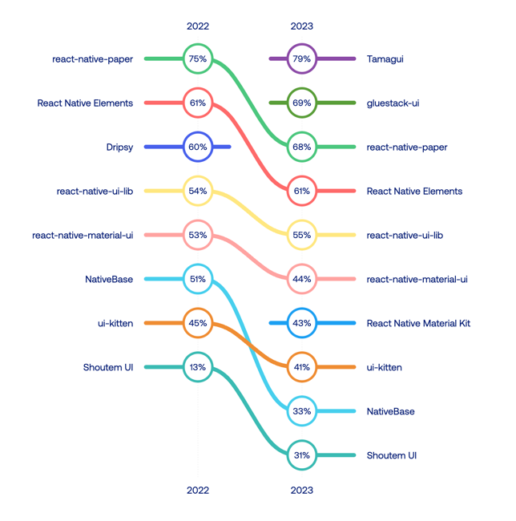
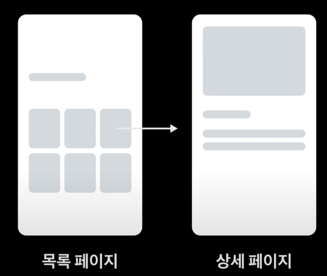
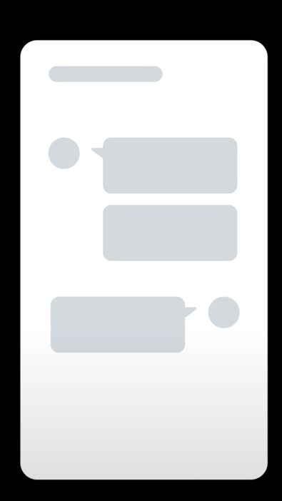
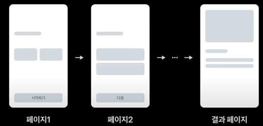

3월에는 1분기동안 진행중이던 챕터업무들을 목표했던 만큼 완료했고, 새로운 스쿼드로 합류하게 되었다. 1분기를 마치며 배운점들과 시행착오들, 새로운 스쿼드에서 느낀 점들을 정리해보려 한다.

## 💪 챕터업무 마무리하기

3월은 1분기동안 챕터 업무로 기획하고 담당하고 있던 작업들을 마무리하는 시간들이었다. 1월부터 진행했던 **App Start Time 줄이기** 작업과 **에러바운더리 적용** 작업을 기획했던 범위만큼 모두 완료할 수 있었다.

### 🚀 App Start Time 줄이기

App Start Time 줄이기 일감을 하면서 고민하고 적용했던 작업들을 따로 [회고](https://choi2021.github.io/2024-03-30-RN%EC%95%B1%EC%8B%9C%EC%9E%91%EC%B5%9C%EC%A0%81%ED%99%94/)로 작성했다.
3개월이라는 시간동안에 퇴근 후에도, 주말에도 계속해서 자료들을 찾아보고 적용해봤다. 정말 말그대로 자다가도 갑자기 생각나서 시도해보기도 할 정도로 최선을 다해서 작업했던 것 같다.
다행히 3월 내에 목표로 했던 **7초에서 4초 이내**로 줄여보자라는 OKR을 iOS/Android 두가지 플랫폼 모두 3.2초로 달성할 수 있어 뿌듯했다.

여기에 더불어 성능 개선 일감들을 담당하면서 몇초를 더 줄이고, 얼마나 더 빨라지는 것에 대한 성과가 항상 **개발자들만 이해할 수 있는 성과**로 남는 것은 아닐까하는 아쉬움이 있었다.
이러한 아쉬움은 이전 4분기에 진행했던 [견적발송 로직 개선작업](https://choi2021.github.io/2023-12-31-2023%EB%85%84-12%EC%9B%94%ED%9A%8C%EA%B3%A0/)을 진행하면서 처음 느끼게 되었는데, 견적을 발송하는데 걸리던 시간을 줄였다는 것에 뿌듯했지만, 작업에 대해 회사 사내 세미나에서 발표를 진행하고 자료를 정리하는 과정에서 내가 한 작업이 실제 우리 제품을 사용하는 **유저에게는 어떤 가치를 주었는지**에 대해서 명확하게 알기 어려웠다.

성능 개선은 제품을 사용하는 유저가 분명히 빠르게 "원하는" 동작을 할 수 있게 도와주지만, 그게 유저가 정말 원했던 것인지, 답답함을 느끼고 있는 부분이었는지를 이해하는 건 다른 문제다보니 성능개선을 하더라도 비즈니스적인 관점에서 더 접근해보고 싶었고, 분석하는 작업도 같이 진행해보고 싶었다.

이번 일감에서는 개인적으로 가려웠던 부분을 해결할 수 있었는데, 앱 시작화면에서 홈화면으로 5초 이내로 랜딩하는 유저 데이터를 함께 봤을 때 5% 상승하는 결과를 볼 수 있었다. 이를 통해 조금 더 **유저 중심적인 성능 개선**을 할 수 있었던 것 같다.

이후에도 미뤄두었던 후순위 작업들을 하나씩 진행하면서 더 나은 제품들을 만드는데 계속해서 기여해보려 한다.

### 🚑 에러바운더리 적용

23년 4분기에 제안하고 일감화하게된 에러 바운더리 작업을 진행했다. 에러바운더리를 적용하기 위해서 Fallback UI에 어떻게 보여줄지 정하기 위해 UX 리서처분과 플랫폼 디자이너분께 의뢰드려 공통 Fallback UI에 대한 디자인을 전달받을 수 있었다.
작업은 우선 런타임 에러가 발생했을 때, **재시도를 해도 해결되지 않는 경우**에 대한 Fallback UI를 만드는 작업을 먼저 진행한 이후에 각 스크린에 적용하게 되었고, 런타임 에러바운더리로 명명하게 되었다.

런타임 에러바운더리를 위한 공통 Fallback UI 컴포넌트를 만들면서 특히 신경썼던 부분은 에러 발생시 레이아웃과 스타일 변화가 최대한 없게 만들기 위해 노력했다.
그러기 위해서 **헤더 부분**이 중요했는데, 비록 유저가 이용중이던 화면은 이용할 수 없지만 앱을 껐다켜거나 하는 재시작 동작이 없어도, 다른 화면으로 진입하거나 **계속해서 제품을 이용할 수 있게** 하는 것을 중요하게 생각하고 작업했다.
기본 fallback UI에 헤더컴포넌트를 주입하는 방법 등을 고려해 작업했고, 약 70%의 화면들에 대한 작업을 완료할 수 있었다.

다음 분기에서 이어서 나머지 화면들에 대해 적용하고, 이후에는 런타임 뿐아니라 데이터 조회 API에서 발생하는 에러들을 다룰 때에도 분기문으로 되어있는 코드들을 에러바운더리를 적용해 선언적으로 작성할 수 있게 해보려 한다.

기존에는 화이트 스크린 에러가 발생했을 때, 최상단에서 잡히다 보니 정확한 흐름을 보기 위해서는 사용자 이용 패턴을 따라하는 방법에 많은 시간이 소요되었는데, 스크린 단위로 런타임 에러바운더리를 적용하고 나서는 정확히 어느 화면에서 **유저들이 어떤 에러를 겪고 있는지** 제보 받을 수 있어 더 좋았다.
이후에 에러바운더리를 제안하고, 적용했던 일감에 대해 정리해보려 한다.

### 🙌 새롭게 합류한 스쿼드

챕터업무를 마치고 3월 말부터는 새로운 스쿼드에 합류하게 되었다. 분명 작년에도 스쿼드에서 기능개발을 맡아서 진행해왔지만, 3개월 정도 챕터에서 작업을 하고 다시 돌아가고 나니 느낌이 새로웠다.

챕터업무는 하나의 OKR을 위해서 혼자서 고민하고, 혼자서 목표를 위한 일감들에 대한 계획을 짜고 진행했다면, 스쿼드는 OKR을 위해 혼자가 아니라 PO, PD, Data Analyst, QA, BackEnd Engineer, FrontEnd Engineer 다양한 동료들과 함께 의사소통해야 하다보니 완전히 다른 업무를 하게 되는 느낌이었다.
더불어 새롭게 합류한 스쿼드의 업무가 많아 나를 포함해 모바일 엔지니어가 두명인 상황으로 함께 하나의 스토리에 대해 일을 분배하고, 서로가 병목이 되지 않게 하는 것이 중요한 상황이 되었다.

달라진 업무환경에 적응하면서 서로간의 의사소통을 통해 정책 결정, 기술적인 결정 등을 진행해야하기에 조금 더 기술적인 용어대신 **조금 더 이해하기 쉬운 용어**로 표현하는 법에 대해 더 연습이 필요하겠다는 점을 느꼈고, 혼자 고민하기 보다 정책적인 결정을 위해 PO, PD분들과 이야기 하고, 기술적으로 고민이 될때 스쿼드 엔지니어 분들과 함께 고민할 수 있어서 혼자 일할 때보다 든든함을 느낄 수 있었다.

1년이 지난 지금, 기능개발에 있어서 이전과 조금 다른 시선을 갖게 된 것 같다. 1분기 동안 성능 개선 작업들과 여러 화면들에 대한 에러바운더리를 적용하면서 프로젝트 전반적인 코드들을 볼 수 있었다. 돌아보면서 내가 짠 코드였는데도 왜 이렇게 작성했는지 알 수 없고, 이후에 리팩토링할 수 있는 시간이 오면 해야지라 생각하며 미뤄뒀던 나의 TODO 주석들이 보이기도 했다.

내가 짠 코드들을 보면서 당시 아쉬운 코드를 작성할 수 밖에 없었던 변명같은 이유는 **기한 내에 완성하기**만을 목표로 작업했기 때문이었던 것 같다. "동작만하면 된거야"라는 생각과 **적당히** 덜어내고, 내가 모르는 도메인과 같이 사용하는 코드는 유지보수하기 어려우니까 그냥 **하나 더** 만들어버리는 등 시간에 쫓겨 기능을 개발하다 보니 부족한 부분이 많았던 것 같다.

부족했던 모습에서 더 성장하기 위해서는 기능개발의 가장 기본적인 **컴포넌트 설계**부터 좀 더 공부할 필요가 있어 보였다.
이를 위해서 이전에 봤던 컴포넌트 설계에 대한 자세한 예시와 인사이트가 잘 담겨있는 토스 slash 컨퍼런스의 [Effective Component 지속 가능한 성장과 컴포넌트](https://www.youtube.com/watch?v=fR8tsJ2r7Eg)를 다시 보며 정리하기 시작했고, 2023 RN 리서치에 정리되어 있는 React Native UI 라이브러리들을 돌아보며 확장성과 변화에 유연한 컴포넌트 설계방법을 공부하고 적용해보려 한다.

두번째로는 **UI 패턴별**로 최적화하는 방법들에 대해 정리해보려 한다. 이부분도 토스 slash 컨퍼런스의 [ 퍼널: 쏟아지는 페이지 한 방에 관리하기](https://www.youtube.com/watch?v=NwLWX2RNVcw&t=41s)를 통해 인사이트를 얻을 수 있었다.
해당 발표에서 총 세가지 UI 패턴,**상점, 단일 페이지, 설문조사**으로 소개하고 있고, 실제로 우리 제품에서 구현되는 UI들의 대부분이 세가지 패턴에 포함된다는 점을 알 수 있었다.

<table width="100%" >
    <tr>
        <th>상점(목록->상세)</th>
    </tr>
    <tr>
        <td>
            
        </td>
    </tr>
    <tr>
        <th>단일 페이지</th>
    </tr>
    <tr>
        <td>
            
        </td>
    </tr>
    <tr>
        <th>설문조사 패턴</th>
    </tr>
    <tr>
        <td>
            
        </td>
    </tr>
</table>

이렇게 UI 패턴을 묶을 수 있다는 것은 도메인과 요구사항들과 상관없이 **공통되게 적용할 수 있는 최적화 요소**들이 있고 이러한 부분들을 정리해놓는다면, 내가 담당하는 도메인이 달라져도, 좋은 코드를 작성할 수 있게다는 생각이 들었다.

이렇게 정리한 두가지 액션아이템들에 대해서 잘 정리해서 팀내에도 공유하고 적용하며 더 resourceful한 엔지니어가 되기 위해 노력해보려 한다.
