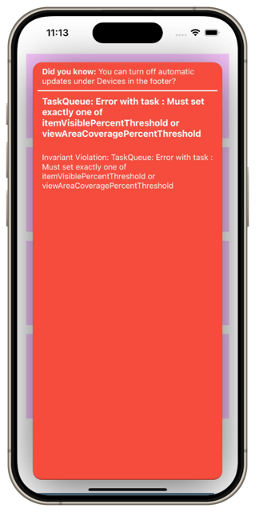
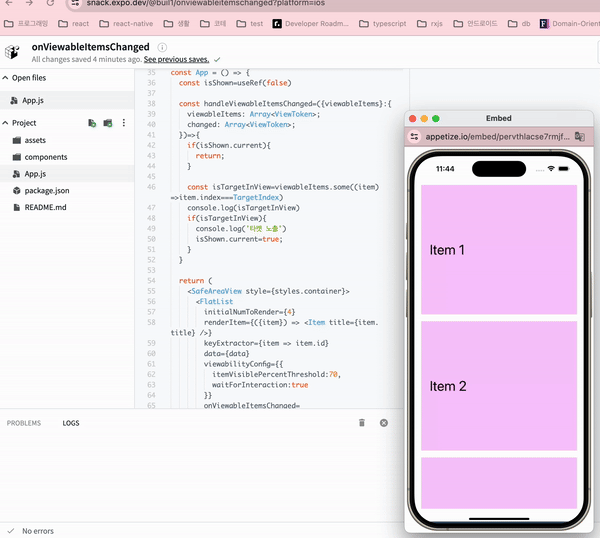
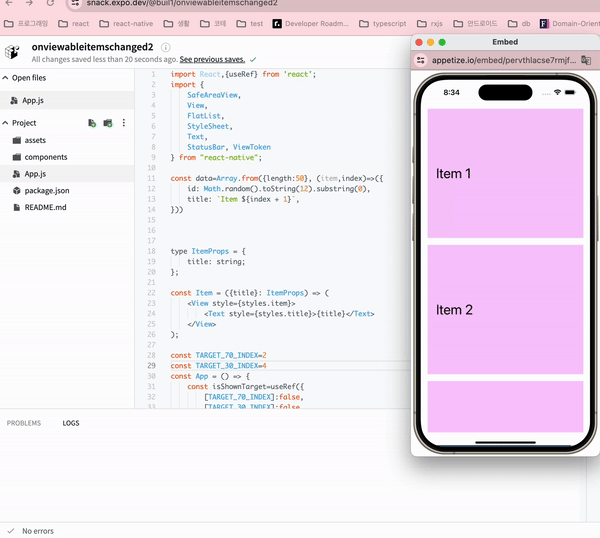

기능 개발을 하면서 목록의 **특정 아이템이 50% 노출되었을 때** 트래커가 발송시키는 요구사항을 받게 되었다. 이를 구현하는 과정에서 알게된 
FlatList의 `onViewableItemsChanged` prop에 대해 정리해보려 한다.

## 🤔 onViewableItemsChanged란?
[onViewableItemsChanged](https://reactnative.dev/docs/flatlist#onviewableitemschanged)는 RN의 FlatList에 전달할 수 있는 prop으로 FlatList가 스크롤에 의해 보여지는 아이템들(viewableItems)이 변경됨에 따라 호출되는 함수로
현재 viewableItems는 어떤 것이고, 변경된 items는 어떤 것인지에 대한 정보를 제공한다.

[onViewableItemsChanged의 타입 정의]
```typescript
onViewableItemsChanged?: ((
    info: { 
        viewableItems: Array<ViewToken>; 
        changed: Array<ViewToken> 
    }) => void) | null | undefined;

interface ViewToken {
    item: any;
    key: string;
    index: number | null;
    isViewable: boolean;
    section?: any;
}
```

이때 자주 함께 사용되는 config로 [`viewabilityConfig`](https://reactnative.dev/docs/flatlist#viewabilityconfig)를 통해 어떤 조건을 만족할 때 viewableItems로 설정할지에 대해 정할 수 있다.
config의 요소는 아래 4가지가 있다.

1. **minimumViewTime**: onViewableItemsChanged를 호출하기 전에 viewableItem으로 간주되기 위한 최소 시간
2. **viewAreaCoveragePercentThreshold**: viewport에 얼마나 아이템이 차지해야 viewableItem으로 여길지에 대한 최소 노출 비율
3. **waitForInteraction**: 사용자의 interaction을 기다릴지 여부
4. **itemVisiblePercentThreshold**: viewport 기준이 아니라 item 기준으로 viewableItem으로 간주되기 위한 최소 노출 비율

위 4가지 속성에 대한 타입은 아래와 같다.

```typescript

export interface ViewabilityConfig {
    minimumViewTime?: number | undefined;
    viewAreaCoveragePercentThreshold?: number | undefined;
    itemVisiblePercentThreshold?: number | undefined;
    waitForInteraction?: boolean | undefined;
}
```

viewabilityConfig를 전달하면 4가지 속성중에서 `viewAreaCoveragePercentThreshold`나  `itemVisiblePercentThreshold`는 필수값으로 설정되어야 한다. 해당 속성이 설정되지 않으면 
아래와 같은 에러가 발생한다.




## 🚀 onViewableItemsChanged 사용하기
그러면 이제 실제 onViewableItemsChanged를 사용하는 예시를 보자. 

### 요구사항 1. 처음 3번째 요소가 70% 노출되었을 때 콘솔 찍기
요구사항으로 처음 3번쨰 요소의 70% 노출되었을 때 콘솔이 찍히게 하려한다.

[[예시 코드 실행해보기](https://snack.expo.dev/@buil1/onviewableitemschanged)]
```tsx
import React,{useRef} from 'react';
import {
    SafeAreaView,
    View,
    FlatList,
    StyleSheet,
    Text,
    StatusBar,
} from 'react-native';

const data=Array.from({length:50}, (item,index)=>({
    id: Math.random().toString(12).substring(0),
    title: `Item ${index + 1}`,
}))


type ItemProps = {
    title: string;
};

const Item = ({title}: ItemProps) => (
    <View style={styles.item}>
        <Text style={styles.title}>{title}</Text>
    </View>
);

const TARGET_INDEX=2

const App = () => {
    const isShown=useRef(false)

    const handleViewableItemsChanged=({viewableItems}:{
        viewableItems: Array<ViewToken>;
        changed: Array<ViewToken>;
    })=>{
        if(isShown.current){
            return;
        }

        const isTargetInView=viewableItems.some((item)=>item.index===TARGET_INDEX)
        console.log(isTargetInView)
        if(isTargetInView){
            console.log('타켓 노출') // Tracker 찍기
            isShown.current=true;
        }
    }

    return (
        <SafeAreaView style={styles.container}>
            <FlatList
                initialNumToRender={4}
                renderItem={({item}) => <Item title={item.title} />}
                keyExtractor={item => item.id}
                data={data}
                viewabilityConfig={{
                    itemVisiblePercentThreshold:70,
                    waitForInteraction:true
                }}
                onViewableItemsChanged={handleViewableItemsChanged}
            />
        </SafeAreaView>
    );
};

const styles = StyleSheet.create({
    container: {
        flex: 1,
        marginTop: StatusBar.currentHeight,
    },
    item: {
        backgroundColor: '#f9c2ff',
        height: 300,
        justifyContent: 'center',
        marginVertical: 8,
        marginHorizontal: 16,
        padding: 20,
    },
    title: {
        fontSize: 32,
    },
});

export default App;
```

[실행 영상]



### 요구사항 2. 3번째요소가 50% 노출되었을 때, 5번째 요소가 30% 노출되었을 때 콘솔 찍기
여기에 조금 더 복잡하게 여러 노출 조건이 요구사항으로 왔을 때는 `viewabilityConfigCallbackPairs`를 이용할 수 있다.
`viewabilityConfigCallbackPairs`는 `viewabilityConfig`와 `onViewableItemsChanged`를 묶어서 전달할 수 있는 prop으로, 배열형식으로 전달할 수 있다.

[[예시 코드 실행해보기](https://snack.expo.dev/@buil1/onviewableitemschanged2)]
```tsx
import React,{useRef} from 'react';
import {
    SafeAreaView,
    View,
    FlatList,
    StyleSheet,
    Text,
    StatusBar, ViewToken
} from "react-native";

const data=Array.from({length:50}, (item,index)=>({
    id: Math.random().toString(12).substring(0),
    title: `Item ${index + 1}`,
}))


type ItemProps = {
    title: string;
};

const Item = ({title}: ItemProps) => (
    <View style={styles.item}>
        <Text style={styles.title}>{title}</Text>
    </View>
);

const TARGET_70_INDEX=2
const TARGET_30_INDEX=4
const App = () => {
    const isShownTarget=useRef({
        [TARGET_70_INDEX]:false,
        [TARGET_30_INDEX]:false
    })

    const handleViewableItemsChanged=({viewableItems}:{
        viewableItems: Array<ViewToken>;
        changed: Array<ViewToken>;
    },targetIndex:typeof TARGET_70_INDEX|typeof TARGET_30_INDEX)=>{
        if(isShownTarget.current[targetIndex]){
            return;
        }
        const isTargetInView=viewableItems.some((item)=>item.index===targetIndex)
        if(isTargetInView){
            console.log(`${targetIndex} 타켓 노출`)
            isShownTarget.current[targetIndex]=true;
        }
    }


    return (
        <SafeAreaView style={styles.container}>
            <FlatList
                initialNumToRender={4}
                renderItem={({item}) => <Item title={item.title} />}
                keyExtractor={item => item.id}
                data={data}
                viewabilityConfig={{
                    itemVisiblePercentThreshold:70,
                    waitForInteraction:true
                }}
                viewabilityConfigCallbackPairs={[
                    {
                        viewabilityConfig:{
                            itemVisiblePercentThreshold:70,
                            waitForInteraction:true
                        },
                        onViewableItemsChanged:(info)=> {
                            handleViewableItemsChanged(info, TARGET_70_INDEX)
                        }
                    }
                    ,{
                        viewabilityConfig:{
                            itemVisiblePercentThreshold:30,
                            waitForInteraction:true
                        },
                        onViewableItemsChanged:(info)=> {
                            handleViewableItemsChanged(info, TARGET_30_INDEX)
                        }
                    }]}
            />
        </SafeAreaView>
    );
};

const styles = StyleSheet.create({
    container: {
        flex: 1,
        marginTop: StatusBar.currentHeight,
    },
    item: {
        backgroundColor: '#f9c2ff',
        height: 300,
        justifyContent: 'center',
        marginVertical: 8,
        marginHorizontal: 16,
        padding: 20,
    },
    title: {
        fontSize: 32,
    },
});

export default App;
```

[실행 영상]



## 📚 마무리
만약에 onViewableItemsChanged를 이용하지 않고 특정 요소의 영역이 노출되었을 때를 확인하려면 Viewport높이, 요소의 위치, scroll offset 위치를 직접 계산해서 확인해야 한다.
다행히 RN에서는 내장된 prop으로 이를 자체적으로 계산해주기 때문에 편리하게 사용할 수 있다.

조금 더 자세한 under the hood 내용은 [Understand onViewableItemsChanged in FlatList](https://suelan.github.io/2020/01/21/onViewableItemsChanged/)을 참고할 수 있다.
