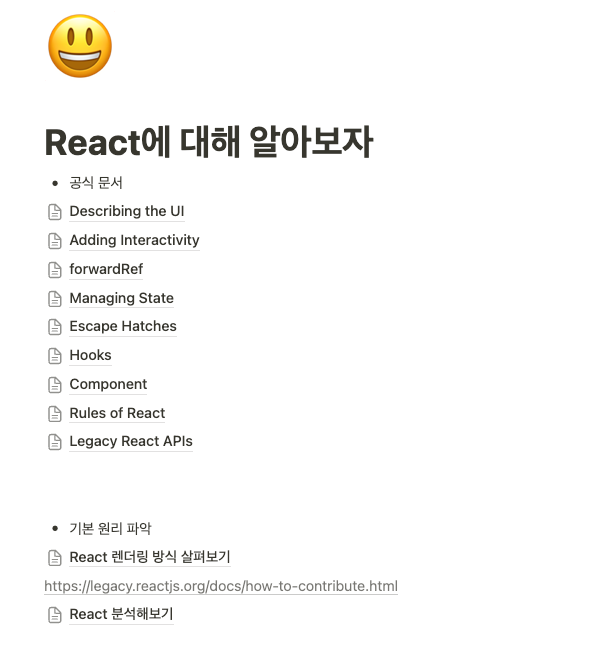

4월은 바빴지만, 내안에 "어떤게 맞는걸까, 내가 잘하고 있는걸까" 하는 고민이 많았던 한 달이었다.
3월 달의 하기로 했던 것들 중 얼마나 했는지에 대해 정리해보고 4월에는 어떤 것들을 했는지 또 어떻게 하면 더 나은 개발자가 될 수 있을지 정리해보려 한다.

## 💪 3월 회고 돌아보기

[3월 회고](https://choi2021.github.io/2024-04-07-2024%EB%85%84-3%EC%9B%94%ED%9A%8C%EA%B3%A0/)때 마음먹었던 것들은 아래와 같이 정리할 수 있다.

- App Startup Time 줄이기 때 하지 못한 일감 후속 작업 진행하기
- 에러바운더리 적용하고 과정에 대한 글쓰기
- 스쿼드 내 소통할 때 적극적으로 소통하기, 기술 용어 대신 이해하기 쉬운 용어로 표현하기
- 컴포넌트 설계에 대한 공부하기
- UI 패턴별 최적화하는 방법에 대해 정리하기

위 다섯가지에 대해 4월 한달동안 어떘는지 개인적으로 생각해보려 한다.

### 1. App Startup Time 줄이기 후속 작업

[App Startup Time 개선 작업](https://choi2021.github.io/2024-03-30-App-StartUp-time-%EA%B0%9C%EC%84%A0/)을 잘 마무리하고 당시 미뤄뒀던 후속작업들을 진행하겠다고 3월에 다짐했었다.

다행히 다음 챕터 업무로 **화면 전환간 성능을 개선**을 담당하게 되었다. 그 방법으로 `Native Stack`을 적용하는 작업을 메인으로 진행하고 있다.
우리 제품은 React Navigation을 이용해 라우팅, 화면전환을 구현하고 있는데, 성능 측정을 위한 자체 Custom Stack Navigation을 만들어서 적용하고 있다.

이를 제거하고 React Navigation의 `Native Stack`을 적용하면서 JS 스레드를 이용한 화면전환이 아니라 Native 스레드를 이용해 화면 전환간 성능을 개선할 수 있을 것이라고 생각했다.
이뿐 아니라 기존 화면 전환간 문제가 될 수 있을 만한 부분들을 찾아보고 아이디어를 떠올리고 있다.

조금 아쉬운건 화면전환 작업은 순간적으로 일어나는 부분이기 때문에 측정에 어려움이 있고, 동일 기기에서 직접 영상으로 비교해보려 하는데, 그것 또한 큰 의미가 있는 것인지 의미를 찾기 어려워 보인다.

만약 조금 더 측정을 해보려한다면 네트워크 의존이 적은 화면에 대한 E2E 테스트 코드를 작성하거나, 앱을 사용하는 흐름에서 화면전환되는 순간의 CPU, 메모리, FPS가 떨어지는 정도를 비교해보는 방법이 좋아 보여 우선 측정 방법을 계속해서 고민해보고 있다.

### 2. 에러바운더리 제안 및 적용하는 과정에 대한 글쓰기

3월에 이어 4월도 에러바운더리를 적용하는 작업을 진행하게 되었다. 3월까지는 작년 4분기 작업 전에 조사했던 화면들에 대한 기준으로 작업을 진행했고, 그사이에 새롭게 추가되고 수정된 화면들에 대한 반영이 되어 있지 않았기 때문에 4월에 작업을 시작하면서는 현재의 기준으로 조사가 먼저 필요했다.

ChatGPT 덕분에 기존 정리해둔 데이터에 새롭게 추가된 데이터를 합친 새로운 테이블을 만들 수 있는 Script를 작성해, 현재 기준 제품 내에는 총 256개 화면이 존재하고 그중 **108개** 화면(42%)에 대한 작업이 필요하다는 것을 알 수 있었다.

분명 3월에 정리했을 때는 작년 4분기 조사한 화면들 기준으로 262개중 **84개**(33%)의 화면이 남아있었는데 다시 정리하니 달라진 것이다. 이렇게 정리하고 나니 단순히 열심히만 해서는 영원히 끝나지 않을 작업이라는 생각이 들었다.
구멍난 독에 물붓기처럼 구멍을 손으로 막으면서 물을 부었을 때 어느정도 차긴 하겠지만, 새로운 화면들은 생기고, 필요없는 화면들은 제거되게 되면서 끝이 없는 작업이라는 것을 느꼈다.

이를 해결하기 위해서는 단순히 새롭게 추가하는 게 다가 아니라 챕터내 공유를 통해 다시 한 번 왜 필요한지, 어떤 효과가 있는지 공유해, 다같이 노력해야 해결할 수 있는 방법이란 생각이 들었다.

그리고 이렇게 챕터 구성원들이 함께 노력해주시기를 요청하는 동시에 조금 더 쉽게 적용할 수 있는 방법은 없을지 고민이 필요해 보였다. 최상위 컴포넌트인 Screen 컴포넌트 내부로 옮겨서 적용할지 등 기존 작업을 돌아보면서 최대한 쉬운 방법을 고민해보려 한다.

이러한 시행착오들을 잘 정리해서 6월정도에는 글을 써보려한다.

### 3. 스쿼드 내 소통 방식에 대한 노력

3월부터 합류한 스쿼드 내에서 다양한 작업을 진행하게 되었다. 신사업 담당 스쿼드이다 보니 다른 회사와의 협업을 하거나 빠르게 테스트하거나 중간에 다른 일들이 많이 들어오는 상황에서 의사소통이 좀 더 중요하게 느껴졌다.

이번달 주요 작업중 하나였던 쿠팡 광고 연결작업을 진행하면서 쿠팡 광고 상품 클릭시 앱이 설치되면 쿠팡 앱으로 진입 후 광고상품에 랜딩하게 되고, 앱이 설치되어 있지 않으면 모바일 웹을 통해 광고상품에 랜딩시키는 작업을 진행했다.

이때 iOS, Android에 따라 쿠팡 광고에 랜딩할 때 기존 기획과 다른 부분들이 있었고, 이런 기획과 다른 부분들을 정리해서 스쿼드에 공유하는 등, 실제 구현과정에서 예상과 다를 수 있는 부분들을 적극적으로 공유하려 노력했다.

또한 유저 데이터를 측정하기 위한 트래커의 경우에도 PO, Data 엔지니어분께서 설계해주셨을 떄 실제 적용할 때 어떤 요소가 있으면 좋을지, 더 좋은 방법은 없을지 적극적으로 소통하기도 했다.

여전히 기술적인 요소에 대해 설명할 때 어려움이 있는 것 같다. 단순히 된다/안된다 두가지로 나눠서 이야기하는 게 아니라 이해할 수 있게 잘 설명하는 방법들을 계속 연습해가야 겠다는 것을 느꼈던 한달이었다.

### 4. 컴포넌트 설계에 대한 공부하기

스쿼드 기능 개발을 하면서 컴포넌트 설계에 대해서 많이 고민하고 작업했다.
기존과 다른 요구사항이 생겼을 때 어떻게 하면 변화에 유연하게 개발할 수 있을지, 고민하는 과정은 시간이 더 많이 들었지만, 데이터와 UI와 분리한 뒤에 재사용하기 편한 인터페이스로 개선하는 작업을 진행하면서 하나씩 더 사용하기 좋은 컴포넌트에 대한 개념을 잡아가고 있다.

3월 회고 떄 말했던 UI 라이브러리들을 참고해서 조금 더 확장성있게 컴포넌트를 만드는 건 아직 적용하지 못했다. 대신 기능 개발 과정에서 병목이 되었던 컴포넌트 하나를 정해서 리팩토링 작업을 계획하고 컴포넌트 설계와 관련된 강의들을 참고해 적용해보려한다.
이과정을 정리해서 주간 미팅 시간에 팀원들과 함께 공유해도 좋을 것 같다.

### 5. UI 패턴별 최적화하는 방법에 대해 정리하기

UI 패턴별 최적화하는 방법에 대해 정리하기는 아직 시작하지는 못했다. 대신 4월 한달간 가장 많이 본 패턴을 정리해보면 목록 -> 상세로 연결되는 화면들로 이루어진 **상점 패턴**이었다.

React Native에는 ScrollView, FlatList, SectionList 등 다양한 리스트 컴포넌트들이 있고, 컴포넌트 자체 Prop이 지원하는 요소들을 공식문서를 기반으로 구현하려 노력했다.

예를 들어 목록의 특정 요소가 노출되었는지를 감지하는 방법인 FlatList의 `onViewableItemsChanged`를 이용하는 방법을 정리해 [간단한 글](https://choi2021.github.io/2024-04-21-onViewableItemsChanged-%EC%9D%B4%ED%95%B4%ED%95%B4%EB%B3%B4%EA%B8%B0/)을 작성했고,
우리 제품내에서도 처음 사용하게 된 prop이라 공유하면 좋을 것 같아 주간 미팅에서 발표를 하기도 했다.

아직 부족해 한번에 UI 패턴 별 최적화 방법을 정리하지 못했지만 하나하나 계속해서 정리해나가려 한다.

## 🚀 4월에 고민을 시작한 일감 및 공부

4월과 다르게 새롭게 고민을 시작한 일감들에 대해 정리하면서 5월에는 어떤 일을 진행할 지 계획해보려 한다.

### 선언적으로 로그인 필요화면 다루기

기능 개발을 하면서 로그인이 되어있는 유저만 진입가능한 화면들에 대한 작업하게 된다. 그경우 로그인을 했는지 안했는지를 스크린 내부에서 계속해서 고민하면서 개발해야하다 보니 분기문이 늘어나는 것을 느끼게 되었다.
만약 스크린 상위에서 HOC로 로그인이 되었는지 확인한 후에 하위에서는 무조건 로그인 되어있는 경우로 생각해서 작업할 수 있다면 조금 더 관심사를 잘 분리할 수 있지 않을까 생각이 들었다.

React의 Protected Route처럼 RN에서 구현할 수 있는 방법을 고민해보려 한다.

### 진입점에 대한 분기문 덜어내기

에러바운더리 작업을 진행하면서 해당 화면에 진입한 진입점에 따라 다른 결과를 실행시키는 코드를 간혹보게 되었다.
예를 들어 공통 휴대폰 인증화면이 있다고 하면 고객 홈에서 들어왔을 경우에는 인증 실패시 고객홈으로 돌아간다면, 커뮤니티에서 진입한 경우에는 토스트를 띄워줄 수 있다.

이렇게 진입점마다 달라지는 코드가 해당 화면에 존재하게 되었을 때 두가지 문제점이 있다고 생각이 들었다.

먼저 해당 진입점의 변화가 생겼을 때 대처가 어렵다. 만약 진입점의 이름이 바뀌거나 해당 화면이 제거되었을 때에도 분기문이 진입점 이름에 따라만 정의되고 있어서 해당 케이스가 제거/변경에 누락되는 케이스가 발생할 수 있다.

두번쨰로는 진입점에 따라 해당 화면 내부 코드가 분기문으로 인해 복잡해진다. 만약 앞선 예제처럼 인증 실패시에 대한 부분에 대한 정의가 필요하다면 해당 실패를 위한 callback을 전달하는 게 더 좋은 코드이지 않을까 생각이 들었다.

이부분도 정리해서 주간 미팅에 공유해보려 한다.

### React 분석해보기

개인적으로 공부하고 있는 부분은 2월부터 계속해서 매일 리액트 공식문서의 한챕터씩 정리해보고 있다. 이제 거의 마무리되어서 다음 단계로 리액트 내부 코드들을 까보면서 각 요소가 직접 어떻게 동작하는지,
리액트의 특징이 어떻게 구현되어 있는지에 대해 공부해보려 한다.

리액트에 대해 더 잘 이해하게 되는 것도 좋지만, 정말 많은 사람들이 사용하는 라이브러리 코드를 보면서, 어떤 코드가 좋은 코드인지 이해하는 좋은 기회가 될 것 같다.

## 📚 마치며

이번 회고는 3월 회고때 했던 다짐들을 잘 지켰는지, 새로운 고민을 시작한 일감들에 대해서도 함께 정리해보았다.
말만 하고 실행하지 않는 것을 막기 위해 매달 회고를 이전 달의 다짐과 비교해보는 것도 좋은 방법이라고 생각이 들었다.

매달 쓰고 있지만 이렇게 정리하면서 다시 한번 내가 어떤 개발자가 되고 싶은지, 어떤 부분을 더 공부해야 하는지, 어떤 부분을 더 신경써야 하는지에 대해 다시 한번 생각해보는 시간이 되는 것 같다.

5월은 쉬는 날이 많다. 이것을 기회로 더 많이 개인공부를 많이 늘려서 회사에서 더 많은 것을 공유할 수 있는 개발자로 나아가는 한달이 되길 바라본다.
