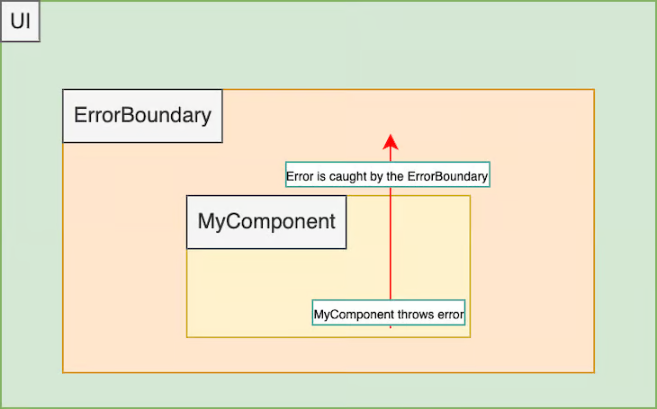
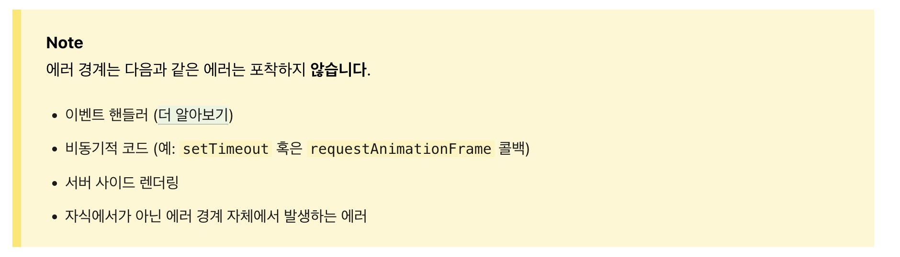
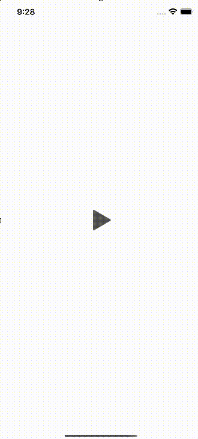
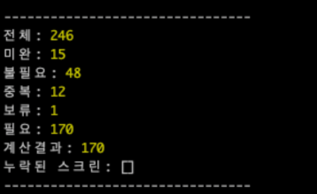

에러바운더리 작업을 작년 2023년 11월에 챕터 주간미팅에서 발표한 후에,24년 1월부터 5월까지 총 5개월동안 작업을 담당하고 제품 내 전체 스크린에 적용을 완료했다.

해당 일감의 목표는 런타임 에러로 인한 **화이트스크린 이슈**를 방지하는데 있다. 이를 위해 **스크린 단위**로 런타임 에러를 감지하고 fallback UI를 노출할 수 있게 에러바운더리를 적용했다.
에러바운더리가 무엇인지, 어떤 장점과 한계점이 있는지, 그리고 적용과정에서 어떤 점들을 고려했는지 정리해보려 한다.

## 🤔 에러바운더리란
에러바운더리는 react 16에 도입된 개념으로 UI 렌더링 과정에서 발생한 자식 컴포넌트 트리에 에러를 발생했을 때, 상위로 에러를 던지지지 않고 fallback UI를 보여주는 컴포넌트다. `에러 상태를 담당해주는 Context`로 이해할 수 있다.


[에러 바운더리를 시각화한 그림 ([참조. Logrocket 에러바운더리 글](https://blog.logrocket.com/react-error-handling-with-react-error-boundary/))]



에러바운더리는 기본적으로 클래스 컴포넌트로 작성되며 아래 코드를 통해 4가지 정보에 대해 알 수 있다.


[에러 바운더리 컴포넌트]

```jsx
class ErrorBoundary extends React.Component {
  constructor(props) {
    super(props);
    this.state = { hasError: false };
  }

  static getDerivedStateFromError(error) {
    // Update state so the next render will show the fallback UI.
    return { hasError: true };
  }

  componentDidCatch(error, errorInfo) {
    // You can also log the error to an error reporting service
    console.log(error, errorInfo);
  }

  render() {
    if (this.state.hasError) {
      // You can render any custom fallback UI
      return <h1>Something went wrong.</h1>;
    }

    return this.props.children; 
  }
}

// Usage in a component
class App extends React.Component {
  render() {
    return (
      <ErrorBoundary>
        <MyComponent />
      </ErrorBoundary>
    );
  }
}
```

1. `this.state`: 에러상태를 가지는 컴포넌트
2. `getDerivedStateFromError`: 렌더링 에러가 발생했을 때, 에러상태를 변경해 fallback UI가 보이도록 업데이트
3. `componentDidCatch`: 에러가 발생했을 때, 버그 리포팅하는 등 수행할 callback을 등록
4. `render`: 에러발생시 조건부 렌더링을 이용해 미리 정의한 fallback UI가 노출

사용할 때는 예시 코드의 App 컴포넌트 처럼 우리가 원하는 컴포넌트를 감싸주면 된다.


### 에러바운더리의 장점과 한계

그러면 에러바운더리가 가지는 장점은 아래의 두가지로 정리할 수 있다.

1. 사용자 경험의 향상 (UX👆): 자식 컴포넌트 렌더링 에러가 최상위로 올라가 화이트스크린으로 이어지지 않게 막아준다.
2. 개발자 경험의 향상 (DX👆): 에러상태를 위임해 에러를 선언적으로 핸들링 할 수 있다.

이러한 장점을 가진 에러바운더리지만 아쉽게도 다음과 같은 에러들은 감지할 수 없다.

[리액트 공식문서에서 작성된 에러바운더리의 한계점]




#### 내가 만들었던 에러

에러바운더리는 위와 같은 한계점을 가지고 있고 `런타임에러나 렌더링 에러가 얼마나 자주 발생하겠어?`라는 생각이 들 수 있다.
실제로 개발을 하면서 제품내 발생했던 런타임 에러에 대한 해당 예제로 런타임 에러가 발생할 수 있는 상황에 대해 알아보자.

예시 요구사항은 회원가입 과정에 대한 개선 작업으로, 총 4개의 화면을 3개로 줄이는 작업을 진행하려한다.이때 작성된 데이터들은 임시로 저장하고 저장된 데이터가 있다면 재진입시 불러올 수 있어야 하고 기존 진행했던 step(pageIndex)에 따라 데이터를 불러온다. 

새롭게 줄인 화면에서는 임시저장된 데이터를 가져올 때 3번째 화면을 마지막으로 생각하면 되기때문에 이전 데이터를 가져올 때, index가 3을 넘어가면 에러를 던지도록 작성해두었다.

```tsx

const 실험전_마지막페이지 = 4;
const 실험후_마지막페이지 = 3;

let AsyncStorage의_마지막페이지 = 실험전_마지막페이지;// 예시로 AsyncStorage를 let으로 작성했다.

const getDataFrom = (index: number) => {
    switch (index) {
        case 1:
            return { title: '페이지1', content: '페이지1의 내용' };
        case 2:
            return { title: '페이지2', content: '페이지2의 내용' };
        case 3:
            return { title: '페이지3', content: '페이지3의 내용' };
        default:
            throw new Error('없는 페이지입니다.'); // 실험 후 마지막 페이지는 3이니까 3보다 큰값은 안 들어올거야
    }
};

function ScreenThrowingError() {
    const [index, setIndex] = React.useState(1);
    const pageData = getDataFrom(index);

    const handlePress = () => {
        if (실험후_마지막페이지 === index) {
            return;
        }
        setIndex(index + 1);
    };

    useEffect(() => {
        const AsyncStorage의_데이터불러오기 = true;
        if (AsyncStorage의_데이터불러오기) {
            setIndex(AsyncStorage의_마지막페이지);
        }
    }, []);

    return (
        <View style={{ flex: 1, justifyContent: 'center', alignItems: 'center' }}>
            <View>
                <PagerView data={pageData} />
            </View>
            <TouchableOpacity style={{ position: 'absolute', bottom: 12 }} onPress={handlePress}>
                <Text style={{ fontSize: 32, color: 'teal' }}>{`다음페이지`}</Text>
            </TouchableOpacity>
        </View>
    );
}
```


위와 같은 상황의 코드를 시뮬레이터에서 동작시켜보면 다음과 같이 화이트 스크린 에러가 발생하게 된다.
원인은 이전에 최대 index를 4로 설정해두었는데, 이후 3으로 줄인 상황에서 4번째 페이지 데이터를 불러와야 하기 때문이다.




<br/>

이렇게 화이트 스크린이 발생하는 상황에서 앞서 작성한 에러바운더리를 적용하면 다음과 같이 코드를 작성할 수 있다.

```tsx
export class ErrorBoundary extends React.Component<{ hasError: boolean }> {
    constructor(props: { children: ReactNode }) {
        super(props);
        this.state = { hasError: false };
    }

    static getDerivedStateFromError() {
        return { hasError: true };
    }

    componentDidCatch(error: Error) {
        // bugsnag.notify(error);
        console.log(error);
    }

    render() {
        if (this.state.hasError) {
            return (
                <View style={{ justifyContent: 'center', alignItems: 'center', rowGap: 12 }}>
                    <Text style={{ fontSize: 32 }}>에러 발생 ☠️</Text>
                    <TouchableOpacity
                        style={{ borderColor: 'red', borderWidth: 1, padding: 10, borderRadius: 10 }}
                        onPress={() => {
                            AsyncStorage의_마지막페이지 = 실험후_마지막페이지;
                            this.setState({ hasError: false });
                        }}>
                        <Text style={{ fontSize: 30, color: 'red' }}>재시도 하기</Text>
                    </TouchableOpacity>
                </View>
            );
        }

        return this.props.children;
    }
}

function App() {
    return (
        <SafeAreaView style={{ justifyContent: 'center', alignItems: 'center', flex: 1, rowGap: 12 }}>
            <ErrorBoundary>
                <ScreenThrowingError />
            </ErrorBoundary>
        </SafeAreaView>
    );
}
```


결과는 동일하게 런타임 에러가 발생하지만 화이트 스크린은 발생하지 않고, 이전 페이지로 돌아가는 것을 볼 수 있다.


위 예제를 통해 에러가 발생했을 때 에러 상황 자체를 해결해 줄 수는 없지만, **앱을 종료하고 다시 실행해야하는 유저의 불편함**을 줄여줄 수 있는 에러바운더리의 장점을 잘 보여준다.


## 🚀 에러바운더리 적용하기
먼저 에러 바운더리를 적용하는 작업범위는 **스크린 단위**로 결정했고, 이를 위해 Route 컴포넌트에 있는 ScreenKey들을 조사했다. 
조사결과 24년 2분기 기준 246개의 스크린이 존재했고, 불필요하거나, 중복된 screenkey들을 제외하고 100% 적용을 목표로 작업을 진행했다.

### 작업 방식 
에러 바운더리의 동작방식은 1) 에러가 발생했을 때, 2) 에러를 잡아 fallback UI로 대신 보여준다. 동작방식을 고려한 적용규칙을 아래와 같이 세웠다.

#### 1. 스크린 최상단에 에러바운더리 적용하기
에러 바운더리의 영향범위를 최대한으로 넓히기 위해 화면의 **최상단에 두는 것**을 제 1원칙으로 삼았다. 

제품 내 코드를 분석해보면 스크린 컴포넌트에서는 데이터 패칭, 공통 상태 관리, 이벤트 버스 구독 등 다양한 로직을 담고 있었다.
이러한 상황에서 기존 스크린 컴포넌트에 그대로 에러바운더리를 적용하게 되면, 에러 경계 자체에서 발생하는 에러들이 발생했을 때 에러바운더리가 커버해 줄 수 없어 보였다.

이를 해결하기 위해서는 두가지 방법이 존재한다. 첫번째로 최상위에 에러바운더리로 감싸는 컴포넌트를 추가하거나, 두번째로 기존 컴포넌트를 유지하되 HOC로 에러바운더리를 적용하는 방법이 있었다.

```tsx
// AS-IS
function AScreen() {
    const [data, setData] = useState(null);
    useEffect(() => {
        fetchData().then((data) => setData(data));
    }, []);


    return (
        <Layout>
            <Header/>
            {data ? <AScreenContent data={data} /> : <Loading />}
        </Layout>
    )
}

// TO-BE 1. 컴포넌트로 감싸주기 

function AScreen() {
    return (
        <ErrorBoundary>
            <AScreenContainer />
        </ErrorBoundary>)
}

function AScreenContainer(){
    const [data, setData] = useState(null);
    useEffect(() => {
        fetchData().then((data) => setData(data));
    }, []);


    return (
        <Layout>
            <Header/>
            {data ? <AScreenContent data={data} /> : <Loading />}
        </Layout>
    )
}


// TO-BE 2. HOC로 감싸주기
function AScreen() {
    const [data, setData] = useState(null);
    useEffect(() => {
        fetchData().then((data) => setData(data));
    }, []);
    
    return (
        <Layout>
            <Header/>
            {data ? <AScreenContent data={data} /> : <Loading />}
        </Layout>
    )
}

export default withErrorBoundary(AScreen);
```

두가지 방법 중에서 내가 선택한 방법은 첫번째 최상위에 에러바운더리를 적용한 컴포넌트를 추가하는 방법을 이었다. 

최상위에 적용하게 되면 depth가 더 많아지지만, 선언적으로 코드를 작성하기 때문에 조금 더 읽기 편하다고 생각해 결정하게 되었다.
그리고 변경된 스크린 컴포넌트의 구현방식이 챕터원분들께 허들로 느껴지지 않게, 코드리뷰를 통해 자세히 설명하려 했고, 주간 미팅때 업무 진행 과정을 지속적으로 공유하면서 큰 문제없이 적용을 완료할 수 있었다.

#### 2. Fallback UI 디자인하기
에러 바운더리의 큰 장점 중 하나는 에러가 발생했을 때 미리 정해놓은 **fallback UI**를 보여줄 수 있다는 것이다. fallback UI를 구현할 때 가장 많이 고민했던 부분은 **화면의 레이아웃 변화 최소화하면서 해당 화면을 벗어날 수 있게 해주는 방법**이었다.
에러가 발생한 것 자체가 유저 입장에서 당황스러운 상황에서 화면이 많이 변경되거나, 화면을 벗어날 수 없다면 더욱 당황스러울 것이라고 생각했다.

이러한 디자인을 기획할 때 모바일 특성을 고려해 **헤더를 어떻게 처리할지**에 대해 많이 고민했다. 
제품 내 화면을 이동하는 방식은 tab, 바텀 버튼, 헤더가 있지만, 그중 대부분의 화면들이 **헤더**를 통해 화면을 이동하고 있기 때문에 헤더의 뒤로가기 버튼 또는 닫기 버튼을 통해 화면을 벗어날 수 있게 해주는 것이 중요했다.

이를 위해서 아래와 같은 prop 구성으로 에러바운더리 컴포넌트를 구현했다. 에러바운더리는 react-error-boundary 라이브러리를 이용해 적용했다.

- screen: 에러가 발생한 스크린에 대한 정보를 에러 리포팅에 전달하기 위한 prop
- fallbackHeader: 공통 헤더를 적용할 수 없을 때, 스크린별로 커스텀 헤더를 적용하기 위한 prop 
- style: 적용하는 스크린이 overlay가 있어 흰색이 아니거나 할 경우, 커스텀할 수 있는 prop


```tsx
type Props = {
    screen: 'AScreen'|'BScreen'|'CScreen'|'DScreen';
    fallbackHeader?: React.FunctionComponentElement<ScreenHeaderPropsInterface>;
    style?: StyleProp<ViewStyle>;
};
export const RuntimeErrorBoundary: React.FC<PropsWithChildren<Props>> = ({
    children,
    screen,
    style,
    fallbackHeader,
}) => {
    const handleError = useCallback(
        (error: Error, info: React.ErrorInfo) => {
            errorLogging.sendError({
                error: new Error('화이트 스크린 에러발생'),
                originalError: error,
                tag: ErrorTag.WhiteScreen,
            });
        },
        [screen],
    );
    
    const fallbackRender = useCallback(() => {
        return (
            <View style={[styles.container, style]}>
                {isNotNil(fallbackHeader) && fallbackHeader}
                <ErrorContent
                    title={'오류가 발생했습니다'}
                    content={'잠시 후 다시 시도해주세요'}
                />
            </View>
        );
    }, [fallbackHeader, style]);
    return (
        <ErrorBoundary fallbackRender={fallbackRender} onError={handleError}>
            {children}
        </ErrorBoundary>
    );
};
const styles = StyleSheet.create({
    container: {
        flex: 1,
    },
});
```

위 코드에서 ErrorContent 컴포넌트의 공통 UI는 화이트 스크린 에러는 재시도를 하더라도 해결되지 않기 때문에 `잠시 후 다시 시도해주세요`와 같은 안내 문구만 노출하게 구성했다.

바로 에러 상황을 해결해줄 수 없지만 에러 상황을 빠르게 제보받고 대처하기 위해 에러 리포팅 유틸을 onError 콜백함수로 연결해 `슬랙`채널을 통해 빠르게 제보받을 수 있게 했다. 

이렇게 구현한 에러바운더리를 스크린에 적용할 때는 헤더에 단순 navigation 로직이 담긴 경우, 헤더를 함께 최상위로 분리했고, 헤더에 회원가입 스텝이 변경되거나, 검색 text input이 있는 등 추가적인 로직이 담겨있는 경우에는 fallbackHeader를 적용해 별도로 적용할 수 있게 했다.

```tsx

// 공통 헤더를 사용하는 경우
function AScreen() {
    return (
        <Layout>
            <Header/>
            <RuntimeErrorBoundary screen={'AScreen'}>
                <AScreenContainer />
            </RuntimeErrorBoundary>
        </Layout>
    )
}

function AScreenContainer(){
    const [data, setData] = useState(null);
    useEffect(() => {
        fetchData().then((data) => setData(data));
    }, []);

    if(!data){
        return <Loading />
    }

    return (
        <AScreenContent data={data} />
    )
}

// 공통 헤더를 사용할 수 없는 경우
function BScreen() {
    return (
        <Layout>
            <RuntimeErrorBoundary
                screen={'BScreen'}
                fallbackHeader={<Header/>}
                style={{ backgroundColor: 'black' }}
            >
                <BScreenContainer />
            </RuntimeErrorBoundary>
        </Layout>
    )
}

function BScreenContainer(){
    const [data, setData] = useState(null);
    useEffect(() => {
        fetchData().then((data) => setData(data));
    }, []);

    return (
        <>
            <BHeader/>
            {data?<BScreenContent data={data} />:<Loading />}
        </>
    )
}
```

최대한 공통 헤더를 이용하려 했지만, 제품의 복잡도가 놀라갈 수록, 헤더의 로직이 복잡해져서 fallbackHeader를 사용하는 경우가 더 많아졌다.

적용하면서 부수 효과로 비동기 처리에 따른 로딩/에러/성공 UI들을 간단하게 정리하기도 했다. 이에 더 나아가 Suspense와 useErrorBoundary 훅을 이용해 선언적으로 비동기 분기문들을 처리하는 작업들도 함께 진행하고 싶었지만, 작업 목표가 전체 제품에 적용하는 것이기 때문에, 우선적으로 에러바운더리 적용에 집중했다.

적용한 후에 실제로, 제품 내 버그가 발생했을 때, 에러바운더리 덕분에 정확한 스크린 단위로 제보를 받아 빠르게 대응할 수 있었고, 유저들이 화이트 스크린을 보지 않고 해당 화면을 벗어나 앱을 이용해 유저 편의성을 개선할 수 있었다.


## 🙌 변화하는 제품 따라가기
24년 1분기에 작업을 시작하면서 작년 4분기에 에러 로그 분류작업을 정리했던 화면 데이터를 토대로 진행했다. 당연하게도 시간이 흐르면서 기능 개발 방향에 따라 새롭게 화면이 생기고, 필요없어진 화면은 제거되었다.

1분기 때 작업을 완료하는 시점에는 작년 4분기 데이터 바탕으로 전체 262개의 화면중 63개 화면 (24%)를 남겨두고 마무리되었다. 당시 나는 “다음 분기에 63개만 마저하면 되겠지”라고 생각했지만 2분기 작업 시작전에 다시 조사해보니 전체 화면은 262개에서 246개 화면으로 줄었고, 적용되지 않은 화면이 **63개에서 108개 화면으로** 늘어난 것을 알게 되었다.

1분기 작업 시작 기준이 작년 4분기 때 조사한 화면 기준이다보니 시간이 6개월 정도 시간이 지나면서 이러한 차이가 발생했지만, 앞으로도 제품의 방향에 따라 새로운 도메인, 새로운 화면들이 계속해서 추가되고, 또 필요없어진 화면들은 제거됨에 따라 적용되지 않은 부분들이 늘어나게 될 것이 예상되는 상황이었다.

이러한 문제를 해결하기 위해서 두가지 방법을 생각하고 적용해보았다.

### 1. 적용된 화면과 적용되지 않은 화면을 알기 위한 자동화 스크립트
작업을 마무리하면서 적용된 화면과 적용되지 않은 화면을 알기 위해 `자동화 스크립트`를 작성했다. 이 스크립트는 제품 내 모든 화면을 조사하고, 적용된 화면과 적용되지 않은 화면을 구분해주는 스크립트로 작업을 하면서 세웠던 규칙을 토대로 작성했다.

전체 화면의 기준은 [React Navigation](https://reactnavigation.org/)을 사용하면서 적용할 때의 규칙인 ScreenKey(key)와 Screen 컴포넌트(value) 구조를 이용해, 전체 ScreenKey를 기준점으로 이용했고, 각 화면들은 1) 적용된 화면, 2) 중복된 화면, 3) 보류 화면, 4) 불필요한 화면으로 분류했다. 

- 중복된 화면 (DuplicatedScreenKeys) : 같은 Screen에 modal/card 형식에 따라 두가지의 ScreenKey를 가지는 화면
- 보류 화면 (DelayedScreenKeys) : 제거가 예정되어 있거나, 사용 파악이 어려웠던 화면
- 불필요한 화면 (NotRequiredScreenKeys) : 개발 환경을 위한 화면이거나, 에러바운더리를 적용해도 큰 효용이 없어보이는 화면

각 분류에 대한 예를 들어 중복된 화면의 경우,프로필 상세화면의 경우 모달형식이냐 카드형식이냐에 따라 ProfileDetail과 ProfileDetailModal ScreenKey가 같이 사용되기 때문에 하나를 제외했다.

보류화면은 스쿼드 작업으로 인해 실험결과에 따라 제거 예정인 화면이거나, 특정 이벤트 화면의 경우 현재 사용되지 않지만 코드로만 남아있는 경우 보류화면으로 분류했다.

불필요한 화면은 개발 환경을 위한 화면이거나, Start 화면과 같이 에러가 발생했을 때 해당 화면을 벗어날 수 없고, 최상위 에러바운더리가 있기 때문에 불필요한 화면으로 분류했다.

이렇게 분류한 기준을 적용한 스크립트 코드는 아래와 같다.

```ts

// src/screens/index.tsx 내부 스크린 설정
type RootStackParamList={
    Start: undefined;
    Home: undefined;
    Login: undefined;
    Signup: undefined;
    Profile: { userId: string};
    ProfileModal: { userId: string};
    Feed: {feedId: string, userId: string};
    FeedModal: {feedId: string, userId: string};
    InviteEvent: {eventId: string};
    NotFound: undefined;
    OldRequest: {requestId: string};
}

enum ScreenKeyEnum {
    Start='Start',
    Home = 'Home',
    Login = 'Login',
    Signup = 'Signup',
    Profile = 'Profile',
    ProfileModal = 'ProfileModal',
    Feed = 'Feed',
    FeedModal = 'FeedModal',
    InviteEvent = 'InviteEvent',
    NotFound = 'NotFound',
    OldRequest= 'OldRequest',
}


// tsconfig.json 설정으로 프로젝트 생성
const project = new Project({
    tsConfigFilePath: 'tsconfig.json',
});

type ScreenKey = `${ScreenKeyEnum}`;

// 파일 경로
const SCREEN_KEY_ENUM_PATH = 'src/screens/index.tsx';
const SCREENS_DIR = 'src/screens';

const checkIsScreenKey = (screenKey: string): screenKey is ScreenKey => {
    const screenKeyEnumValues: ScreenKey[] = Object.values(ScreenKeyEnum);
    return screenKeyEnumValues.includes(screenKey as ScreenKey);
};

const filterScreenKeys = (keys: string[]): ScreenKey[] => {
    return keys.filter(checkIsScreenKey);
};

// RuntimeErrorBoundary 컴포넌트를 사용하는 파일을 찾기 위한 함수
const findFilesUsingRuntimeErrorBoundary = (dirPath: string): ScreenKey[] => {
    const screenKeys: string[] = [];
    const items = fs.readdirSync(dirPath, { withFileTypes: true });

    items.forEach((item) => {
        const itemPath = path.join(dirPath, item.name);
        if (item.isDirectory()) {
            screenKeys.push(...findFilesUsingRuntimeErrorBoundary(itemPath));
        } else if (item.isFile() && item.name.endsWith('.tsx')) {
            const sourceFile = project.addSourceFileAtPath(itemPath);
            const fileText = sourceFile.getText();
            if (fileText.includes('<RuntimeErrorBoundary')) {
                // 정규식을 사용하여 스크린 내부 RuntimeErrorBoundary 컴포넌트의 screen prop의 ScreenKeyEnum 값을 추출
                const regex = /<RuntimeErrorBoundary[^>]*screen\s*=\s*\{(ScreenKeyEnum\.\w+)\}/;
                const match = regex.exec(fileText);
                if (match != null) {
                    const screenValue = match[1];
                    const screenKeyRegex = /ScreenKeyEnum\.(\w+)/;
                    const screenKeyMatch = screenKeyRegex.exec(screenValue);
                    if (screenKeyMatch != null) {
                        screenKeys.push(screenKeyMatch[1]);
                    }
                }
            }
        }
    });

    return filterScreenKeys(screenKeys);
};

// ScreenKeyEnum enum의 key 값을 가져오는 함수
const getScreenKeyEnumKeys = (): ScreenKey[] => {
    const sourceFile = project.addSourceFileAtPath(SCREEN_KEY_ENUM_PATH);
    const keys: string[] = [];

    sourceFile.forEachDescendant((node) => {
        if (node.getKind() === SyntaxKind.EnumDeclaration) {
            if (node.getText().includes('ScreenKeyEnum')) {
                node.getChildrenOfKind(SyntaxKind.EnumMember).forEach((member) => {
                    keys.push(member.getName());
                });
            }
        }
    });

    return filterScreenKeys(keys);
};

const main = () => {
    const screenKeys = getScreenKeyEnumKeys();
    const screenKeysInScreenDir = findFilesUsingRuntimeErrorBoundary(SCREENS_DIR);
    const DuplicatedScreenKeys: ScreenKey[] = [
        ScreenKeyEnum.ProfileDetailModal, // ProfileDetail와 중복
        ScreenKeyEnum.FeedModal // Feed와 중복
    ];
    const DelayedScreenKeys: ScreenKey[] = [ScreenKeyEnum.OldRequest, ScreenKeyEnum.ModalRequestReview];
    const NotRequiredScreenKeys: ScreenKey[] = [ScreenKeyEnum.Start, ScreenKeyEnum.NotFound];

    const DoneArr = new Set([...screenKeysInScreenDir, ...screenKeysInComponentDir]);

    const AlreadyCheckedArr = new Set([...NotRequiredScreenKeys, ...DuplicatedScreenKeys, ...DelayedScreenKeys]);

    const requiredScreenArr = screenKeys.filter((screenKey) => !AlreadyCheckedArr.has(screenKey));
    const missingArr = requiredScreenArr.filter((screenKey) => !DoneArr.has(screenKey));

    // 결과 출력
    console.debug('--------------------------------');
    console.debug('전체:', screenKeys.length);
    console.debug('불필요:', NotRequiredScreenKeys.length);
    console.debug('중복:', DuplicatedScreenKeys.length);
    console.debug('보류:', DelayedScreenKeys.length);
    console.debug('필요:', requiredScreenArr.length);
    console.debug('계산결과:', DoneArr.size);
    console.debug('누락된 스크린:', missingArr);
    console.debug('--------------------------------');
};

main();
```

이제 해당 script를 package.json의 script로 등록해두면, `npm run check-screen` 명령어로 전체 화면을 조사하고, 적용된 화면과 적용되지 않은 화면을 알 수 있게 된다.



현재 script에 개선할 부분이 많이 있지만 우선 적용되지 않은 화면을 알 수 있게 되어, 이후 작업을 진행할 때 더욱 효율적으로 작업할 수 있게 되었다.

이후 github action으로 연결해 CI 과정과 연결해 master에 병합될 때마다 주기적으로 체크하는 작업도 진행할 수 있을 것 같다는 생각이 들었다.

### 2. 스크린 파일 생성 script에 에러바운더리 적용하기
챕터 동료분께서 주신 아이디어로 나는 몰랐지만 챕터내 많은 분들이 스크린 생성 스크립트를 이용해서 새로운 화면을 생성한다는 것을 알게 되었다.
새로운 화면을 만들기 위해서는 RootStack.Navigator안에 RootStack.Screen 컴포넌트를 추가하고 해당 컴포넌트에 대한 ScreenKey를 추가해야 한다. 

이를 자동으로 추가해주는 script가 기존에 존재해 여기에 에러바운더리를 추가해보기로 했다. 직접 추가하는 경우에는 당연히 에러바운더리 코드를 작성해야 적용되겠지만 스크린 생성 script를 이용할 떄는 별다른 고민없이 적용될 수 있을 것 같다는 생각이 들었다.
기본 형식은 아래처럼 정하게 되었다.

```tsx
import React from 'react';
import Screen from '@component/Screen'; 
import { Text, View } from 'react-native';
import { ScreenKeyEnum } from '@screen/index';
import ScreenHeader from '@component/ScreenHeader';
import { RuntimeErrorBoundary } from '@component/RuntimeErrorBoundary';
import Screen from '@component/Screen';
        

export function FooScreen() {     
    return (
        <Layout>
            <ScreenHeader title={''} />
            <RuntimeErrorBoundary screen={ScreenKeyEnum.Foo}>
                <${screenName}Content />
            </RuntimeErrorBoundary>
        </Layout>
    );
} 

function FooContent() {     
    return (
        <View>
            <Text>bcg</Text>
        </View>
    );
};
```

역시 혼자 고민하기 보다 함께 고민할 때 더 좋은 해결책을 얻을 수 있다는 것을 알게 되었고, 앞으로 새롭게 스크린들이 추가될 때 편하게 적용할 방법에 대한 고민을 해결할 수 있었다.
 

## 📚 마치며
하나의 기술을 알게 되고 적용하는 것은 쉽지 않은 일이다. 단순히 하나의 컴포넌트를 만들고 기존 컴포넌트에 적용하는 작업이라 생각했지만 이과정에서 많은 고민과 시행착오가 있었다.
어떻게 하면 최대한 기존 코드 컨벤션을 깨뜨리지 않으면서 적용해 동료분들의 학습 곡선을 최소화할 수 있을지, 어떻게 하면 더 효율적으로 작업을 진행할 수 있을지 고민하고, 이를 해결하기 위해 다양한 방법을 시도해보았다. 

횡단 관심사인 에러바운더리를 적용하면서 제품내 모든 화면들을 조사하면서, 제품 전체에 대한 이해도가 높아질 수 있었고, 5개월간 하나의 주제의 일감을 혼자 처음부터 끝까지 진행하면서, 일을 지치지 않고 진행하기 위해서는 적절한 단위로 끊어서 진행해야하는 일의 방식도 배울 수 있었다.

또 좋은 제품을 만들기 위해서는 혼자서 일하는 게 아니라 동료와 함께 고민하고, 함께 공유하며, 함께 성장해야 한다는 것을 다시금 깨달았다. 이번 작업을 통해 앞으로도 함께 성장하며 좋은 제품을 만들어 나가고 싶다. 
