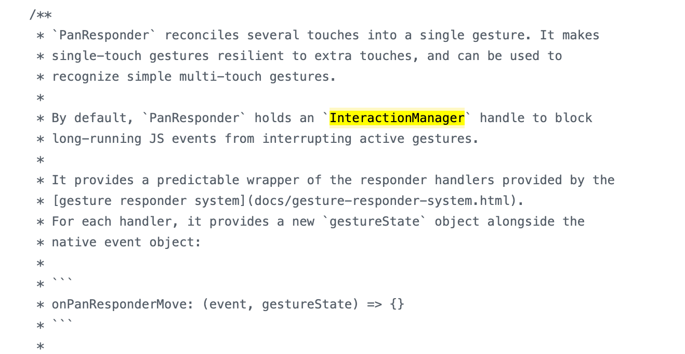
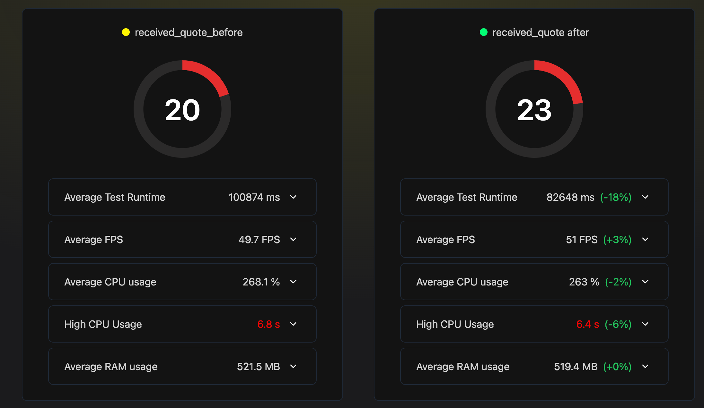

2분기를 마무리하면서 6월 한달 간 진행했던 스쿼드 업무, 챕터 업무 및 5월달의 action item들을 정리해보고 다음 분기를 위해 어떤 부분들을 더 공부하면 좋을지 개선하면 좋을지 정리해보려 한다.

## 5월 회고 돌아보기
5월에 삼았던 action item들을 정리해보면 아래와 같다.

- 화면전환 간 성능 개선을 위해 Native Stack 도입 및 성능 분석방법 찾아보기
- 에러 바운더리를 조금 더 챕터원들이 쉽게 적용하는 방법 고민해보기
- 컴포넌트 설계 정리
- 못했던 작업 진행해보기: 리액트 내부 코드 분석, UI 패턴별 최적화 정리해보기
- 3분기 일감 발제하기: 선언적으로 인증/인가 관리하기, Async Storage 대체하기

이중 리액트 내부 코드 분석은 Native Stack 적용을 위해 React Navigation과 React Native Screens 패키지를 분석하는데 시간을 쏟다보니 하지못했다. 
3분기 일감으로 생각했던 선언적으로 인증/인가 관리하기는 이보다 Native Stack을 적용하면서 여러 퍼널들을 겪으면서 화면전환간 로딩을 개선하는게 조금 더 유저경험에 도움이 될 것 같아 미루게 되었다. 
대신 Async Storage를 mmkv로 대체하는 일감은 챕터업무로 발탁되어 3분기에 담당자로 진행하게 되었다.

이제 5월의 action item들을 진행했던 6월의 작업들을 정리해보자.

## 6월의 작업들
### 🚀 Native Stack 적용하기
React Navigation의 [Stack Navigator](https://reactnavigation.org/docs/stack-navigator)에서 [Native Stack Navigator](https://reactnavigation.org/docs/native-stack-navigator)를 적용해 화면전환간 성능을 개선하는 작업으로 6월 26일 배포되면서 마무리하게 되었다.
원래 배포는 6월 12일로 예정되어 있었지만, QA과정에서 애니메이션이 끊기는 이슈와 gesture handler로 사진을 끌어당겨 닫은 이후에, 요청서 화면에서 10개의 질문만 렌더링되는 이슈가 있어 롤백하게 되었는데 해당 이슈를 해결하고 다시 배포하게 되었다.
해당 이슈들에 대해 간단하게 정리해보려 한다.

#### 애니메이션 끊김 이슈
애니메이션이 끊겼던 이슈는 overlay가 있는 회원가입 안내 모달 화면에서 발생하게 되었다. 해당 화면은 transparent modal로 되어있었는데 Card로 된 다음 화면으로 전환할 때 애니메이션이 끊기는 듯한 현상이 나타났다.

이를 해결하기 위해서 transparent modal 대신 바텀 시트를 사용해 화면을 구현하는 방식으로 수정했고, 해당 이슈를 통해 Native Stack에서 transparent modal의 경우 다음 화면이 어떤 것인지에 따라 애니메이션이 끊겨보일 수 있어, bottomTab이 있는 홈 화면이 아니면
바텀시트로 구현하는 것이 좋다는 것을 알게 되었다.

#### gesture handler로 사진 끌어당겨 닫기 이슈
이미지를 보고 끌어당겨 종료한 후에, 제품 내 메인 퍼널 중 하나인 요청서 작성화면에서 질문이 10개만 렌더링되는 이슈가 발생했다.
해당 이슈는 롤백을 하게 되는 가장 큰 이유가 된 이슈로, React Native의 Interaction Manager와 관련된 이슈였다.

이미지를 끌어당겨 종류할 수 있게 하기 위해 PanResponder로 구현했는데, PanResponder로 끌어당김 이벤트가 종료되는 시점에 navigation.pop을 진행하면서 StackNavigator에서는 발생하지 않았던 이슈가 Native Stack에서 발생했다.
해당 이슈를 해결하는 과정에서 FlatList로 구현된 요청서 작성화면의 요소가 Flatlist의 [initialNumToRender](https://reactnative.dev/docs/flatlist#initialnumtorender) prop의 default 값처럼 딱 10개만 항상 렌더링되는 것을 근거로 삼아 내부 코드를 확인해보게 되었다.

Flatlist는 VirtualizedList를 상속받아 구현되어 있고, VirtualizedList는 다음 목록을 가져오기 위해서 [Batchinator](https://github.com/facebook/react-native/blob/main/packages/virtualized-lists/Interaction/Batchinator.js)를 이용해 다음 목록을 받아오게된다.
이때 Batchinator는 InteractionManager를 이용해 InteractionManager.runAfterInteractions를 이용해 다음 목록을 받아오게 되는 것을 알게 되었다. 

[ [Batchinator 코드](https://github.com/facebook/react-native/blob/main/packages/virtualized-lists/Interaction/Batchinator.js)]
```typescript
class Batchinator {
  _callback: () => void;
  _delay: number;
  _taskHandle: ?{cancel: () => void, ...};
  constructor(callback: () => void, delayMS: number) {
    this._delay = delayMS;
    this._callback = callback;
  }
  /*
   * Cleanup any pending tasks.
   *
   * By default, if there is a pending task the callback is run immediately. Set the option abort to
   * true to not call the callback if it was pending.
   */
  dispose(options: {abort: boolean, ...} = {abort: false}) {
    if (this._taskHandle) {
      this._taskHandle.cancel();
      if (!options.abort) {
        this._callback();
      }
      this._taskHandle = null;
    }
  }
  schedule() {
    if (this._taskHandle) {
      return;
    }
    const timeoutHandle = setTimeout(() => {
      this._taskHandle = InteractionManager.runAfterInteractions(() => {
        // Note that we clear the handle before invoking the callback so that if the callback calls
        // schedule again, it will actually schedule another task.
        this._taskHandle = null;
        this._callback();
      });
    }, this._delay);
    this._taskHandle = {cancel: () => clearTimeout(timeoutHandle)};
  }
}

module.exports = Batchinator;
```

이미지를 끌어당겨 종료하기 위해 사용되는 PanResponder 또한 내부 적으로 InteractionManager를 이용하는데 이때 gesture 방해를 막기위해 JS 이벤트를 blocking하게 구현되어 있다.



이를 근거로 자세한 동작과 충돌 과정은 파악하지 못했지만 이미지를 끌어당겨 종료하는 이벤트가 발생 후 Interaction Manager가 blocking되어 FlatList의 InteractionManager가 동작하지 못하게 막아서 발생하는 이슈로 추측할 수 있었다.
그래서 Pan responder의 interaction 도중에 navigation.pop이 진행되게 하는게 아니라 Interaction이 모두 끝난 후에 진행되게 해 문제를 해결할 수 있었다.

```typescript
    const panResponder = useRef(
        PanResponder.create({
            ...,
            onPanResponderGrant: () => {
                // PanGesture가 완료되고 난 이후에 화면 이동을 동작시켜 InteractionManager간 충돌을 막습니다.
                InteractionManager.runAfterInteractions(() => {
                        navigation.goBack();
                });
            },
        }),
    ).current;
```

이렇게 두가지 추가 이슈를 모두 마친 이후에 6월 26일 배포를 진행하게 되었다.

#### 성능 분석하기
일감의 목표가 화면전환간 성능개선이었다보니, 어떻게 측정 기준을 잡아야할 지 막막함이 있었다. 왜냐하면 대부분의 상황에서는 JS 스레드에서 애니메이션을 진행하든 UI 스레드에서 애니메이션을 진행하든 큰 차이가 보이지 않을 것으로 예상되었기 때문이다.
어떻게 하면 수치적으로 나타낼 수 있을까 고민끝에 화면전환과 직접적으로 관련된 것은 아니지만 CPU와 메모리 사용량을 비교해보기로 했다.


측정방법은 [FlashLight](https://github.com/bamlab/flashlight)와 maestro를 이용한 e2e 테스트를 사용했다.FlashLight는 현재 안드로이드만 지원하고 있어 안드로이드를 기준으로, 제품 내 고객, 고수 분들이 가장 많이 사용하는 퍼널들을 사용했다.
총 30회 반복 측정을 진행했고, 아래는 측정한 받은 견적 목록 도메인의 화면 전환간 성능을 측정한 결과이다.



사진은 측정한 퍼널 중 하나의 퍼널 데이터이지만, 총 4가지 퍼널을 측정했을 때 CPU 사용량과 RAM 사용량은 전반적으로 감소되었다.

결과를 분석하다보니 짧은 퍼널일 때보다 퍼널이 길어질 수록 차이가 더 심해지는 것을 알게되어, 페이지가 많아져 메모리 사용량이 많아졌을 때 애니메이션이 정상적을 동작하는지 보기 위해 **Stress 테스트**도 추가로 진행했다.

측정 방법은 stack에 최대 100개까지 화면이 쌓여있는 경우에 101번째 화면으로 진입할 때 애니메이션을 영상으로 찍어보았다. 
영상 상단의 숫자는 Navigator에 쌓여있는 페이지 숫자를 의미한다.

[페이지가 stack에 10개/100개가 쌓였을 때 화면 전환 애니메이션]

<table>
  <tr>
    <th>Stack Navigator</th>
    <th>Native Stack Navigator</th>
  </tr>
  <tr>
    <td>
        
    </td>
    <td>
        
    </td>
  </tr>
    <tr>
    <td>
        
    </td>
    <td>
        
    </td>
  </tr>
</table>

stack Navigator의 경우 100개가 되었을 때 클릭 이벤트처리부터 화면전환까지 10개 때와 비교해 눈에 띄게 느려진 것을 볼 수 있었고, 
그에 반해 Native Stack Navigator의 경우 큰 차이 없이 자연스럽게 처리되는 것을 볼 수 있었다.

추가로 테스트를 진행하면서 기기의 발열감을 느낄 수 있었는데 이는 stack Navigator의 경우 화면이 많아질수록 메모리 사용량이 늘어나고, 메모리 사용량이 늘어나면서 CPU 사용량이 늘어나게 되어 발열이 느껴지는 것으로 추측된다.
더 자세한 데이터는 Native Stack을 주제로 글을 작성하며 함께 공유할 예정이다.

Native Stack을 적용을 마치고 결과를 챕터원 분들께 공유드렸을 때, 받았던 질문이 몇가지 있었다. 

- React Navigation에서 React-native-screens가 사용되는 방식
- 실제 Native 요소가 사용되는 것과 RN의 View로 화면을 만들었을 때 차이점

당시 답변을 드리지 못했고, 개인적으로도 궁금한 부분이기 떄문에 이에 대한 답변들을 계속해서 찾으며 공부해보고 있고, Native Module에 대한 공부를 추가적으로 진행해서 간단한 패키지를 mimic해서 만들어 글과 함께 정리해볼 예정이다.

2분기 챕터 OKR이었던 Native Stack 적용을 잘 마무리해서 기쁘고, 잘 마무리할 수 있었던 이유는 첫 배포 당시 이슈 파악을 위해 많은 챕터원분들께서 함께 도와주셔서 이후에 두번째 배포때는 문제없이 안정적으로 배포될 수 있었다.
개인적으로 React Navigation에 대해 많이 공부할 수 있었고, Native 코드도 많이 보고 동작을 이해하는 계기가 되었다.

조금 아쉬웠던 부분은 개선된 결과를 숫자로 표현하기 어려움이 있었다는 점이었다. 애니메이션과 메모리/CPU사용량에 대한 관계를 더 잘 공유하고, 이를 측정하는 작업들을 선행했다면 성과분석에 더 좋았을 것이라는
아쉬움도 남았다.

### 에러 바운더리 적용작업 마무리
드디어 에러바운더리 적용작업도 완료했다. 5월에 고민했던 새로운 화면들이 추가되었을 때 어떻게 적용할 수 있을지 고민했던 부분을 위한 작업들도 추가로 진행했다.
현재 적용된 화면과 적용되지 않은 화면들을 파악할 수 있는 script를 추가했고, 새로운 화면을 생성할 때 자동으로 에러바운더리가 적용되도록 하는 작업을 진행했다.
자세한 시행착오들을 [에러바운더리 도입하기](https://choi2021.github.io/2024-06-02-%EC%97%90%EB%9F%AC%EB%B0%94%EC%9A%B4%EB%8D%94%EB%A6%AC-%EB%8F%84%EC%9E%85%ED%95%98%EA%B8%B0/)에 작성해보았다.

하나의 화면에 적용하는 작업은 간단하지만 제품 전체에 적용하면서 다양한 케이스들을 고민하고 적용하는 것은 생각보다 어려운 작업이었다.
그리고 동료의 학습비용을 줄이기 위한 고민들을 하면서, 지속적인 공유가 필요한 이유를 느낄 수 있었다.

그래도 3분기에 거쳐 해온 에러/예외처리 고도화 작업을 마무리하면서 긴 호흡의 하나의 작업을 완료했다는 점에 뿌듯함을 느낄 수 있었다.

### 컴포넌트 설계
5월에 작업했던 composition 컴포넌트 설계 공부를 하고 적용한 고수 프로필 컴포넌트를 동료분들께 어떻게 변경되었고 어떤 점을 고려해서 리팩토링했는지 전달드리려 했지만, Native Stack과 에러바운더리 적용작업에 많은 시간을 쓰다보니,
자연스럽게 후순위로 밀리게 되었다. 

다행히 스쿼드 작업을 진행하면서 작업한 컴포넌트를 내가 직접 사용하게 되었다. 수정 당시에는 이렇게 사용되면 좋겠다 하며 설계했던 부분이 기존에 없던 요구사항을 적용하면서 어려움을 만들기도 했다.
1차로는 완료했지만 아직 개선해야할 부분들이 많아 조금 더 공부하고 적용해서 8월 내로 꼭 전달해보려 한다.

### UI 패턴별 최적화 정리하기
스쿼드 작업을 진행하면서 신규 폼 화면을 구현하게 되었다. 여러가지 스텝을 통해 데이터를 모으고 마지막에 전달하는 `설문조사 패턴`으로 앞서 토스 슬래시 발표를 보면서 공부했던 내용을 적용해려 했다.
하지만 기존 챕터 내 컨벤션은 전역 상태와 화면들간의 결합도를 낮추기 위해서 최대한 스크린 단위로 데이터를 관리하는 방식으로 이루어져 있기 때문에 설문조사 패턴을 적용하기는 어려웠다.

그래서 우선은 각 스텝별 화면에서 데이터를 param으로 전달하는 기존 방식대로 구현을 했고, 3분기에 기존 파편화되어있던 화면간의 데이터 공유 문제를 해결하기 위한 작업들이 예정되어 있기 때문에 조금씩 의견들을 제시해보고 다시 적용해보려한다.

추가적으로는 input 컴포넌트들을 사용하면서 키보드에 따라 어떻게 스크롤을 관리할지, 각종 에러 상황, 로딩상황 등 다양한 유즈케이스들을 정리하면서 유저경험을 개선하기 위한 많은 고민들을 해보려 했다.

### Async Storage 대체하기
3분기 챕터 업무를 기획하면서 5월에 고민했던 Async Storage를 [mmkv](https://github.com/mrousavy/react-native-mmkv)로 적용하는 작업을 발제했다.
mmkv를 적용했을 때 두가지 장점을 기대하고 작업을 발제했다.

1. Async Storage 보다 빠른 속도 (유저 경험 향상)
2. Async Storage 사용시 필요했던 비동기 코드를 동기적 코드로 변경해 데이터 흐름을 쉽게 이해할 수 있다 (개발자 경험 향상)

위 두가지 장점을 기대하며 7월부터 작업을 진행할 예정이고, 챕터원분들의 피드백으로 mmkv대신 다른 [op-sqlite](https://github.com/OP-Engineering/op-sqlite)와 같은 다른 스토리지 라이브러리들도 같이 고민하면 좋겠다고 말씀해주셔서,
먼저 조사 후에 기대하는 효과들을 모두 만족하는 라이브러리를 선택해서 작업을 진행해보려 한다.


## 7월의 action item 정리
6월도 역시 목표했던 만큼 다 완료하지는 못해 아쉽지만, 우선순위에 따라, Native Stack 적용과 에러 바운더리 작업들을 마무리했고 이어서 다음 일감으로 기획했던 작업도 담당하게 되어 2분기를 잘 마무리 할 수 있었다.

7월의 목표는 아래와 같다.

- Native Stack 적용 글 작성하기
- 컴포넌트 설계 추가 작업 진행하기
- 페이지간 데이터 공유 문제 고민하고 논의하기
- Async Storage 대체할 라이브러리 검토 및 마이그레이션하기
- 제품 내 로딩 상태 개선하기

마지막 로딩 상태 개선은 에러 바운더리 적용 이후에, 고민한 작업으로 너무 빠르게 로딩이 진행될 경우 오히려 깜빡임처럼 느끼게 해, 유저경험을 해치고 있다고 느끼게 되어 3분기 일감으로 발제하게 되었다.
현재 작업 방식은 일정한 기준 시간을 정해서 로딩을 진행하는 방식을 고민하고 있지만, 어떻게 진행될지는 조금 더 고민을 해보려 한다.

우선 이렇게 5가지로 action item을 정했고, 7월에 다시 한번 회고를 통해 어떤 부분을 개선하면 좋을지, 어떤 부분을 더 공부하면 좋을지 정리해보려 한다.
