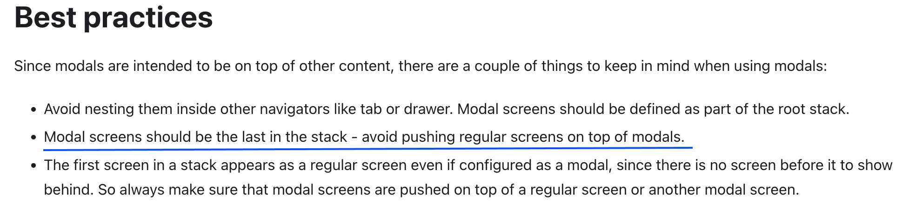
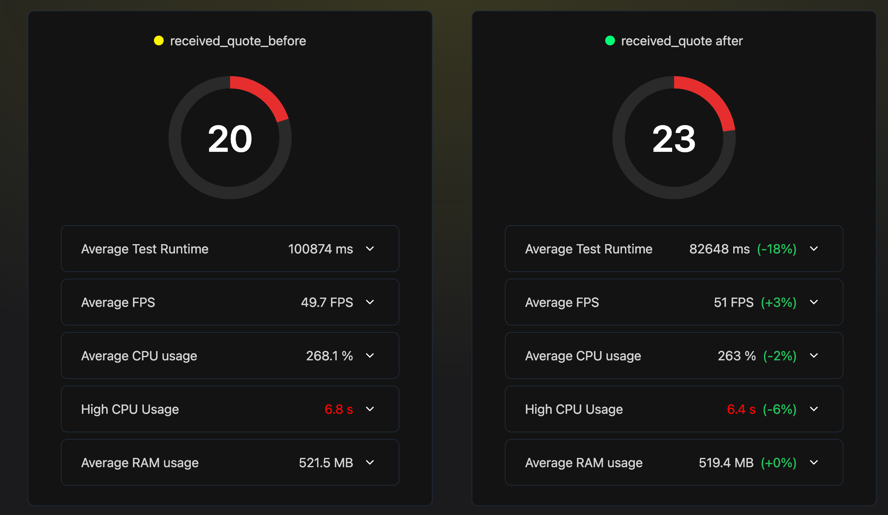

2분기 TechOKR 작업으로 선정된 **화면전환간 성능 개선** 작업을 담당하면서 **Native Stack Navigator**을 제품에 도입하게 되었다. 해당 작업을 진행하게된 배경, 적용과정에 대해 정리하면서 새롭게 알게된 내용, 시행착오를 기록해보려 한다.

## 🚀 Native Stack Navigator 작업 배경

### Native Stack이란

Native Stack Navigator는 [react navigation](https://github.com/react-navigation/react-navigation)에서 지원하는 Navigator 형태 중 하나로, stack navigator의 인터페이스와 유사하게 제공하면서, stack navigator와 다르게 iOS는 **UINavigationController**, Android는 **Fragment**로 Native 요소를 이용해 화면을 구현하게 된다.

Native 요소를 이용해 화면을 구현하면서 Native가 가지고 있는 성능과 특징들을 이용할 수 있는 장점을 가지지만, stackNavigator와 다르게 커스텀이 어려운 단점을 가진다.

### 왜 Native Stack을 도입하게 되었나

Native Stack은 이전 1분기에 [startup-time 개선 작업](https://choi2021.github.io/2024-03-30-App-StartUp-time-%EA%B0%9C%EC%84%A0/)을 진행하면서 고려했던 방법중에 있었던 작업으로,
당시에는 화면전환간 속도가 앱 시작 시간을 최적화하는데 큰 영향이 없을 것 같아 보류해 두었다.


이후에 일감으로 발전시켰던 이유로 기존 제품에 stackNavigator를 이용하면서 화면 전환간 버벅임이 발생하는 경우가 간헐적으로 있었고, React Native 공식문서의 Navigation 예제가 NativeStack을 이용하는 방식으로 소개되는 것으로 수정되었고 (커뮤니티에서 성능을 위해 권장하는 방법),
화면전환 애니메이션을 Native 스레드에서 진행하게 되면 JS 스레드가 바쁘게 진행될 때에도 안정적으로 화면 전환 애니메이션을 보장할 수 있을 것을 기대하며 작업을 시작하게 되었다.

[[react native 공식문서의 Navigating between screens](https://reactnative.dev/docs/0.73/navigation)]


[[React Navigation v2의 소개된 메모리 사용량 비교 데이터](https://twitter.com/janicduplessis/status/1039979591815897088?s=21)]


추가로 현재 React Native는 Expo를 공식적인 프레임워크로 추천하고 있는 흐름 속에 expo에서 사용하는 routing 시스템인 Expo router도 동일하게 React Native Screens를 이용해 file-based routing 방식으로 지원하고 있다.


## 🛠 Native Stack Navigator 제품에 적용해보기

기존 제품은 Stack Navigator를 사용하고 있었기 때문에 Native Stack Navigator로 마이그레이션하기 위해서는 Stack Navigator의 Navigation Option을 Native Stack Navigator에 맞게 변경하는 작업이 가장 중요하게 진행되었다.

이러한 옵션중 가장 중요했던 부분은 **presentation** 옵션으로, presentation을 어떻게 정하느냐에 따라 화면전환 애니메이션, 화면 렌더링 스타일이 달라지게 된다.

### Stack Navigator의 presentation 옵션

stack navigator에서는 `card`, `modal`, `transparent modal` 3가지 옵션을 사용할 수 있다.

- `card`: 기본 화면전환 방식으로, iOS와 Android에서 default OS animation으로 화면전환이 진행된다.
- `modal`: 화면이 모달로 뜨는 방식으로, iOS와 android 모두 화면이 아래에서 위로 올라오는 방식으로 화면이 뜨게 된다.
- `transparent modal`: 모달로 뜨는 화면이지만, 배경이 투명하게 되어있어 이전 화면이 보이게 된다.

[iOS Presentation별 화면전환 애니메이션]

<table>
  <tr>
    <th align="center">Card</th>
    <th align="center">Modal</th>
    <th align="center">Transparent Modal</th>
  </tr>
  <tr>
    <td></td>
    <td></td>
    <td></td>
  </tr>
</table>
<br/>

[Android Presentation별 화면전환 애니메이션]

<table>
  <tr>
    <th align="center">Card</th>
    <th align="center">Modal</th>
    <th align="center">Transparent Modal</th>
  </tr>
  <tr>
    <td></td>
    <td></td>
    <td></td>
  </tr>
</table>

또한, stack Navigator의 경우 일반 View로 구현되는 화면이기 때문에 Card <-> Modal 화면간 이동이 자유로워 Card 위에 Modal화면이 쌓이고,
Modal화면에 Card 화면이 다시 쌓일 수 있다.

[Card -> Modal -> Card2 -> TransparentModal 화면전환]


### [Native Stack Navigator의 presentation 옵션](https://reactnavigation.org/docs/native-stack-navigator/#presentation)

Native Stack Navigator에서는 `card`, `modal`, `transparent modal`, `contained modal`, `contained transparent modal`, `full screen modal`, `form sheet` 7가지로 구분되어 있다.

iOS에서 사용하는 모달 스타일을 조금 더 세부적으로 설정할 수 있게 지원하고 있고, android에서는 모두 modal 또는 transparentModal로 fallback되어 처리된다.

- `card`: 기본 화면전환 방식으로, iOS는 오른쪽에서 왼쪽으로 화면이 전환되고, Android는 OS 버전에 따라 다르게 화면전환 애니메이션이 진행된다.
- `modal`: iOS는 네이티브 모달처럼 화면이 입체적으로 올라오는 형태의 모달을 가지고 아래에서 위로 화면이 나타나게 되지만, Android는 card와 동일한 애니메이션으로 화면이 전환된다.
  ([관련 이슈](https://github.com/software-mansion/react-native-screens/issues/1650))
- `transparent modal`: 이전화면이 보이는 백그라운드로 보이는 모달형태의 화면이다.
- `contained modal`: iOS는 `UIModalPresentationCurrentContext` 모달 스타일을 이용해 부모 크기에 따라 차지하게 되며, Android는 modal과 동일하게 처리된다.
- `contained transparent modal`: iOS는 `UIModalPresentationOverCurrentContext` 모달 스타일을 이용해 부모 크기에 따라 차지하게 되며, Android는 transparent modal과 동일하게 처리된다.
- `fullScreenModal`: iOS는 `UIModalPresentationFullScreen` 모달 스타일을 이용해 전체 화면을 차지하게 되고, 제스처로 제거되지 않는 특징을 가진다. Android는 modal과 동일하게 처리된다.
- `formSheet`: iOS는 `UIModalPresentationFormSheet` 모달 스타일을 이용하고 Android는 modal과 동일하게 처리된다.

[iOS Presentation]

<table width="100%">
  <tr>
    <th>card</th>
    <th>modal</th>
  </tr>
  <tr>
    <td></td>
    <td></td>
  </tr>
  <tr>
    <th>transparent modal</th>
    <th>contained modal</th>
  </tr>
 <tr>
    <td></td>
    <td></td>
  </tr>
 <tr>
    <th>contained transparent modal</th>
    <th>fullScreen modal</th>
  </tr>
 <tr>
    <td></td>
    <td></td>
  </tr>
 <tr>
    <th>formSheet</th>
  </tr>
 <tr>
    <td></td>
  </tr>
</table>

[android Presentation (Android 14, API Level 34)]

<table>
  <tr>
    <th>card</th>
    <th>modal</th>
  </tr>
  <tr>
    <td></td>
    <td></td>
  </tr>
 <tr>
    <th>transparent modal</th>
    <th>contained modal</th>
  </tr>
  <tr>
    <td></td>
    <td></td>
  </tr>
  <tr>
    <th>contained transparent modal</th>
    <th>fullScreen modal</th>
  </tr>
 <tr>
    <td></td>
    <td></td>
  </tr>
  <tr>
    <th>formSheet</th>
  </tr>
 <tr>
    <td></td>
  </tr>
</table>

stack Navigator와 다르게 Native 요소들을 이용해 화면을 구현하기 때문에 모달은 **항상 Navigation History의 마지막에 와야하는 조건**이 있다. 이 조건을 지키지 않으면 Card 화면이 Modal 화면 뒤에 쌓여 보이지 않는 현상이 발생한다.

[Card -> Modal -> Card2 화면전환 ]


위 예시를 보면 Modal 이후 Card2로 화면전환을 진행하게 되면, Card2가 Modal 화면 뒤에 쌓이게 되어 보이지 않는 현상이 발생한다. navigation pop을 클릭하게 되면, Card2가 먼저 제거되고, 이후 Modal 화면이 제거되는 현상을 확인할 수 있다.

[React Navigation의 가이드](https://reactnavigation.org/docs/modal)에 따르면 모달 화면은 항상 Navigation History의 마지막에 와야한다고 되어있는데, 이는 Native Stack Navigator의 특징으로 보여진다.



### 제품 내 Navigator presentation 반영하기

그러면 이제 Native Stack Navigator의 presentation 옵션을 제품에 적용해보자.

#### Card

Stack Navigator와 동일하게 iOS와 Android 모두 동일하게 `Card`에 default Animation을 적용하기로 했다.
iOS는 완전히 동일하게 동작해서 큰 고민이 없었지만 Android는 별도의 애니메이션을 주어야할 지 고민이 되었다.
그이유는 Android에서는 OS 버전에 따라 다른 화면전환 애니메이션이 진행되게 되고 기존과 다른 유저 경험에 대한 우려가 있었기 때문이다.

[Stack Navigator에 정의된 Transition Preset, Android 버전별 애니메이션 옵션]

```tsx
/**
 * Standard Android navigation transition when opening or closing an Activity on Android < 9 (Oreo).
 */
export const FadeFromBottomAndroid: TransitionPreset = {
  gestureDirection: "vertical",
  transitionSpec: {
    open: FadeInFromBottomAndroidSpec,
    close: FadeOutToBottomAndroidSpec,
  },
  cardStyleInterpolator: forFadeFromBottomAndroid,
  headerStyleInterpolator: forFade,
}

/**
 * Standard Android navigation transition when opening or closing an Activity on Android 9 (Pie).
 */
export const RevealFromBottomAndroid: TransitionPreset = {
  gestureDirection: "vertical",
  transitionSpec: {
    open: RevealFromBottomAndroidSpec,
    close: RevealFromBottomAndroidSpec,
  },
  cardStyleInterpolator: forRevealFromBottomAndroid,
  headerStyleInterpolator: forFade,
}

/**
 * Standard Android navigation transition when opening or closing an Activity on Android 10 (Q).
 */
export const ScaleFromCenterAndroid: TransitionPreset = {
  gestureDirection: "horizontal",
  transitionSpec: {
    open: ScaleFromCenterAndroidSpec,
    close: ScaleFromCenterAndroidSpec,
  },
  cardStyleInterpolator: forScaleFromCenterAndroid,
  headerStyleInterpolator: forFade,
}
```

아래 GIF에서 기존은 가운데에서 퍼져나가는 형식(ScaleFromCenterAndroid)으로 화면이 전환된다면, Native Stack에서는 오른쪽에서 왼쪽으로 화면이 전환되는 것을 확인할 수 있다.

<table>
  <tr>
    <th>기존 안드로이드 화면전환</th>
    <th>Native Stack 화면 전환</th>
  </tr>
  <tr>
    <td></td>
    <td></td>
  </tr>
</table>

기존 `ScaleFromCenterAndroid`와 최대한 유사한 애니메이션으로 `Fade` 애니메이션을 처음 고민해봤지만, 여전히 기존과 다른게 느껴지는 것 같다는 동료분의 피드백을 받았고,
버전에 맞게 표준 애니메이션을 적용하는 default 옵션이 이후 유지보수 측면에서 좋을 것 같다는 좋은 조언을 해주셔서, `Card` 옵션을 그대로 적용하기로 했다.

#### Modal

작업 중 가장 이슈가 많았고, OS별로 기본적으로 제공하는 부분이 달라 고민이 많았던 작업 영역이었다.

OS별로 모달 옵션들을 정리해보면 iOS에서는 `modal, contained modal, fullscreen modal, formsheet` 4가지가 있고, android는 `modal` 한가지 옵션만 제공하지만 이슈가 있어서 추가적으로 애니메이션 옵션을 적용해야하는 상황이었다.

여기에 추가적으로 모달이 항상 Navigation History의 마지막에 와야하는 조건이 있어서, 이를 지키지 않으면 기존 제품과 다르게 화면이 보이지 않는 이슈가 발생해, card와 modal간 화면 전환의 자유도도 고민해야 했다.

결론적으로는 위에서 언급한 옵션들이 아닌 iOS와 Android 모두 `Card` 옵션에 `slide_from_bottom` 애니메이션을 적용한 형태로 적용하기로 했다.

왜 뜬금없이 `Card`냐는 의문이 들 수 있겠지만, android에 이슈로 인해 추가적인 애니메이션이 필수적으로 필요한 상황인 점과 기존 제품 내 Navigation History 관리 방식을 유지해 작업범위와 컨벤션을 지키는 것이 더 좋겠다는 점을 고려해 선택하게 되었다.

그러면 각 옵션들을 적용했을 때 발생했던 이슈들을 정리해보자.

##### Modal와 FormSheet

iOS에서는 `modal`와 `formsheet` 옵션을 적용했을 때, 기존 제품내 모달과 다르게 화면 전체를 차지하는게 아니라 일정 영역만 차지하고 위로 떠있는 형태를 가지게 되고, android는 card와 동일하게 화면 전환이 이루어지는 이슈가 있어 사용하지 못했다.

[제품내 모달과 Modal 옵션]

<table>
  <tr>
    <th>기존 제품내 모달 화면</th>
    <th>modal iOS</th>
    <th>modal android</th>
  </tr>
  <tr>
    <td></td>
    <td></td>
    <td></td>
  </tr>
</table>

[제품내 모달과 formsheet 옵션]

<table>
  <tr>
    <th>기존 제품내 모달 화면</th>
    <th>formsheet iOS</th>
    <th>formsheet android</th>
  </tr>
  <tr>
    <td></td>
    <td></td>
    <td></td>
  </tr>
</table>

##### Contained Modal과 FullScreen Modal

android는 card와 동일하게 화면 전환이 이루어지는 이슈가 동일하게 있지만, iOS에서는 `contained modal`과 `fullscreen modal` 옵션을 적용했을 때, 기존과 같이 화면이 전체를 차지하는 형태로 화면이 나타낼 수 있어 사용하려 했던 옵션이었다.

하지만 각 옵션은 적용에 있어 문제점들이 각각 존재했다. contained Modal의 경우에는 Navigation History의 마지막에 와야하는 조건을 위해 별도의 Nested Navigator로 모달들을 관리하는 비용이 컸다는 점으로 인해 사용하지 못했다.

fullscreen Modal 옵션은 card,modal간 화면 전환 이슈와 더불어, alert 모달을 상위에 띄워줄 수 없는 이슈가 있어 사용하지 못했다. 아래는 해당 상황을 위한 mimic 코드이다.

[fullscreen modal에서 Modal로 구현한 alert가 뜨지 않는 이슈를 위한 mimic 코드]

```tsx
// zustand로 구현한 전역 모달 노출 코드
import { create } from "zustand"

export const useAlertModal = create(set => ({
  visible: false,
  show: () => set({ visible: true }),
  hide: () => set({ visible: false }),
}))

const App = () => {
  const visible = useAlertModal(state => state.visible)
  const close = useAlertModal(state => state.hide)
  const onPressClose = () => {
    close()
  }

  return (
    <SafeAreaView style={{ flex: 1 }}>
      {visible && (
        <Modal
          visible={visible}
          animationType={"fade"}
          transparent={true}
          onRequestClose={onPressClose}
        >
          <View
            style={{
              justifyContent: "center",
              alignItems: "center",
              backgroundColor: "white",
              flex: 1,
            }}
          >
            <Text>Modal이에요</Text>
            <Button title="닫기" onPress={onPressClose} />
          </View>
        </Modal>
      )}
      <NavigationContainer>
        <NativeStack />
      </NavigationContainer>
    </SafeAreaView>
  )
}

const FullscreenModal = ({ navigation }) => {
  const handlePress = () => {
    navigation.pop()
  }

  const show = useAlertModal(state => state.show)
  const showAlert = () => {
    show()
  }

  return (
    <SafeAreaView style={{ flex: 1 }}>
      <Button title="뒤로가기" onPress={handlePress} />
      <Button title="alert 띄우기" onPress={showAlert} />
    </SafeAreaView>
  )
}
```

<table>
  <tr>
    <td>Modal로 구현한 alert 컴포넌트가 상위에 뜨지 않는 이슈</td>
  </tr>
  <tr>
    <td></td>
  </tr>
</table>

이러한 이슈들로 인해 iOS와 Android 모두 `Card` 옵션에 `slide_from_bottom` 애니메이션을 적용한 형태로 적용하기로 했다.

##### slide_from_bottom 속도 이슈 해결하기

이제 더이상 이슈가 없을 것이라 생각했지만 `Card` 옵션에 `slide_from_bottom` 옵션을 적용하는 방식에도 이슈가 있었다.

바로 모달이 뜨는 애니메이션 속도 이슈로 iOS에서는 duration을 옵션으로 정할 수 있게 제공하지만, android에서는 커스텀할 수 없어 기존과 체감이 될정도로 느리게 화면이 전환되는 이슈가 있었다.


<table>
  <tr>
    <td>Android Stack Navigator Modal</td>
    <td>Android Native Stack Card (slide_from_bottom)</td>
  </tr>
  <tr>
    <td></td>
    <td></td>
  </tr>
</table>

눈에 띄게 느리다는 느낌이 들어 해당 부분을 해결하기 위해 React Navigation 내부 코드를 하나하나 분석하게 되었다.

먼저 NativeStackNavigator를 만들기 위한 `createNativeStackNavigator`를 보면 `createNavigatorFactory` 팩토리 함수에 `NativeStackNavigator`를 인자로 넘겨주는 방식으로 NativeStackNavigator를 만들고 있다.

```tsx
//[참조 코드](https://github.com/react-navigation/react-navigation/blob/main/packages/native-stack/src/navigators/createNativeStackNavigator.tsx)
function NativeStackNavigator({...rest }: NativeStackNavigatorProps) {
    ...

    return (
        <NavigationContent>
            <NativeStackView
                {...rest}
                state={state}
                navigation={navigation}
                descriptors={descriptors}
            />
        </NavigationContent>
    );
}

export function createNativeStackNavigator<
    ParamList extends ParamListBase,
    NavigatorID extends string | undefined = undefined,
    TypeBag extends NavigatorTypeBagBase = {
        ParamList: ParamList;
        NavigatorID: NavigatorID;
        State: StackNavigationState<ParamList>;
        ScreenOptions: NativeStackNavigationOptions;
        EventMap: NativeStackNavigationEventMap;
        NavigationList: {
            [RouteName in keyof ParamList]: NativeStackNavigationProp<
                ParamList,
                RouteName,
                NavigatorID
            >;
        };
        Navigator: typeof NativeStackNavigator;
    },
    Config extends StaticConfig<TypeBag> | undefined =
            | StaticConfig<TypeBag>
        | undefined,
>(config?: Config): TypedNavigator<TypeBag, Config> {
    return createNavigatorFactory(NativeStackNavigator)(config);
}
```

내가 궁금한건 스크린이 어떻게 만들어지냐니까 이제 NativeStackView 코드 내부를 보게 되면 `React Native Screens`에서 Screen, ScreenStack 컴포넌트를 받아서 prop을 전달하는 방식으로 wrapping하고 있다는 것을 알 수 있었다.

```tsx
//[참조 코드](https://github.com/react-navigation/react-navigation/blob/main/packages/native-stack/src/views/NativeStackView.native.tsx):`react-navigation/packages/native-stack/src/views/NativeStackView.native.tsx`)
//...
import {
    Screen,
    type ScreenProps,
    ScreenStack,
    type StackPresentationTypes,
} from 'react-native-screens';
//...


const MaybeNestedStack = (props) => {
    //...
    if (isHeaderInModal) {
        return (
            <ScreenStack style={styles.container}>
                <Screen
                    enabled
                    isNativeStack
                    hasLargeHeader={options.headerLargeTitle ?? false}
                    style={StyleSheet.absoluteFill}
                >
                    {content}
                    <HeaderConfig
                        {...options}
                        route={route}
                        headerHeight={headerHeight}
                        headerTopInsetEnabled={headerTopInsetEnabled}
                        canGoBack
                    />
                </Screen>
            </ScreenStack>
        );
    }

    return content;
};

const SceneView = (props) => {
    //...
    return (
        <Screen
            key={route.key}
            enabled
            isNativeStack
            style={StyleSheet.absoluteFill}
            hasLargeHeader={options.headerLargeTitle ?? false}
            customAnimationOnSwipe={animationMatchesGesture}
            fullScreenSwipeEnabled={fullScreenGestureEnabled}
            // ... 기타 props
        >{...}</Screen>
    );
};

type Props = {
    state: StackNavigationState<ParamListBase>;
    navigation: NativeStackNavigationHelpers;
    descriptors: NativeStackDescriptorMap;
};

export function NativeStackView({ state, navigation, descriptors }: Props) {
    ...
    return (
        <SafeAreaProviderCompat style={{ backgroundColor: colors.background }}>
            <ScreenStack style={styles.container}>
                {state.routes.map((route, index) => {
                    //...
                    return (
                        <SceneView
                            key={route.key}
                            index={index}
                            focused={isFocused}
                            descriptor={descriptor}
                            previousDescriptor={previousDescriptor}
                            nextDescriptor={nextDescriptor}
                            isPresentationModal={isModal}
                            // 기타 props
                        />
                    );
                })}
            </ScreenStack>
        </SafeAreaProviderCompat>
    );
}
```

실제 애니메이션 속도를 변경하기 위해서는 React Navigation 코드가 아니라 **React Native Screens** 패키지 내부 코드를 수정해야하는 것을 알게 되었다.
그래서 React Navigation에서 Native Stack의 이슈는 React Native Screens 레포에 올려달라했구나 이해가 되었다.


이어서 React Native Screens 패키지 내부 코드를 분석하게 되었고, 아래와 같이 Screen 코드를 간단하게 나타낼 수 있고, Screen 컴포넌트는 ScreenNativeComponent를 만들어지는 것을 볼 수 있다.

```tsx
//[참조 코드](react-native-screens/src/components/Screen.tsx)
// ...
import ScreenNativeComponent from "../fabric/ScreenNativeComponent"
import ModalScreenNativeComponent from "../fabric/ModalScreenNativeComponent"

export const NativeScreen: React.ComponentType<ScreenProps> =
  ScreenNativeComponent as React.ComponentType<ScreenProps>
const AnimatedNativeScreen = Animated.createAnimatedComponent(NativeScreen)

// ...

const Screen: React.FC<ScreenProps> = props => {
  // ...
  return <AnimatedNativeScreen {...props} />
}

export default Screen
```

그리고 ScreenNativeComponent 코드를 보게 되면, `Screen` 컴포넌트를 만들어주는 코드를 찾을 수 있었다.
아래 코드는 [**codegen**](https://github.com/reactwg/react-native-new-architecture/blob/main/docs/codegen.md)을 이용해 Screen 컴포넌트를 iOS와 Android를 빌드할 때 자동으로 생성하기 위한 인터페이스들이 정의되어 있는 코드이다.
이제 codegen을 통해 만들어진 해당 코드 부분을 찾아가면 드디어 내가 원하는 안드로이드 애니메이션 속도를 변경할 수 있을 것이라고 생각할 수 있었다.

```ts
//[참조코드](react-native-screens/src/fabric/ScreenNativeComponent.ts)
import codegenNativeComponent from "react-native/Libraries/Utilities/codegenNativeComponent"
// ...

type StackPresentation =
  | "push"
  | "modal"
  | "transparentModal"
  | "fullScreenModal"
  | "formSheet"
  | "containedModal"
  | "containedTransparentModal"

type StackAnimation =
  | "default"
  | "flip"
  | "simple_push"
  | "none"
  | "fade"
  | "slide_from_right"
  | "slide_from_left"
  | "slide_from_bottom"
  | "fade_from_bottom"
  | "ios"

// ...
export default codegenNativeComponent<NativeProps>("RNSScreen", {
  interfaceOnly: true,
})
```

드디어 rnscreens 내부의 ScreenStack 코드에서 애니메이션 설정 코드를 발견할 수 있었다.
그중 내가 찾던 `slide_from_bottom`애니메이션은 `R.anim.rns_slide_in_from_bottom`, `R.anim.rns_no_animation_medium`으로 정의되어 있었다.

```kotlin
[참고 코드](react-native-screens/android/src/main/java/com/swmansion/rnscreens/ScreenStack.kt)
class ScreenStack(context: Context?) : ScreenContainer(context) {
    ...
    override fun onUpdate() {
        ...
        createTransaction().let {
            // animation logic start
            if (stackAnimation != null) {
                if (shouldUseOpenAnimation) {
                    when (stackAnimation) {
                        StackAnimation.DEFAULT -> it.setCustomAnimations(R.anim.rns_default_enter_in, R.anim.rns_default_enter_out)
                        StackAnimation.NONE -> it.setCustomAnimations(R.anim.rns_no_animation_20, R.anim.rns_no_animation_20)
                        StackAnimation.FADE -> it.setCustomAnimations(R.anim.rns_fade_in, R.anim.rns_fade_out)
                        StackAnimation.SLIDE_FROM_RIGHT -> it.setCustomAnimations(R.anim.rns_slide_in_from_right, R.anim.rns_slide_out_to_left)
                        StackAnimation.SLIDE_FROM_LEFT -> it.setCustomAnimations(R.anim.rns_slide_in_from_left, R.anim.rns_slide_out_to_right)
                        StackAnimation.SLIDE_FROM_BOTTOM -> it.setCustomAnimations(
                            R.anim.rns_slide_in_from_bottom, R.anim.rns_no_animation_medium
                        )
                        StackAnimation.FADE_FROM_BOTTOM -> it.setCustomAnimations(R.anim.rns_fade_from_bottom, R.anim.rns_no_animation_350)
                        StackAnimation.IOS -> it.setCustomAnimations(R.anim.rns_slide_in_from_right_ios, R.anim.rns_slide_out_to_left_ios)
                    }
                } else {
                    when (stackAnimation) {
                        StackAnimation.DEFAULT -> it.setCustomAnimations(R.anim.rns_default_exit_in, R.anim.rns_default_exit_out)
                        StackAnimation.NONE -> it.setCustomAnimations(R.anim.rns_no_animation_20, R.anim.rns_no_animation_20)
                        StackAnimation.FADE -> it.setCustomAnimations(R.anim.rns_fade_in, R.anim.rns_fade_out)
                        StackAnimation.SLIDE_FROM_RIGHT -> it.setCustomAnimations(R.anim.rns_slide_in_from_left, R.anim.rns_slide_out_to_right)
                        StackAnimation.SLIDE_FROM_LEFT -> it.setCustomAnimations(R.anim.rns_slide_in_from_right, R.anim.rns_slide_out_to_left)
                        StackAnimation.SLIDE_FROM_BOTTOM -> it.setCustomAnimations(
                            R.anim.rns_no_animation_medium, R.anim.rns_slide_out_to_bottom
                        )
                        StackAnimation.FADE_FROM_BOTTOM -> it.setCustomAnimations(R.anim.rns_no_animation_250, R.anim.rns_fade_to_bottom)
                        StackAnimation.IOS -> it.setCustomAnimations(R.anim.rns_slide_in_from_left_ios, R.anim.rns_slide_out_to_right_ios)
                    }
                }
            }

            ...
        }
    }
}
```

이제 진짜 마지막으로 해당 xml 파일을 찾아 duration부분을 수정하고 patch package를 진행해 애니메이션 속도를 변경할 수 있었다.
기존 duration은 `config_mediumAnimTime`으로 설정되어 있었고, 해당 부분을 수정하면 커스텀하게 수정이 가능하게 되었다.

animation duration은 react-native-screens에서 20,250,350을 기본 값으로 설정해두고 있는 것으로 보여, 250으로 변경해 적용하게 되었다.

```XML

<!--[참고 코드](react-native-screens/android/src/main/res/base/anim/rns_slide_in_from_bottom.xml)-->
<?xml version="1.0" encoding="utf-8"?>
<translate xmlns:android="http://schemas.android.com/apk/res/android"
    android:fromYDelta="100%"
    android:toYDelta="0%"
    android:duration="@android:integer/config_mediumAnimTime" /> <!--250으로 변경 -->

<!--[참고 코드](react-native-screens/android/src/main/res/base/anim/rns_slide_out_to_bottom.xml)-->
<?xml version="1.0" encoding="utf-8"?>
<translate xmlns:android="http://schemas.android.com/apk/res/android"
    android:fromYDelta="100%"
    android:toYDelta="0%"
    android:duration="@android:integer/config_mediumAnimTime" /> <!--250으로 변경 -->

<!--[참고 코드] (react-native-screens/android/src/main/res/base/anim/rns_no_animation_medium.xml)-->
<?xml version="1.0" encoding="utf-8"?>
<alpha xmlns:android="http://schemas.android.com/apk/res/android"
    android:fromAlpha="1.0"
    android:toAlpha="1.0"
    android:duration="@android:integer/config_mediumAnimTime"/> <!--250으로 변경 -->
```

<table>
  <tr>
    <td>개선 전 Android Native Stack Card (slide_from_bottom)</td>
    <td>개선 후 Android Native Stack Card (slide_from_bottom)</td>
  </tr>
  <tr>
    <td></td>
    <td></td>
  </tr>
</table>

시간상 하지 못했지만, 조금 더 모달 애니메이션을 개선하면 좋았을 것 같다는 아쉬운 생각이 들었다.
기존에는 끝에 점점 천천히 도착하는 듯한 효과가 있었지만 지금은 linear하게 한번에 뜨고 닫히는 것 같아 어색함이 남아있어보였다.
이후에 더 `native스러운 느낌`을 줄 수 있게 후작업으로 개선 작업도 진행해보려 한다.

#### TransparentModal

기존 일부 화면에서 사용되고 있던 `transparent modal` 옵션을 `containedTransparentModal`을 이용해 최대한 사용하려 했지만, 다음 화면이 card인 경우에 애니메이션이 버벅이는 듯한 이슈가 발생하게 되었다.
이를 해결하기 위해서 `transparent modal` 옵션 대신 기존 화면을 바텀시트 컴포넌트를 이용해 구현하는 방식으로 수정하게 되었다.

이렇게 수정했을 때 기존은 모달이지만 서서히 fade in/fade out으로 화면전환이 되었지만, 바텀시트로 변경하면서 overlay가 보이는 모달 느낌이 더 들 수 있어 좋은 선택이라 생각이 들었다.

제품 내 모든 `transparent modal` 옵션을 사용하던 화면들을 다 바꾸지는 못했고, 이슈가 있었던 화면만 수정하게 되었지만, 다음화면에 따라 화면전환 애니메이션에 이슈가 있을 수 있어 후작업을 진행해야할 것 같다.

<table>
  <tr>
    <td>이슈가 되었던 transparent modal</td>
    <td>BottomSheet으로 전환한 transparent modal</td>
  </tr>
  <tr>
    <td></td>
    <td></td>
  </tr>
</table>

### 기타 이슈: gesture handler로 사진 끌어당겨 닫기 이슈

해당 이슈는 첫번째 배포 때 롤백하게 된 가장 컸던 이슈로 이미지 슬라이더를 보고 끌어당겨 해당 화면을 pop한 후에, 제품 내 메인 퍼널 중 하나인 요청서 작성화면에 진입한 경우에 질문이 10개만 렌더링되는 이슈가 발생했다.

이미지를 끌어당겨 종류할 수 있게 하기 위해 PanResponder를 이용해 구현했는데, PanResponder로 끌어당겨 `navigation.pop`을 진행하게 하는 동작에서 문제가 발생하는 것으로 보였다.

해당 이슈를 해결하는 과정에서 FlatList로 구현된 요청서 작성화면의 요소가 Flatlist의 [initialNumToRender](https://reactnative.dev/docs/flatlist#initialnumtorender) prop의 default 값처럼 딱 10개만 항상 렌더링되는 것을 근거로 `FlatList` 내부 코드를 확인해보게 되었다.

Flatlist는 VirtualizedList를 상속받아 구현되어 있고, VirtualizedList는 다음 목록을 가져오기 위해서 [Batchinator](https://github.com/facebook/react-native/blob/main/packages/virtualized-lists/Interaction/Batchinator.js)를 이용해 다음 목록을 받아오게된다.
이때 Batchinator는 InteractionManager의 runAfterInteractions 메소드를 이용해 다음 목록을 받아오게 구현되어 있었다.

[ [Batchinator 코드](https://github.com/facebook/react-native/blob/main/packages/virtualized-lists/Interaction/Batchinator.js)]

```typescript
class Batchinator {
  _callback: () => void;
  _delay: number;
  _taskHandle: ?{cancel: () => void, ...};
  constructor(callback: () => void, delayMS: number) {
    this._delay = delayMS;
    this._callback = callback;
  }
  /*
   * Cleanup any pending tasks.
   *
   * By default, if there is a pending task the callback is run immediately. Set the option abort to
   * true to not call the callback if it was pending.
   */
  dispose(options: {abort: boolean, ...} = {abort: false}) {
    if (this._taskHandle) {
      this._taskHandle.cancel();
      if (!options.abort) {
        this._callback();
      }
      this._taskHandle = null;
    }
  }
  schedule() {
    if (this._taskHandle) {
      return;
    }
    const timeoutHandle = setTimeout(() => {
      this._taskHandle = InteractionManager.runAfterInteractions(() => {
        // Note that we clear the handle before invoking the callback so that if the callback calls
        // schedule again, it will actually schedule another task.
        this._taskHandle = null;
        this._callback();
      });
    }, this._delay);
    this._taskHandle = {cancel: () => clearTimeout(timeoutHandle)};
  }
}

module.exports = Batchinator;
```

이미지를 끌어당겨 종료하기 위해 사용되는 PanResponder 또한 내부 적으로 InteractionManager를 이용하는데 이때 gesture 방해를 막기위해 JS 이벤트를 blocking하게 구현되어 있다.


이를 근거로 자세한 동작과 충돌 과정은 파악하지 못했지만 이미지를 끌어당겨 종료하는 이벤트를 처리하는 과정에서 Interaction Manager가 blocking되어 FlatList의 InteractionManager가 동작하지 못하게 막아서 발생하는 이슈로 추측할 수 있었다.

해당 이슈를 해결하게 위해서 Pan Responder의 interaction 도중에 navigation.pop이 진행되게 하는게 아니라 Interaction이 모두 끝난 후에 진행되게 해 문제를 해결할 수 있었다.

```typescript
    const panResponder = useRef(
        PanResponder.create({
            ...,
            onPanResponderGrant: () => {
                // PanGesture가 완료되고 난 이후에 화면 이동을 동작시켜 InteractionManager간 충돌을 막습니다.
                InteractionManager.runAfterInteractions(() => {
                        navigation.goBack();
                });
            },
        }),
    ).current;
```

## ⭐️ 적용 후 성능 분석

이제 적용 후 성능 분석을 진행한 내용을 정리해보려 한다. 화면 전환간 성능을 개선한다는 목표를 가지고 작업을 진행했다 보니 지표적으로 명확하게 보여줄 방법이 크게 없어 어려움을 느꼈다.

고민 끝에 정했던 방법은 총 3가지로, 먼저 간단하게 실제 제품 내 메인 퍼널들에 대한 **영상**을 찍어서 전/후 비교를 진행했고, 다음으로 직접적이지는 않지만 애니메이션 처리 과정에 필요한 **CPU 사용량과 memory 사용량**을 보기 위해 android에서 웹의 light house처럼 성능측정을 할 수 있는 [**flash light**](https://github.com/bamlab/flashlight)을 이용해 메인 퍼널들에 대한 지표를 측정해보았다.
그리고 추가적으로 화면 stack이 최대 100개가 되었을 때도 정상적으로 애니메이션을 처리할 수 있을지 보기 위해 **stress 테스트**를 진행해보았다.

### 영상을 통한 전/후 비교

영상을 통한 전/후 비교는 가장 직관적으로 보여줄 수 있는 방법이라고 생각했다. 영상을 찍어서 전/후 비교를 진행했고, 이를 통해 애니메이션의 자연스러움과 끊김이 있는지, 또한 화면 전환 속도가 빨라졌는지 확인할 수 있었다.

아래는 메인 퍼널 중 하나인 고객홈 -> 메인 카테고리 까지 넘어가는 과정을 Android (Galaxy22)에서 찍은 영상이다.

<table>
  <tr>
    <td>AS-IS</td>
    <td>TO-BE</td>
  </tr>
  <tr>
    <td></td>
    <td></td>
  </tr>
</table>

영상을 비교해보았을 때 이전보다 조금 더 부드럽게 전환되고 화면전환 이벤트 처리가 빨라진 것을 느낄 수 있었다.

### FlashLight를 이용한 성능 측정

영상을 찍는데에서 끝내지 않고 최대한 숫자로, 지표로 분석해보면 조금 더 좋지 않을까 생각해 flash light를 이용해 성능 측정을 진행해보았다.
flash light와 maestro e2e 자동화 코드를 이용해 측정해보았고, 앱을 시작해서 위에서 영상으로 찍었던 메인 퍼널 시나리오에 대해 각각 30번 진행했을 때 성능 지표를 측정했다.

<table width="100%">
  <tr>
    <th>홈 -> 메인 카테고리 전/후</th>
  </tr>
  <tr>
    <td></td>
  </tr>
 <tr>
    <th>받은 요청 목록 -> 받은 요청 상세 전/후</th>
  </tr>
  <tr>
    <td></td>
  </tr>
 <tr>
    <th>받은 견적 목록 -> 받은 견적 상세 -> 견적서 상세 전/후</th>
  </tr>
  <tr>
    <td></td>
  </tr>
 <tr>
    <th>채팅방 목록 -> 채팅방 AS-IS</th>
  </tr>
  <tr>
    <td></td>
  </tr>
</table>

성능 지표를 분석해보았을 때 퍼널 별로 오르락 내리락 하는 부분들이 있지만, CPU 사용량과 Memory 사용량이 대부분 감소했고 이는 **애니메이션 처리 과정에서 더 효율적으로 처리되고 있다**는 것을 의미한다고 볼 수 있었다.

그리고 추가적으로 분석해보았을 때 받은견적 목록 -> 받은 견적 상세 -> 견적서 상세 전환에서 다른 퍼널과 다르게 전체적인 지표 모두 좋아진 것을 볼 수 있었다.
퍼널간 차이점을 보았을 때 측정했던 퍼널 중 가장 긴 퍼널이었다는 점을 고려해 Navigation stack이 쌓일수록 더 효율적으로 처리하고 있다는 것을 알 수 있었다.

이러한 특징을 눈으로 더 명확하게 확인해보기 위해서 `Navigation stack이 100개가 되었을 때도 성능이 좋아지는지` 확인해보는 건 어떨까라는 호기심이 생겨 stress 테스트를 이어서 진행해보았다.

### Stress 테스트를 통한 성능 확인

stress 테스트는 10개, 30개, 50개, 75개, 100개 까지 stack에 화면이 쌓였을 때 어떻게 화면전환이 되는지를 촬영해보았고, 영상 상단에 navigation stack의 길이를 표시해 현재 몇개 stack이 쌓였는지 확인할 수 있게 했다.
아래 영상은 Android Galaxy22 기기에서 측정한 결과다.

<table width="100%">
 <tr>
    <th>Stack Navigator 10개 </th>
    <th>Stack Navigator 50개 </th>
    <th>Stack Navigator 100개 </th>
  </tr>
 <tr>
    <td></td>
    <td></td>
    <td></td>
 </tr>
 <tr>
    <th>Native Stack Navigator 10개 </th>
    <th>Native Stack Navigator 50개 </th>
    <th>Native Stack Navigator 100개 </th>
  </tr>
 <tr>
    <td></td>
    <td></td>
    <td></td>
 </tr>
</table>

Stack Navigator는 stack이 쌓일수록 화면전환 속도가 느려지는 것을 확인할 수 있었고, Native Stack Navigator는 stack이 쌓여도 유사한 속도로 화면전환이 진행되는 것을 볼 수 있었다.

촬영과정에서 기기에서 느껴지는 발열도 Native Stack Navigator가 더 낮은 것을 느낄 수 있었고, 이는 CPU 사용량과 Memory 사용량이 줄어들어 성능이 향상되었다는 것을 체감할 수 있었다.

## 📚 배운점

여태까지 진행했던 프로젝트 중에서 가장 이슈가 많았던 작업이었고, 다행히 잘 해결해서 현재 잘 제품에 반영되어 있어 뿌듯했다.

단순 Javascript 런타임만 고민하는게 아니라 모바일 플랫폼에 특화된 성능 개선을 적용할 수 있어 좋았고, 잘 만들어진 오픈 소스 라이브러리들을 내부구조도 파헤치는 좋은 경험이 되어 이후에 React Navigation에도 기여하고 싶은 마음도 생겼다.

적용하면서 성능이 개선되었는지 확인하기 위해 다양한 방법을 사용해보았는데, 영상을 찍어 전/후 비교를 하는 것이 가장 직관적이었다. 나름 숫자로 표현하기 위해 노력해보았지만 어느정도 한계가 있었다.
하지만, 메모리나 CPU 사용량과 같이 이전에 관심을 두지 않았던 하드웨어 스펙에 대해서도 관심을 가지게 되었고, 이를 통해 성능을 개선하는데 도움이 되었다.

물론 여전히 남겨진 일들이 있지만, 하나의 또 큰 일감을 잘 마무리하고 사용자 경험과 성능 모두 개선할 수 있었던 좋은 작업이었다고 생각되었다.
