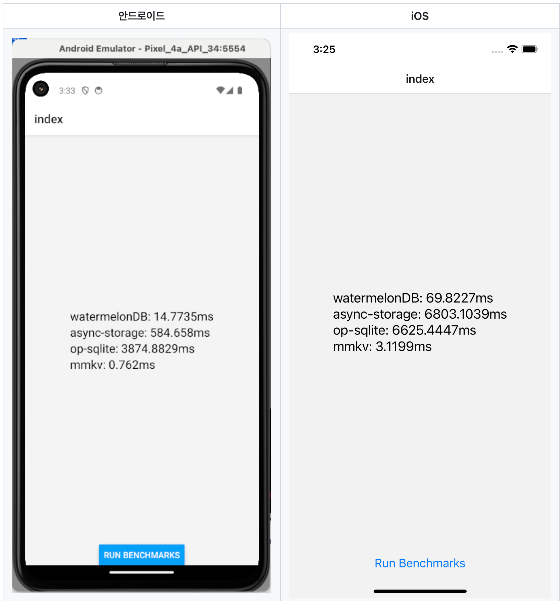

7월은 새롭게 한분기를 시작하는 달로, 챕터 내에서는 하고 싶었던 MMKV 데이터 스토리지 마이그레이션과 로딩 경험 개선 두가지 일감을 담당해 진행했고,
스쿼드에서는 새롭게 요청서 기반이 아닌 새로운 비즈니스 모델 실험에 맞는 퍼널 화면을 구현하는 등 새로운 작업들을 사내에서 담당해서 진행하게 되었다.

외부 활동으로는 오픈 소스 라이브러리에 처음으로 contribution을 해보고, 토스 FE Accelerator에도 합격해 멘토링 과정을 시작했다.

다양한 새로운 활동을 진행한 7월을 정리하고, 8월의 액션아이템들을 정리해보려 한다.

## 7월의 액션아이템

6월 회고를 작성하면서 7월의 액션아이템으로 아래와 같이 선정했었다.

- Native Stack 적용 글 작성하기
- Async Storage 대체할 라이브러리 검토 및 마이그레이션하기
- 제품 내 로딩 상태 개선하기
- 컴포넌트 설계 추가 작업 진행하기
- 페이지간 데이터 공유 문제 고민하고 논의하기

### Native Stack 적용기 글 작성하기
2분기 OKR로 **화면 전환간 성능 개선** 작업을 담당하면서 적용한 [Native Stack Navigation 적용과정에 대한 글](https://choi2021.github.io/2024-06-30-NativeStack%EC%A0%81%EC%9A%A9%ED%95%98%EA%B8%B0/)을 작성했다.
Native Stack Navigation을 적용하면서 메모리 사용량과 CPU 사용량을 감소시켜 화면 전환간 버벅임을 개선 과정과, 작업간 어려웠던 점, 트러블 슈팅을 정리할 수 있었고 이후 시도하면 좋을 작업들에 대해서도 정리할 수 있었다.

후작업으로 생각했던 일감 중 하나였던 `검색 화면 진입시 버벅이는 이슈`에 대한 작업을 추가적으로 진행했다.

해당 이슈는 [react native screens에 등록되어 있던 이슈](https://github.com/software-mansion/react-native-screens/issues/1637)로 전환되는 화면의 TextInput이 AutoFocus가 true로 되어있을 경우 AutoFocus로 인한 키보드 노출 이벤트와 화면 전환 이벤트가 함께 처리되면서
버벅임이 발생하는 것으로 보였다. 

[Repo에 등록된 이슈의 재현 영상]

UI 스레드의 부하를 줄이기 위해서 AutoFocus를 true로 설정하는 것 대신, 화면전환 완료 이후에 manual하게 TextInput ref에 focus를 동작시키는 방식으로 해결할 수 있었다.

후작업을 통해 담당했던 일감에 대한 완성도를 높일 수 있어 뿌듯했던 순간이었다.

### Async Storage 대체할 라이브러리 선정하기
Async Storage를 이용하면서 큰 문제는 없지만, 조금 더 빠르면서도 사용성이 좋은 데이터 스토리지 라이브러리를 찾고 적용하는 작업을 시작하게 되었다.

후보군으로는 [WatermelonDB](https://github.com/Nozbe/WatermelonDB?tab=readme-ov-file), [MMKV](https://github.com/mrousavy/react-native-mmkv), [OP-SQLite](https://github.com/OP-Engineering/op-sqlite?tab=readme-ov-file)로 총 3가지 라이브러리를 선정하게 되었는데 MMKV만을 사실 첫 목표로 작업을 기획했었지만,
챕터원 분들의 추천으로 다른 라이브러리들도 함께 비교해보면 좋을 것 같다고 알려주신 라이브러리들을 함께 비교해보기로 했다.

해당 라이브러리들을 비교하기 위해 MMKV 레포에 소개되어있는 [Bench Mark 레포](https://github.com/mrousavy/StorageBenchmark)를 참고했고, [새롭게 레포](https://github.com/choi2021/rn-storage-benchmark-test)를 만들어 비교를 진행하고 결과를 정리해보았다. 

아래는 각 라이브러리별로 성능을 비교한 결과로 `key: 'k', value: 'hello'` 저장을 1000번 반복한 후에 시간을 측정한 결과로, MMKV가 가장 빠르게 처리되었음을 확인할 수 있었다.

속도도 중요하지만 개발자 경험, 커뮤니티 지원, 실제 제품에 적용이 가능한지 등 여러가지 비교가 필요했고 결론적으로 `MMKV`를 선정하게 되었다.

[데이터 스토리지 라이브러리 별 npm 트렌드 비교]

정리한 내용들을 통해 챕터원분들께 발표를 진행했고, MMKV를 실제 제품에 적용했을 때 기대되는 성능적인 이점도 공유했다.

공유한 내용중에 시간 측정에 API 응답시간도 함께 포함되어있던 결과를 보고, 조금 더 정확한 측정을 위해 추가적인 작업이 필요하다는 피드백을 받았고, 이에 대한 추가적인 작업을 진행한 후에 정확하게 얼마나 성능적인 이점을 기대할 수 있을지 다시 측정하는 작업을 진행하기도 했다.

MMKV가 왜 빠른지, 또 제품에 적용하면서 고려했던 점 등에 대한 내용은 8월에 제품에 반영한 후에 블로그에 정리해보려 한다.

### 제품 내 로딩 상태 개선하기
제품 내 비동기 상태를 관리를 고도화하기 위해 로딩 상태 개선 작업을 발제하고 진헹하게 되었다. 
에러바운더리 작업을 하면서, 전체 제품의 화면들을 보게 되면서 **로딩화면이 필요한데 없는 경우**, **로딩화면이 있는데 불필요하게 깜빡이는 경우**들을 보게 되었다.

로딩화면이 필요한데 없는 경우는 웹뷰 진입시 화면, 목록 화면에서 탭을 눌렀을 때 새로운 데이터를 가져오는동안 로딩 상태가 없어 반응이 없는 것 처럼 보이는 등 사용성 개선을 위한 로딩처리가 필요한 부분들이 있어보였다.
해당 케이스는 각각에 맞는 로딩 상태를 추가해서 해결해나가고 있다.

로딩화면이 있는데 깜빡인다고 느껴지는 경우는 화면 조회를 위한 API 응답속도가 너무 빠를 때 오히려 로딩 상태 화면이 나왔다 사라지는 속도가 빨라서 깜빡이는 것처럼 느끼게된다.
이에 대한 개선 방법으로 두가지 방법이 있었는데 하나는 로딩 화면을 보여주는 **최소시간 설정** 방법과 다른 하나는 카카오 페이지의 [무조건 스켈레톤 화면을 보여주는게 사용자 경험에 도움이 될까요?](https://tech.kakaopay.com/post/skeleton-ui-idea/) 글에서 소개된 일정 시간 내 응답이 오면 로딩화면을 보여주지 않는 방법이 있었다.

두가지 방법에 대해서는 장단점이 존재한다. 

첫번째 방법의 장점은 유저가 아무리 빨라도 최소시간 설정이 있으니까 통일화된 로딩 경험을 할 수있지만, 단점으로 빠른 응답을 받았음에도 불구하고 로딩화면이 더 오래 보여지는 것처럼 느껴질 수 있다.

두번째 방법의 장점은 빠른 응답을 받았을 때 로딩화면을 보여주지 않아 사용자 경험이 더 좋아질 수 있지만, 단점으로 해당 시간 이상의 시간이 걸리면서 얼마 차이가 나지 않는 경우 깜빡이는 효과를 또다시 느낄 수 밖에 없다는 점이다.
(기준 200ms 이내는 보여주지 않는다면 300ms 응답이 왔을 때 로딩은 100ms동안 보이면서 깜빡임을 여전히 느낄 수 있다.)

해당 장단점을 비교하고 일감 목표를 고민했을 때 최소 시간 설정을 생각하고 있었지만 카카오 페이지의 글과, 챕터원 분들께 방향을 공유드리면서 `이미 빠른데 일부로 느리게 보여주는 것이 더 제품에 안좋을 것 같다`는 피드백을 듣고, 두번째 방법을 선택했다.
이제 두번째 방법을 정하면서 로딩화면을 보여주지 않는 시간을 어떻게 설정할지, 어떤 화면에 적용할지 등 다양한 고민을 하면서 적용작업을 진행하고 있다.

추가적으로 로딩 경험 개선을 위해 React Query를 이용해 비동기 상태를 개선하는 방법으로 적용해가고 있다. 그중 가장 많이 공부하고 적용해보려 하는 방식은 로딩 상태를 선언적으로 관리할 수 있는 **suspense의** 도입인데, suspense가 왜 좋은지, 어떤 문제를 풀기 위한 방법인지 등을 8월 중에 발표해보고 챕터 내 비동기 코드를 개선하는데 기여해보고자 한다. 

### 하지 못한 액션아이템
하지 못했던 액션아이템들로는 **컴포넌트 설계 작업 공유**와 **페이지간 데이터 공유** 해결해보기가 있었다.

페이지간 데이터 공유 문제는 챕터 동료 분께서 Zustand를 도입 작업을 해주시면서 도메인 간 공유할 수 있는 방법을 통해 해결해주셔서, 다음 달에는 남아있는 컴포넌트 설계부분을 더 고민하고 해결해보려 한다.

## 새롭게 진행했던 활동들

### 오픈 소스 라이브러리에 contribution하기
7월에는 특별한 경험들을 많이 할 수 있었는데, 먼저 토스의 [es-toolkit](https://github.com/toss/es-toolkit) 라이브러리에 contribution을 했다.
챕터원분께서 해당 라이브러리에 대해 소개해주시면서 오픈소스에 기여하는 경험을 해보면 좋겠다며 슬랙에 공유해주셨다.

평소 오픈소스에 기여를 하고 싶지만, 어디서부터 어떻게 해야하는지 알지 못해, 늘 분석만 하고 있다가 좋은 기회라 생각해 해당 라이브러리 코드들을 보게되었다.

잘 설명된 문서들과 제품에서 자주 사용하던 lodash를 최신 ECMAScript에 맞게, 성능과 번들 사이즈를 향상시킨 라이브러리다 보니 상대적으로 어떤 패키지보다 나에게 허들이 낮아 보였다.

작업이 필요한 이슈들과 이미 완료된 PR, 해당 라이브러리에 필요한 작업이 어떤 것인지 파악하고, 이미 병합된 PR들을 분석해보면서 어떤 점들을 고민하면 좋을지 라이브러리에 대한 이해도가 높여갔다.

총 7개의 PR을 올렸고, 그중 3개는 수정이 필요하거나, 불필요할 것 같다는 논의 끝에 close하게 되었고, 4개의 PR은 merge되게 되었다.

[내가 올렸던 PR]

이렇게 연초부터 개인적으로 목표로 잡고 있었던 오픈소스 기여를 할 수 있어서 뿌듯했고, 이제는 어떻게 하는지 알았으니 앞으로도 계속해서 관심있게 보고 내가 자주 사용하는 라이브러리들의 문제들을 찾아서 기여해보고 싶다.

### 토스 FE Accelerator 멘토링
우연히 링크드인에서 보게된 토스 FE Accelerator 프로그램에 6월 말에 지원해 테스트, 면접과정을 거쳐 7월부터 멘토링 과정을 시작하게 되었다. 

토스 slash 개발자 컨퍼런스를 열심히 듣던 애청자로서 토스는 어떻게 일하고 있는지, 회사 밖의 다른 개발자 분들의 고민과 좋은 코드는 어떤 것이라 생각하는지 궁금했던 나에게 너무 좋은 기회가 되었다.

함께 조로 배정된 다른 회사의 FE 개발자분들과 토스 리드분과 함께 매주차 오프라인 코드 리뷰를 하면서 서로 같은 과제를 두고 왜 이렇게 코드를 작성했는지, 더 좋은 방법은 없을지 등을 함께 이야기 하면서
매주차 하나의 주제에 대한 깊이를 더해가는 시간을 가지고 있다.

회사에서 일하다보면 서로 다른 도메인을 담당하고 일을 하게 되고, 코드리뷰를 하더라도 더 깊이 고민하고 작업하신 작업자 분의 말씀을 더 존중하고 `나보다 배경에 대해 더 잘 알고 계시니까`라고 생각하면서 어느 정도 믿고 진행하는 경우도 많았던 것 같다.

하지만 멘토링 과정을 진행하면서 매주 진행하는 과제는 모두가 같다보니, 배경이 동일한 상황에서 이것 저것 물어보다 보니, 매주 내가 고려하지 못했던 부분, 내가 놓친 부분들을 다시 한번 생각해보게 되는 시간이 되고 있다.

#### 7월에 진행한 주제들
7월은 2가지 주제, **관심사 분리**와 **퍼널간 상태관리**를 주제로 한주씩 진행했다. [3월 회고](https://choi2021.github.io/2024-04-07-2024%EB%85%84-3%EC%9B%94%ED%9A%8C%EA%B3%A0/) 때부터 언급했던 퍼널간 상태관리를 고민하던 나에게 자연스럽게, **퍼널간 상태관리**라는 관심사를 어떻게 우아하게 해결할 수 있을지 고민하게 되었다.

해당 문제를 해결하기 위해 첫번째로 Routing 페이지에 필요한 정보를 지역상태로 선언해 각 페이지에 필요한 정보를 주입하는 방식으로 작성하고 이를 공유했지만, 해당 방식은 Routing과 퍼널 스텝 관리 관심사가 혼재해 분리되면 좋을 것 같다는 피드백을 받을 수 있었다.

첫주차 멘토링 시간이 끝나고 리팩토링을 하면서 우선 관심사 분리에 초점을 맞춰서 퍼널간 상태 관리를 위해 정석적인 Zustand를 이용한 전역스토어를 만드는 방법을 이용해 해결할 수 있었다.

과제의 테스트 코드들도 다 통과했고, 기존 피드백에 따라 잘 수정한 것 같지만, 오랫동안 고민했던 주제였고 이번에 공부하지 않으면 이후에도 계속해서 마음 한켠에 남아있을 것 같아 `useFunnel` 코드를 분석하고, 이를 적용해보는 과정을 진행했다.

useFunnel 코드를 여러번 보고, 발표내용을 여러번 들으면서, `어떤 문제를 해결하려하는 훅`인지, `왜 코드가 이렇게 작성되었는지` 한땀 한땀 이해하는 과정을 거칠 수 있었다.
처음에는 과한가 싶었지만 분석하고 직접 적용해보면서 너무 좋은 경험이었다는 것을 깨닫게 되었다.

2주차 멘토링 시간에 비록 완벽하게 구현한 건 아니지만 현재 과제에 맞게 어느정도 구현한 결과물을 가져갔고, 함께 공유했을 때 좋은 피드백을 받을 수 있었고, 실제 사내 제품에도 적용하면 좋겠다는 생각도 들었다.

useFunnel을 조금 더 완벽하게 분석한 후에 오픈소스 분석과정을 공유하는 글을 작성해도 좋을 것 같다.

벌써 2주나 흘렀지만 앞으로 남은 과정들을 진행하면서, 단순히 내가 알고있는 바운더리 내에서 최선이 아니라, 조금은 과하게 고민하고, 다른 사람들과 함께 공유하면서 더 좋은 방법을 찾아가는 과정을 더 많이 경험해보고 싶다.

## 8월의 액션아이템
7월의 다양한 새로운 활동과 함께 아래와 같이 8월의 액션아이템을 선정했다.

- MMKV 데이터 스토리지 라이브러리 적용 후 성능 개선 결과 정리하기
- React Query를 이용한 비동기 상태 개선 방향 공유하기
- useFunnel 라이브러리 분석 후 오픈소스 분석 과정 공유하기
- 컴포넌트 설계 추가 작업 진행하기

하던 걸 꾸준히 잘하는 것도 중요하지만, 더 잘하기 위해 지금 보다 extra mile을 고민하는 게 지금 시점에 필요하다고 생각이 들었다.

새로운 시야와 다양한 경험을 통해 더 좋은 개발자가 되기 위해 8월에도 노력해보려 한다.
