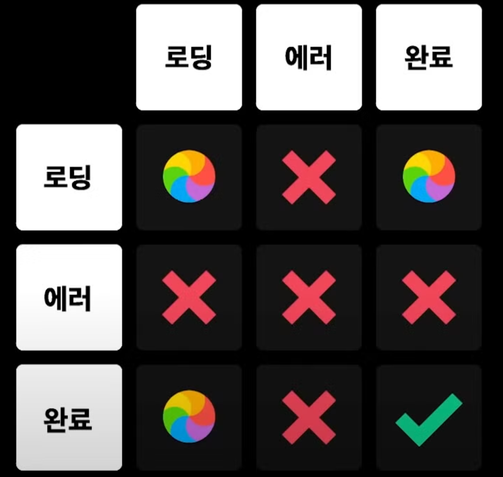

정신없이 9월을 보내다 보니 8월이 끝나고도 벌써 15일이나 지나버렸다. 조금 늦었지만 8월을 회고하고 9월의 계획을 세워보려 한다.

## 8월의 액션아이템

7월에 계획했던 8월의 액션아이템은 아래 4가지이다. 이중 앞선 2가지는 완료했지만, useFunnel 라이브러리 분석 후 오픈소스 분석 과정 공유하기와 컴포넌트 설계 추가 작업 진행하기는 하지 못했다.

- MMKV 데이터 스토리지 라이브러리 적용 후 성능 개선 결과 정리하기
- React Query를 이용한 비동기 상태 개선 방향 공유하기
- useFunnel 라이브러리 분석 후 오픈소스 분석 과정 공유하기
- 컴포넌트 설계 추가 작업 진행하기

### MMKV 데이터 스토리지 라이브러리 적용 후 성능 개선 결과 정리하기

지난 달에 벤치마크 지표들을 공유하면서 기존 사용하던 Async Storage에서 마이그레이션할 라이브러리를 MMKV로 정했고, 이번 달에는 실제 마이그레이션을 진행했다.

이전 발표에서 앱시작과정에서 API 호출과 함께 데이터를 가져오는 시간을 측정했던 부분이 API 의존성을 제거했을 때 수치를 보면 더 좋을 것 같다는 의견을 주셨고,
개발 환경에서 앱을 빌드하고 비교해 보았을 때 MMKV는 150ms에서 65ms로 50%이상 개선된 결과를 보였다.

하지만 로컬 DB자체를 제품내에서 사용하는 경우가 많지 않아 엄청나게 큰 개선을 가져오지는 못할 것으로 보이지만, Async Storage에서 간혹 200ms까지 걸리는 조회 시간이 있었기 때문에, 이를 개선하는 건 의미있다고 생각이 들었다.

#### 작업 내용

마이그레이션 작업은 이전 마이그레이션 작업들에 비해 상대적으로 간단했지만, 테스트나 기존 코드들이 Async Storage 자체에 의존하고 있어서 이를 수정하는 작업이 조금 까다로웠다.
이를 해결하기 위해서 기존 아키텍처에서 AsyncStorage 자체에 의존하기 보다 인터페이스를 의존하게 해 이후 다른 라이브러리로 전환하더라도 최소한의 수정으로 가능하도록 설계를 변경하는 작업이 필요했다.

```typescript
// 기존 예시

class KeyValueStorage {
  async setItem(key, value) {
    await AsyncStorage.setItem(key, value)
  }
  async getItem(key) {
    return AsyncStorage.getItem(key)
  }
}

class Repository {
  constructor() {
    this.storage = new KeyValueStorage()
  }

  async getLocalData(key) {
    return this.storage.getItem(key)
  }
}

// 이후

interface Storage {
  getItem: (key: string) => Promise<string | null>
  setItem: (key: string, value: string) => Promise<void>
}
const storage: Storage = new MMKVStorage()

class MMKVStorage implements Storage {
  async setItem(key, value) {
    await storage.set(key, value)
  }
  async getItem(key) {
    // 기존과 호환을 위해 JSON.parse를 사용
    const value = storage.getString(key)
    return value ? JSON.parse(value) : null
  }

  async setItem(key, value) {
    storage.set(key, JSON.stringify(value))
  }
}

class Repository {
  constructor(storage: Storage) {
    this.storage = storage
  }

  async getLocalData(key) {
    return this.storage.getItem(key)
  }
}

const repository = new Repository(storage)
```

조금 아쉬웠던 부분은 MMKV 라이브러리 자체가 AsyncStorage와는 다르게 기본 자료형들을 바로 가져올 수 있게 지원하지만, 기존 AsyncStorage와의 호환성을 위해 JSON.Stringinfy가 필요하고, 기존 인터페이스를 맞추기 위해 불필요한 promise를 반환해야 했다.

추가로 유틸들의 테스트가 AsyncStorage에 의존하고 있는 경우에 storage를 주입하는 방식으로 수정하다보니, 오히려 사용처 코드들이 복잡해보이기도 했다. 테스트가 필요한 게 맞는지 조금 더 고민해봐야 할 것 같다.

이후 작업 자체는 모두 완료했지만 아직 Native Module에서 어떻게 토큰을 가져오고 할지에 대해 논의가 진행되면서 배포는 보류되게 되었다.
배포 이후 성능을 측정하고 결과를 정리해보는 작업을 9월 또는 10월에 진행해보려 한다.

### React Query를 이용한 로딩경험 개선 작업 공유하기

React Query를 이용해 Suspense로 비동기 상태를 분리하고, 전역 로딩경험을 개선하는 작업을 완료했다.
작업 자체는 완료했지만, 다양한 도메인에서 작업이 진행된 만큼 QA가 각각 진행이 필요하다보니 완전히 배포를 하지는 못했다.

작업 과정에서 중간중간에 공유하려 했지만, 발표를 하기에 다른 분들의 발표 일정이 겹쳤고, 예비군도 다녀오다 보니 작업과정이 아니라 결과를 공유하는 방식이 되어버렸다.
코드리뷰의 리뷰어로 배정되신 분들은 작업과정에 대해 이해하실 수 있었지만, 다른 분들은 결과만을 보게 된 것 같아 아쉬웠고,
문제의 크기에 비해 너무 어렵게 작업이 된 것 같다는 피드백을 받기도 했다.

해당 피드백을 받으면서 문제를 해결하기 위해서, 필요한 기술을 사용했는데 어떤 부분이 문제였는지 온전히 이해하는데에는 시간이 필요했다.
조금 더 일찍 공유했다면 괜찮았을까 아쉬움이 남아 한동안 괴로워하기도 했다.

기술적 문제를 해결하는 것도 중요하지만, 그 과정에서 다른 분들과 소통하는 것도 중요하다는 것을 다시 한번 느낄 수 있었다.
나름의 성장통을 겪었던 작업이었고, 해당 발표내용을 정리해 9월중으로 해당 작업에 대한 글을 작성해보려 한다.

### 하지 못한 액션아이템

`useFunnel 라이브러리 분석 후 오픈소스 분석 과정 공유하기`와 `컴포넌트 설계 추가 작업 진행하기`는 진행하지 못했다.

8월 동안 아직 `프론트엔드엔드 accelarator 멘토링` 과정 중이었기 때문에 둘째주까지 매주 다른 주제로 과제를 개선시켜나가면서 시간이 부족했다.

9월에는 꼭 이 두가지에 대해 진행해보려 한다.

## 새롭게 진행했던 활동들

7월과 동일하게 프론트엔드엔드 accelarator 멘토링 과정의 3주차, 4주차 과정을 진행해 마무리하게 되었다.
3주차 주제는 우아한 비동기 처리, 4주차는 UX 개선에 대한 주제로 진행되었다. 각 주차별 주제에 대한 내용을 정리해보자.

### 3주차 - 우아한 비동기 상태관리

3주차 주제의 우아한 비동기에는 `Promise`, `async/await`, `Generator`, `Observable` 등 비동기 처리를 어떻게 하면 더 우아하게 할 수 있을지에 대해 이야기했다.

비동기 상태는 사실 React에서 가장 어려운 부분 중 하나라고 생각한다. 하나의 요청에 대해서는 로딩/성공/실패가 발생하고 n개의 요청에 대해서는 3^n개의 상태가 발생할 수 있기 때문이다.

[참고자료: 프론트엔드 웹 서비스에서 우아하게 비동기 처리하기](https://www.youtube.com/watch?v=FvRtoViujGg&t=1s)


"에이, 왠만하면 다 성공하잖아" 라고 생각할 수 있지만, 개발자의 실수, 서버의 장애, 네트워크의 문제 등 다양한 이유로 실패할 수 있기 때문에 이러한 상태를 고려해야 한다.

그리고 이러한 고려를 일일이 manual하게 관리하기에는 코드가 너무 복잡해지거나 특정 로직가 빠지는 경우가 발생할 수 있기 때문에, 선언적인 방식으로 처리했을 때 각 상태에 대한 처리를 놓치지 않을 수 있다.

```tsx
// 명령적인 방식
function Profile(){
	const foo=useAsyncValue(()=>{
		return fetchFoo()
	});

	const bar=useAsyncValue(()=>{
		if(foo.error||!foo.data){
			return undefined
		}
		return fetchBar(foo.data);
	});

	if(foo.error||bar.error) return <div> 로딩 실패.. </div>
	if(!foo.data||!bar.data) return <div> 로딩중... </div>
	return <div>{foo.data.name}님 {bar} 환영합니다. </div>
}

// 선언적인 방식

function FooBar(){
    const foo= useAsyncValue(()=> fetchFoo());
    const bar=useAsyncValue(()=>fetchBar(foo));
    return <div>{foo}{bar}</div>
}

function App(){
    return (
        <ErrorBoundary fallback={<MyErrorPage/>}>
            <Suspenese fallback={<Loader/>}>
                <FooBar/>
            </Suspense>
        </ErrorBoundary>
    )
}
```

이렇게 선언적으로 작성했을 때 기존과 달리 각 상태에 대한 처리를 놓치지 않을 수 있고, 로딩/성공/실패라는 각 비동기 상태에 따른 관심사 분리가 되어 코드가 더욱 깔끔해진다.

이렇게 선언적인 비동기 상태 관리에 대해 의논하고 알아가면서, 3분기 작업중 진행하고 있는 로딩 경험개선 작업을 진행하면서 Suspense를 이용해 선언적으로 비동기 상태를 분리하는 방법을 적용하게 되었다.

추가로 나는 놓쳤던 부분이지만 함께 진행하는 분은 작성된 폼 정보를 여러번 요청할 수 있는 경우를 고려해 Post 요청에 대한 추가 로딩 상태를 구현하는 디테일을 보여주시기도 해서,
내가 놓쳤던 디테일에 대한 부분들을 배울 수 있었다.

```tsx
function Form() {
  const [name, setName] = useState("")
  const [email, setEmail] = useState("")
  const { mutate, isPending } = useMutation({
    mutationFn: submitForm,
    onSuccess: () => {
      navigate("/success")
    },
  })

  return (
    <form
      onSubmit={e => {
        e.preventDefault()
        mutate({ name, email })
      }}
    >
      <input value={name} onChange={e => setName(e.target.value)} />
      <input value={email} onChange={e => setEmail(e.target.value)} />
      <button type="submit" disabled={isPending}>
        제출
      </button>
    </form>
  )
}
```

### 4주차 - UX 개선

UX를 개선하는 방법으로 FCP/LCP 개선 방법과 스켈레톤 UI를 이용한 사용자 체감 로딩 속도를 줄이는 내용에 대해 이야기했다.

FCP/LCP를 개선하는 방법으로 나는 번들의 크기를 줄여서 초기로딩 시간을 개선할 수 있지 않을까 생각하고 작업하게 되었다.
이를 위한 방법으로 코드스플릿팅과 CRA 대신 vite로 마이그레이션하는 방식을 적용해보았다.

하지만 아쉽게도 과제 자체의 페이지 수가 많지 않고 CRA의 webpack에서 vite의 esbuild와 rollup으로 변경해 본 결과 번들 크기는 차이가 났지만,
FCP에 큰 영향을 주지 못했다.

이러한 접근은 사실 데이터적으로 접근하는데 너무 많은 시간을 투자했고, 결과적으로는 큰 성과를 보지 못했던 것 같다.

다른 분들은 스켈레톤 UI와 화면 전환 애니메이션을 구현하고, 화면 이탈시에 이탈 방지 모달을 노출하는 등 보다 유저가 느낄 수 있는 실질적인 UX 개선을 진행하셨다.
이걸 보면서 유저에게 유의미한 개선은 무엇일지, 어떤 방식으로 개선할 수 있을지에 대해 다시 한번 생각해보고 배울 수 있는 순간이었다.

이렇게 하나의 과제에 대해 다양한 주제로 진행하면서 내가 놓치고 있던 점, 다른 분들께서 중요하게 생각하는 점들을 배울 수 있었던 정말 소중한 시간이었다.
그리고 마음 한켠에 `이제 왠만한 건 다 만들 수 있고, 잘하고 있다`는 생각에 빠져있던 모습을 느꼈고, 다시 한번 겸손해지고 더욱 더 배우고 싶다는 생각이 들었다.

React Native를 이용한 작업도 좋지만 웹개발에 대한 지식을 더욱 더 깊게 배우고 싶다는 생각이 들었다.

## 9월의 액션아이템

글을 작성하는 시점에 9월 중순이 지나가고 있지만, 9월의 액션아이템을 정리해보려한다.

- MMKV 데이터 스토리지 라이브러리 적용 작업 정리하기
- React Query를 이용한 로딩 경험 개선 작업 정리하기
- useFunnel 라이브러리 분석 후 오픈소스 분석 과정 공유하기

이번 달에는 8월에 못했던 작업들과 함께 완료한 작업들에 대해서는 성과와 트러블 슈팅들에 대한 글을 작성해보려한다. 추가로 useFunnel 라이브러리 분석 후 오픈소스 분석 과정을 공유해보려 한다.

8월 한달 동안 다양한 활동을 하면서 새로운 경험을 많이 했고, 이를 토대로 9월에는 더욱 더 성장하고 싶다는 의욕이 생기는 한편, 내가 어디로 가고 싶은지, 어떤 개발자가 되고 싶은지에 대해 다시 한번 고민이 깊어지는 시기를 보내고 있는 것 같다.

앞으로도 더욱 더 성장하고 싶다는 의지를 가지고 9월을 보내보려 한다.
