2023 토스 Slash의 [퍼널: 쏟아지는 페이지 한 방에 관리하기 발표](https://www.youtube.com/watch?v=NwLWX2RNVcw&t=50s)에서 복잡한 퍼널간 상태관리를 위한 라이브러리 useFunnel을 소개했다.

[퍼널: 쏟아지는 페이지 한 방에 관리하기 인트로 ]
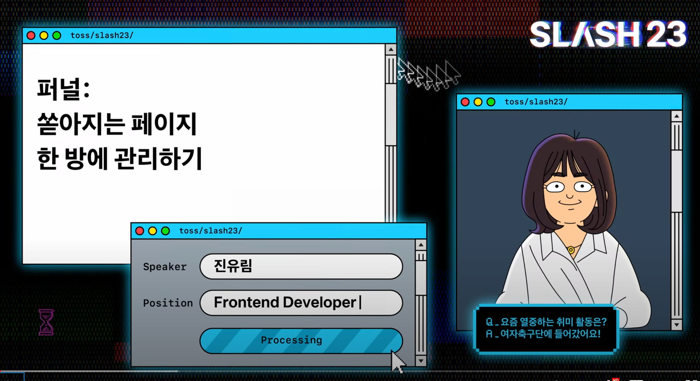

프론트엔드 개발자라면 여러 스텝에 거쳐서 사용자의 입력을 받고, 해당 정보를 제출하는 폼 정보를 다루는 경험을 한번쯤은 하게된다. 그리고 페이지나 스텝이 많아지면 많아질수록 복잡도는 올라가고, 디버깅의 어려움을 겪기도 한다.

현업에서 자주 마주치는 이 문제를 우아하게 풀어낸 토스의 useFunnel 라이브러리를 언젠가 분석하고 적용해봐야겠다고 생각했지만 당시에는 미래의 나에게 맡겨두고(?) 미뤄두었다.

토스의 프론트엔드 accelerator 멘토링 과정의 2주차 주제였던 `퍼널간 상태 관리하기`라는 주제로 과제를 개선하게 되었고, 더이상 미루지말자라는 마음으로 useFunnel 라이브러리를 분석하고 적용해보는 과정을 진행했다.


useFunnel 라이브러리는 당시 Next JS에 의존도를 가지고 있었지만 현재는 타입적으로 강화되었고, Next JS 뿐 아니라 React Router와 같은 다양한 Routing 라이브러리들을 지원할 수 있게 [개선된 버전](https://use-funnel.slash.page/ko)도 만들어졌다.
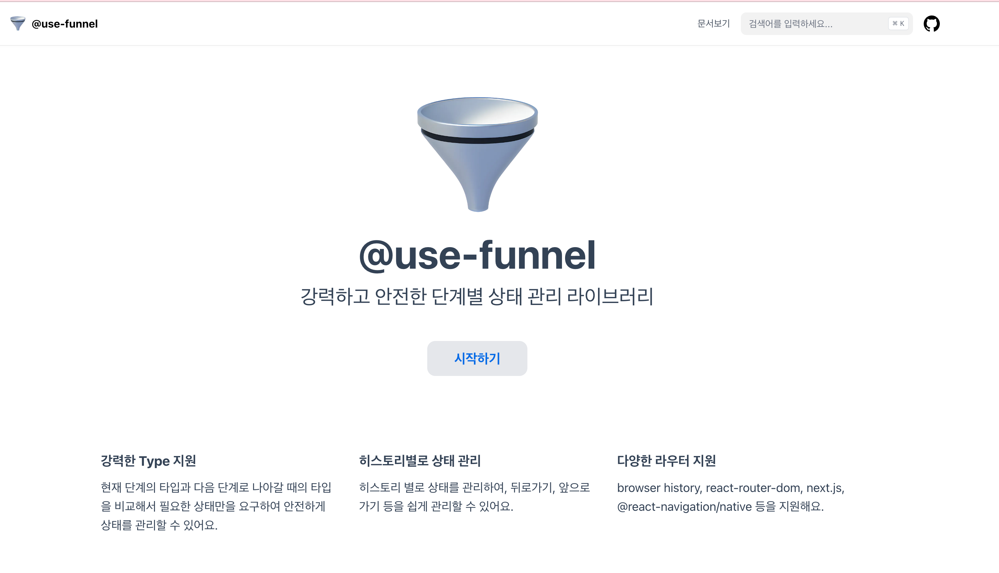

이번 글은 [구 useFunnel 라이브러리](https://www.slash.page/ko/libraries/react/use-funnel/README.i18n) 발표와 라이브러리를 분석하고, 이를 적용해보는 과정을 공유하려 한다.

## useFunnel이 풀고 싶은 문제

### Funnel이란?
Funnel이란 용어는 현재 재직중인 회사에서도 많이 사용하는 용어로, 원래는 마케팅에서 많이 사용하는 용어로 알려져있다.

Funnel의 의미는 깔때기로 번역되며 초기 단계에 많은 사용자가 들어오다가, 중간 단계에서는 일부 사용자가 빠져나가고, 마지막 단계에서는 일부 사용자만 남게되는 형태를 의미한다.

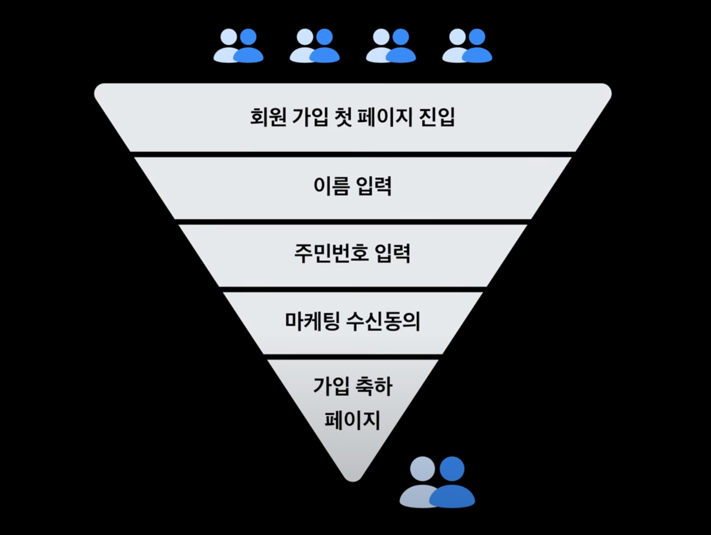

그러면 이러한 Funnel 형태로 구성되는 디자인을 알아보자.

### 디자인 요구사항 탐방
발표 자료는 휴대폰 가입에 대한 예제로, 각 스텝별로 가입방식, 주민번호, 집주소를 입력한 후에 제출하는 방식을 취하고 있다.

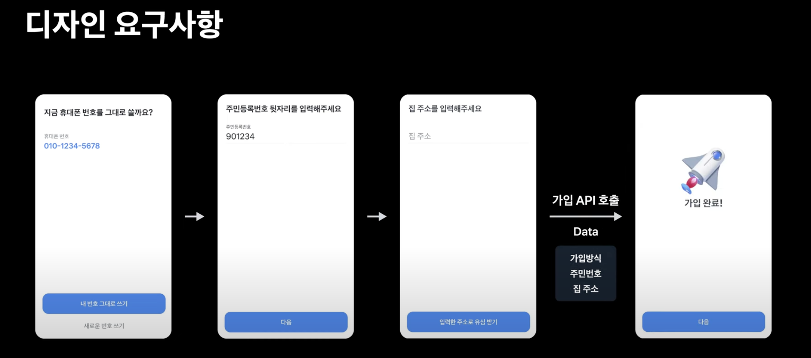

이를 해결하는 방법, useFunnel을 사용하기 전 후로 나눠서 살펴보자.

### useFunnel 전 해결 방법과 예제

useFunnel을 사용하기 전에는 전역상태를 사용하여 데이터를 관리하고, 각 스텝을 페이지로 별로 관리하고, 제출 API를 호출할 때 모아온 데이터를 담아 발송하는 방식으로 구현할 수 있다.

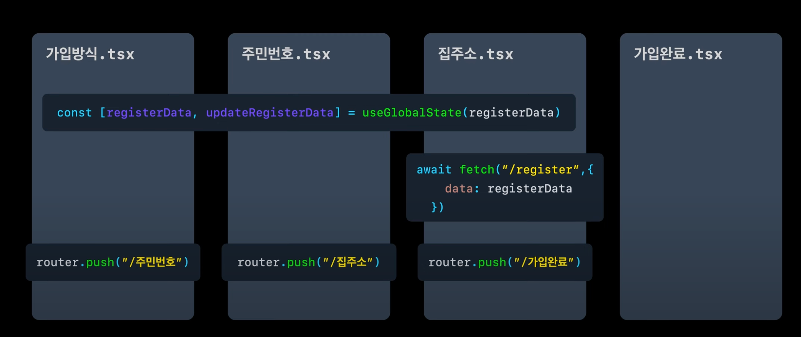

발표보다 조금 더 간단히 이동 버튼을 누르면 전역 상태를 업데이트 하고 마지막 집 주소 스텝에서는 alert를 보여주고 제출 완료 화면에서 작성된 내용을 출력하는 예제를 작성해 보았다.

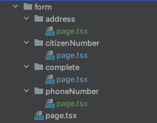

```tsx
export default function PhoneNumberPage() {
    const setForm=useFormStore(state=>state.setForm)
    const router=useRouter();

    const handleClick=()=>{
        setForm({phoneNumber:'010-1234-5678'})
        router.push('/form/citizenNumber')
    }

    return (
        <div className={styles.page}>
            <main className={styles.main}>
                <h1>휴대전화 입력</h1>
                <button className={styles.primary} onClick={handleClick}>주민번호 입력 스텝으로 이동</button>
            </main>
        </div>
    );
}


export default function CitizenNumberPage() {
    const setForm=useFormStore(state=>state.setForm)
    const phoneNumber=useFormStore(state=>state.form.phoneNumber)
    const router=useRouter();

    const handleClick=()=>{
        setForm({citizenNumber:'123456789'})
        router.push('/form/address')
    }
    return (
        <div className={styles.page}>
            <main className={styles.main}>
                <h1>주민번호 입력</h1>
                <p>{`입력된 휴대번호: ${phoneNumber}`}</p>
                <button className={styles.primary} onClick={handleClick}>주소입력 스텝으로 이동</button>
            </main>
        </div>
    );
}


// 전역 스토어

const initialForm: Form = {
    phoneNumber: '',
    address: '',
    citizenNumber: '',
}

export const useFormStore = create<StoreType>((set) => ({
    form: initialForm,
    setForm: (form:Partial<Form>) => set(state=>{
        return{
            ...state,
            form:{
                ...state.form,
                ...form
            }
        }
    }),
    resetForm: () => set({ form: initialForm }),
}))
```

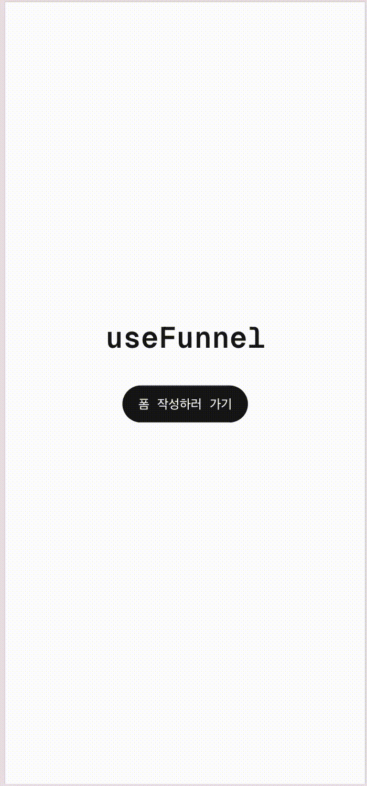

요구사항을 모두 충족하면서 정석적인 방법이지만, 두가지 유지보수의 어려움이 존재하게 된다.

1. 스텝별로 어떤 데이터/ 어떤 스텝으로 이동하는지 **페이지를 들어가야 알 수 있다**
2. 상태를 수집하는 곳과 사용하는 곳이 달라 **수정할 때 전체 흐름을 추적해야한다**

위 두가지 문제를 어떻게 해결한 useFunnel 훅에 대해 알아보자.

### useFunnel을 이용한 해결 방법

위 문제를 해결하기 위해서 우선 여러개의 페이지로 구성된 스텝을 **하나의 페이지**에서 관리하고 각 스텝들은 조건부 렌더링을 이용해 하위 컴포넌트로 변경해 **스텝별 UI 흐름을 한눈에 추적하기 쉽게** 개선할 수 있다.

그리고 기존 전역상태로 관리하던 폼 데이터는 지역상태로 둠으로써 스텝과 데이터가 한곳에서 관리하게 되고, 사용하는 곳과 업데이트 하는 곳 모두 하나의 파일내 작성해 **응집도를 높이는 이점**을 가질 수 있다.

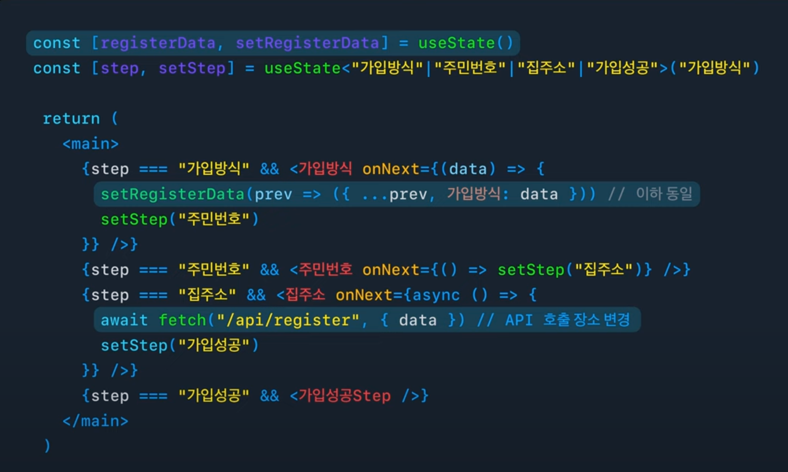

그러면 이에 맞게 이전 예제를 리팩토링해보자.


```tsx

export type Form= {
    phoneNumber: string,
    address: string,
    citizenNumber: string,
}

const initialForm: Form = {
    phoneNumber: '',
    address: '',
    citizenNumber: '',
}

export default function FormPage(){
    const [form, setForm] = useState<Form>(initialForm);
    const [step, setStep] = useState<'주민번호'|'주소'|'핸드폰번호'|'제출완료'>('핸드폰번호');

    return (
        <div className={styles.page}>
            <main className={styles.main}>
                {step==='핸드폰번호' && (
                    <PhoneNumberStep onNext={(phoneNumber:Form['phoneNumber'])=>{
                        setForm(prev=>({...prev, phoneNumber}));
                        setStep('주민번호');
                    }}/>
                )}
                {step==='주민번호' && (
                    <CitizenNumberStep phoneNumber={form.phoneNumber} onNext={(citizenNumber:Form['citizenNumber'])=>{
                        setForm(prev=>({...prev, citizenNumber}));
                        setStep('주소');
                    }}/>
                )}
                {step==='주소' && (
                    <AddressStep phoneNumber={form.phoneNumber} citizenNumber={form.citizenNumber} onNext={async(address:Form['address'])=>{
                        try{
                            // 제출 로직
                            await new Promise((resolve)=>{
                                setTimeout(resolve, 1000);
                            })
                            setForm(prev=>({...prev, address}));
                            setStep('제출완료');
                        }catch (error:unknown){
                            alert(`제출 실패: ${error}`);
                            return;
                        }
                    }}/>
                )}

                {step==='제출완료' && (
                    <CompleteStep form={form}/>
                )}
            </main>
        </div>
    );
};

// 주민번호 스텝 컴포넌트
'use client'

import styles from "@/app/page.module.css";
import {Form} from "@/app/registerForm/page";


type CitizenNumberPageProps={
    phoneNumber:Form['phoneNumber']
    onNext:(citizenNumber:Form['citizenNumber'])=>void;
}

export function CitizenNumberStep({phoneNumber,onNext}:CitizenNumberPageProps) {
    const handleClick=()=>{
        onNext('123456789')
    }
    return (
        <>
            <h1>주민번호 입력</h1>
            <p>{`입력된 휴대번호: ${phoneNumber}`}</p>
            <button className={styles.primary} onClick={handleClick}>주소입력 스텝으로 이동</button>
        </>
    );
}

```

위 리팩토링한 예제 코드를 통해 보면 발표처럼 여러 페이지가 아니라 하나의 페이지로, 전역상태로 폼 데이터를 관리하는 것이 아니라 지역상태로 관리하고, 각 스텝별로 조건부 렌더링을 통해 UI를 관리하는 것을 확인할 수 있다.


동작도 기존과 동일하게 작동하며, 새로운 스텝이 생겨도 조건부 렌더링 조건을 추가하면 되고, 제출을 다른 스텝에서 진행해야 하더라도 prop만 변경하면 되어, **코드의 가독성과 유지보수성**이 향상되었다.

## useFunnel 라이브러리 따라 만들어가기

그러면 이제 useFunnel 라이브러리를 따라 만들어가보자. 발표에서 순차적으로 추상화 과정이 잘 설명되어있어서 그대로 순차적으로 만들어가보려 한다.

### 1. 조건부 렌더링 추상화
먼저 조건부 렌더링 부분을 Step이라는 컴포넌트로 추상화할 수 있다. 조건이 맞을 때에만 보여줄 수 있게 하는 컴포넌트로 발표에서는 if라는 property로,
예제에서는 show라는 property로 적용해보았다.

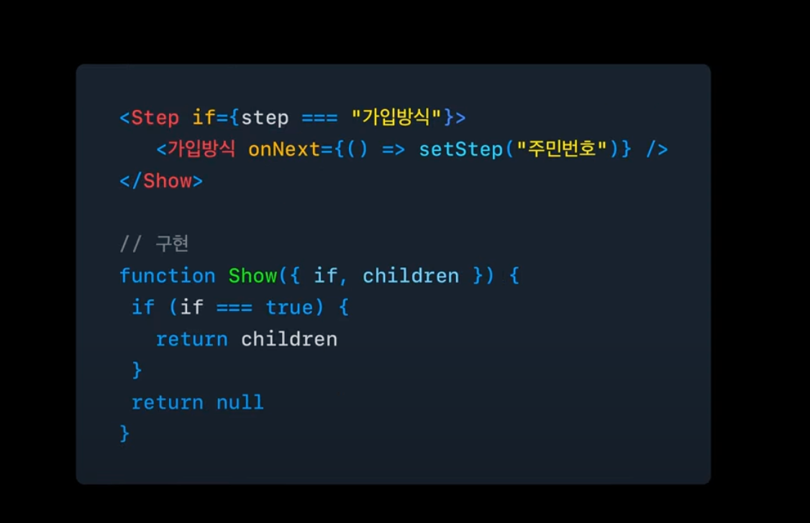

```tsx
export default function FormPage(){
    const [form, setForm] = useState<Form>(initialForm);
    const [step, setStep] = useState<'주민번호'|'주소'|'핸드폰번호'|'제출완료'>('핸드폰번호');

    return (
        <div className={styles.page}>
            <main className={styles.main}>
                <Step show={step==='핸드폰번호'}>
                    <PhoneNumberStep onNext={(phoneNumber:Form['phoneNumber'])=>{
                        setForm(prev=>({...prev, phoneNumber}));
                        setStep('주민번호');
                    }}/>
                </Step>
                <Step show={step==='주민번호'}>
                    <CitizenNumberStep phoneNumber={form.phoneNumber} onNext={(citizenNumber:Form['citizenNumber'])=>{
                        setForm(prev=>({...prev, citizenNumber}));
                        setStep('주소');
                    }}/>
                </Step>
                <Step show={step==='주소'}>
                    <AddressStep phoneNumber={form.phoneNumber} citizenNumber={form.citizenNumber} onNext={async(address:Form['address'])=>{
                        try{
                            // 제출 로직
                            await new Promise((resolve)=>{
                                setTimeout(resolve, 1000);
                            })
                            setForm(prev=>({...prev, address}));
                            setStep('제출완료');
                        }catch (error:unknown){
                            alert(`제출 실패: ${error}`);
                            return;
                        }
                    }}/>
                </Step>

                <Step show={step==='제출완료'}>
                    <CompleteStep form={form}/>
                </Step>
            </main>
        </div>
    );
};

// Step 컴포넌트
export function Step({ show, children }: PropsWithChildren<{ show: boolean }>) {
    if (!show) {
        return null;
    }
    return <>{children}</>;
}
```

### 2. 반복되는 조건문과 Step 상태 추상화
step에 조건문을 반복하지 않고, 단순히 어떤 스텝인지만 넘겨주면, 현재 step과 비교하여 조건부 렌더링을 할 수 있게 추상화해보자.

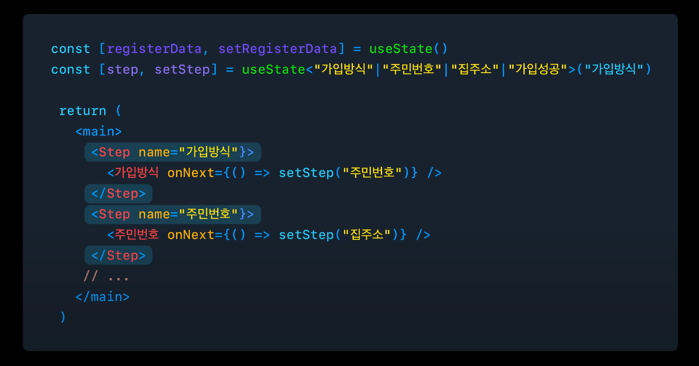

이를 위해서 드디어 오늘 주제인 useFunnel 훅이 나오게 된다. 현재 스텝을 Step 컴포넌트가 알기 위해서는 이를 관리하는 Funnel이라는 컴포넌트로 children으로 전달되는 Step들중 현재와 일치하는 step만 렌더링하게 할 수 있다.

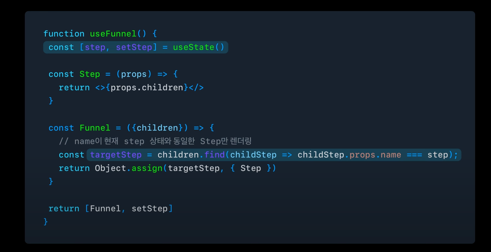

예제 코드에 적용해보자.

```tsx
export default function FormPage(){
    const [form, setForm] = useState<Form>(initialForm);
    const [Funnel,setStep]=useFunnel();

    return (
        <Funnel>
            <Funnel.Step name={'핸드폰번호'}>
                <PhoneNumberStep onNext={(phoneNumber:Form['phoneNumber'])=>{
                    setForm(prev=>({...prev, phoneNumber}));
                    setStep('주민번호');
                }}/>
            </Funnel.Step>
            <Funnel.Step name={'주민번호'}>
                <CitizenNumberStep phoneNumber={form.phoneNumber} onNext={(citizenNumber:Form['citizenNumber'])=>{
                    setForm(prev=>({...prev, citizenNumber}));
                    setStep('주소');
                }}/>
            </Funnel.Step>
            <Funnel.Step name={'주소'}>
                <AddressStep phoneNumber={form.phoneNumber} citizenNumber={form.citizenNumber} onNext={async(address:Form['address'])=>{
                    try{
                        // 제출 로직
                        await new Promise((resolve)=>{
                            setTimeout(resolve, 1000);
                        })
                        setForm(prev=>({...prev, address}));
                        setStep('제출완료');
                    }catch (error:unknown){
                        alert(`제출 실패: ${error}`);
                        return;
                    }
                }}/>
            </Funnel.Step>
            <Funnel.Step name={'제출완료'}>
                <CompleteStep form={form}/>
            </Funnel.Step>
        </Funnel>
    );
};


// useFunnel 훅 
type StepProps={
    children:React.ReactNode;
}

function Step({children}:StepProps) {
    return <>{children}</>;
}


type FunnelProps={
    children:React.ReactNode;
    step:'주민번호'|'주소'|'핸드폰번호'|'제출완료';
}


export function useFunnel(){
    const [step, setStep] = useState<'주민번호'|'주소'|'핸드폰번호'|'제출완료'>('핸드폰번호');
    const FunnelComponent=({children}:FunnelProps)=> {
        const validSteps=Children.toArray(children).filter(isValidElement)
        const targetStep=validSteps.find((children:React.ReactElement<{name:'주민번호'|'주소'|'핸드폰번호'|'제출완료'}>)=>children.props.name===step)

        if(targetStep==undefined){
            throw new Error(`${step} 스텝 컴포넌트를 찾지 못했습니다.`)
        }

        return targetStep;
    }

    return [Object.assign(FunnelComponent,{Step}),setStep] as const;
}
```

발표 자료의 코드는 짧은 시간내의 이해도를 위해 조금 더 간소화 버전을 소개해주셨지만 [useFunnel 오픈 소스](https://github.com/toss/slash/blob/main/packages/react/use-funnel/src/Funnel.tsx)를 보면 예제 코드처럼 유효한 children만 필터링하여 현재 step과 일치하는 step만 렌더링하는 방식으로 구현되어있다.

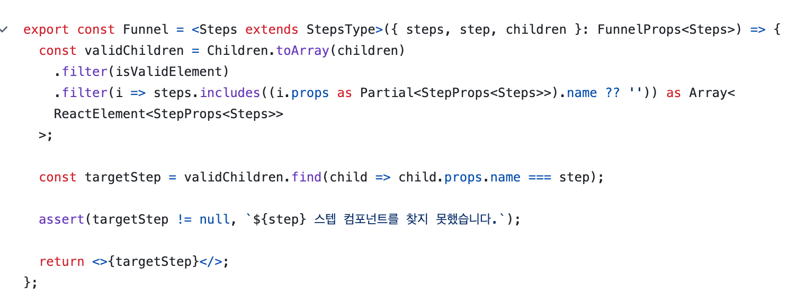

여기서 또한 볼 수 있는 것은 외부에 노출할 필요가 없는 Step 컴포넌트를 useFunnel 내부에 숨기고, 외부에 노출할 Funnel 컴포넌트만 노출하는 **Compound 패턴**으로 컴포넌트 간 관계를 잘 보여주고 있다.

### 3. Steps 타입 추상화

발표내용에는 없지만 예제 코드에 구현한 훅은 현재 타입이 내부에서 하드코딩되어있어, 이를 추상화하여 외부에서 타입을 지정할 수 있게 만들어보려 한다.
이 작업은 오픈소스 코드에서 어떻게 타입을 관리하고 있는지를 참고해 구현해보았다.

```tsx
export default function FormPage(){
    const [form, setForm] = useState<Form>(initialForm);
    const [Funnel,setStep]=useFunnel({
        steps:['핸드폰번호','주민번호','주소','제출완료'] as const
    });

    return (
        // ...
    );
};


// useFunnel 훅

type NonEmptyArray<T> = readonly [T, ...T[]];
type StepsType = NonEmptyArray<string>;

type StepProps<Steps extends StepsType> = {
    name: Steps[number];
    children: ReactNode;
};

function Step<Steps extends StepsType>({ children }: StepProps<Steps>) {
    return <>{children}</>;
}

type FunnelProps<Steps extends StepsType> = {
    children: Array<ReactElement<StepProps<Steps>>>;
    steps: Steps;
    step: Steps[number];
};

function Funnel<Steps extends StepsType>({children, step, steps}: FunnelProps<Steps>) {
    const validSteps = Children.toArray(children)
        .filter(isValidElement)
        .filter((child) => {
            return steps.includes(
                (child.props as Partial<StepProps<Steps>>).name ?? ""
            );
        }) as Array<ReactElement<StepProps<Steps>>>;

    const targetStep = validSteps.find(
        (children) => children.props.name === step
    );

    if (targetStep == undefined) {
        throw new Error(`${step} 스텝 컴포넌트를 찾지 못했습니다.`);
    }

    return targetStep;
}

type RouteFunnelProps<Steps extends StepsType> = Omit<
    FunnelProps<Steps>,
    "steps" | "step"
>;

type FunnelComponent<Steps extends StepsType> = ((
    props: RouteFunnelProps<Steps>
) => ReactElement) & {
    Step: (props: StepProps<Steps>) => ReactElement;
};

export function useFunnel<Steps extends StepsType>(steps: Steps) {
    const [step, setStep] = useState<Steps[number]>(steps[0]);
    const FunnelComponent: FunnelComponent<Steps> = useMemo(
        () =>
            Object.assign(
                function RouteFunnel(props: RouteFunnelProps<Steps>) {
                    return (
                        <Funnel<Steps> steps={steps} step={step}>
                            {props.children}
                        </Funnel>
                    );
                },
                { Step }
            ),
        // eslint-disable-next-line react-hooks/exhaustive-deps
        []
    );

    return [FunnelComponent, setStep] as const;
}

```

위 코드는 useFunnel 오픈소스 코드를 거의 그대로 가져온 코드로 추상화된 훅을 사용하면서 외부에서 타입을 지정할 수 있게 만들어보았다.
각 코드들을 조금씩 뜯어보면서 왜 각각이 필요한지 정리해보자.

- StepsType

```tsx
type NonEmptyArray<T> = readonly [T, ...T[]];
type StepsType = NonEmptyArray<string>;
```

StepsType은 빈배열이 아님을 타입적으로 보장하고, 전달하는 스텝 배열에 따라 `리터럴`로 타입을 좁혀주기 위해, **readonly**로 되어 있다.
Generic으로 받은 Steps 타입은 StepProps와 FunnelProps에서 사용되어, 각각의 컴포넌트에서 사용할 수 있게 되었다.

- StepProps

```tsx
type StepProps<Steps extends StepsType> = {
    name: Steps[number];
    children: ReactNode;
};

function Step<Steps extends StepsType>({ children }: StepProps<Steps>) {
    return <>{children}</>;
}
```

StepProps는 Step 컴포넌트에서 사용할 타입을 정의한 것으로, name은 **전달된 Steps 배열의 요소중 하나**로 타입을 좁힌다.

- FunnelProps

```tsx

type FunnelProps<Steps extends StepsType> = {
    children: Array<ReactElement<StepProps<Steps>>>;
    steps: Steps;
    step: Steps[number];
};

function Funnel<Steps extends StepsType>({children, step, steps}: FunnelProps<Steps>) {
    const validSteps = Children.toArray(children)
        .filter(isValidElement)
        .filter((child) => {
            return steps.includes(
                (child.props as Partial<StepProps<Steps>>).name ?? ""
            );
        }) as Array<ReactElement<StepProps<Steps>>>;

    const targetStep = validSteps.find(
        (children) => children.props.name === step
    );

    if (targetStep == undefined) {
        throw new Error(`${step} 스텝 컴포넌트를 찾지 못했습니다.`);
    }

    return targetStep;
}
```

FunnelProps는 Funnel 컴포넌트의 Prop을 지정한 부분이고 Funnel 내부에 유효한 children으로 필터링하는 과정에서 타입 단언으로 작성되어 있다.
타입 단언으로 작성된 이유가 뭘까하고 제거해보았을 때, 아래 `children.props.name`에서 `name`이 정의되어 있지 않다는 에러가 발생하기 때문에 타입 단언을 사용한 것으로 보인다.

- FunnelComponent

```tsx

type RouteFunnelProps<Steps extends StepsType> = Omit<
    FunnelProps<Steps>,
    "steps" | "step"
>;

type FunnelComponent<Steps extends StepsType> = ((
    props: RouteFunnelProps<Steps>
) => ReactElement) & {
    Step: (props: StepProps<Steps>) => ReactElement;
};

export function useFunnel<Steps extends StepsType>(steps: Steps) {
    const [step, setStep] = useState<Steps[number]>(steps[0]);
    const FunnelComponent: FunnelComponent<Steps> = useMemo(
        () =>
            Object.assign(
                function RouteFunnel(props: RouteFunnelProps<Steps>) {
                    return (
                        <Funnel<Steps> steps={steps} step={step}>
                            {props.children}
                        </Funnel>
                    );
                },
                { Step }
            ),
        // eslint-disable-next-line react-hooks/exhaustive-deps
        []
    );

    return [FunnelComponent, setStep] as const;
}
```

RouteFunnel은 Funnel 컴포넌트를 분리하는 대신 바로 작성해도 동작에는 문제가 없지만 코드 가독성을 위해 분리시키신 것으로 보였다.
FunnelComponent 타입 Step 컴포넌트의 타입을 지정해줌으로서 **Step의 name이 전달받은 Steps 배열의 요소중 하나임을 보장**할 수 있게된다.

해당 타입 없이도 StepsType을 사용하면서 자동으로 좁혀지지 않을까 했지만, 타입 지정전에는 단순 컴포넌트로 암묵적으로 추론되면서 name에 지정된 값이 아닌 다른값을 넣거나, Steps로 빈배열을 넣어도 타입에러가 안나게 된다.

<table width="100%">
    <tr>
        <th>타입 지정 전</th>
    </tr>
    <tr>
        <td>
            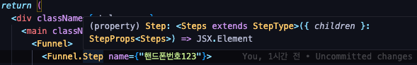
        </td>
    </tr>
    <tr>
        <th>타입 지정 후</th>
    </tr>
    <tr>
        <td>
            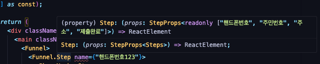
        </td>
    </tr>
</table>

### 4. 히스토리 관리
하나의 페이지로 관리하게 되면서 가독성은 올라가게 되었지만 뒤로가기를 했을 때 스텝별 히스토리가 유지되지 못하게 되었다. 

해당 문제를 해결하기 위해 발표 내용을 참고해보면 step을 상태가 아니라 **QueryParam**으로 관리하는 방식으로 해결했다.
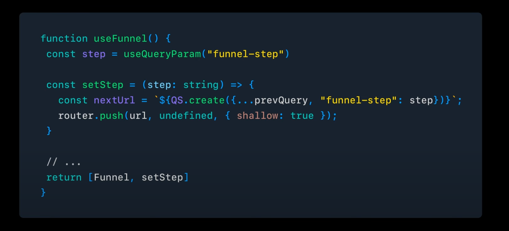

위 방법과 같이 예제코드에 적용해보자.

```tsx

// QS
function createQueryString(params: Record<string, any>) {
    const queryString = createSearchParamString(params);

    if (queryString === "") {
        return "";
    }

    return `?${queryString}`;
}

function createSearchParamString(params: Record<string, any>) {
    return new URLSearchParams(
        Object.entries(params)
            .filter(([, value]) => value != null)
            .map(([key, value]) => {
                if (Array.isArray(value)) {
                    return value.map((x) => [key, x]);
                }
                return [[key, value]];
            })
            .flat()
    )
        .toString()
        .replace(/\+/g, "%20");
}

export const QS = {
    create: createQueryString,
};

// useFunnel 훅
interface SetStepOptions {
    stepChangeType?: "push" | "replace";
}

const STEP_QUERY_KEY = "funnel-step";

export function useFunnel<Steps extends StepsType>(
    steps: Steps,
    initialStep: Steps[number]
) {
    const router = useRouter();
    const setStep = useCallback(
        (step: Steps[number], setStepOptions?: SetStepOptions) => {
            const url = `${QS.create({
                [STEP_QUERY_KEY]: step,
            })}`;

            switch (setStepOptions?.stepChangeType) {
                case "replace":
                    router.replace(url);
                    return;
                case "push":
                default:
                    router.push(url);
                    return;
            }
        },
        [router]
    );

    const FunnelComponent: FunnelComponent<Steps> = useMemo(
        () =>
            Object.assign(
                function RouteFunnel(props: RouteFunnelProps<Steps>) {
                    const step = useQueryParam(STEP_QUERY_KEY) ?? initialStep;
                    return (
                        <Funnel<Steps> steps={steps} step={step}>
                            {props.children}
                        </Funnel>
                    );
                },
                {Step}
            ),
        []
    );

    return [FunnelComponent, setStep] as const;
}
```

QueryParam으로 Step을 관리하게 되면서 더이상 step 지역상태는 불필요하게 되었고, setStep의 옵션으로 push와 replace에 따라 히스토리를 관리할 수 있게 되었다.

<table>
    <tr>
        <th>히스토리 관리 전 뒤로가기</th>
        <th>히스토리 관리 후 뒤로가기</th>
    </tr>
    <tr>
        <td>
            
        </td>
        <td>
            
        </td>
    </tr>
</table>

### 5. 폼 데이터 관리
발표는 히스토리 관리까지를 라이브러리 작업에 대한 소개로 마무리했지만, 오픈 소스 코드를 보면 폼 데이터 관리에 대한 부분도 있어서 추가해보았다.

코드 중에는 데이터 스토리지를 이용해 이전 작성한 값들을 저장하고 불러오는 로직도 있었지만, 현재 예제에서는 생략하였다.

```tsx

export type Form = {
  phoneNumber?: string;
  address?: string;
  citizenNumber?: string;
};

export default function FormPage() {
  const [Funnel, state, setState] = useFunnel([
    "핸드폰번호",
    "주민번호",
    "주소",
    "제출완료",
  ] as const).WithState<Form>({});

  return (
    <div className={styles.page}>
      <main className={styles.main}>
        <Funnel>
          <Funnel.Step name={"핸드폰번호"}>
            <PhoneNumberStep
              onNext={(phoneNumber: Form["phoneNumber"]) => {
                setState((prev) => ({
                  ...prev,
                  step: "주민번호",
                  phoneNumber,
                }));
              }}
            />
          </Funnel.Step>
          <Funnel.Step name={"주민번호"}>
            <CitizenNumberStep
              phoneNumber={state.phoneNumber}
              onNext={(citizenNumber: Form["citizenNumber"]) => {
                setState((prev) => ({
                  ...prev,
                  step: "주소",
                  citizenNumber,
                }));
              }}
            />
          </Funnel.Step>
          <Funnel.Step name={"주소"}>
            <AddressStep
              phoneNumber={state.phoneNumber}
              citizenNumber={state.citizenNumber}
              onNext={async (address: Form["address"]) => {
                try {
                  // 제출 로직
                  await new Promise((resolve) => {
                    setTimeout(resolve, 1000);
                  });
                  setState((prev) => ({
                    ...prev,
                    step: "제출완료",
                    address,
                  }));
                } catch (error: unknown) {
                  alert(`제출 실패: ${error}`);
                  return;
                }
              }}
            />
          </Funnel.Step>
          <Funnel.Step name={"제출완료"}>
            <CompleteStep form={state} />
          </Funnel.Step>
        </Funnel>
      </main>
    </div>
  );
}


// useFunnel 훅

export function useFunnel<Steps extends StepsType>(
    steps: Steps,
    initialStep?: Steps[number]
) {
    const router = useRouter();
    const _initialStep = initialStep ?? steps[0];
    const setStep = useCallback(
        (step: Steps[number], setStepOptions?: SetStepOptions) => {
            const url = `${QS.create({
                [STEP_QUERY_KEY]: step,
            })}`;

            switch (setStepOptions?.stepChangeType) {
                case "replace":
                    router.replace(url);
                    return;
                case "push":
                default:
                    router.push(url);
                    return;
            }
        },
        [router]
    );

    const FunnelComponent: FunnelComponent<Steps> = useMemo(
        () =>
            Object.assign(
                function RouteFunnel(props: RouteFunnelProps<Steps>) {
                    const step = useQueryParam(STEP_QUERY_KEY) ?? _initialStep;
                    return (
                        <Funnel<Steps> steps={steps} step={step}>
                            {props.children}
                        </Funnel>
                    );
                },
                { Step }
            ),
        // eslint-disable-next-line react-hooks/exhaustive-deps
        []
    );

    type S = Record<string, unknown>;
    type Step = Steps[number];
    type NextState = S & { step?: Step };

    const nextPendingStepRef = useRef<Step | null>(null);
    const nextStateRef = useRef<Partial<S> | null>(null);

    const WithState = <State extends S>(initialState: State) => {
        const [state, _setState] = useState<S>(initialState);
        const setState = useCallback(
            (
                next: Partial<NextState> | ((next: Partial<NextState>) => NextState)
            ) => {
                let nextStepValue: Partial<NextState>;
                if (typeof next === "function") {
                    nextStepValue = next(state);
                } else {
                    nextStepValue = next;
                }

                console.log(nextStepValue);

                if (nextStepValue.step != null) {
                    nextPendingStepRef.current = nextStepValue.step;
                }
                nextStateRef.current = nextStepValue;

                _setState(next);
            },
            [_setState, state]
        );

        useEffect(() => {
            if (nextPendingStepRef.current == null) {
                return;
            }
            if (deepEqual(nextStateRef.current, state)) {
                setStep(nextPendingStepRef.current);
                nextPendingStepRef.current = null;
            }
        }, [state]);

        return [FunnelComponent, state, setState] as const;
    };

    return Object.assign([FunnelComponent, setStep] as const, {
        WithState,
    }) as readonly [
        FunnelComponent<Steps>,
        (step: Steps[number], options?: SetStepOptions) => void
    ] & {
        WithState: <StateExcludeStep extends Record<string, unknown>>(
            initialState: StateExcludeStep
        ) => [
            FunnelComponent<Steps>,
            StateExcludeStep,
            (
                next:
                    | Partial<StateExcludeStep & { step: Steps[number] }>
                    | ((
                    next: Partial<StateExcludeStep & { step: Steps[number] }>
                ) => StateExcludeStep & { step: Steps[number] })
            ) => void
        ];
    };
}

```

setState로 폼 데이터를 업데이트시킨 후에 다음 step으로 이동시키기 위해 nextPendingStepRef와 nextStateRef와 useEffect를 사용한 것으로 보인다.
마지막 타입 단언을 하지 않았을 때 state의 타입이 주입한 타입이 아니라 `Record<string, unknown>`로 추론되기 때문에 타입 단언을 사용한 것으로 보인다.

이렇게 step과 폼 데이터를 함께 관리하게 되면서, 보다 응집도를 높인 훅을 완성할 수 있었다.

## 마치며
useFunnel이란 훅을 너무 좋은 방법이다 생각하다 드디어 직접 분석해보았다.
요구사항들과 해결방법을 코드와 함께 히스토리를 분석해보는 과정에서 더 깊이 있게 공부할 수 있게 되었고, 앞으로도 틈틈히 오픈소스를 분석해보며 더 많은 것을 배워나가야겠다.


