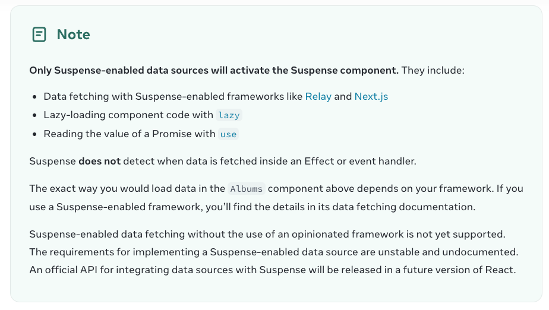
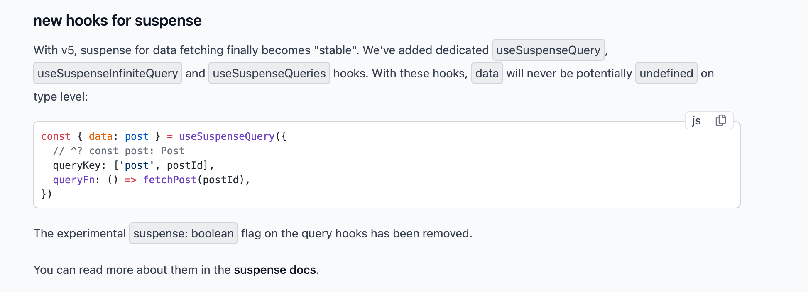
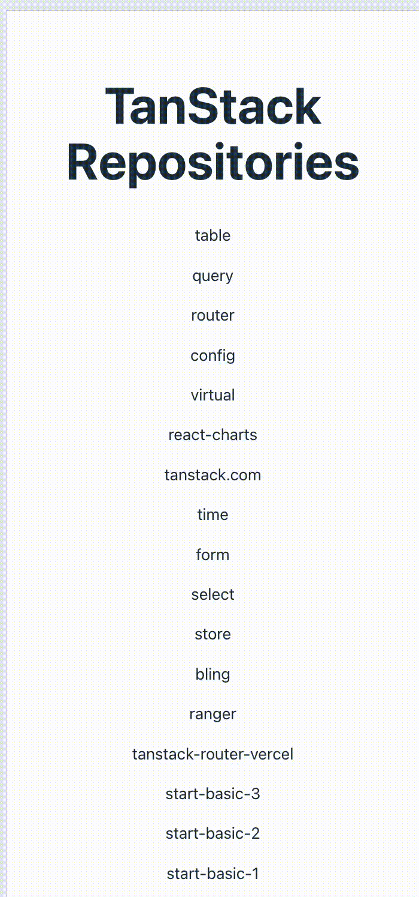
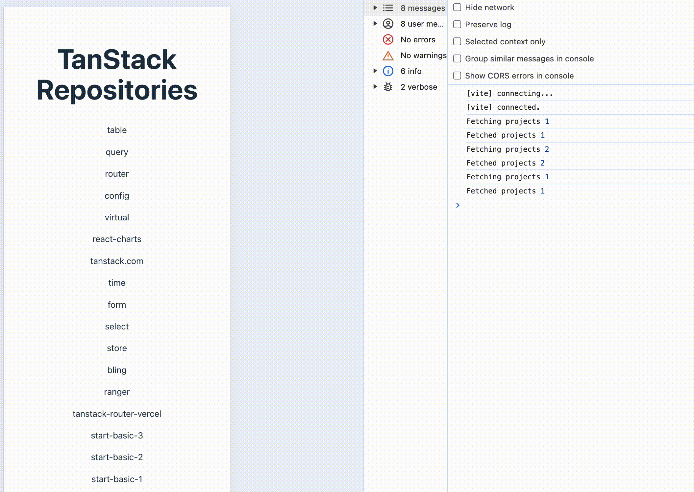
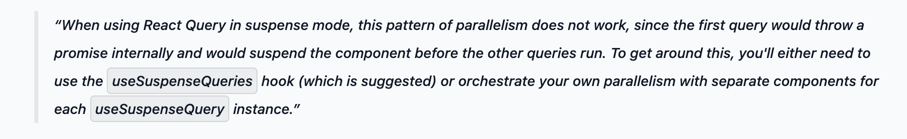
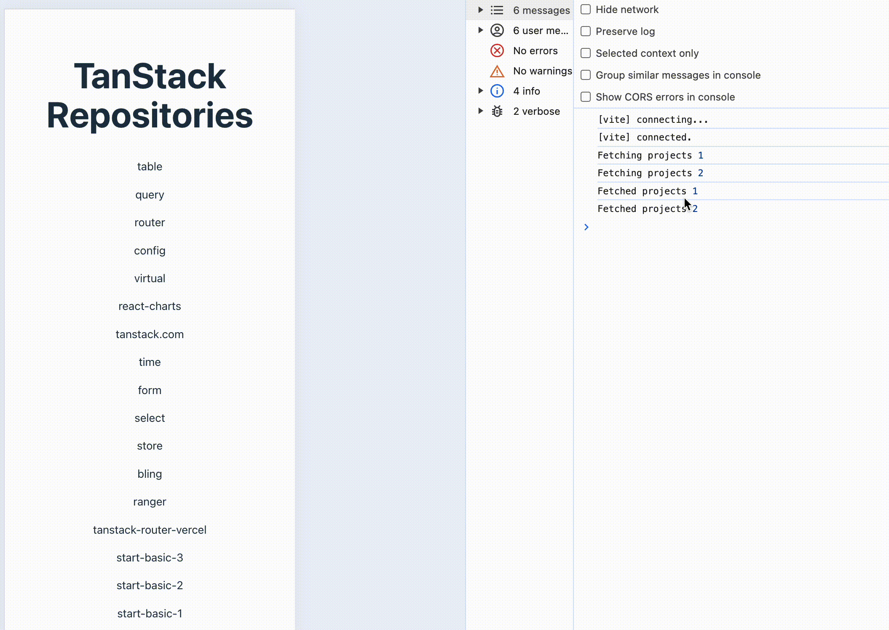
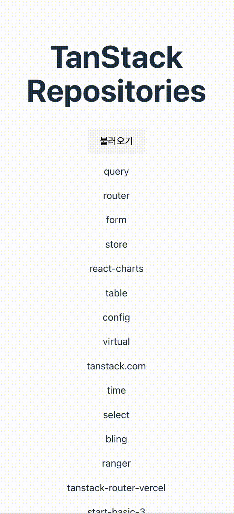
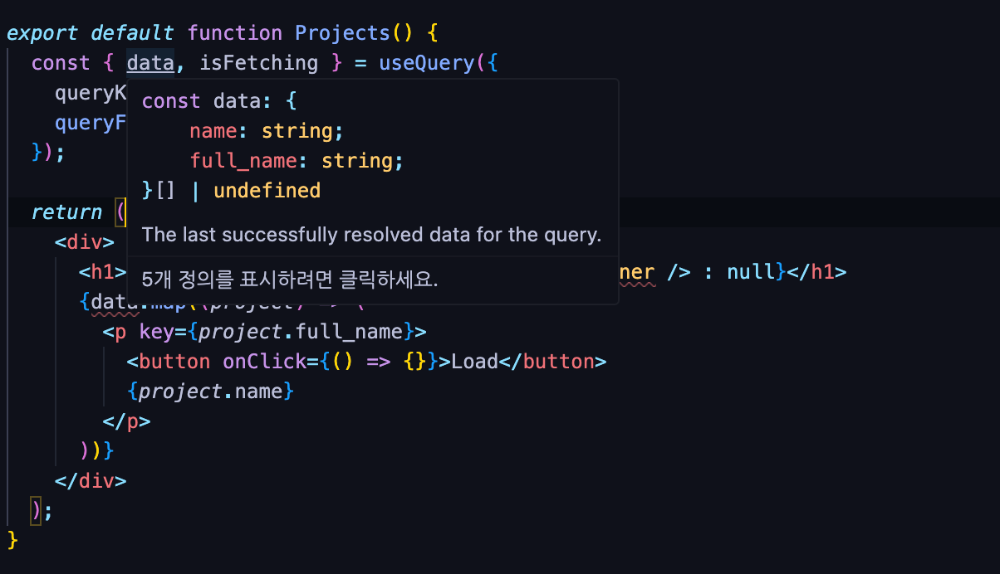
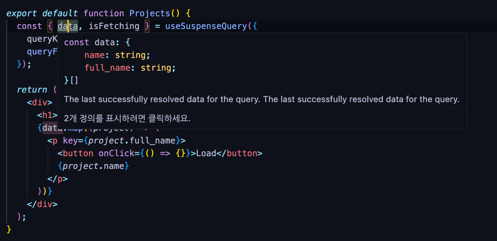
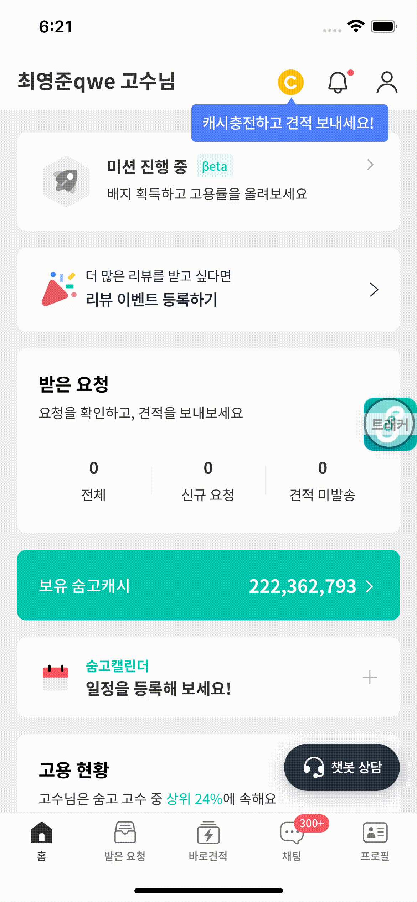

## ❓로딩 경험 개선은 왜 필요할까
일전에 동료분께서 공유해주신 글로 카카오 페이지의 [무조건 스켈레톤 화면을 보여주는게 사용자 경험에 도움이 될까요?](https://tech.kakaopay.com/post/skeleton-ui-idea/)라는 글을 읽게 되었다.
글의 내용을 요약하면 **무조건** 스켈레톤 UI와 같은 로딩 상태를 위한 UI를 보여주는 것이 사용자 경험에 도움이 되지 않는다는 내용이었다.

<table>
    <tr>
        <td>예시 100ms</td>
        <td>예시 300ms</td>
    </tr>
    <tr>
        <td></td>
        <td></td>
    </tr>
</table>

아티클의 예시로 나왔던 이미지 둘을 보면, 100ms는 300ms 응답보다 유저에게 빠르게 와서 더 좋은 상황임에도 불구하고, 
로딩 상태로 인해 **깜빡임이 발생하는 것**처럼 보여 사용자에게 불편함을 줄 수 있다.

이러한 상황은 당시 우리 제품에서도 발생하고 있는 상황이었다.


위 예시처럼 dim처리가 있는 **전역 로딩**을 사용하는 화면들에서 많이 느껴지던 불편함이었고, 진입시 **전역로딩**을 사용하는 화면들을 작업범위로 정하고 작업을 시작했다.

## ❗️로딩 경험 개선을 위한 두가지 접근법
그러면 어떻게 로딩 상태에 대해 개선할 수 있을까? 여기에 대해서는 두가지 접근 방법이 있었다.
각각을 **지연 로딩 시간 설정**과 **최소 로딩 시간 설정**이라고 부르려한다.

### 1. 최소 로딩 시간 설정: 임의로 최소 로딩시간을 주기
최소 로딩 시간 설정 방식은 응답 속도와 무관하게 일정시간을 로딩UI를 노출한 후에 성공/실패 화면을 보여주는 방식으로, 
로딩 시간이 깜빡임으로 느껴지지 않을 만큼 충분히 길게 노출시키는 방식이다.

해당 방식의 장점은 응답속도와 무관하게 적용되기 때문에, 전체 유저에게 일정한 유저 경험을 보장할 수 있다.
하지만 응답이 빠르게 왔지만, 특정 시간만큼 기다려야 하기 때문에 유저 입장에서 불편함을 느낄 수 있다.


### 2. 지연 로딩 시간 설정: 특정 시간만큼의 Delay를 준 후에 노출시키기
지연 로딩 시간 설정 방식은 로딩 UI 노출을 특정시간만큼 지난 후에 노출시키는 방식으로 빠른 응답이 오는 경우에
로딩 UI가 노출되지 않고 성공/실패 화면으로 넘어갈 수 있기 때문에 깜빡임을 방지할 수 있다.

해당 방식의 장점은 응답속도에 따라 로딩 UI를 노출시키기 때문에, 빠른 응답속도를 보장하면서 깜빡임을 방지할 수 있다.
하지만 해당 시간 이후로 걸릴 경우 일부 사람에게는 여전히 깜빡임이 발생할 수 있기 때문에, 기준이 될 시간에 대한 고려가 필요했다.

예를 들어 200ms를 기준으로 지연 로딩 시간을 설정하면, 200ms 이내에 응답이 오면 로딩 UI를 노출하지 않고, 200ms 이후에 응답이 오면 로딩 UI를 노출하는 방식이다.
하지만 250ms가 걸린 경우에는 200ms 이후에 로딩 UI가 노출되기 때문에, 50ms동안 로딩 UI가 보였다 사라지기 때문에 여전히 깜빡임이 발생할 수 있다.

각각 장단점이 있는 방식이기 때문에 고민이 필요해 동료분들의 의견을 여쭤보았고 최소 로딩 시간 설정 방식으로 진행했을 때 **로딩 시간을 임의로 늘리는 것**이기 때문에,
유저에게 안좋을 것 같다는 동료분들의 의견이 있어 **지연 로딩 시간 설정**을 적용하기로 했다.

## 🚀 지연 로딩 시간 설정 적용
전역로딩을 이용하는 화면들에 지연 로딩 시간을 설정하기 위해서는 생각보다 간단했다.

Redux 전역 로딩상태를 구독하고 있는 최상위 컴포넌트에 정의되어 있는 FullScreenLoading 컴포넌트에 지역 상태를 추가한 후에 전역상태가 변경되면
지연시간을 주고 로딩 UI를 노출하도록 구현했다.

```tsx
export const FullScreenLoading: React.FC = () => {
    const globalLoading = useSelector(state=>state.globalLoading);
    const [show, setShow] = useState(false);
    
    useEffect(() => {
        const timeout = setTimeout(() => {
            setShow(visible);
        }, 200);
        return () => {
            clearTimeout(timeout);
        };
    }, [globalLoading]);
    
    return show ? <Loading loading={globalLoading} /> : null;
};
```

하지만 두가지 포인트에 대한 고려가 필요했다.

먼저 전역로딩의 용도가 다양했다. POST 요청 과정에서 여러번 호출되지 않게 막을 때, 발송 과정에서 안드로이드 백버튼과 같이 뒤로가기를 하지 못하게 막는 역할을 함께 하고 있다보니, 
진입시에 필요한 지연 로딩을 전체적으로 적용하는 것이 적절하지 않아 보였다. 

두 번째로는 지연 로딩 시간 설정의 단점인 특정 시간 이상 걸리는 유저에게는 여전히 깜빡임이 발생할 수 있다는 점을 고려해, 페이지별 지연시간 설정이 가능하게 구현하는 게 필요하다고 생각했다.
Redux에 추가적인 속성을 정의해서 해결할 수 있지만, Redux 사용을 지양하는 팀내 컨벤션을 생각해 Redux 의존성을 줄이는 방향으로 구현하려 했다.

Redux 없이 구현하는 방식으로 개인적으로 관심이 많던 **Tanstack Query**와 **Suspense**를 이용해, 로딩 상태를 선언적으로 분리한 후에 지연시간을 설정하는 방식을 적용하기로 했다.

### Suspense로 로딩 상태 선언적으로 분리하기
**Suspense**는 React에서 비동기 상태를 선언적으로 처리하는 방식으로, 에러바운더리는 에러를 suspense는 로딩 상태를 분리할 수 있다.

예를 들어 아래 코드와 같이 컴포넌트 내에서 데이터 조회에 대한 성공/실패/로딩 세가지 경우에 대한 상태가 함께 존재했을 때 분기문이 길어져 코드 가독성이 떨어지고,
일일이 상태를 manual하게 관리하면서 실수가 발생할 수 있다.

```tsx
function MyComponent() {
  const [data, setData] = useState();
  const [isLoading, setIsLoading] = useState(true);
  const [isError, setIsError] = useState(false);
  
  useEffect(() => {
    async function fetchData() {
      try {
        setIsLoading(true);
        const data = await fetchData();
        setData(data);
        setIsLoading(false);
      } catch (error) {
        setIsError(true);
        setIsLoading(false);
      }
    }
    fetchData();
  }, []);
  
  if (isLoading) return <div>Loading data...</div>;
    
  if (isError)
    return (
      <div>
        Oops failed to fetch data! <a href="/home">Home page</a>
      </div>
    );
  
  return (
    <ul>
      {data.map(({ id, name }) => {
        return <li key={id}>{name}</li>;
      })}
    </ul>
  );
}
```

위 코드를 개선해 에러는 에러바운더리, 로딩은 Suspense로 분리하면 우리가 관심을 가지고 있는 성공 상태에 대해서만 신경쓰면 되어 코드 가독성이 향상되고,
선언적인 방식으로 상태를 관리해 개발자의 실수를 줄일 수 있다.

```tsx
function MyComponentContent() {
  const data = useFetchData(); // 임의의 suspense 사용가능한 훅
  return (
    <ul>
      {data.map(({ id, name }) => {
        return <li key={id}>{name}</li>;
      })}
    </ul>
  );
}
function MyComponent() {
  return (
    <ErrorBoundary>
      <Suspense fallback={<div>Loading data...</div>}>
        <DataLoader />
      </Suspense>
    </ErrorBoundary>
  );
}
```

이제 여기에 지연로딩을 위해 전역 로딩 컴포넌트에 적용하는 방식과 유사하게 지연시간을 주고 로딩 UI를 노출하도록 구현해보자.

### 지연 로딩을 위한 Delay 컴포넌트 구현하기
지연 로딩을 위한 컴포넌트를 카카오 페이지 글에서는 **DeferredComponent**라고 명명했지만, 토스의 [Suspensive](https://suspensive.org/) 라이브러리 내의 Delay 컴포넌트를 참고해
조금 더 직관적인 Delay로 정하게 되었다. 아래는 Delay 컴포넌트 구현 코드이다.

```tsx
export const Delay: React.FC<{ ms?: number }> = ({ ms=200, children }) => {
    const [show, setShow] = useState(false);
    
    useEffect(() => {
        const timeout = setTimeout(() => {
            setShow(true);
        }, ms);
        return () => {
            clearTimeout(timeout);
        };
    }, [ms]);
    
    return show ? <>{children}</> : null;
};

// Delay 컴포넌트 사용 예시
function MyComponentContent() {
    const data = useFetchData(); // 임의의 suspense 사용가능한 훅
    return (
        <ul>
            {data.map(({ id, name }) => {
                return <li key={id}>{name}</li>;
            })}
        </ul>
    );
}
function MyComponent() {
    return (
        <ErrorBoundary>
            <Suspense fallback={
                <Delay>
                    <div>Loading data...</div>
                </Delay>
            }>
              <DataLoader />
            </Suspense>
        </ErrorBoundary>
    );
}
```

Delay 컴포넌트는 기존 전역 상태를 이용하는 방식과 유사하게 지연시간을 주고 로딩 UI를 노출하도록 구현했다.
Props으로 ms를 받아 지연시간을 설정할 수 있고, 기본값은 카카오 페이지 글을 참고해 200ms로 설정했다.

하지만, Suspense 자체적으로 아직 Next JS와 같은 프레임워크나, 특정 인터페이스로 데이터를 가져오는 경우가 아니면 사용할 수 없는 한계점이 존재했다.



Suspense를 지원하는 라이브러리들은 Recoil, Relay, Tanstack Query 등이 있고, 다행히 우리 프로젝트에서 아주 일부 사용하고 있던 Tanstack Query가 V5 기준으로 안정적으로 지원하고 있었기 때문에 Tanstack Query를 이용해 적용해보기로 했다.



### Tanstack Query의 SuspenseQuery를 이용한 Suspense 적용
Tanstack Query V5버전에서 suspense를 이용하기 위해서는 새롭게 추가된 `useSuspenseQuery`,`useSuspenseQueries`,`useSuspenseInfiniteQuery` 세가지 훅을 이용해야 한다.

각각에 대한 적용방법을 알아보자.

#### 1. useSuspenseQuery를 이용한 적용
useSuspenseQuery는 **단일 쿼리**에 대해 suspense를 적용할 때 사용한다. 아래 코드는 useSuspenseQuery를 이용해 데이터를 가져오는 코드이다.

```tsx
function MyComponentContent() {
    const {data} = useSuspenseQuery({
        queryKey: 'data',
        queryFn: fetchData,
    }); 
    
    return (
        <ul>
            {data.map(({ id, name }) => {
                return <li key={id}>{name}</li>;
            })}
        </ul>
    );
}
function MyComponent() {
    return (
        <ErrorBoundary>
            <Suspense fallback={
                <Delay>
                    <div>Loading data...</div>
                </Delay>
            }>
              <DataLoader />
            </Suspense>
        </ErrorBoundary>
    );
}
```




#### 2. useSuspenseQueries를 이용한 적용
여러 쿼리에 대해 Suspense를 적용할 때는 각각을 SuspenseQuery로 함께 작성하게 되면 Promise를 순서대로 던지면서 컴포넌트 렌더링이 suspend되게 되기 때문에, 병렬로 처리되지 못하게 된다.



이러한 길어지는 요청시간을 개선하기 위해서는 하위 컴포넌트에서 각각 useSuspenseQuery로 호출하게 하거나, **useSuspenseQueries**로 병렬로 호출할 수 있다.



```tsx
import { useSuspenseQueries } from "@tanstack/react-query";
import { fetchProjects } from "../queries";

export default function Projects() {
  const [{ data }] = useSuspenseQueries({
    queries: [
      {
        queryKey: ["projects"],
        queryFn: () => fetchProjects(1),
      },
      {
        queryKey: ["projects2"],
        queryFn: () => fetchProjects(2),
      },
    ],
  });

  return (
    <div>
      <h1>TanStack Repositories</h1>
      {data.map((project) => (
        <p key={project.full_name}>{project.name}</p>
      ))}
    </div>
  );
}
```
이렇게 적용하게 되면 앞선 요청이 끝나고 다음 요청을 하는게 아니라 병렬로 처리되기 때문에, 각각의 요청시간이 더해지지 않고 병렬로 처리되어 더욱 빠른 응답속도를 보장할 수 있다.



### 3. useSuspenseInfiniteQuery를 이용한 적용
useSuspenseInfiniteQuery는 무한 스크롤/ 페이지네이션이 필요한 목록 화면에 대한 Suspense를 적용할 때 사용한다. 아래 코드는 useSuspenseInfiniteQuery를 이용해 데이터를 가져오는 코드이다.

```tsx
export default function PaginatedProjects() {
  const { data, fetchNextPage, isFetching } = useSuspenseInfiniteQuery<
    Data,
    Error,
    InfiniteData<Data>,
    QueryKey,
    number | undefined
  >({
    queryKey: ["projects"],
    queryFn: ({ pageParam }) => {
      return fetchProjects({ pageParam });
    },
    initialPageParam: 1,
    getNextPageParam: (lastPage, pages) => {
      return lastPage.length === 10 ? pages.length + 1 : undefined;
    },
  });

  const list = data.pages.flat();

  return (
    <div>
      <h1>TanStack Repositories</h1>
      <button onClick={() => fetchNextPage()}>불러오기</button>
      {list.map((project) => (
        <p key={project.full_name}>{project.name}</p>
      ))}
      {isFetching ? <p>불러오는중...</p> : null}
    </div>
  );
}
```



SuspenseQuery 훅들을 적용했을 때 부수적인 장점으로 코드적으로 뿐만 아니라, 타입적으로도 성공했을 때에 대한 타입을 명확하게 지정시켜준다.
덕분에 라이브러리 내의 초기값으로 정의된 undefined과 구분되어 별도로 undefined을 좁혀주는 Validation 없이 적용이 가능했다. 

<table>
    <tr>
        <td>useQuery 타입 정의</td>
        <td>useSuspenseQuery 타입 정의</td>
    </tr>
    <tr>
        <td></td>
        <td></td>
    </tr>
</table>

### AsyncBoundary 구현
SuspenseQuery를 이용해 Suspense를 적용하게 되면 Query가 실패했을 때 에러를 던지기 때문에 에러바운더리가 필요하다.

이때 중요했던 것은 기존 처럼 단순히 ErrorBoundary를 이용하는 게 아니라 tanstack Query의 **QueryErrorResetBoundary**를 한번 더 감싸서,
reset할 수 있게 구현해야 했다.

```tsx
import { QueryErrorResetBoundary } from '@tanstack/react-query'
import { ErrorBoundary } from 'react-error-boundary'

function MyComponent() {
    return (
        <QueryErrorResetBoundary>
            {({ reset }) => (
                <ErrorBoundary
                    onReset={reset}
                    fallbackRender={({ resetErrorBoundary }) => (
                        <div>
                            There was an error!
                            <Button onClick={() => resetErrorBoundary()}>Try again</Button>
                        </div>
                    )}
                >
                    <Suspense fallback={
                        <Delay>
                            <div>Loading data...</div>
                        </Delay>
                    }>
                        <DataLoader />
                    </Suspense>
                </ErrorBoundary>)}         
        </QueryErrorResetBoundary>
    );
}
```

상대적으로 길어진 코드길이와 매번 SuspenseQuery를 사용할 때마다 많은 코드를 작성해야하기 떄문에 이를 추상화하고 재사용할 수 있게 **AsyncBoundary**라는 컴포넌트를 구현해 사용했다.

```tsx
import { ReactElement, Suspense } from "react";
import { ErrorBoundary } from "react-error-boundary";
import { QueryErrorResetBoundary } from "@tanstack/react-query";

type AsyncBoundaryProps = {
    pendingFallback: ReactElement;
    rejectFallback: ReactElement;
    children: ReactElement;
};

export function AsyncBoundary({
       pendingFallback,
       rejectFallback,
       children,
    }: AsyncBoundaryProps) {
    return (
        <QueryErrorResetBoundary>
            {({ reset }) => (
                <ErrorBoundary onReset={reset} fallback={rejectFallback}>
                    <Suspense fallback={pendingFallback}>{children}</Suspense>
                </ErrorBoundary>
            )}
        </QueryErrorResetBoundary>
    );
}

function MyComponent() {
    return (
        <AsyncBoundary
            pendingFallback={
                <Delay>
                    <div>Loading data...</div>
                </Delay>
            }
            rejectFallback={<div>There was an error!</div>}>
            <DataLoader />
        </AsyncBoundary>
    );
}
```

### 로딩 UI 개선
지연 로딩 방식은 200ms 이상 걸릴 경우 깜빡임이 발생할 수 있기 때문에, 로딩 UI 자체를 개선하는 작업도 필요하다 생각했다.

기존 전역 로딩 UI는 dim 처리가 되어있어 기본 바탕색이 되는 흰색과 차이가 커서 더 깜빡임이 느껴지는 것 같아 로딩 UI를 흰바탕의 ActivityIndicator를 이용한
UI로 교체해 개선했다.

<table>
    <tr>
        <td>기존 전역 로딩 UI</td>
        <td>개선된 전역 로딩 UI</td>
    </tr>
    <tr>
        <td></td>
        <td></td>
    </tr>
</table>

상대적으로 덜하긴 하지만, 깜빡임이 느껴질 수 있을 만한 시간을 체크해서 세부적인 조정도 진행하는 작업을 진행하면 이후에 더 좋은 유저경험을 기대할 수 있을 것 같다. 

## 지연 로딩 시간 설정 적용 후 결과와 느낀 점
아래는 앞서 제품내 전역로딩으로 인해 깜빡임이 발생하던 알림 목록화면에 적용한 결과다.

<table>
    <tr>
        <td>200ms 이하로 걸릴 때</td>
        <td>200ms 이상으로 걸릴 때</td>
    </tr>
    <tr>
        <td></td>
        <td></td>
    </tr>
</table>

200ms 이하로 걸릴 때는 로딩 UI가 노출되지 않고, 200ms 이상으로 걸릴 때는 로딩 UI가 노출되는 것을 확인할 수 있다.

깜빡임이 심하게 느껴지던 전역로딩을 진입시 로딩 UI로 사용하는 화면들에 대해서만 작업을 했지만, 작업과정에서 Tanstack Query와 Suspense를 이용해 선언적으로 비동기 상태를 관리하는 방법을 고민하고 적용해, 
평소 비동기 상태 관리에 관심을 제품에 녹일 수 있는 좋은 경험이었다.

하지만 개인적으로 아쉬웠던 건 적용과정에서 페이지별 소요되는 시간들을 이용해 세밀하게 지연 로딩 시간을 적용하지 못했고, 배포 후 결과를 공유하며 구현 방식이 복잡했다는 피드백을 받기도 했다.

나의 기준에서는 제품 내 선언적인 비동기 상태 관리와 Tanstack Query의 적극적 도입이 필요하다고 생각하고 작업 방향을 잡았지만, 팀내에서는 필요성에 대한 공감이 부족한 채로, 밀어붙였던 것 같다.

이러한 작업을 진행할 때에는 팀원들과 충분한 커뮤니케이션이 필요하다는 것을 느꼈다. 다음에는 조금 더 사전 공유와 의견을 듣는 시간을 만들어서 작업을 진행하는 게 좋을 것 같다는 생각이 들었다.


