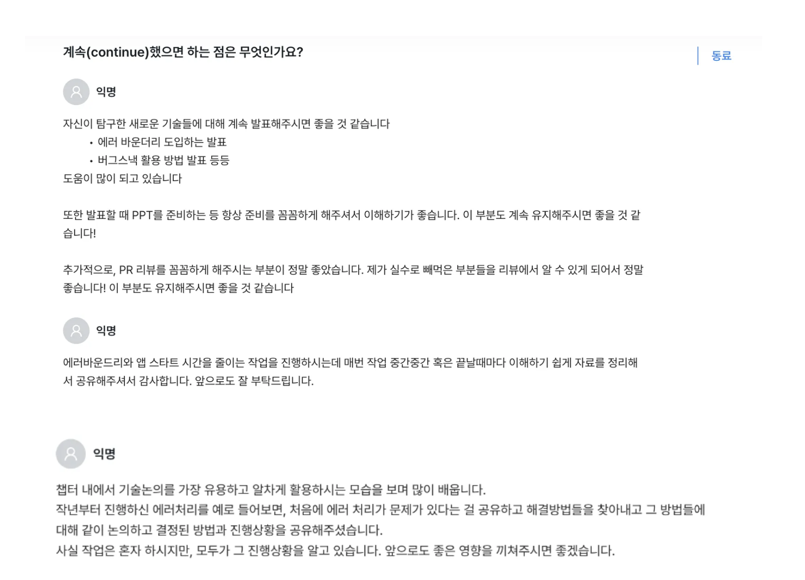

## 👋 숨고를 떠나며

23년 2월에 입사해 24년 10월 18일을 마지막으로 숨고라는 제품을 만든지 1년 8개월이 지났다.
2년을 채우고 떠났으면 좋았겠지만, 좋은 기회가 오게 되어 떠나게 되었고 10월은 대부분 함께 일했던 동료분들과 함께 이야기하고 고마움을 표현하며 보내는 시간을 주로 가졌다.

9월회고에 작성했던 MMKV작업과 React Query작업은 현재까지 진행된 내용들에 대한 문서만 인수인계를 위해 작성했고, 실제 적용한 결과를 보지는 못했다.

개발자로서 첫 직장이었던 숨고를 떠나며 기억에 남는 순간들과 배웠던 부분들을 정리해보려 한다.

### 1. 사람은 실수한다

이직을 준비하고 내가 했던 작업들을 정리하면서, 내가 했던 실수들, 그리고 그것을 보완하기 위해서 어떤 노력을 해왔는지 돌아보았다.

숨고에서 가장 가슴을 쓸어내렸던 순간은 단연코, 작년 5월에 있었던 **요청 견적서 작업**이었다. 제품의 메인 비즈니스 도메인인 견적서 작성 퍼널에 딥링크를 이용해 진입했을 때 견적 발송이 되지 않는 장애가 발생했다. 당시 입사한지 3개월이 되었던 시점에 아직 모바일 플랫폼에 대한 이해도 부족해 발생했던 이슈였다.

매출에 직접적인 장애를 만들면서, 사후 회고도 진행하면서 자존감이 많이 떨어졌던 순간이었다.
개발자는 제품을 직접 만드는 사람이다보니, 제품에 대해 많은 기여를 할 수 있지만, 그만큼의 책임감을 가져야한다는 것을 깨달았던 순간이었다.

그리고 제품의 안정성에 대해 크게 관심을 가지게 되었던 계기가 되었다. 다시는 장애를 만들고 싶지 않아 '어떻게 하면 다시 이런 장애를 만들지 않을 수 있을까' 혼자 엄청나게 고민하게 되었다. 하지만 의도적으로 장애를 만드는 사람이 없듯이, 경험을 통해서 점점 설계와 좋은 코드에 대해 배우면서 놓치는 부분들이 줄여져 가겠지만 여전히 사람이라면 예상하지 못한 곳에서 발생할 수 밖에 없다고 생각이 정리 되었다.

한마디로 빈도는 줄일 수 있어도 **사람은 실수할 수밖에 없다**라고 정리가 되었다. 그러면 내가 해야할 노력해야할 행동은 `예측하는 게 아니라 빠르게 대응하는 것`이라고 생각하게 되었다.

개인적으로 공부를 해서 냄새나는 코드를 빠르게 찾는 노력은 당연히 시간을 들여서 하지만, 지금 내가 할 수 있는 노력은 빠르게 대응하기 위한 작업을 담당해 보자는 생각이 들었다.

그렇게 시작한 작업이 바로 에러 모니터링 강화, [에러바운더리 도입](https://choi2021.github.io/2024-06-02-%EC%97%90%EB%9F%AC%EB%B0%94%EC%9A%B4%EB%8D%94%EB%A6%AC-%EB%8F%84%EC%9E%85%ED%95%98%EA%B8%B0/)이었다.

당시 에러 모니터링은 필요한 부분, 중요 도메인에 한해서 로깅용도로 사용되고 있었고, 여러 에러들이 위계없이 슬랙으로 제보되면서 중요한 에러를 구분하기 어려워 빠른 대처가 어려웠다.

이를 해결하기 위해서 에러 로깅에 위계를 설정하고, 불필요한 에러 로그와 필요한 로그를 구분하고, 비어있는 catch문으로 전파되지 않는 에러가 없게 eslint 룰을 추가하는 로딩 개선 작업과 화이트스크린 에러가 발생한 상황에서도 앱을 계속해서 사용할 수 있도록 에러바운더리를 스크린 단위로 제품 전체에 적용했다.

사고 치기 싫어서(?) 진행했던 작업이었지만 제품 안정성에 대한 고민을 해볼 수 있게 되었고, 챕터 내에서 자연스럽게 담당하게 된 영역 중 하나가 되어 이후, 에러 모니터링 과정에서 어려움이 있을 때, 나에게 물어보시기도 하고 에러 모니터링 툴을 변경하는 작업에서도 POC를 담당해서 진행하는 등 긍정적인 방향으로 이어졌다.

작업을 하면서도 쉽지는 않았다. 모호할 수 있는 기준을 처음부터 세우고, 에러 바운더리라는 기술이 해결할 수 있는 문제들을 소개하고 어떤 장단점이 있는지 설명했을 때를 떠올려보면, 일이 이만큼 커질 줄은 몰랐다. 혼자서 제품 전체에 적용하면서 길어지는 작업 과정에서 지치기도 하고, 동료분들이 공감할 수 있는 작업을 하고 있는 건지 중간중간 힘들기도 했다.

다행히 중간 중간 작업 과정을 계속해서 공유드렸던 것의 효과였을까, 작업에 대해 주기적으로 피드백과 좋은 방향을 함께 제시 해주셨고, 덕분에 잘 마무리할 수 있었다. 장기적인 일을 할 때 일의 범위를 적당한 단위로 **끊어가는 것의 중요성**도 덤으로 배워갔다.

앞으로도 아마 실수하고 싶지 않지만, 장애를 만들 수 있다. 중요한 건 일어난 일을 잘 마무리 한 후에 더 좋은 제품을 만드는 기회로 바꿔서, 더 나은 시스템과 코드를 함께 만들어 가기 위해 노력해 나가야겠다. 실수를 성장의 기회로 만들어 준 좋은 동료들에게 감사한 마음을 가지고 더 좋은 제품을 만들어 나가야겠다.

### 2. 나중에 리팩토링할 시간은 없다

작업을 하다보면 늘 **시간**과 **퀄리티**는 늘 고민하게 되는, 함께 가기 어려운 트레이드 오프인 것 같다. 현실의 문제는 늘 시간과 싸우기 때문에 시간 내 빠르게 동작하는 코드를 만들게 되는 경우가 많았고, 쌓여진 동작만 하는 코드들은, 서로 엉켜 더 이상 다음 기능을 붙일 수 없게 되고 결국 `대공사`가 필요해졌다.

그렇다면 이전으로 돌아가서 어떻게 하면 더 좋은 결과물을 만들 수 있을까?

시간을 많이 들이면 제품의 퀄리티가 올라갈 수 있지만, 시간은 한정되어 있는 이러한 현실의 문제를 해결하기 위해 내가 선택한 방법은 **틈틈이, 짬짬히 리팩토링하는 것**이었다.

당시 시간이 없어서 퀄리티가 떨어졌고, 당시에는 이만큼의 기능을 담당하게 될 줄 몰랐던 코드라면, 지금의 내가 계속해서 과거의 내 작업을 돌아보는 것이 맞겠다는 생각이 들었다.

그러면 지금의 작업은 늦춰지는 건 아닐까 라는 생각이 들지만, 그때보다 도메인에 적응하고, 코드베이스에 익숙해지면서 대체로 어제보다 오늘 더 좋은 코드를 작성하게 되었던 것 같다. 그리고 익숙해진 부분이 많아진 상태에서 다시 요구사항들을 바라보면 그때보다 훨씬 간단히 해결할 때도 많았다.

그리고 하드스킬을 키우기 위한 노력을 지속해 같은 기능을 만들 때 시간을 줄여 더 좋은 코드로 작성하기 위해 노력해왔다. 조금 더 좋은 패턴, 좋은 설계방법들을 보고 배우며, 나와 유사한 문제를 풀어오신 선배 개발자분들의 흔적을 열심히 쫓아갔던 것 같다.

이러한 노력들이 티나지 않는 내 나름의 양심적인 노력이라 생각하고 틈틈히 챕터업무로 진행해왔다. 하지만 동료분들은 그런 모습을 보면서 격려와 계속했으면 하는 점으로, 내가 가진 장점으로 봐주시기도 했다.

앞으로도 개발자로서 좋은 코드를 만들기 위해 틈틈히, 짬짬히 리팩토링을 진행해가며 역량을 늘려 더 좋은 코드를 만들어 나가야겠다.

### 3. 질문하는 개발자

현업에서 일하기 전, 내가 생각했던 잘하는 개발자는 주어진 요구사항을 척척 해결하는 개인의 퍼포먼스를 잘 내는 사람이라고 생각했다. 그리고 입사 초기 "내가 얼마나 잘하는 사람인지 보여줘야 해"라는 생각에 혼자서 압박감에 시달리고 힘들어 했었고, 1년을 일할 때까지도 나보다 잘하는 동료들의 모습을 보면 "내가 다른 사람들보다 잘한다고 할 수 있는 무기가 뭘까" 고민하고 내 부족함을 부끄러워했다. 질문을 할 때 나를 판단하지 않는 동료들이였지만 혼자서 너무 부족한 질문은 아닐까 부끄러워하기도 했다.

내가 만든 무거운 짐들은 다행히 시간이 흐르면서 관점을 내가 아니라 잘하는 동료의 모습을 조사해보기로 바꾸면서 줄어들게 되었다.

좋은 동료분들의 모습들을 정리해보았을 때 다 달랐다. 어떤 분은 히스토리를 잘 기억하셔서 팀이 정책적으로 힘들어할 때 결정을 잘 내릴 수 있게 돕기도하고, 어떤 분은 비개발자 분들과 소통할 때 기술적인 내용을 잘 풀어서 설명해주시도 했다. 어떤 분은 자동화에 진심이어서 팀의 비효율을 개선하려 노력하셨고, 어떤 분은 설계에 관심이 많아서 잘짜여진 구조를 만드는 일을 잘하셨다.

나라는 한사람이 이 모든것을 다 잘하면 좋겠지만 현실적으로 할 수 없다는 사실을 자연스럽게 받아드리기로 했다.
대신 작업을 진행하면서 나에게 부족한 부분들이 동료가 잘하는 부분이라면 가서 **적극적으로 물어보고 배우기로** 했다. **모르는 것을 받아드리고, 질문하는 것이 더 빠르게 성장할 수 있는 방법**이라고 생각하게 되었다.

질문하는 과정에서 자연스럽게 동료의 잘하는 부분을 나의 것으로 조금씩 만들어나갈 수 있었고, 더 좋은 제품을 위한 토론을 하면서 우리 팀에서 반복적으로 겪는 문제를 알게 되고, 당장은 중요하지 않을 수 있지만 장기적으로 필요로 하는 부분들에 대해서 제안하고 담당하며 나만의 뾰족함도 만들어 나갈 수 있었다.

현재 내가 되고 싶은 사람, 내가 생각하는 좋은 개발자는 **질문하는 개발자**인 것 같다. 기존 방식을 당연하지 않게 바라보고 조금 더 효율적이고 쉬운방법을 고민하고 질문을 던지는 사람, 코드리뷰 속에서 당연하게 생각했던 부분에 던져진 하나의 물음을 통해 동료가 더 깊이 고민하고 더 좋은 방법을 찾아낼 수 있게 하는 사람인 것 같다.

앞으로도 이렇게 질문하며, 계속해서 더 성장해나가길, 그리고 좋은 질문을 던지는 사람이 되길 바란다.

### 4. 코딩은 사회적 활동이다

코딩은 컴퓨터에게 명령을 하고 원하는 결과물을 얻어나가는 과정이라고 개인과 컴퓨터간의 상호작용이라고 생각하기 쉽지만, 혼자서 작업을 진행하는 것이 아니라 동료와 함께 작업을 진행하는 **사회적 활동**이라는 점을 많이 배웠다.

사람은 모두 다르다. 좋아하는 것도, 잘하는 것도, 중요하게 생각하는 것도 다르다. 그리고 그러한 관심사들이 코드를 작성하는 개발자 한명, 한명에게 묻어난다.

나는 선언적인 비동기 처리에 관심이 많았고, 에러바운더리, suspense를 통해서 선언적으로 비동기 상태를 관리하는 방식을 제품에 녹여내고 싶었다.

에러 바운더리는 작업 전에 어떤 장단점이 있는지, 우리가 얻을 수 있는 건 어떤건지, 그리고 얼마나 제품의 복잡도가 올라가게 될지 등 다양하게 설명하는 시간을 가질 수 있었다. 발표를 통해 동료분들과 함께 고민하는 시간을 가지고, 혼자서 오래 고민하던 문제를 더 좋은 방향으로 작업을 진행해 잘 마무리할 수 있었다.

하지만 전역로딩 경험 개선 작업을 진행하면서는 충분한 시간을 가지지 못했다. Tanstack Query와 Suspense를 이용해 로딩상태를 분리하는 작업을 모두 다 진행하고 난 뒤에 사후에 작업 결과를 정리하는 시간을 가졌다. 그때 동료분께서 해주신 피드백은 `작업이 풀고자하는 문제보다 복잡하게 되었다`이었다. 코드리뷰를 하면서 일부 동료분들은 어떻게 작업이 진행되고 있는지 접할 수 있었지만, 랜덤으로 배정되다보니 피드백 시간에 처음보시는 분도 계셨기 때문에 어렵게 느껴지셨던 것 같다.

나에게 당연하다고 느끼는 것이 누군가에게 당연하지 않다는 어쩌면 당연한 사실을 다시금 깨달았다. 이러한 과정을 겪으면서 단순히 내가 생각하는 좋은 것이 제품에 적용되는 게 중요한 게 아니라, 함께 코드를 작성하는 동료분들이 어떻게 생각하는지 들어보고 **함께 고민하는 시간이 중요하다**는 것을 깊이 깨달을 수 있었다. 제품 내 반영되게 되면 나만 관리하면 되는게 아니라 동료들이 함께 가꾸어야 하는 팀의 자산이 된다는 것을 크게 느끼게 되었다.

이직을 하게 되면서 실제로 더이상 내가 관리할 수 없게 되면서, 더 죄송한, 마음의 빚이 된 작업으로 남게 되었다. "먼저 어떤 문제를 어떻게 풀지 설명했더라면, 조금 더 설득력있고 복잡도를 낮추는 방향으로 미리 작업 방향을 바꿨을텐데"하는 아쉬움이 아직도 많이 든다.

앞으로는 시간이 더 걸리고, 이해를 맞춰가는데 어려울 수 있지만 함께 코드를 작성하는 동료분들과 함께 작업을 진행해 나가야겠다.

## 📝 마무리

숨고는 나에게 너무 감사한 곳이다. 배울 수 있는 부분이 너무 많았고, 부족한 나에게 많은 기회를 주고, 개발자라는 직업에 대해 더 깊이 이해하게 해준 곳이다. 그리고 앞으로 어떤 개발자가 되고 싶은지, 어떤 사람이 되고 싶은지 옆의 동료들을 보며 많이 느끼고 배울 수 있는 곳이었다.

이제는 다음 회사로 떠나지만, 숨고에서 배운 것들을 기억하며 더 성장해 더 많은 것을 나누어줄 수 있는 개발자가 되고 싶다.
