토스에 입사한 후 프론트엔드의 다양한 기술 주제에 대해 새롭게 알게 되면서 하나씩 정리해보고자 한다.

이번 주제는 패키지 매니저로 평소 잘 몰랐던 주제라 흥미롭게 생각해 각각의 특징과 장단점 등에 대해 정리해보려한다.

이미 토스 블로그와 다른 블로그들에 잘 정리된 글이 있기 때문에 해당 글들을 참고하여 작성하였다.

[node_modules로부터 우리를 구원해 줄 Yarn Berry](https://toss.tech/article/node-modules-and-yarn-berry)

[패키지 매니저의 과거, 토스의 선택, 그리고 미래](https://toss.tech/article/lightning-talks-package-manager)

## 패키지 매니저란?

패키지 매니저는 NPM, YARN과 같이 외부 모듈을 관리할 때 사용하는 도구로 의존성을 관리하고, 패키지를 설치, 업데이트, 제거하기 위한 도구이다.

만약 패키지 매니저가 없이 외부 모듈을 사용하려면 어떻게 해야할지 생각해보자.

1. 패키지 매니저가 없다면 내가 원하는 라이브러리 코드를 프로젝트에서 사용하기 위해서, 특정 폴더에 해당 코드를 직접 복사해서 붙여넣어야 한다.

2. 그리고 붙여넣은 위치에 맞게 라이브러리를 가져올 수 있게 경로를 관리해야 한다.

3. 그리고 어느 시점의 라이브러리를 다운받냐에 따라 사용하고 있는지에 따라 코드가 달라지니까 어떤 버전의 라이브러리를 복사 붙여넣기 했는지 기록해야할 것 같다.

4. 마지막으로 패키지 자체가 안전한지 확인하는 과정도 필요할 것 같다.

방금 말한 패키지 매니저가 없을 때 해야할 과정 4가지 과정은 결국 우리를 위해 패키지 매니저가 담당해주고 있는 일로 볼 수 있다.

결국 한마디로는 `패키지 매니저는 외부 모듈을 프로젝트에 쉽게 설치하고 관리할 수 있게 도와주는 도구`라고 할 수 있다.

## 패키지 매니저가 동작하는 방식

패키지가 동작하는 방식을 알아보면 세가지 스텝으로 진행된다.

- Resolution
- Fetching
- Linking

각 스텝에 대해 알아보자.

### Resolution

Resolution은 `package.json`에 기록된 의존성 정보를 읽고 해당하는 버전 범위를 체크하는 과정이다.

예를 들어 `package.json`에 `react` 패키지가 `^18.0.0` 버전으로 기록되어 있다면, Resolution 과정에서는 `react` 패키지의 버전이 `18.0.0` 이상이면서 최대한 최신 버전인 `18.99.99` 버전을 이용할 수 있구나하고 사용가능한 버전을 체크하는 과정이다.

이때 의존성의 의존성의 버전도 체크하는 과정을 거쳐서 각 의존성들의 버전을 고정시켜서 최종적으로 사용할 수 있는 버전을 찾는 과정이다.

### Fetching

Fetching은 체크된 버전의 패키지를 다운받는 과정으로 로컬 캐시가 있는지 확인하고 없다면 원격 저장소에서 패키지를 다운받는 과정이다.

### Linking

Linking은 다운받은 패키지를 프로젝트에 연결하는 과정으로 패키지를 사용할 수 있도록 프로젝트에 연결하는 과정이다.
npm과 yarn은 node_modules 폴더에 패키지를 설치하고 각 매니저별로 최적화된 방식으로 패키지를 연결한다.

## 패키지 매니저 비교하기

패키지 매니저의 역할을 알아보았으니 이제 각 패키지 매니저에 대해 알아보자.
알아볼 패키지매니저는 NPM, Yarn, Pnpm, Yarn Berry이다.

### NPM

NPM은 Node Package Manager의 약자로, 가장 역사가 오래된 Node.js 패키지 매니저다.

편한 CLI 명령어를 제공하고 NPM 공식사이트를 통해서 패키지를 검색할 수 있다.

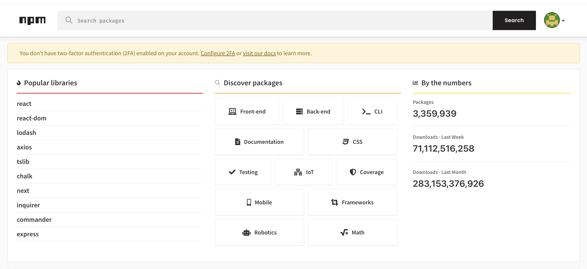

위에서 소개된 Linking 과정에서 NPM은 정해진 의존성 트리를 기반으로 `node_modules` 폴더에 패키지를 설치하고 연결하는 과정을 거친다.

```
npm-project/
└─ node_modules/
| ├─ a/
| |
| └─ b/
|    └─ node_modules/
|        └─ c
|
└─ src
└─ index.ts
```

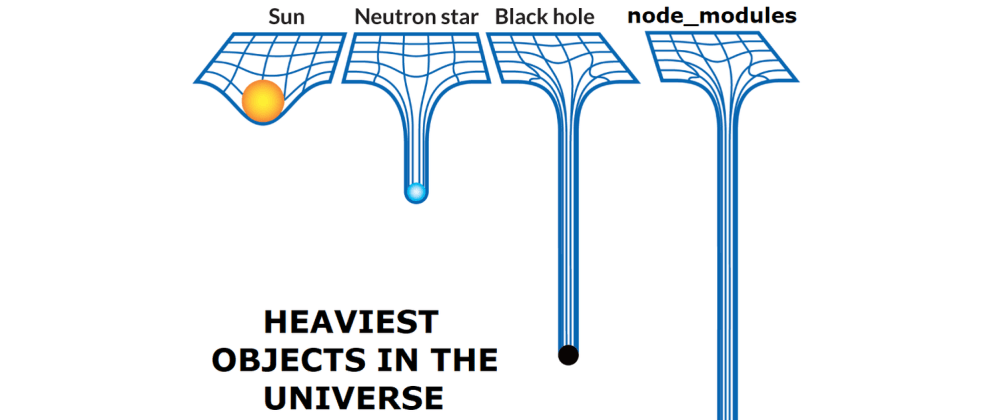

이렇게 거대해진 `node_modules` 폴더는 프로젝트 크기가 커질수록 CI/CD 과정에서 오래걸리게 되고 시간 뿐 아니라, 큰 용량을 차지하게 된다.

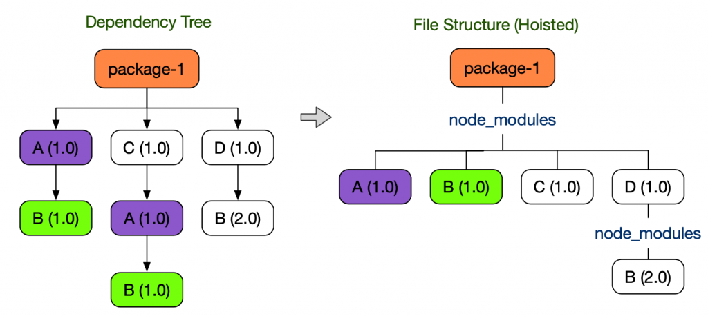

이렇게 커진 `node_modules` 폴더를 최적화하기 위해서 `hoisting`이라는 기법을 이용하지만, 이러한 최적화 방식은 오히려 사용하려고 하지 않았던 패키지를 설치하거나 삭제될 수 있는 `Ghost Dependencies` 문제가 발생하게 된다.

#### Ghost Dependencies

Ghost Dependencies를 이해하기 위해 간단한 예제를 만들어 보았다.

먼저 간단히 가장 기본이 되는 패키지 `@choi2021/ghost-dep-test-package-a`를 만들어보았다.
해당 패키지는 정말 간단한 sum이라는 함수를 반환한다.

```javascript
function sum(a, b) {
  return a + b
}

module.exports = {
  sum,
}
```

이제 두번째 패키지 `@choi2021/ghost-dep-test-package-b`를 만들어보자.
해당 패키지는 앞서 만든 `@choi2021/ghost-dep-test-package-a`를 의존성으로 가지고 있다.

```javascript
// package.json
{
  "name": "@choi2021/ghost-dep-test-package-a",
  "version": "1.0.0",
  "main": "index.js"
}

// index.js
const { sum } = require("@choi2021/ghost-dep-test-package-a")

function sumAndMultiply(a, b, c) {
  return sum(a, b) * c
}

module.exports = {
  sumAndMultiply,
}
```

이제는 실제로 npm-example이라는 프로젝트에 `@choi2021/ghost-dep-test-package-b`를 설치해보자.

```package.json
{
  "name": "npm-example",
  "version": "1.0.0",
  "main": "index.js",
  "scripts": {
    "test": "echo \"Error: no test specified\" && exit 1"
  },
  "keywords": [],
  "author": "",
  "license": "ISC",
  "description": "",
  "type": "module",
  "dependencies": {
    "@choi2021/ghost-dep-test-package-b": "*"
  }
}
```

해당 프로젝트에 npm install을 진행하면 아래와 같이 `node_modules` 폴더에 패키지가 설치된다.

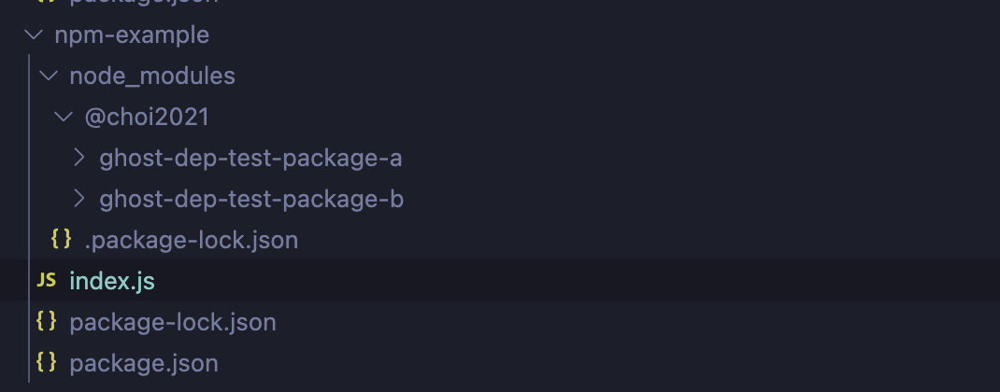

node_modules 폴더를 살펴보면 `@choi2021/ghost-dep-test-package-b`만 의존성을 가지고 있지만 `@choi2021/ghost-dep-test-package-a` 패키지가 설치되어 있는 것을 확인할 수 있다.

그리고 의존성 트리가 앞서 설명한 호이스팅과정을 통해서 최상위 레벨에 위치하게 된다.

여기서 문제가 되는 Ghost Dependency가 발생하게 되는데 해당 패키지가 가지는 의존성은 `@choi2021/ghost-dep-test-package-b`이지만, 프로젝트 내부에서 `@choi2021/ghost-dep-test-package-a`를 직접 사용할 수 있다.

```javascript
import { sum } from "@choi2021/ghost-dep-test-package-a"

console.log(sum(1, 2))
```

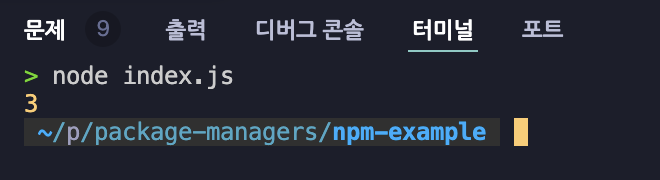

이렇게 직접 의존하지 않은 패키지에 접근할 수 있게 되는 현상을 Ghost Dependency라고 하며, 이는 실제 프로젝트에서 다음과 같은 문제를 일으킬 수 있다.

1. 의도치 않은 패키지 사용으로 인한 보안 취약점 발생
2. 패키지 업데이트 시 예상치 못한 오류 발생
3. 프로젝트의 의존성 관리가 불명확해짐

npm은 가장 오래된 패키지 매니저이라 커뮤니티가 크지만, 프로젝트의 규모가 커질 수록 용량을 많이 차지하고, CI/CD 과정에서 오래걸리는 단점을 가지고 있다. 이러한 단점을 극복하기 위해 Yarn이 등장하게 되었다.

### Yarn

Yarn은 페이스북에서 만든 패키지 매니저로 2016년도에 작성된 페이스북 [Yarn 소개 글](https://engineering.fb.com/2016/10/11/web/yarn-a-new-package-manager-for-javascript/)을 보면 Yarn의 배경에 대해 알 수 있다.

당시 페이스북은 팀과 프로젝트가 커지면서 일관되지 않는 의존성, 안정성, 성능적인 이슈를 겪게 되었고 새로운 npm client로 Yarn을 만들게 되었다.

어떻게 Yarn은 이러한 문제들을 해결한걸까? 하나씩 알아보자.

#### 일관된 의존성

NPM을 이용해 만든 node_modules 폴더는 파일 시스템 기반이다보니 여러 패키지가 얽히다 보면 일관되지 않은 트리를 만들게 되고, "내 컴퓨터에서는 되는데"라는 문제점이 발생하게 된다.

이를 개선하기 위해 Yarn은 `yarn.lock` 파일을 도입했다. 이 파일은 모든 패키지의 정확한 버전과 의존성 정보를 저장하여, 어느 환경에서나 동일한 버전의 패키지가 설치되도록 보장한다.

```yaml
# yarn.lock 예시
react@^16.0.0:
  version "16.14.0"
  resolved "https://registry.yarnpkg.com/react/-/react-16.14.0.tgz"
  integrity sha512-...
  dependencies:
    loose-envify "^1.1.0"
    object-assign "^4.1.1"
```

#### 성능

npm은 순차적인 방식으로 설치하는 반면에 Yarn은 병렬적인 방식으로 설치하기 때문에 성능적인 측면에서 더 빠르다.

#### 명령어

명령어도 조금 더 npm에 비해 간결해져 사용하기 편하다.

<table>
  <tr>
    <th>npm</th>
    <th>yarn</th>
  </tr>
  <tr>
    <td>npm install</td>
    <td>yarn install</td>
  </tr>
  <tr>
    <td>npm uninstall package</td>
    <td>yarn remove package</td>
  </tr>
</table>

하지만 NPM에 비해 일부 호환성 문제가 있다는 단점이 있고, 자체 최적화 알고리즘을 진행해 node_modules를 이용하는 방식은 여전히 Ghost Dependency 문제가 발생하게 된다.

같은 예제를 Yarn 프로젝트에서 실행했을 때 상황이다.

```javascript
// package.json
{
  "name": "yarn-example",
  "version": "1.0.0",
  "main": "index.js",
  "license": "MIT",
  "dependencies": {
    "@choi2021/ghost-dep-test-package-b": "*"
  },
  "type": "module"
}

// index.js
import { sum } from "@choi2021/ghost-dep-test-package-a"

console.log(sum(1, 2))
```

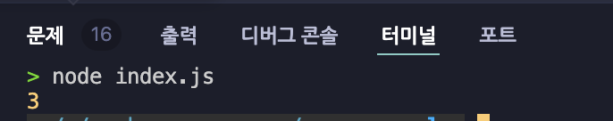

직접 의존성이 없는 패키지에 아직 접근할 수 있는 것을 확인할 수 있다.

### Pnpm

pnpm(performant npm) 또한 npm의 문제점을 해결하기 위해 만들어진 패키지 매니저로 Yarn과는 다른 방식으로 해결한다.

[pnpm의 공식문서](https://pnpm.io/motivation)의 motivation 부분을 살펴보면 기존 문제를 어떻게 해결하는지 알 수 있다.

#### 적은 용량

npm으로 백개의 프로젝트에서 하나의 의존성을 설치해야 하는 경우 100개의 복사본이 생기게 된다. 하지만 pnpm에서는 content-addressable store라는 개념을 도입해 하나의 의존성에 대해서 하나의 복사본만 존재하게 된다.

만약 버전이 다른 의존성이 설치되어야 한다면 다른 버전만 store에 설치하게 되고 모든 파일들은 한 곳에 설치되어 `hard-link` 방식으로 연결되게 된다.

hard-link는 주소를 alias처럼 동일한 파일을 여러 위치에서 참조할 수 있게 하는 방식이다. 실제 파일은 하나만 존재하고, 여러 위치에서 이 파일을 직접 가리키는 참조를 만들기 때문에 용량이 적게 차지하게 된다.

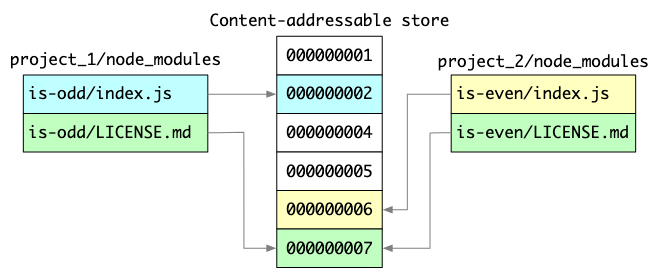

#### 빠른 설치 속도

pnpm의 설치 과정은 세가지 과정을 거친다고 한다.

1. Resolution: 필요한 의존성을 파악하고 스토어에 설치한다.
2. Directory structure calculation: npm과 동일하게 node_modules 폴더 구조를 계산한다.
3. Linking: 정리된 의존성들을 다운받고 스토어와 node_modules를 hard-link로 연결한다

#### Non-flat node_modules와 Ghost Dependencies

npm과 yarn은 모두 hoist로 인해 flat한 구조를 가지고 Ghost Dependencies 문제가 발생하지만, pnpm은 이러한 문제를 해결하기 위해 바로가기 폴더를 만드는 것과 같은 symlink 방식으로 문제를 해결한다.

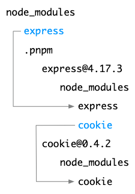

앞선 예제를 pnpm 프로젝트에서 설치했을 때 모습이다.

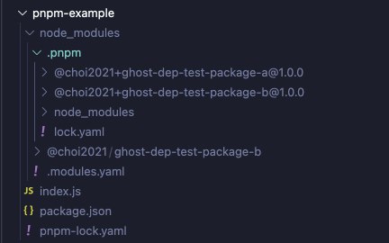

node_modules에는 직접 의존하는 `ghost-dep-test-package-b`만 존재하고, 실제로 코드에서 실행해보면 에러가 발생하는 것을 볼 수 있다.

```javascript
// package.json
{
  "name": "pnpm-example",
  "version": "1.0.0",
  "description": "",
  "main": "index.js",
  "scripts": {
    "test": "echo \"Error: no test specified\" && exit 1"
  },
  "keywords": [],
  "author": "",
  "license": "ISC",
  "dependencies": {
    "@choi2021/ghost-dep-test-package-b": "*"
  },
  "type": "module",
}


// index.js
import { sum } from "@choi2021/ghost-dep-test-package-a"

console.log(sum(1, 2))
```

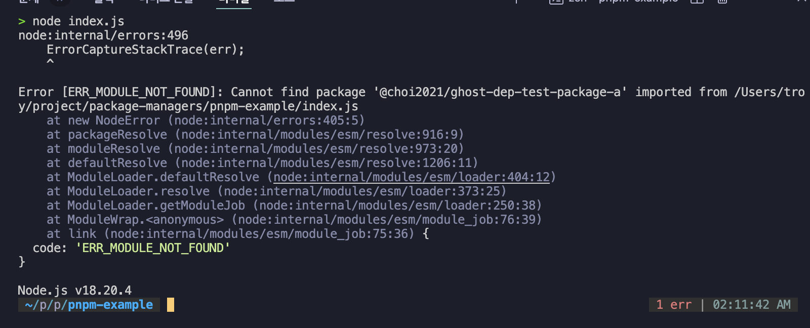

이렇게 직접 의존하지 않은 패키지에 접근할 수 없게 되어 Ghost Dependencies 문제를 해결할 수 있게 되었다.

pnpm도 단점이 존재하는데 적은 용량과 빠른 설치 속도를 위해 추가된 store를 만드는 과정과 symlink, hard link의 오버헤드로 최초에 store를 만드는 시간이 조금 더 걸리지만 이후에는 매우 빠른 속도로 설치할 수 있다.

### Yarn Berry

마지막으로 Yarn Berry에 대해 알아보자.

Yarn Berry는 yarn classic(v1)에서 조금 더 개선된 버전으로 앞서 소개한 패키지 매니저들과는 다르게 Plug'n'Play(pnp) 방식을 이용한다.

그러면 동일하게 앞서 만든 패키지를 의존하는 예제를 만들어서 어떤 점이 달라졌는지 살펴보자

#### 적은 용량

yarn berry 세팅하기 위해서는 `yarn set version berry` 명령어를 먼저 실행해야 한다.
이후에는 기존 yarn 명령어를 그대로 사용할 수 있다.

```bash
yarn set version berry
yarn install
```

pnp방식의 큰 특징은 많은 용량을 차지하던 `node_modules` 폴더가 없고 대신에 `.yarn/cache` 폴더 내부에 패키지들이 설치되는 것이다.

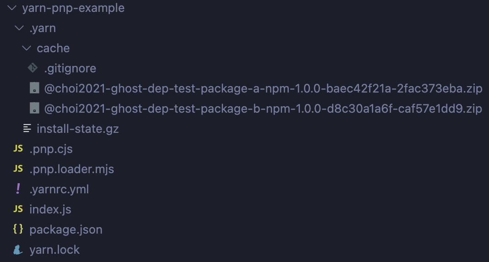

그리고 이러한 패키지들은 각 패키지별로 하나의 zip만 가지기 때문에 훨씬 적은 용량을 차지하게 된다.

#### 빠른 설치 속도

먼저 여러 파일을 다운받아서 복잡한 구조를 만들던 node_modules 대신 yarn.lock을 기반으로 `.pnp.cjs` 파일 하나만 만들면 되기 때문에 기존 패키지들에서 많은 시간을 소요하던 I/O 작업에서 많은 시간이 단축 된다.

패키지를 찾을 때도 javascript map을 이용해서 패키지의 직접 참조 주소로 바로 접근하기 때문에 훨씬 빠르게 패키지를 찾을 수 있다.

아래는 `.pnp.cjs` 파일의 일부를 가져온 것으로 packageRegistryData에 각 패키지 별로 어디에 위치해 있는지, 어떤 패키지에 의존하는지 등의 정보를 기록하고 있다.

#### 패키지 관리와 Ghost Dependencies

pnp는 `.pnp.cjs` 파일을 이용해서 패키지를 관리하기 때문에 아래와 같은 형태로 패키지들의 위치와 의존성을 기록하고 있다.

```javascript
// .pnp.cjs

const RAW_RUNTIME_STATE =
  '{\
  "packageRegistryData": [\
    [null, [\
      [null, {\
        "packageLocation": "./",\
        "packageDependencies": [\
          ["@choi2021/ghost-dep-test-package-b", "npm:1.0.0"]\
        ],\
        "linkType": "SOFT"\
      }]\
    ]],\
    ["@choi2021/ghost-dep-test-package-a", [\
      ["npm:1.0.0", {\
        "packageLocation": "./.yarn/cache/@choi2021-ghost-dep-test-package-a-npm-1.0.0-baec42f21a-2fac373eba.zip/node_modules/@choi2021/ghost-dep-test-package-a/",\
        "packageDependencies": [\
          ["@choi2021/ghost-dep-test-package-a", "npm:1.0.0"]\
        ],\
        "linkType": "HARD"\
      }]\
    ]],\
    ["@choi2021/ghost-dep-test-package-b", [\
      ["npm:1.0.0", {\
        "packageLocation": "./.yarn/cache/@choi2021-ghost-dep-test-package-b-npm-1.0.0-d8c30a1a6f-caf57e1dd9.zip/node_modules/@choi2021/ghost-dep-test-package-b/",\
        "packageDependencies": [\
          ["@choi2021/ghost-dep-test-package-b", "npm:1.0.0"],\
          ["@choi2021/ghost-dep-test-package-a", "npm:1.0.0"]\
        ],\
        "linkType": "HARD"\
      }]\
    ]],\
    ["yarn-pnp-example", [\
      ["workspace:.", {\
        "packageLocation": "./",\
        "packageDependencies": [\
          ["yarn-pnp-example", "workspace:."],\
          ["@choi2021/ghost-dep-test-package-b", "npm:1.0.0"]\
        ],\
        "linkType": "SOFT"\
      }]\
    ]]\
  ]\
}'
```

정확하게 어떤 패키지를 직접 의존하는지 확인할 수 있고, 이를 통해 Ghost Dependencies 문제를 해결할 수 있다.
실제로 앞서 만든 예제를 yarn berry에서 실행했을 때 모습이다.

```javascript
// package.json
{
  "name": "yarn-pnp-example",
  "version": "1.0.0",
  "main": "index.js",
  "license": "MIT",
  "dependencies": {
    "@choi2021/ghost-dep-test-package-b": "*"
  },
  "type": "module",
  "packageManager": "yarn@4.5.1"
}

// index.js

import { sum } from "@choi2021/ghost-dep-test-package-a";

console.log(sum(1, 2));
```

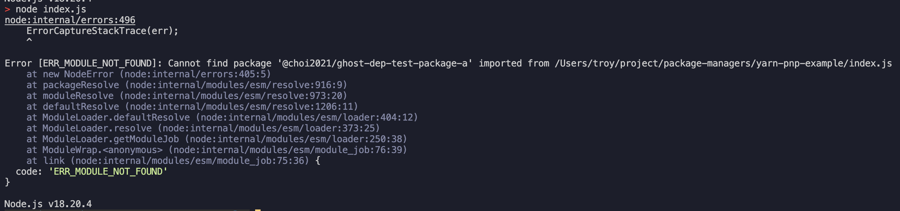

pnp 패키지 매니저에서 패키지를 찾을 수 없다는 에러를 볼 수 있다.

정리해보면 yarn berry는 PnP 방식을 이용해 기존과 달리 node_modules 폴더 없이 패키지를 관리하고, 빠른 설치 속도와 적은 용량을 가지며, 또한 Ghost Dependencies 문제를 해결할 수 있는 장점을 가지고 있다.

하지만 기존의 node_modules 기반의 패키지 매니저와 호환성 문제가 있다.

yarn berry에서는 이렇게 적은 용량으로 패키지를 관리할 수 있다보니 패키지 자체를 git의 버전 관리 대상에 포함시키는 `zero-install`으로도 이용하는 경우도 많다.

git clone 과정에서 모든 패키지가 함께 설치되다보니 별도의 Install 과정이 필요 없어 새로 프로젝트를 다운받을 때나, CI과정에서 시간을 아껴줄 수 있는 장점이 있다.

토스는 기존에 이러한 장점으로 [zero-install](https://toss.tech/article/node-modules-and-yarn-berry)을 도입했지만, [현재는 PnP를 이용하더라도 레포 크기가 커져서 zero install을 끈 상태](https://toss.tech/article/lightning-talks-package-manager)라고 한다.

## 마치며

RN 개발자에서 프론트엔드 개발자로 전향하면서 보다 javascript 생태계에 대해 조금 더 관심을 갖고 바라보고 있게 되었다. 그중에서 패키지 매니저는 크게 신경쓰지 않았던 부분이었지만 토스에 합류해 메이트 분과 이야기를 나누면서 이전 회사에서는 어떤 패키지 매니저 환경에서 작업을 했는지 질문을 받게 되었다.

토스 기술 블로그들에도 몇번 본적이 있었고, 프론트엔드 개발자로서 이런부분을 알면 좋겠다는 생각이 들어 작성하게 되었다.

이제는 조금은 더 이해할 수 있게된 패키지 매니저를 통해 단순히 CLI만 사용하지 않고 의존성들이 각각 어떻게 관리되는지 어떤 장단점이 있는지 이해하고 사용할 수 있을 것 같다.
