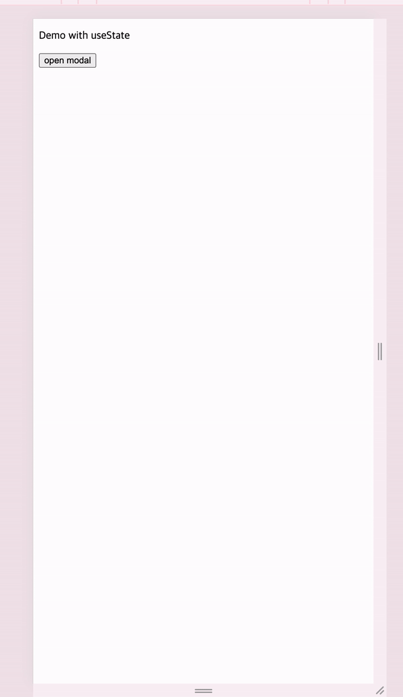
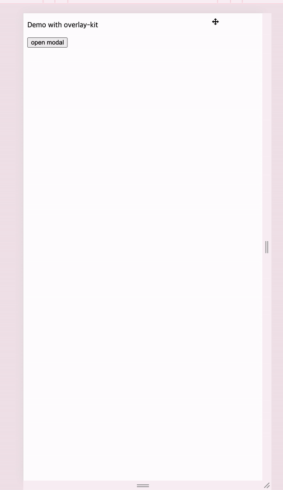
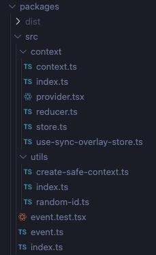
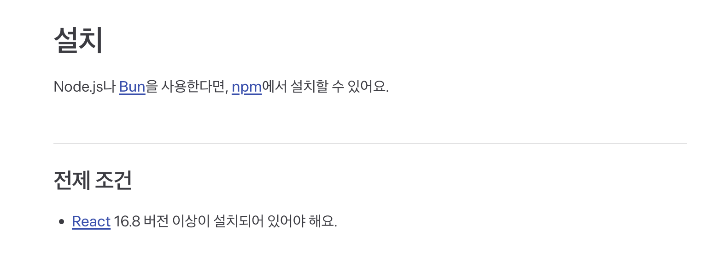

[overlay-kit](https://overlay-kit.slash.page/ko/introduction.html)은 토스의 오픈소스 프로젝트로 모바일 제품을 만들면서 자주 사용하는 바텀시트, 다이얼로그 컴포넌트를 `선언적`으로 관리할 수 있도록 도와주는 패키지이다.

해당 패키지의 사용법과 내부 구현을 분석해보면서 어떤 문제를 해결하고자 만들어졌는지 알아보자.

## Overlay Kit이 해결하고 싶은 문제

모바일 제품을 만들면서 한정적인 화면 크기로 인해 추가 정보를 받거나, 보여주기 위해 바텀시트와 다이얼로그와 같은 overlay 컴포넌트를 자주 사용하게 된다.

이러한 overlay 컴포넌트를 사용하고 만드는 방법으로 가장 일반적인 방법은 `상태를 직접 관리하는 방식`으로 isOpen에 따라 컴포넌트를 보여주고 보여주지 않게 변경해 구현할 수 있다.

```jsx
// 패키지 데모의 state를 이용한 예시
function DemoWithState() {
  const [isOpen, setIsOpen] = useState(false)

  return (
    <div>
      <p>Demo with useState</p>
      <button onClick={() => setIsOpen(true)}>open modal</button>
      <Modal isOpen={isOpen}>
        <div
          style={{
            display: "flex",
            flexDirection: "column",
            alignItems: "center",
            justifyContent: "center",
          }}
        >
          <p>MODAL CONTENT</p>
          <button onClick={() => setIsOpen(false)}>close modal</button>
        </div>
      </Modal>
    </div>
  )
}
```



문제 없이 잘 동작하는 코드이지만, 다음과 같은 문제점이 있다.

1. overlay 컴포넌트가 늘어남에 따라 isOpen 상태에 대한 보일러 플레이트 코드가 많아진다.
2. isOpen 상태의 선언(useState), 변경(onClick), 사용하는 곳(Modal)이 흩어져 있어 코드 가독성이 떨어져보인다.

이러한 부분은 더 많은 overlay 컴포넌트를 관리해야할 때 더욱 문제가 되게 된다.

overlay kit은 해당 문제들을 열고닫는 동작을 선언적으로 관리함으로서 해결한다. 아래는 overlay kit을 이용해 같은 요구사항을 구현한 예시이다.

```jsx
function DemoWithEsOverlay() {
  return (
    <div>
      <p>Demo with overlay-kit</p>
      <button
        onClick={() => {
          overlay.open(({ isOpen, close, unmount }) => {
            return (
              <Modal isOpen={isOpen} onExit={unmount}>
                <div
                  style={{
                    display: "flex",
                    flexDirection: "column",
                    alignItems: "center",
                    justifyContent: "center",
                  }}
                >
                  <p>MODAL CONTENT</p>
                  <button onClick={close}>close modal</button>
                </div>
              </Modal>
            )
          })
        }}
      >
        open modal
      </button>
    </div>
  )
}
```



앞선 예제와는 다르게 상태를 별도로 선언하지 않아도 되고, 상태의 선언과, 변경, 사용하는 곳이 하나로 관리되기 때문에 코드 가독성이 좋아진다.

이제 해당 패키지의 내부 구현을 살펴보면서 어떻게 이러한 기능을 구현되어있는지 알아보자.

## 패키지 분석하기

overlay kit 패키지를 다운받아서 내부 구조를 보게 되면 아래와 같은 구조를 확인할 수 있다.



생각보다 굉장히 간단하게 구성되어있는 것을 볼 수 있는데 하나하나 한번 살펴보자.

### package.json

가장 먼저 package.json보면 다음과 같은 내용이 있다.

```json
{
  // ...
  "dependencies": {
    "use-sync-external-store": "^1.2.2"
  },
  // ...
  "peerDependencies": {
    "react": "^16.8.0 || ^17.0.0 || ^18.0.0",
    "react-dom": "^16.8.0 || ^17.0.0 || ^18.0.0"
  }
}
```

[공식문서](https://overlay-kit.slash.page/ko/installation.html)를 보면 react 16.8 버전부터 지원하고 있으며, 18버전부터 추가된 useSyncExternalStore를 지원하기 위해서 별도의 dependency로 추가하고 있는 것으로 볼 수 있다.



useSyncExternalStore는 react 18에서 추가된 hook으로 javascript로 구현된 외부 상태를 구독할 수 있도록 도와주는 hook으로 제품을 개발할 때 사용하기 보다 JS 변수의 변화를 리액트의 렌더링으로 연결할 때, 특히 상태관리 라이브러리에서 내부적으로 사용되고 있다.

```js
// zustand의 useStore 구현부
export function useStore<TState, StateSlice>(
  api: ReadonlyStoreApi<TState>,
  selector: (state: TState) => StateSlice = identity as any,
) {
  const slice = React.useSyncExternalStore(
    api.subscribe,
    () => selector(api.getState()),
    () => selector(api.getInitialState()),
  )
  return slice
}
```

useSyncExternalStore의 내부 구현을 살펴보면 다음과 같다.

```js
// useSyncExternalStore 내부 구현
import * as React from "react"
import is from "shared/objectIs"

const { useState, useEffect, useLayoutEffect } = React

export function useSyncExternalStore<T>(
  subscribe: (() => void) => () => void,
  getSnapshot: () => T,
  getServerSnapshot?: () => T
): T {
  const value = getSnapshot()
  const [{ inst }, forceUpdate] = useState({ inst: { value, getSnapshot } })

  useLayoutEffect(() => {
    inst.value = value
    inst.getSnapshot = getSnapshot

    if (checkIfSnapshotChanged(inst)) {
      forceUpdate({ inst })
    }
  }, [subscribe, value, getSnapshot])

  useEffect(() => {
    if (checkIfSnapshotChanged(inst)) {
      forceUpdate({ inst })
    }
    const handleStoreChange = () => {
      if (checkIfSnapshotChanged(inst)) {
        forceUpdate({ inst })
      }
    }
    return subscribe(handleStoreChange)
  }, [subscribe])

  return value
}

function checkIfSnapshotChanged<T>(inst: {
  value: T,
  getSnapshot: () => T,
}): boolean {
  const latestGetSnapshot = inst.getSnapshot
  const prevValue = inst.value
  try {
    const nextValue = latestGetSnapshot()
    return !is(prevValue, nextValue)
  } catch (error) {
    return true
  }
}
```

useSyncExternalStore의 내부 구현을 분석해보면 `getSnapshot` 함수를 통해 외부 상태의 현재 값을 읽어오고 `subscribe` 함수를 통해 외부 상태의 변경을 구독하며, 외부 상태가 변경될 때마다 `getSnapshot`의 반환값을 이전 값과 비교하여 값이 변경되었다면 컴포넌트를 재렌더링하는 방식으로 동작한다.

리액트에서 리렌더링을 발생시키기 위해서는 상태가 변경되어야 하기 때문에, 외부 상태의 변경을 구독하여 외부 상태가 변경될 때마다 컴포넌트를 재렌더링하는 방식으로 동작하는 것을 볼 수 있다.

그러면 overlay kit에서는 어떻게 사용되고 있는지 살펴보자.

### store.ts

store.ts 파일을 살펴보면 다음과 같은 내용이 있다.

```typescript
import { type OverlayControllerComponent } from "./provider"
import { type OverlayReducerAction, overlayReducer } from "./reducer"

type OverlayId = string

export type OverlayItem = {
  id: OverlayId
  isOpen: boolean
  controller: OverlayControllerComponent
}

export type OverlayData = {
  current: OverlayId | null
  overlayOrderList: OverlayId[]
  overlayData: Record<OverlayId, OverlayItem>
}

let overlays: OverlayData = {
  current: null,
  overlayOrderList: [],
  overlayData: {},
}

let listeners: Array<() => void> = []

function emitChangeListener() {
  for (const listener of listeners) {
    listener()
  }
}

export function dispatchOverlay(action: OverlayReducerAction) {
  overlays = overlayReducer(overlays, action)
  emitChangeListener()
}

export const registerOverlaysStore = {
  subscribe(listener: () => void) {
    listeners = [...listeners, listener]

    return () => {
      listeners = listeners.filter(l => l !== listener)
    }
  },
  getSnapshot() {
    return overlays
  },
}
```

#### OverlayItem과 OverlayData 인터페이스

```typescript
type OverlayId = string

export type OverlayItem = {
  id: OverlayId // 오버레이 식별자
  isOpen: boolean // 열림/닫힘 상태
  controller: OverlayControllerComponent // 오버레이 제어 컴포넌트
}

export type OverlayData = {
  current: OverlayId | null // 현재 활성화된 오버레이
  overlayOrderList: OverlayId[] // 오버레이 순서 관리 (z-index 등)
  overlayData: Record<OverlayId, OverlayItem> // 각 오버레이의 상세 정보
}
```

OverlayItem은 id, isOpen, controller로 구성된다.

- id: overlay 식별자
- isOpen: overlay 열림/닫힘 상태
- controller: overlay 컴포넌트

OverlayData는 current, overlayOrderList, overlayData로 구성된다.

- current: 현재 상위 노출되는 overlay id
- overlayOrderList: 현재 메모리에 등록된 오버레이 순서 관리
- overlayData: id를 키로 사용하여 각 오버레이의 상세 정보 관리

이러한 데이터 구조를 통해 오버레이 상태를 관리하고 있는 것을 알 수 있다.

#### overlay 상태관리

사용처에서 노출되지 않던 overlay 상태관리는 아래와 같이 구현되어있다.

```typescript
let overlays: OverlayData = {
  current: null,
  overlayOrderList: [],
  overlayData: {},
}
let listeners: Array<() => void> = []

function emitChangeListener() {
  for (const listener of listeners) {
    listener()
  }
}

export function dispatchOverlay(action: OverlayReducerAction) {
  overlays = overlayReducer(overlays, action)
  emitChangeListener()
}

export const registerOverlaysStore = {
  subscribe(listener: () => void) {
    listeners = [...listeners, listener]

    return () => {
      listeners = listeners.filter(l => l !== listener)
    }
  },
  getSnapshot() {
    return overlays
  },
}
```

상태는 overlays 변수를 통해 관리되고 있고, 변수의 변경사항의 현재 값을 반환하는 getSnapshot 함수를 통해 현재 상태를 조회하고 달라질 때마다 useSyncExternalStore를 통해 리렌더링이 일어나게 된다.

listeners 변수에는 상태가 변경될 때마다 실행할 콜백 함수를 보관하는 배열로, 앞서 설명한 useSyncExternalStore 내부 구현의 useEffect에서 forceUpdate를 통해 리렌더링시키는 함수가 해당 배열에 추가된다.

이후에 dispatchOverlay를 통해 등록된 콜백함수가 실행되면서 reducer를 통해 overlays 변수의 값이 변경되면(checkIfSnapshotChanged가 true) 이에 따라 리렌더링이 발생하게 된다.

```jsx
// useSyncExternalStore 내부 구현의 useEffect 일부
useEffect(() => {
  if (checkIfSnapshotChanged(inst)) {
    forceUpdate({ inst })
  }
  const handleStoreChange = () => {
    if (checkIfSnapshotChanged(inst)) {
      forceUpdate({ inst })
    }
  }
  return subscribe(handleStoreChange)
}, [subscribe])
```

### useSyncOverlayStore와 OverlayProvider

이제 위에서 정의한 registerOverlaysStore를 통해 오버레이 상태를 관리하는 useSyncOverlayStore와 오버레이 컴포넌트를 렌더링하는 OverlayProvider를 살펴보자.

```jsx
// useSyncOverlayStore
import { useSyncExternalStore } from "use-sync-external-store/shim/index.js"
import { registerOverlaysStore } from "./store"

export function useSyncOverlayStore() {
  const { subscribe, getSnapshot } = registerOverlaysStore
  return useSyncExternalStore(subscribe, getSnapshot, getSnapshot)
}

// OverlayProvider
import { type FC, useEffect, useRef, type PropsWithChildren } from "react"
import { OverlayContextProvider } from "./context"
import { dispatchOverlay } from "./store"
import { useSyncOverlayStore } from "./use-sync-overlay-store"
import { overlay } from "../event"

export function OverlayProvider({ children }: PropsWithChildren) {
  const overlayState = useSyncOverlayStore()

  useEffect(() => {
    return () => {
      dispatchOverlay({ type: "REMOVE_ALL" })
    }
  }, [])

  return (
    <OverlayContextProvider value={overlayState}>
      {children}
      {overlayState.overlayOrderList.map(item => {
        const {
          id: currentOverlayId,
          isOpen,
          controller: currentController,
        } = overlayState.overlayData[item]

        return (
          <ContentOverlayController
            key={currentOverlayId}
            isOpen={isOpen}
            current={overlayState.current}
            overlayId={currentOverlayId}
            onMounted={() => {
              requestAnimationFrame(() => {
                dispatchOverlay({ type: "OPEN", overlayId: currentOverlayId })
              })
            }}
            onCloseModal={() => overlay.close(currentOverlayId)}
            onExitModal={() => overlay.unmount(currentOverlayId)}
            controller={currentController}
          />
        )
      })}
    </OverlayContextProvider>
  )
}

type OverlayControllerProps = {
  overlayId: string
  isOpen: boolean
  close: () => void
  unmount: () => void
}

type OverlayAsyncControllerProps<T> = Omit<OverlayControllerProps, "close"> & {
  close: (param: T) => void
}

export type OverlayControllerComponent = FC<OverlayControllerProps>
export type OverlayAsyncControllerComponent<T> = FC<
  OverlayAsyncControllerProps<T>
>

type ContentOverlayControllerProps = {
  isOpen: boolean
  current: string | null
  overlayId: string
  onMounted: () => void
  onCloseModal: () => void
  onExitModal: () => void
  controller: OverlayControllerComponent
}

function ContentOverlayController({
  isOpen,
  current,
  overlayId,
  onMounted,
  onCloseModal,
  onExitModal,
  controller: Controller,
}: ContentOverlayControllerProps) {
  const prevCurrent = useRef(current)
  const onMountedRef = useRef(onMounted)

  /**
   * @description Executes when closing and reopening an overlay without unmounting.
   */
  if (prevCurrent.current !== current) {
    prevCurrent.current = current

    if (current === overlayId) {
      onMountedRef.current()
    }
  }

  useEffect(() => {
    onMountedRef.current()
  }, [])

  return (
    <Controller
      overlayId={overlayId}
      isOpen={isOpen}
      close={onCloseModal}
      unmount={onExitModal}
    />
  )
}
```

useSyncOverlayStore는 registerOverlaysStore를 구독하고 현재 상태를 반환하는 함수로, 이를 통해 오버레이 상태를 구독할 수 있다.

```jsx
import { useSyncExternalStore } from "use-sync-external-store/shim/index.js"
import { registerOverlaysStore } from "./store"

export function useSyncOverlayStore() {
  const { subscribe, getSnapshot } = registerOverlaysStore
  return useSyncExternalStore(subscribe, getSnapshot, getSnapshot)
}
```

이렇게 만들어진 useSyncOverlayStore는 OverlayProvider에서 사용되어 오버레이 상태를 구독하고 있는 것을 볼 수 있다.

OverlayProvider는 오버레이 상태를 구독하고 있는 useSyncOverlayStore를 통해 현재 상태를 읽어와 오버레이 컴포넌트를 렌더링하는 역할을 한다. 내부 코드를 보면 unMount또는 리렌더링이 일어날때 기존 오버레이들을 닫는 action을 발생시키고, 오버레이 목록을 순회하며 오버레이 컴포넌트를 렌더링하는데 children으로 전달받은 컴포넌트 밑에 렌더링함으로서 기존 페이지 컴포넌트 상위에 그려질 수 있게 한다.

```jsx
export function OverlayProvider({ children }: PropsWithChildren) {
  const overlayState = useSyncOverlayStore()

  useEffect(() => {
    return () => {
      dispatchOverlay({ type: "REMOVE_ALL" })
    }
  }, [])

  return (
    <OverlayContextProvider value={overlayState}>
      {children}
      {overlayState.overlayOrderList.map(item => {
        // 오버레이 컴포넌트 렌더링
      })}
    </OverlayContextProvider>
  )
}
```

ContentOverlayController는 overlay 상태에 있는 오버레이 컴포넌트를 주입받아 렌더링한다.
오버레이 컴포넌트로 정의된 인터페이스의 isOpen, close, unmount를 overlayState에서 prop으로 전달받아 사용하게 된다.

내부적으로 onMounted, onCloseModal, onExitModal로 정의된 이벤트 액션을 오버레이 컴포넌트에 전달하는 것을 볼 수 있다.

이때 onMounted에는 requestAnimationFrame을 이용해 액션을 발생시키는데, 컴포넌트 내부에서는 ref를 활용해 불필요한 렌더링을 방지하면서 이벤트를 처리하고 있다. 추가적으로 OverlayAsyncControllerProps를 이용해 비동기로 처리할 수 있도록 하고 있다.

```jsx

type OverlayControllerProps = {
  overlayId: string
  isOpen: boolean
  close: () => void
  unmount: () => void
}

type OverlayAsyncControllerProps<T> = Omit<OverlayControllerProps, "close"> & {
  close: (param: T) => void
}

export type OverlayControllerComponent = FC<OverlayControllerProps>
export type OverlayAsyncControllerComponent<T> = FC<
  OverlayAsyncControllerProps<T>
>

type ContentOverlayControllerProps = {
  isOpen: boolean
  current: string | null
  overlayId: string
  onMounted: () => void
  onCloseModal: () => void
  onExitModal: () => void
  controller: OverlayControllerComponent
}

function ContentOverlayController({
  isOpen,
  current,
  overlayId,
  onMounted,
  onCloseModal,
  onExitModal,
  controller: Controller,
}: ContentOverlayControllerProps) {
  const prevCurrent = useRef(current)
  const onMountedRef = useRef(onMounted)

  /**
   * @description Executes when closing and reopening an overlay without unmounting.
   */
  if (prevCurrent.current !== current) {
    prevCurrent.current = current

    if (current === overlayId) {
      onMountedRef.current()
    }
  }

  useEffect(() => {
    onMountedRef.current()
  }, [])

  return (
    <Controller
      overlayId={overlayId}
      isOpen={isOpen}
      close={onCloseModal}
      unmount={onExitModal}
    />
  )
}
```

그러면 ContentOverlayController에 전달하는 이벤트들과 액션들에 대해 알아보자.

### Reducer와 Event

위 섹션에서 정리한 ContentOverlayController에 전달하던 액션들은 event.ts에 정의되어있다.

앞서 useSyncStore로 연결한 이벤트를 모두 실행시키는 dispatchOverlay 함수를 통해서 open, close, unmount, closeAll, unmountAll, openAsync 함수들이 정의되어있다.

dispatchOverlay 함수 내부에는 현재상태인 overlays와 액션을 받아 reducer를 통해 overlays 변수의 값을 변경하고, 변경된 값을 반환하고 변경된 상태를 구독하는 리스너들에게 알리는 emitChangeListener 함수를 호출하는 것을 볼 수 있다.

```jsx
export function dispatchOverlay(action: OverlayReducerAction) {
  overlays = overlayReducer(overlays, action)
  emitChangeListener()
}
```

#### Reducer.ts

reducer를 보게되면 전달받은 상태와 액션에 따라 상태를 변경해 반환하는 것을 볼 수 있다. 이러한 패턴은 Redux에서 자주보는 Flux 패턴을 따르고 있는 것을 볼 수 있다.

```jsx
import { type OverlayData, type OverlayItem } from './store';

export type OverlayReducerAction =
  | { type: 'ADD'; overlay: OverlayItem }
  | { type: 'OPEN'; overlayId: string }
  | { type: 'CLOSE'; overlayId: string }
  | { type: 'REMOVE'; overlayId: string }
  | { type: 'CLOSE_ALL' }
  | { type: 'REMOVE_ALL' };

export function overlayReducer(state: OverlayData, action: OverlayReducerAction): OverlayData {
  switch (action.type) {
    case 'ADD': {
      const isExisted = state.overlayOrderList.includes(action.overlay.id);

      if (isExisted && state.overlayData[action.overlay.id].isOpen === true) {
        throw new Error("You can't open the multiple overlays with the same overlayId. Please set a different id.");
      }

      return {
        current: action.overlay.id,
        /**
         * @description Brings the overlay to the front when reopened after closing without unmounting.
         */
        overlayOrderList: [...state.overlayOrderList.filter((item) => item !== action.overlay.id), action.overlay.id],
        overlayData: isExisted
          ? state.overlayData
          : {
              ...state.overlayData,
              [action.overlay.id]: action.overlay,
            },
      };
    }
    case 'OPEN': {
      return {
        ...state,
        overlayData: {
          ...state.overlayData,
          [action.overlayId]: {
            ...state.overlayData[action.overlayId],
            isOpen: true,
          },
        },
      };
    }
    case 'CLOSE': {
      const openedOverlayOrderList = state.overlayOrderList.filter(
        (orderedOverlayId) => state.overlayData[orderedOverlayId].isOpen === true
      );
      const targetIndexInOpenedList = openedOverlayOrderList.findIndex((item) => item === action.overlayId);

      /**
       * @description If closing the last overlay, specify the overlay before it.
       * @description If closing intermediate overlays, specifies the last overlay.
       *
       * @example open - [1, 2, 3, 4]
       * close 2 => current: 4
       * close 4 => current: 3
       * close 3 => current: 1
       * close 1 => current: null
       */
      const currentOverlayId =
        targetIndexInOpenedList === openedOverlayOrderList.length - 1
          ? openedOverlayOrderList[targetIndexInOpenedList - 1] ?? null
          : openedOverlayOrderList.at(-1) ?? null;

      return {
        ...state,
        current: currentOverlayId,
        overlayData: {
          ...state.overlayData,
          [action.overlayId]: {
            ...state.overlayData[action.overlayId],
            isOpen: false,
          },
        },
      };
    }
    case 'REMOVE': {
      const remainingOverlays = state.overlayOrderList.filter((item) => item !== action.overlayId);
      if (state.overlayOrderList.length === remainingOverlays.length) {
        return state;
      }

      const copiedOverlayData = { ...state.overlayData };
      delete copiedOverlayData[action.overlayId];

      const current = state.current
        ? remainingOverlays.includes(state.current)
          ? /**
             * @description If `unmount` was executed after `close`
             */
            state.current
          : /**
             * @description If you only run `unmount`, there is no `current` in `remainingOverlays`
             */
            remainingOverlays.at(-1) ?? null
        : /**
           * @description The case where `current` is `null`
           */
          null;

      return {
        current,
        overlayOrderList: remainingOverlays,
        overlayData: copiedOverlayData,
      };
    }
    case 'CLOSE_ALL': {
      return {
        ...state,
        overlayData: Object.keys(state.overlayData).reduce(
          (prev, curr) => ({
            ...prev,
            [curr]: {
              ...state.overlayData[curr],
              isOpen: false,
            } satisfies OverlayItem,
          }),
          {} satisfies Record<string, OverlayItem>
        ),
      };
    }
    case 'REMOVE_ALL': {
      return { current: null, overlayOrderList: [], overlayData: {} };
    }
  }
}

```

#### Event.ts

reducer에 전달한 action들을 직접 전달하는 이벤트 함수들은 event.ts에 정의되어있다. 내부적으로 dispatchOverlay를 통해 reducer에 전달하는 것을 볼 수 있다.

```jsx
import { type OverlayAsyncControllerComponent, type OverlayControllerComponent } from './context/provider';
import { dispatchOverlay } from './context/store';
import { randomId } from './utils';

type OpenOverlayOptions = {
  overlayId?: string;
};

function open(controller: OverlayControllerComponent, options?: OpenOverlayOptions) {
  const overlayId = options?.overlayId ?? randomId();

  dispatchOverlay({
    type: 'ADD',
    overlay: {
      id: overlayId,
      isOpen: false,
      controller: controller,
    },
  });

  return overlayId;
}

async function openAsync<T>(controller: OverlayAsyncControllerComponent<T>, options?: OpenOverlayOptions) {
  return new Promise<T>((resolve) => {
    open((overlayProps, ...deprecatedLegacyContext) => {
      /**
       * @description close the overlay with resolve
       */
      const close = (param: T) => {
        resolve(param as T);
        overlayProps.close();
      };
      /**
       * @description Passing overridden methods
       */
      const props = { ...overlayProps, close };
      return controller(props, ...deprecatedLegacyContext);
    }, options);
  });
}

function close(overlayId: string) {
  dispatchOverlay({ type: 'CLOSE', overlayId });
}
function unmount(overlayId: string) {
  dispatchOverlay({ type: 'REMOVE', overlayId });
}
function closeAll() {
  dispatchOverlay({ type: 'CLOSE_ALL' });
}
function unmountAll() {
  dispatchOverlay({ type: 'REMOVE_ALL' });
}

export const overlay = { open, close, unmount, closeAll, unmountAll, openAsync }
```

## 더 알아보기 섹션 이해해보기

공식문서의 더 알아보기 섹션에는 4가지 추가 사용법을 제공하고 있다. 각각에 대해 앞서 봤던 동작원리를 이용해서 이해해보자.

### 1. React 바깥에서 열기

Overlay kit은 react 외부에서도 overlay를 열 수 있다.

```jsx
import ky from "ky"
import { overlay } from "overlay-kit"

const api = ky.extend({
  hooks: {
    afterResponse: [
      (_, __, response) => {
        if (response.status >= 400) {
          overlay.open(({ isOpen, close }) => (
            <ErrorDialog open={isOpen} onClose={close} />
          ))
        }
      },
    ],
  },
})
```

이러한 구조가 가능한 이유는 overlay.open 메소드는 내부적으로 dispatchOverlay를 통해 reducer에 렌더링할 컴포넌트와 함께 액션으로 전달하고 있기 때문이다.

```jsx
function open(
  controller: OverlayControllerComponent,
  options?: OpenOverlayOptions
) {
  const overlayId = options?.overlayId ?? randomId()

  dispatchOverlay({
    type: "ADD",
    overlay: {
      id: overlayId,
      isOpen: false,
      controller: controller,
    },
  })

  return overlayId
}
```

이후에 렌더링 되는 곳은 OverlayProvider 내부에서 정의된 controller에 전달되기 때문에 react 외부에서도 동일하게 사용할 수 있다.

```jsx
export function OverlayProvider({ children }: PropsWithChildren) {
  const overlayState = useSyncOverlayStore()

  useEffect(() => {
    return () => {
      dispatchOverlay({ type: "REMOVE_ALL" })
    }
  }, [])

  return (
    <OverlayContextProvider value={overlayState}>
      {children}
      {overlayState.overlayOrderList.map(item => {
        // 오버레이 컴포넌트 렌더링
      })}
    </OverlayContextProvider>
  )
}
```

### 2. Custom ID 지정하기

overlayId를 직접 지정해서 전달할 수 있다.

```jsx
function Demo() {
  const openDialog = () => {
    overlay.open(
      ({ isOpen, close, unmount }) => {
        return <Dialog open={isOpen} onClose={close} onExit={unmount} />
      },
      { overlayId: "customId" }
    )
  }

  return <Button onClick={openDialog}>Open dialog</Button>
}
```

직접 id를 지정할 수 있는 것은 open 메소드에 전달하는 옵션에 있는 overlayId 속성을 전달하고 있고 없을 경우에는 randomId 함수를 통해 랜덤한 id를 생성하고 있다.

```jsx
const overlayId = options?.overlayId ?? randomId()
```

이렇게 정해진 id는 reducer에서 처리되는 OPEN 액션에 전달되어 오버레이 데이터에 저장된다.

```jsx
//...
case 'OPEN': {
      return {
        ...state,
        overlayData: {
          ...state.overlayData,
          [action.overlayId]: {
            ...state.overlayData[action.overlayId],
            isOpen: true,
          },
        },
      };
    }
```

### 3. Promise와 함께 사용하기

overlay kit은 비동기 처리를 위해 promise와 함께 사용할 수 있다.

```tsx
const result = await new Promise<boolean>(resolve => {
  overlay.open(({ isOpen, close }) => {
    return (
      <Dialog open={isOpen} onClose={() => close(false)}>
        <DialogTitle>계속 진행하시겠어요?</DialogTitle>
        <DialogActions>
          <Button
            onClick={() => {
              resolve(true)
              close()
            }}
          >
            네
          </Button>
          <Button
            onClick={() => {
              resolve(false)
              close()
            }}
          >
            아니요
          </Button>
        </DialogActions>
      </Dialog>
    )
  })
})

if (result) {
  // 사용자가 "네"를 눌렀을 때의 처리
} else {
  // 사용자가 "아니요"를 눌렀을 때의 처리
}
```

그이유도 1번과 동일하게 open 메소드가 실행되면서 데이터가 저장되고, 이후에 렌더링 되는 곳은 OverlayProvider 내부에서 정의된 controller에 전달되기 때문이다.

promise를 사용할 때 주의할점은 꼭 resolve를 해줘야한다는 점인데, resolve를 하지 않으면 await에서 무한정 대기하게 되어 다음 코드로 진행할 수 없다. 추가로 promise가 메모리에서 해제되지 않아 메모리 누수가 발생할 수 있다.

직접 promise에서 감싸는 방식 대신 openAsync 메소드를 사용하는 방법도 있다.

```tsx
const result = await overlay.openAsync<boolean>(({ isOpen, close }) => {
  const agree = () => close(true)
  const cancel = () => close(false)

  return (
    <Dialog open={isOpen} onClose={cancel}>
      <DialogTitle>계속 진행하시겠어요?</DialogTitle>
      <DialogActions>
        <Button onClick={agree}>네</Button>
        <Button onClick={cancel}>아니요</Button>
      </DialogActions>
    </Dialog>
  )
})

if (result) {
  // 사용자가 "네"를 눌렀을 때의 처리
} else {
  // 사용자가 "아니요"를 눌렀을 때의 처리
}
```

openAsync 메소드는 자체적으로 close 메소드 내부에서 resolve를 호출하기 때문에 따로 resolve를 호출해줄 필요가 없어 실수를 줄일 수 있다.

```jsx
async function openAsync<T>(
  controller: OverlayAsyncControllerComponent<T>,
  options?: OpenOverlayOptions
) {
  return new Promise<T>((resolve) => {
    open((overlayProps, ...deprecatedLegacyContext) => {
      /**
       * @description close the overlay with resolve
       */
      const close = (param: T) => {
        resolve(param as T);
        overlayProps.close();
      };
      /**
       * @description Passing overridden methods
       */
      const props = { ...overlayProps, close };
      return controller(props, ...deprecatedLegacyContext);
    }, options);
  });
}
```

### 4. 오버레이 애니메이션과 Unmount 처리

overlay kit에서 close는 오버레이의 애니메이션을 위해서 메모리에서 완전히 제거하지 않고 렌더링만 제외시키는 역할을 한다. 이러한 이유로 오버레이 컴포넌트에서 unmount 메소드를 이용해야 메모리에서 완전히 제거할 수 있다.

```jsx
function Demo() {
  const openDialog = () => {
    overlay.open(({ isOpen, close, unmount }) => (
      <Dialog open={isOpen} onClose={close} onExit={unmount} />
    ))
  }
}
```

실제 reducer와 이벤트 함수들을 보면 실제로 해당 데이터를 지우는 것은 REMOVE 액션이다.

```tsx
// event.ts
function close(overlayId: string) {
  dispatchOverlay({ type: "CLOSE", overlayId })
}
function unmount(overlayId: string) {
  dispatchOverlay({ type: "REMOVE", overlayId })
}

// reducer.ts
//...
    case 'CLOSE': {
      const openedOverlayOrderList = state.overlayOrderList.filter(
        (orderedOverlayId) => state.overlayData[orderedOverlayId].isOpen === true
      );
      const targetIndexInOpenedList = openedOverlayOrderList.findIndex((item) => item === action.overlayId);

      /**
       * @description If closing the last overlay, specify the overlay before it.
       * @description If closing intermediate overlays, specifies the last overlay.
       *
       * @example open - [1, 2, 3, 4]
       * close 2 => current: 4
       * close 4 => current: 3
       * close 3 => current: 1
       * close 1 => current: null
       */
      const currentOverlayId =
        targetIndexInOpenedList === openedOverlayOrderList.length - 1
          ? openedOverlayOrderList[targetIndexInOpenedList - 1] ?? null
          : openedOverlayOrderList.at(-1) ?? null;

      return {
        ...state,
        current: currentOverlayId,
        overlayData: {
          ...state.overlayData,
          [action.overlayId]: {
            ...state.overlayData[action.overlayId],
            isOpen: false,
          },
        },
      };
    }
    case 'REMOVE': {
      const remainingOverlays = state.overlayOrderList.filter((item) => item !== action.overlayId);
      if (state.overlayOrderList.length === remainingOverlays.length) {
        return state;
      }

      const copiedOverlayData = { ...state.overlayData };
      delete copiedOverlayData[action.overlayId];

      const current = state.current
        ? remainingOverlays.includes(state.current)
          ? /**
             * @description If `unmount` was executed after `close`
             */
            state.current
          : /**
             * @description If you only run `unmount`, there is no `current` in `remainingOverlays`
             */
            remainingOverlays.at(-1) ?? null
        : /**
           * @description The case where `current` is `null`
           */
          null;

      return {
        current,
        overlayOrderList: remainingOverlays,
        overlayData: copiedOverlayData,
      };
    }
```

## 마치며

선언적으로 관리하는 overlay kit의 장점과 내부 구조를 살펴보았다.

이 과정을 통해서 react와 javascript가 어떻게 연결될 수 있는지 살펴볼 수 있었고, 선언적으로 관리하기 위해서 어떠한 방식으로 코드가 작성되어있는지 이해할 수 있었다.

코드를 볼 수록 토스 팀의 노력과 생각을 이해할 수 있었고, 단순히 이용하는 것이 아니라 앞으로 동료로서 더 발전시키는데 기여하고 싶다는 생각이 들었다.
