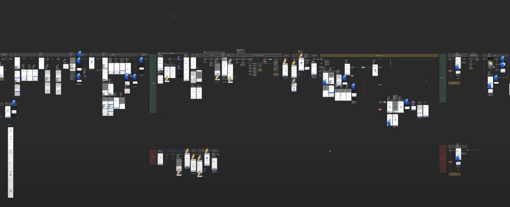
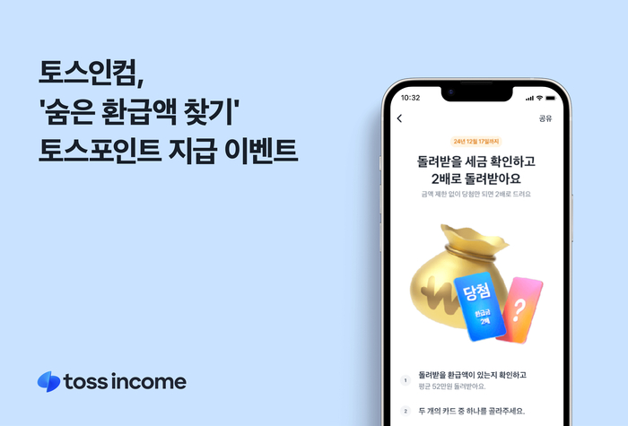
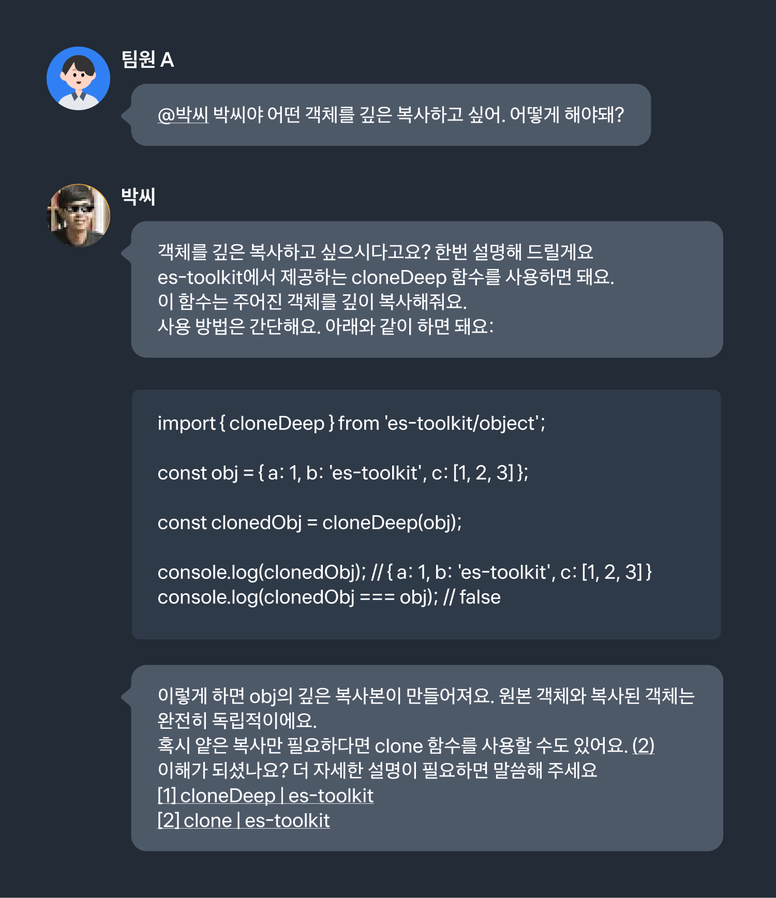

11월은 토스로 이직한 지 첫 달이었고, 새로운 사람들, 새로운 문화, 새로운 코드 등 모든 게 새로웠던 한달이었다.

아직 적응 중이지만 한달간 겪었던, 토스의 모습과 내가 배웠던 것들을 기록해보려 한다.

## 내가 경험한 토스 사람들

팀에 처음 배치되었을 때 놀랐던 부분은 팀원들이 굉장히 적극적으로 도와주려 하는 모습이었다.

메이트 분은 거의 매일같이 30분씩 어려움이 없는지 기술적, 문화적 어려움을 같이 해결해주시려 해주셨고, 팀원 분들 모두가 온보딩 과정에서 필요하거나 질문이 있을 때 빠르게 도와주시는 모습을 보며 감사했다.

그와 함께 팀원 모두 자신이 하는 일에 대해 굉장히 몰입되어 있고, 왜 이일을 하는지 또는 진행하고 있는 일의 목적이 무엇인지에 대해 근본적인 질문을 누구에게 물어도 PM, 디자이너, 개발자 상관없이 명확하게 답해주는 모습을 보며 놀랐다.

이전 회사에서 개발자로서 일하면서 '주어진 것을 잘 만드는 것'에 조금 더 많이 고민을 하며 일을 했지만, 토스는 일을 하면서 왜 이일을 하는지 또는 진행하고 있는 일의 목적이 무엇인지에 대해 근본적인 질문에 대해 서로를 설득할 수 있어야하고, 확실한 목적을 가지고 일을 하는 것 같았다.

동시에 이러한 납득이 되고 난 후에는 빠르게 제품의 이터레이션을 돌리며, 유저의 피드백을 받아 제품을 발전시키는 문화를 경험할 수 있었다.

그리고 팀의 빠른 속도를 위해서 서로가 병목이 되지 않게 필요한 부분에 대해서는 서스럼없이 도움을 요청하거나 의견을 묻다보니 일을 하면서 답답함이 없다는 점이 좋았다.

이러한 속도를 보면서 아직 미숙한 내가 팀의 속도를 더디게 하지 않을까 걱정되기도 했지만, 다행히 팀원 분들이 나에게 많은 도움을 주시며 적응하는 데 도움을 주셨다.

점점 더 팀의 속도에 기여할 수 있기를, 또한 토스팀의 중요한 문화인 DRI를 발휘해서 내가 생각하는 지금 제품에 필요한 부분에 대해 의견을 제시하고 책임지고 결정해보는 것을 다음 한달의 목표로 잡으려 한다.

## 첫 서비스 개발 - 환급액 2배 이벤트

내가 맡게된 서비스는 토스의 '숨은 환급액 찾기' 서비스로, 유저가 납부한 세금에 대해서 돌려받을 수 있는 환급액을 찾아주는 서비스이다.

해당 서비스의 디자인들을 보고 제품을 분석하면서 놀랐던 부분은 압도당할 만큼 복잡한 퍼널이었다.

입사전에 slash 발표 영상을 봤을 때 발표자분이 엄청나게 복잡한 제품을 만드셔서 이렇게 디자인이 나왔구나 모두 이렇게 복잡하지는 않겠지 했지만, 내가 담당한 숨은 환급액 찾기 서비스 또한 만만치 않게 복잡한 퍼널이었다.

세금이라는 복잡한 개념에 대해 유저들이 이해할 수 있도록 논리적으로 퍼널들이 나열되어있었고, 시간이 꽤 필요했지만 실제 사용해보면서 디자인과 전체 플로우에 대한 이해도를 높일 수 있었다.

해당 제품에 가장 먼저 담당한 기능은 '환급액 2배 이벤트'였다. 게임 형식으로 뽑기를 진행하고 당첨시 2배 환급을 진행하는 이벤트로, 유저들의 인플로우를 늘리는 이벤트였다. 백엔드 개발자분께서 말씀해주신 것에 따르면
팀 내에서 진행했던 이벤트 중에서 가장 복잡했던 이벤트였다고 한다.

작업을 하면서 혹시 나로 인해서 기간이 많이 미뤄지지 않을까, 놓친 요구사항들로 인해서 장애가 나지 않을까 걱정했지만 다행히도 메이트분의 도움으로 계속해서 제품 이해도와 코드베이스를 높여갔고,
팀원 모두가 함께 QA를 해주시면서 다행히 안정적으로 배포될 수 있었다.

해당 이벤트가 배포되고 난 후에 또 놀랐던 점은 내가 작업한 이벤트가 [뉴스 기사](https://www.etnews.com/20241121000231)로 나오게 되었다는 점이었다.

이전 회사에서는 팀이 열심히 작업한 기능을 유저가 모르고 사용하지 않아, 데이터적으로 분석하거나 더 나은 제품을 만드는 데 피드백을 받기 어려웠는데 토스는 굉장히 적극적으로 유저들에게 제품을 알리고 피드백을 받아 제품을 발전시키는 문화를 가지고 있구나 생각이 들었다.

토스는 정말 안타나 번트를 대는게 아니라 모두가 홈런을 치게 밀어준다는 문화를 경험할 수 있었다.

## 프론트엔드 코드 베이스에 익숙해지기

토스 프론트엔드 개발자로서 새로운 코드 베이스에 익숙해지기 위해서 우선 제품의 여러 코드를 보고 분석했다.

다행히 토스의 디자인 시스템은 프론트엔드 멘토링 과정을 통해서 한달간 사용하다 보니 조금 더 자연스럽게 사용할 수 있었고, 다양한 라이브러리
를 사용하는데 어려움이 있으면 여러 채널을 통해 질문할 수 있었다.

특히 사내 문서가 잘 되어 있었고, 최근 [토스 기술 블로그](https://toss.tech/article/toss-frontend-ai-docs)에 소개된 `박씨`라는 봇이 있기 때문에 24시간 편하게 질문할 수 있어 좋았다.

또한 추가적인 노력으로 사내 문서의 히스토리를 보면서 어떤 주제들을 중요하게 생각하는지 찾아 이번 달은 [패키지 매니저](https://choi2021.github.io/2024-11-18-%ED%8C%A8%ED%82%A4%EC%A7%80%EB%A7%A4%EB%8B%88%EC%A0%80/)에 대해 공부하고 정리하며 글을 작성했고, 사내 오픈소스인 [overlay kit](https://github.com/toss/overlay-kit)에 대해 [분석하는 글](https://choi2021.github.io/2024-11-24-overlay-kit-%EB%B6%84%EC%84%9D/)을 작성했다.

앞으로도 하나씩 조금씩 더 깊이 있게 코드 베이스에 익숙해져 이후에는 기여하는 것까지를 목표로 하고 있다.

## 다음 한달의 목표

이번 한달은 사람, 문화, 건물 모든 것에 새롭게 적응해야 했지만, 다음 한달은 조금 더 여유를 갖고 제품에 대해 더 깊이 있게 이해하고 기여할 수 있기를 바라며 다음 한달의 목표를 정해보았다.

- 숨은 환급액 찾기 제품 내 개선할 부분 제시하고 작업해보기
- 토스 프론트엔드 라이브러리 분석하기
- 사내 라이브러리에 기여하기

현재 사일로 내에서 개선할 부분에 대해서 제시하고 직접 작업하고 유저에게 기술적 문제를 해결했을 때 어떤 피드백을 받을 수 있는지 경험해보고 싶고, 토스 프론트엔드 라이브러리를 분석하고 기여해보며 토스 프론트엔드 개발자로서 동료로서 성장할 수 있기를 바란다.
