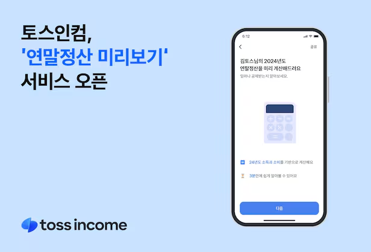
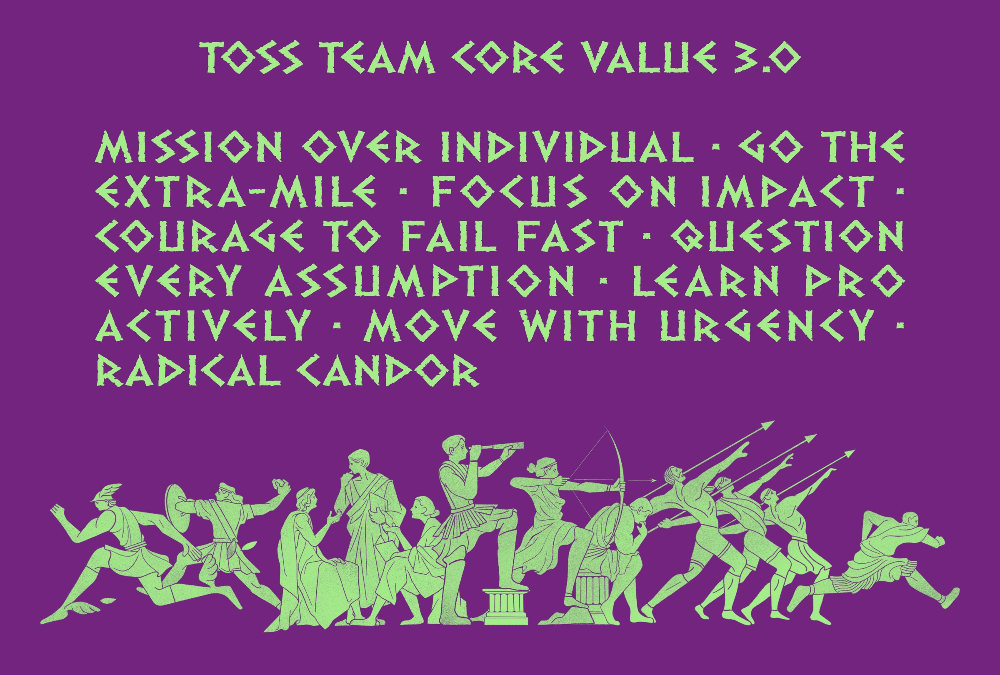

2024년 12월은 토스에서 2번째 달로, 글을 작성하는 현재 off-week 기간으로 조금 빠르게 회고를 작성하고 있다.

다른 달보다 근무 일수는 적었지만, 처음 동료평가를 받아보고, 사업자 환급금 서비스, 연말정산 미리보기 서비스 등을 개발하며 많은 것을 배웠던 한달이었다.
12월을 정리하며 토스 적응기 2달차에 대해 기록해보려 한다.

## 12월은 연말정산의 달

환급액 두배 이벤트 이후로 새롭게 진행한 서비스로 `연말정산 미리보기` 서비스를 개발해 빠르게 런칭하게 되었다.

연말에 직장인과 사업자 모두가 궁금해하는 시즌성 서비스였기 때문에 기존의 기능들을 최대한 살려서 빠르게 런칭하는 것이 중요했고, 그과정에서 세금 도메인과 프로젝트 구조를 더 이해하게 되었다.

코드를 보면서 사용자는 굉장히 편하게 느끼지만, 그 편안함을 위해 개발자들은 얼마나 많은 노력을 했는지 알 수 있었다. 다양한 유저별 상황과 조건에 맞게 제품을 만들고, 그안에서 속도를 내기 위해 노력한 흔적을 보며 많이 배울 수 있었다.

제품을 만들면서 숨이 차오른다(?)는 느낌을 받았지만, 그러다 보니 하면 좋은 일들과 중요한 일들의 위계를 세우는 것이 중요하다는 것, 왜 토스에서 Focus on Impact라는 문화를 가지고 있는지 느낄 수 있었다.

필수 기능들에 대해 빠르게 개발하고, 서비스를 런칭한 후에 추가 개선점들을 개선하는 빠른 이터레이션을 진행해 더 좋은 제품을 만들 수 있었다.

이렇게 런칭한 제품은 [뉴스 기사](https://www.etnews.com/20241121000231)로 소개되었고 현재까지도 좋은 반응을 이끌어내고 있다.

첫달에 했던 환급액 두배 이벤트는 잘될 줄 알았지만 생각보다 반응이 미적지근했고, 반면 연말정산 미리보기는 개인적으로 이미 유사한 서비스들이 토스 내에도 있었기 때문에 큰 기대는 없었지만 좋은 반응을 받게 되면서, 두 달안에 토스 내의 성공과 실패(?)를 모두 경험하는 좋은 기회를 얻을 수 있었다.

다음 달은 또 어떤 일들이 있을지 더 많은 것을 배워나갈 수 있기를 바라본다.

## 토스에서의 첫 피드백

토스로 이직 후 처음으로 동료평가를 받아보게 되었다. 토스의 회사 문화중 솔직한 피드백을 중요시한다고 알고 있었기 때문에, 살짝 두려움이 있었지만 매일같이 함께 일하는 사일로 팀원분들의 솔직한 피드백을 받아보며 좋은 경험을 할 수 있었다.

토스의 피드백은 문화를 근거로 이야기하게 되는데 여기서 가장 많이 공통적으로 받았던 부분은 `Move with Urgency`와 `Learn proactively`였다.

공통적인 설명은 한달 반이라는 기간 내에 빠르게 적응하고 제품을 만들어 팀에 기여했다는 점과 팀과 회사의 적응을 위한 점들을 먼저 물어보고 배워나갔던 점에 대해서 좋은 평가를 해주셨다.

입사를 하고 적응을 하면서 현재 팀의 내 자리는 특수성이 있었다고 느껴졌다. 매출을 내고 있는 팀이기 때문에 기대를 받는 팀이라는 점, 세금이라는 다소 어려운 맥락을 가진 제품이라는 점 등 다른 팀에 대해 잘 모르지만 주변의 이야기를 들으면서 어느정도 차이가 있다고 느껴졌다.

그렇기 때문에 적응기간을 줄이고 빠르게 팀에 기여하는 것이 중요하다고 느껴서 최대한 제품을 이해하기 위해 노력했고, 모르는 것이나 중간 중간 1대 1로 밥을 먹거나하면서 어떻게 하면 잘 적응할 수 있을지, 내가 더 잘하기 위해서 어떤 점을 신경쓰면 좋을지 등 질문을 적극적으로 했던 부분들이 긍정적으로 평가되었던 것 같다.

앞으로 더 잘할 수 있으면 좋을 부분들은 내가 가진 판단을 통해 팀과 조직에 영향력이 있다면 적극적으로 제안하는 것과 주도적으로 의견을 내는 부분이었다.

그래서 1월부터의 액션아이템으로 현재 우리 서비스에서 보완되면 좋겠다고 느끼는 점들을 적극적으로 제안해보려 한다.

두려웠지만 잘 적응하고 좋은 팀과 좋은 제품을 만들어가고 있다는 것, 한명의 토스 사람으로서 좋은 팀원이 되고 있다는 것을 느낄 수 있었다.

## 사업자 환급금 서비스

토스는 플랫폼으로서 많은 회사들과 협업하는 경우가 많다. 예를 들어 금융상품에서는 한국투자증권 등의 금융회사들도 있고, 토스 인슈런스는 보험사들과도 긴밀하게 협력하는 등 다양한 회사들과 협업하게 된다.

사업자 환급금은 내가 처음 맡은 제휴사 협력 서비스였다. 제휴사와 협업하면서 다른 회사의 제품을 어떻게 연결할지 우리가 해줘야할 부분과 제휴사에 요청해야할 부분 등 다양한 부분을 고려해 서비스를 만들어야 했다.

서로 개발해온 방식과 테스트 환경 등이 다르다보니 생각보다 의사소통에 많은 시간이 소요되었고, 이런 부분들을 해결하며 서비스를 만들어나가는 것이 중요하다는 것을 느낄 수 있었다.

또한, 사업자 환급 서비스는 긴 퍼널은 아니었지만, 누군가가 만들어둔 서비스를 기반으로 개발하는 게 아니라, 처음부터 개발하는 경험을 할 수 있었다.

기존 개발 환경과 달리 SSR로 개발하면서 SSR에서 주의해야할 점들 (서버에서 실행 시 window가 없다는 점 등) 등을 배울 수 있었고, [이전 slash 영상](https://www.youtube.com/watch?v=IKyA8BKxpXc)과 다른 SSR로 개발된 서비스 코드들을 분석하면서 SSR에서의 데이터 패칭 방식등을 배울 수 있었다.

SSR로 개발하면서 특히 좋았던 점은 서버에서 redirection 로직을 처리할 수 있다. CSR이었다면 유저에게 화면을 보여주고 리다이렉션이 이루어야 하기 때문에 잠시의 깜빡임과 로딩 시간이 필수적이지만, 서버에서 응답에 따라 바로 리다이렉션을 해주다보니 굉장한 장점으로 느껴졌다.

SSR의 단점은 아니지만 내가 길러야 할 새로운 역량으로 서버를 모니터링하고 디버깅 능력이 필요해졌다.

토스의 프론트 개발자로서 조금씩 더 성장해갈 수 있었던 시간으로 좋은 경험을 할 수 있었다.

## 다음 한달의 목표

이전 한달의 목표들은 아래와 같았다.

- [ ] 숨은 환급액 찾기 제품 내 개선할 부분 제시하고 작업해보기
- [x] 토스 프론트엔드 라이브러리 분석하기
- [x] 사내 라이브러리에 기여하기

이중 첫번째 부분은 아직 직접 작업에 대해 제시하고 작업해보지 못했다. off-week동안 조금 더 좋은 서비스가 되기 위해 필요한 부분들에 고민해보고 1월에는 꼭 직접 작업해보고 피드백을 받아보고 싶다.

두번째, 세번째 목표는 함께 진행중에 있다. 사내 라이브러리 작업에 contributor로 참여하게 되어 진행하고 있고, 이과정에서 다양한 라이브러리 코드에 대해 분석이 필요해 자연스럽게 진행할 수 있었다.

아직 진행하지 못했거나 진행중이기 때문에 다음 한달의 목표도 이전 한달과 동일하게 잡아보려 한다.

- 숨은 환급액 찾기 제품 내 개선할 부분 제시하고 작업해보기
- 사내 라이브러리 적극적으로 기여하기

이중 숨은 환급액 찾기 제품 내 개선할 부분 제시하고 작업해보기의 작업할 부분으로 성능 분석과 에러 모니터링 등 운영상 제품의 안정성에 기여할 수 있을 만한 부분들을 고려하고 있다.

생각만 하기보다 행동을 하는 한달이 되기를 다음 달에는 더 많은 것을 배워나갈 수 있기를 바란다.
