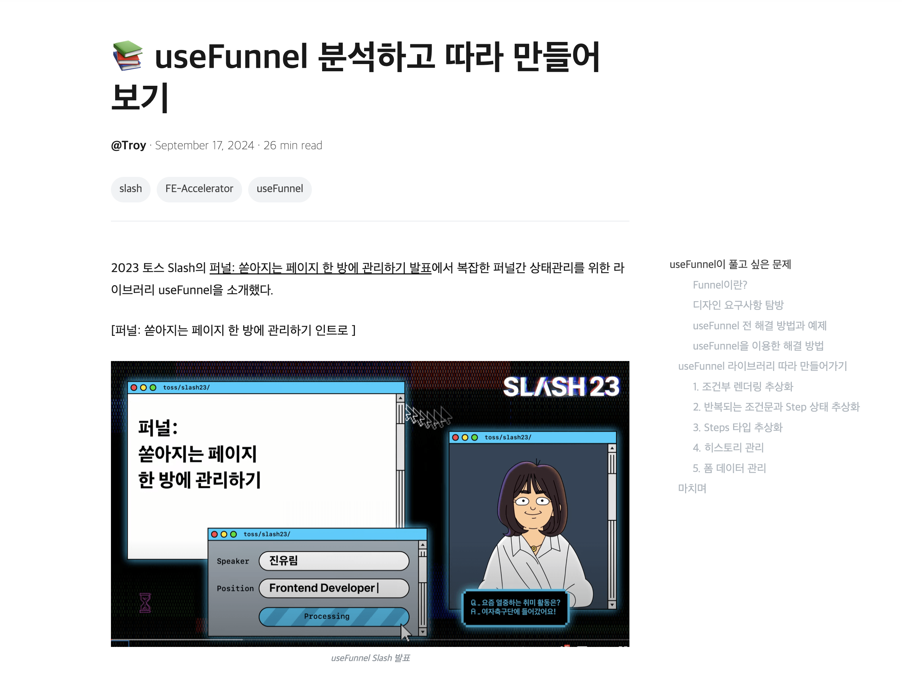
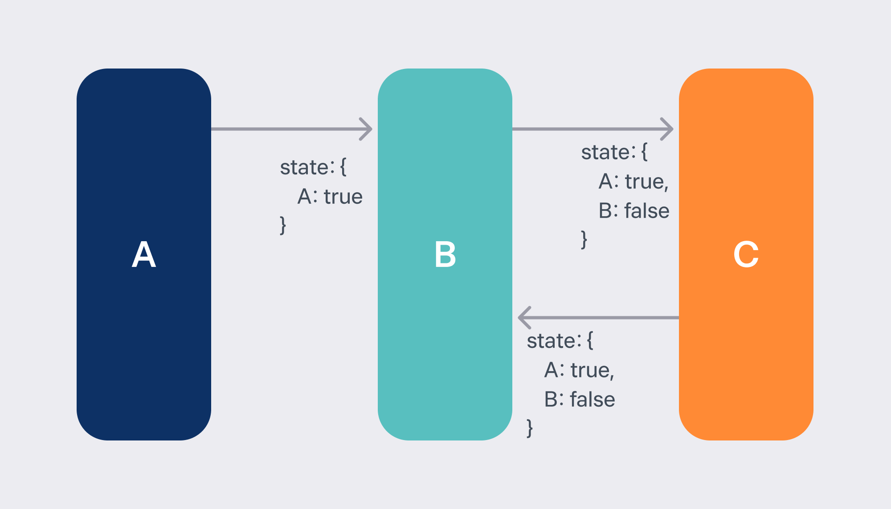
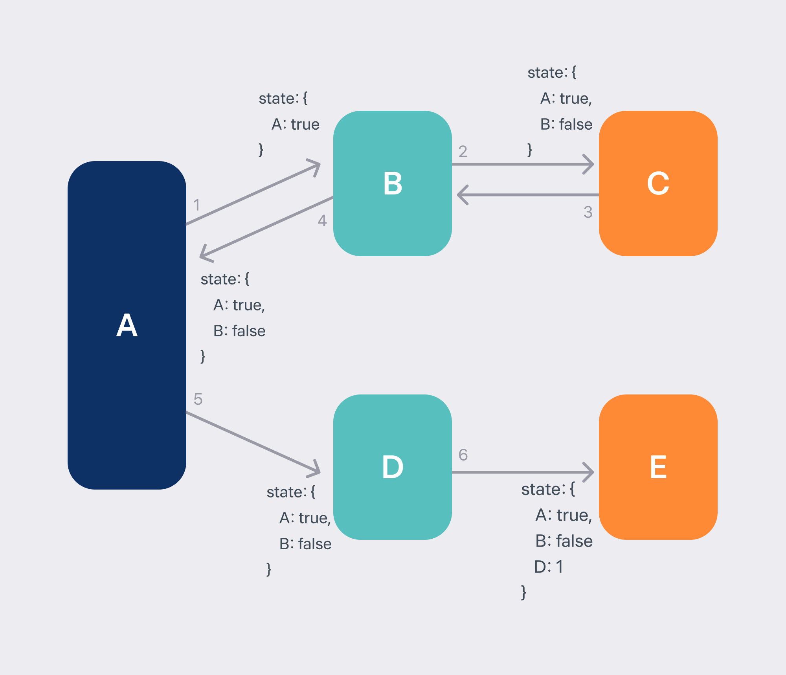
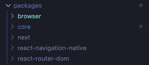
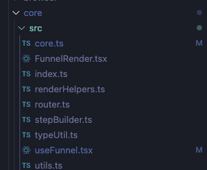
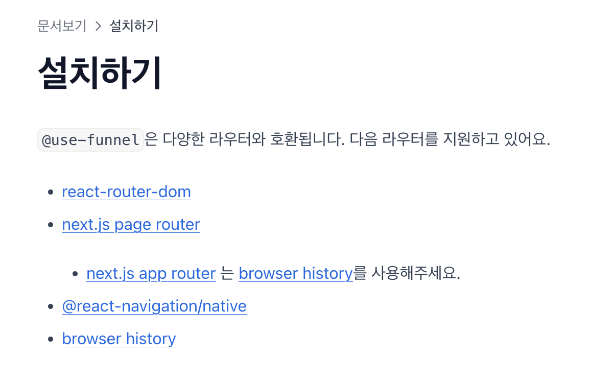
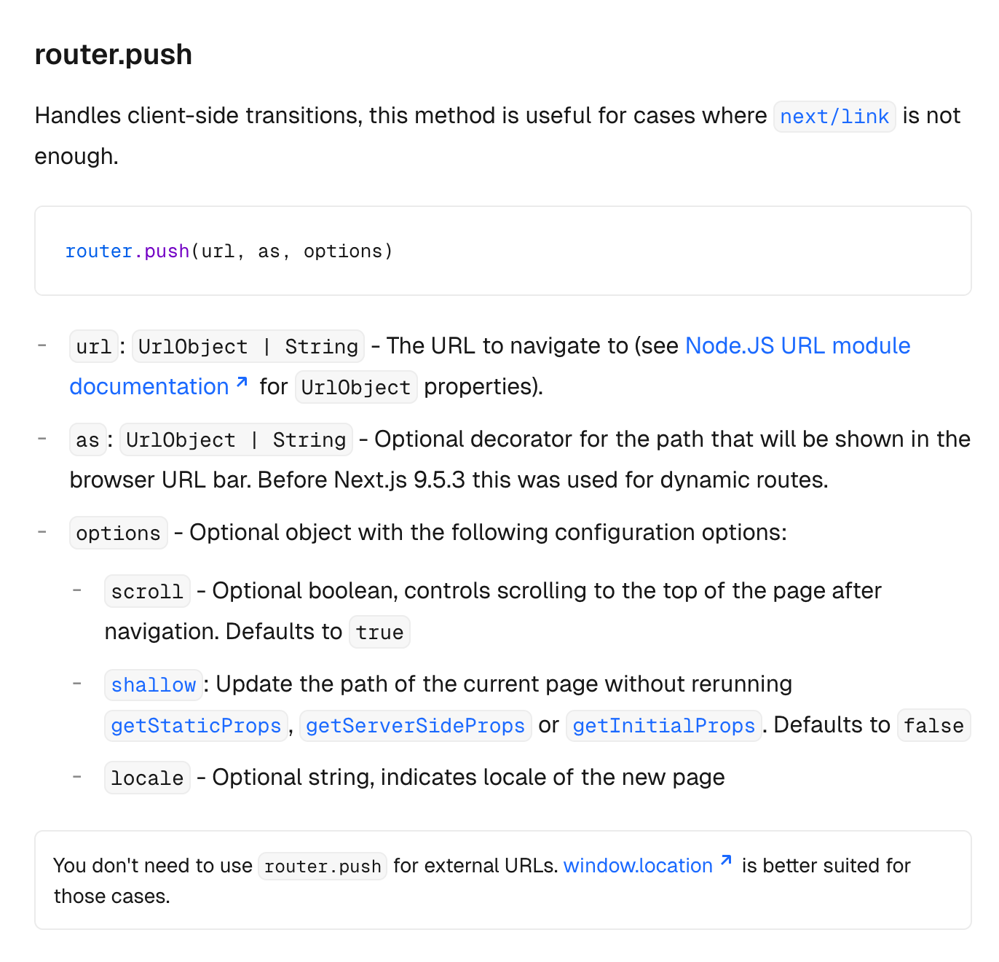
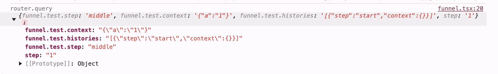

useFunnel 라이브러리는 2023 토스 Slash의 [퍼널: 쏟아지는 페이지 한 방에 관리하기 발표](https://www.youtube.com/watch?v=NwLWX2RNVcw&t=50s)에서 복잡한 퍼널간 상태관리를 위한 라이브러리 useFunnel을 소개되었고, 토스 프론트엔드 액셀러레이터 과정의 2주차 주제였던 `퍼널간 상태 관리하기`라는 주제를 진행하고 [분석하는 글](https://choi2021.github.io/2024-09-17-useFunnel-%EB%B6%84%EC%84%9D%ED%95%B4%EB%B3%B4%EA%B8%B0/)을 작성했다.



개인적으로 새롭게 정리하게 된 이유는 기존 패키지과 달리 다양한 장점을 가지고 있고, 훨씬 다양한 유즈케이스를 관리하기 위해 새롭게 만들어져 오픈소스로 공개되어 분석해보고 싶었고, 1월부터 굉장히 복잡한 퍼널을 관리가 필요한 제품을 담당하게 되면서 퍼널에 대한 이해도를 높일 필요가 있다고 느꼈다.

그러면 새로운 useFunnel 패키지에 대해 알아보고 분석해보자.

## 새로운 useFunnel은 어떤 문제를 해결하기 위한걸까?

기존 패키지가 있지만 새롭게 만들게 된 이유는 무엇일까? 새로운 패키지를 만들어주신 선영님과 민우님께서 사내 블로그에 올려주신 글을 통해 알아보자.

- [@use-funnel 개발기 #1: 왜 기존 라이브러리를 두고 새로 만들었나?](https://toss.tech/article/use-funnel-1)

- [@use-funnel 개발기 #2: 기존 라이브러리를 어떻게 뜯어 고칠 것인가?](https://toss.tech/article/use-funnel-2)

### 먼저 기존 라이브러리의 문제점

당시 선영님께서 담당하게 되신 서비스인 주택 담보 대출 비교 서비스는 굉장히 복잡한 퍼널 관리가 필요했고, 기존 사용중인 두가지 퍼널 관리 방식을 통해 구현되어 있었다.

첫번째는 기존 use-funnel 패키지로 직관적이고 익숙하지만 퍼널과정에서 수집하게 되는 데이터 관리를 별도로 해야하는 문제점이 있었다.

```tsx
interface FormState {
  purpose: Purpose;
  address: string;
  income: number;
}

function Funnel() {
  const [formState, setFormState] = useState<Partial<FormState>>({});
  const [Funnel, setStep] = useFunnel([FunnelName.대출목적선택, FunnelName.담보물선택, FunnelName.연소득입력], {
    initialStep: FunnelName.대출목적선택,
    stepQueryKey: 'mortgage-loan-funnel',
  });

  return (
    <Funnel>
      <Funnel.Step name={FunnelName.대출목적선택}>
        <대출목적선택
          onNext={purpose =>
            setFormState(prev => ({ ...prev, purpose }));
          }}
        />
      </Funnel.Step>
      <Funnel.Step name={FunnelName.담보물선택}>
        <담보물선택
          onNext={(address) => {
            setFormState(prev => ({ ...prev, address }));
          }}
        />
      </Funnel.Step>
      <Funnel.Step name={FunnelName.연소득입력}>
        <연소득입력
          onNext={(income) => {
            setFormState(prev => ({ ...prev, income }));
          }}
        />
      </Funnel.Step>
    </Funnel>
  );
};
```

두번째로는 XState 상태관리 도구를 이용하는 방식으로 퍼널과 상태를 함께 관리하지만 복잡하면서도 상태관리와 렌더링하는 컴포넌트 코드가 분리되어 있는 문제점이 있었다.

```tsx
function createFunnelMachine() {
  return (
    createMachine<Partial<Context>, Event, StateType>({
		  id: "mortgage-loan-funnel",
		  initial: "대출목적선택",
		  states: {
				대출목적선택: {
					entry: [assign(context => 대출목적선택State검증(context))],
					on: {
						대출목적선택완료: [
						  {
						    target: "담보물선택",
						    actions: [assign()],
						  }
						]
					}
				},
				담보물선택: {
					entry: [assign(context => 담보물선택State검증(context))],
					on: {
						담보물선택완료: [
						  {
						    target: "연소득입력",
						    actions: [assign()],
						  }
						]
					}
				},
				연소득입력: {
					entry: [assign(context => 연소득입력State검증(context))],
					on: {
						연소득입력완료: [
						  {
						    target: "입력완료",
						    actions: [assign()],
						  }
						]
					}
				},
				입력완료: {
				  entry: [assign(context => 입력완료State검증(context))],
				}
		  }
    })
  );
}

function Funnel() {
  const [funnelMachine] = useState(() => createFunnelMachine());
  // useMachineRouter는 dispatch 시점에 적절한 다음 퍼널로 라우트시켜주는 기능을 구현한 hook이에요
  // 내부적으로 XState의 useMachine을 사용해요
  const [render, state] = useMachineRouter(funnelMachine);

  return (
    <>
      {render({
        대출목적선택: ({ dispatch }) => (
          <대출목적선택
	          onNext={purpose =>
	            dispatch({ type: "대출목적선택완료", payload: { purpose }})
	          }}
	        />
        ),
        담보물선택: ({ dispatch }) => (
          <담보물선택
	          onNext={address =>
	            dispatch({ type: "담보물선택완료", payload: { address }})
	          }}
	        />
        ),
        연소득입력: ({ dispatch }) => (
          <연소득입력
	          onNext={income =>
	            dispatch({ type: "연소득입력완료", payload: { income }})
	          }}
	        />
        ),
        입력완료: ({ context }) => (
          <입력완료 context={context} />
        )
      })}
    </>
  );
}
```

둘다 공통적으로 뒤로가기와 앞으로 가기를 할 때, 수집한 데이터를 관리하는데 어려움이 존재하게 된다. 예를 들어 A->B->C 에서 B로 돌아가게 되면 A에서 수집한 데이터 외의 B에서 이미 수집한 데이터가 존재하게 된다.



이부분을 읽으면서 `이미 선택한 데이터를 다시 선택하지 않아도 되게 해줄 수 있기 위해 이미 선택한 정보는 뒤로가기시에도 보관하는 게 좋지 않을까` 생각이 들었지만 아래와 같은 상황이라면 달라진다.



위 사진처럼 A → B → C → B(뒤로가기) → A(뒤로가기) → D → E로 이동한다면 했을때 선택한적 없어야하는 B의 값을 D, E 퍼널에서 갖게 되면서 별도로 원하는 데이터를 정제하는 과정이 필요하게 된다.

이렇게 퍼널이 복잡해질수록 각 스텝에서 보유해야하는 데이터를 한정시켜주는게 데이터의 흐름을 이해하는데 조금 더 직관적이고 좋을 것 같다는 생각이 들었고 문제상황을 공감할 수 있었다.

## 기존 useFunnel의 또다른 문제점

기존의 useFunnel 패키지의 또다른 문제점은 `Next와의 강한 결합`이었다. 다른 라우팅 라이브러리와 환경(React Router DOM, react native 환경) 에서는 각자 자체적으로 구현해야 한다는 점이 있었고,
퍼널에서 수집한 데이터의 타입이 `자동적으로 추론이 되지 않기 때문에` A퍼널에서 필수적으로 받아야하는 데이터가 B 퍼널에서 여전히 optional로 추론되기도 해 타입을 좁히는 코드가 별도로 필요했다.

이 두가지 문제점을 추가로 개선한 버전이 바로 `새로운 useFunnel` 패키지였다. 그러면 이제 실제 코드를 보면서 분석해보자.

## 코드 분석

use-funnel 패키지를 다운받아서 내부 구조를 보게 되면 아래와 같은 구조를 확인할 수 있다.



위와 같은 프로젝트 구조를 통해 core 폴더는 라이브러리, 프레임워크와 상관없이 동일하게 적용되는 핵심로직을 가지고 있고, 라우팅 라이브러리/프레임워크 폴더들은 각각의 사용방법에 맞게 구체적인 구현이 되어있을 것으로 예상할 수 있다.

이렇게 공통 코어 로직과 구체적인 구현을 분리하는 구조를 통해 특정 라우팅 라이브러리/프레임워크와의 강결합을 끊고 라이브러리의 유연성을 가지게 되었다.

그러면 이제 핵심적이고 중요한 코어 폴더의 코드를 살펴보자.

### Core 패키지

코어 패키지는 모든 패키지에서 공통적으로 사용되는 핵심 로직이 구현되어 있는 패키지이다.



코어 패키지의 index.ts 파일을 살펴보면 다음과 같은 코드를 확인할 수 있다.

```ts
// index.ts
export { AnyFunnelState } from "./core.js"
export * from "./stepBuilder.js"
export { CreateFunnelStepType } from "./typeUtil.js"
export * from "./useFunnel.js"
```

stepBuilder 등 추가적인 기능들을 제공하고 있지만, 이중 개인적으로 중요하다고 생각하는 핵심 `useFunnel.tsx` 파일을 살펴보면서 필요한 타입, 유틸 함수들을 하나씩 분석해보려 한다.

처음 코드를 봤을 때 굉장히 복잡한 타입 정의에 압도를 당하는 느낌이어서 부분 부분 따라가며 이해하는 것이 좋다고 생각이 들어 쪼개서 분석해보았다.

#### UseFunnelOptions

`UseFunnelOptions` 타입은 퍼널의 옵션을 정의하는 타입이다.

```ts
// core.ts
export interface FunnelState<TName extends string, TContext = never> {
  step: TName
  context: TContext
}

export type AnyContext = Record<string, any>
export type AnyStepContextMap = Record<string, AnyContext>

export type FunnelStateByContextMap<TStepContextMap extends AnyStepContextMap> =
  {
    [key in keyof TStepContextMap & string]: FunnelState<
      key,
      TStepContextMap[key]
    >
  }[keyof TStepContextMap & string]

// useFunnel.tsx
export interface UseFunnelOptions<TStepContextMap extends AnyStepContextMap> {
  id: string
  initial: FunnelStateByContextMap<TStepContextMap>
  steps?: {
    [TStepName in keyof TStepContextMap]: FunnelStepOption<
      TStepContextMap[TStepName]
    >
  }
}
```

UseFunnelOptions 타입은 라우팅 패키지별로 사용할 `createUseFunnel` 함수에 전달할 옵션을 정의하는 타입이다. initial 옵션을 정의할 때 `FunnelStateByContextMap` 타입을 사용하고 있는데,
사용처에서 정의한 context 구조를 통해 스텝별 퍼널의 상태를 타입으로 정의하고 있다.

```ts
// core.ts
export interface FunnelState<TName extends string, TContext = never> {
  step: TName
  context: TContext
}
```

`funnelState`는 퍼널의 상태를 정의하는 타입이다. 퍼널의 상태는 퍼널의 스텝과 퍼널에서 사용할 데이터를 정의하는 context로 구성되어 있다.

```ts
// core.ts
export type FunnelStateByContextMap<TStepContextMap extends AnyStepContextMap> =
  {
    [key in keyof TStepContextMap & string]: FunnelState<
      key,
      TStepContextMap[key]
    >
  }[keyof TStepContextMap & string]
```

`FunnelStateByContextMap` 타입은 스텝별 퍼널 상태를 정의하는 타입으로 키는 문자열로 좁혀져 있는데 퍼널의 퍼널의 스텝은 `브라우저 히스토리`와 관련이 깊다보니 key가 될 수 있는 `string | number | symbol` 타입에서 string으로 좁히도록 되어있지 않을까 생각해볼 수 있었다.

실제로 사용하는 코드를 보면 아래와 같다.

```tsx
type EmailInput = {}

type PasswordInput = {
  email: string
}

type OtherInput = {
  email: string
  password: string
}

const funnel = useFunnel<{
  이메일입력: EmailInput
  비밀번호입력: PasswordInput
  그외정보입력: OtherInput
}>({
  id: "my-funnel-app",
  initial: {
    step: "이메일입력",
    context: {},
  },
})
```

그러면 위 예제에서 전달될 타입들을 살펴보면 다음과 같다.

```ts
type TStepContextMap = {
  이메일입력: EmailInput
  비밀번호입력: PasswordInput
  그외정보입력: OtherInput
}

type FunnelStateByContextMap = {
  이메일입력: FunnelState<"이메일입력", EmailInput>
  비밀번호입력: FunnelState<"비밀번호입력", PasswordInput>
  그외정보입력: FunnelState<"그외정보입력", OtherInput>
}

type UseFunnelOptions = {
  id: string
  initial: {
    step: keyof TStepContextMap
    context: TStepContextMap[keyof TStepContextMap]
  }
  steps?: {
    [TStepName in keyof TStepContextMap]: FunnelStepOption<
      TStepContextMap[TStepName]
    >
  }
}
```

기본적인 옵션 외에 steps는 퍼널의 타입을 커스텀하게 정의할 수 있는 옵션으로 옵셔널한 옵션이다. 이때 step별로 조금 더 세부적인 타입이나 런타임 에러를 체크할 수 있는 옵션을 정의할 수 있다.

```ts
// stepBuilder.ts
export type FunnelStepGuardOption<TContext> = {
  guard: (data: unknown) => data is TContext
}

export type FunnelStepParseOption<TContext> = {
  parse: (data: unknown) => TContext
}

export type FunnelStepOption<TContext> =
  | FunnelStepGuardOption<TContext>
  | FunnelStepParseOption<TContext>
```

`FunnelStepGuardOption`은 전달 받은 데이터가 특정 타입인지 검증하는 옵션이고, `FunnelStepParseOption`은 전달 받은 데이터를 특정 타입으로 변환하는 옵션이다.

`FunnelStepOption`은 두 옵션을 합치는 union 타입으로 정의되어 있는데 steps 옵션으로 두가지 방식을 다 사용할 수 있게 제공하고 있다.

그러면 실제 사용 예제를 살펴보자.

```tsx
import { useFunnel } from "@use-funnel/next"

type FormState = {
  email?: string
  password?: string
  other?: unknown
}

function 이메일입력_guard(data: unknown): data is FormState {
  return true
}

function 비밀번호입력_parse(data: unknown): FormState & { email: string } {
  if (
    !(
      data != null &&
      typeof data === "object" &&
      "email" in data &&
      typeof data["email"] === "string"
    )
  ) {
    throw new Error("비밀번호입력 데이터가 아닙니다.")
  }
  return { ...data, email: data.email }
}

function 그외정보입력_parse(
  data: unknown
): FormState & { email: string; password: string; other: unknown } {
  const parseData = 비밀번호입력_parse(data)
  if (!("password" in parseData && typeof parseData.password === "string")) {
    throw new Error("비밀번호가 없습니다")
  }
  return { ...parseData, password: parseData.password, other: parseData.other }
}

function MyFunnelApp() {
  const funnel = useFunnel({
    id: "step-by-step",
    initial: {
      step: "이메일입력",
      context: {},
    },
    steps: {
      이메일입력: { guard: 이메일입력_guard },
      비밀번호입력: { parse: 비밀번호입력_parse },
      그외정보입력: { parse: 그외정보입력_parse },
    },
  })

  funnel.step === "이메일입력" && typeof funnel.context.email // "string" | "undefined"
  funnel.step === "비밀번호입력" && typeof funnel.context.email // "string"

  funnel.step === "비밀번호입력" && typeof funnel.context.password // "string" | "undefined"
  funnel.step === "그외정보입력" && typeof funnel.context.password // "string"
  // ...
}
```

위 코드는 공식 문서의 예제를 이용한 것으로 steps에 실제 런타임 에러를 체크할 수 있는 옵션을 정의하고 타입이 안전하게 추론되는 것을 확인할 수 있다.

#### UseFunnelResults

타입적으로 가장 복잡한 UseFunnelResults는 `createUseFunnel` 함수의 반환 타입이다. 해당 타입을 이해하기 위해 위와 같이 구성하는 타입들을 하나하나씩 살펴보며 이해해보자.

```ts
// core.ts
export type AnyStepContextMap = Record<string, AnyContext>

export type RouteOption = Partial<Record<string, any>>

export interface FunnelState<TName extends string, TContext = never> {
  step: TName
  context: TContext
}

export type AnyFunnelState = FunnelState<string, AnyContext>

export type GetFunnelStateByName<
  TFunnelState extends AnyFunnelState,
  TName extends TFunnelState["step"]
> = Extract<TFunnelState, { step: TName }>
```

`AnyStepContextMap`은 퍼널의 스텝별 데이터를 정의하는 타입이고, `RouteOption`은 퍼널의 라우트 옵션을 정의하는 타입으로 key를 문자열로 가지는 객체이다.

`FunnelState` 타입은 퍼널의 상태를 정의하는 타입으로 퍼널의 상태는 퍼널의 스텝과 퍼널에서 사용할 데이터를 정의하는 context로 구성되어 있다.

`GetFunnelStateByName` 타입은 FunnelState 타입에서 특정 스텝의 이름을 이용해 특정 퍼널의 상태를 추출하는 타입이다.

예로 퍼널의 상태가 다음과 같이 정의되어 있다고 가정해보자.

```ts
type StepContextMap = {
  이메일입력: {
    email?: string
  }
  비밀번호입력: {
    email: string
    password?: string
  }
}
```

여기에 특정 스텝의 상태를 추출하면 다음과 같은 타입이 된다.

```ts
type 이메일입력State = GetFunnelStateByName<StepContextMap, "이메일입력">
// {
//   step: '이메일입력';
//   context: { email?: string; }
// }
```

이제 다음으로 히스토리 관리 메소드들, 트랜지션 함수를 정의하는 타입들을 살펴보자.

```ts
// router.ts
export interface FunnelRouterTransitionOption {
  renderComponent?: {
    overlay: boolean
  }
}

type TransitionFnArguments<
  TName extends PropertyKey,
  TContext,
  TRouteOption extends RouteOption
> = Partial<TContext> extends TContext
  ? [
      target: TName,
      context?: TContext,
      option?: FunnelRouterTransitionOption & TRouteOption
    ]
  : [
      target: TName,
      context: TContext,
      option?: FunnelRouterTransitionOption & TRouteOption
    ]
```

`FunnelRouterTransitionOption` 타입은 퍼널의 라우트 옵션을 정의하는 타입으로 Overlay 형식의 컴포넌트도 퍼널의 스텝으로 관리하기 위해 정의되어 있다.

`TransitionFnArguments` 타입은 트랜지션 함수의 인자를 정의하는 타입으로 트랜지션 함수의 인자는 특정 스텝의 이름, 스텝의 데이터, 라우트 옵션으로 구성되어 있다.

다음으로 step별로 required, optional 속성을 정의하는 util 타입을 살펴보자.

```ts
// typeUtils.ts

export type Prettify<T> = Omit<T, never>

export type RequiredCompareKeys<TBase, TResult> =
  | keyof TResult
  | keyof TBase extends infer K
  ? K extends keyof TResult
    ? K extends keyof TBase
      ? TBase[K] extends TResult[K]
        ? never
        : K
      : undefined extends TResult[K]
      ? never
      : K
    : never
  : never

export type OptionalCompareKeys<TBase, TResult> =
  | keyof TBase
  | keyof TResult extends infer K
  ? K extends keyof TResult
    ? K extends keyof TBase
      ? TBase[K] extends TResult[K]
        ? K
        : never
      : undefined extends TResult[K]
      ? K
      : never
    : K extends keyof TBase
    ? K
    : never
  : never
```

`Prettify` 타입은 객체의 속성으로 never인 타입을 제외해 타입을 읽기 쉽게 만들어주는 타입이다.

`RequiredCompareKeys` 타입은 두가지 타입의 속성 중 **필수 속성으로 변경/추가**된 속성을 배열로 반환하고,`OptionalCompareKeys` 타입은 두가지 타입의 속성 중 **선택 속성으로 변경된 속성과 공통으로 가지고 있는 속성**을 배열로 반환한다.

예시로 step별로 아래와 같은 타입이 있다고 가정해보자.

```ts
type StepContextMap = {
  이메일입력: {
    email?: string
  }
  비밀번호입력: {
    email: string
    password?: string
  }
}
```

그러면 이제 두가지 타입의 속성을 합치면 RequiredCompareKeys와 OptionalCompareKeys 타입을 사용해 필수 속성과 선택 속성을 추출할 수 있다.

```ts
// 비밀번호입력 스텝에서:
type Required = RequiredCompareKeys<
  StepContextMap["이메일입력"],
  StepContextMap["비밀번호입력"]
> // "email"

type Optional = OptionalCompareKeys<
  StepContextMap["이메일입력"],
  StepContextMap["비밀번호입력"]
> // "password"
```

TransitionFn에서는 두가지 타입의 속성을 합치는 타입을 사용해 트랜지션 함수의 인자를 정의하고 있다.

```ts
// typeUtils.ts

export type CompareMergeContext<TBase, TResult> = Prettify<
  {
    [K in RequiredCompareKeys<TBase, TResult>]: K extends keyof TResult
      ? TResult[K]
      : K extends keyof TBase
      ? TBase[K]
      : never
  } & {
    [K in OptionalCompareKeys<TBase, TResult>]?: K extends keyof TBase
      ? TBase[K]
      : K extends keyof TResult
      ? TResult[K]
      : never
  }
>

//FunnelRender.tsx

type TransitionFn<
  TState extends AnyFunnelState,
  TNextState extends AnyFunnelState,
  TRouteOption extends RouteOption
> = <TName extends TNextState["step"]>(
  ...args:
    | TransitionFnArguments<
        TName,
        CompareMergeContext<
          TState["context"],
          GetFunnelStateByName<TNextState, TName>["context"]
        >,
        TRouteOption
      >
    | [
        target: TName,
        callback: (
          prev: TState["context"]
        ) => GetFunnelStateByName<TNextState, TName>["context"],
        option?: FunnelRouterTransitionOption & TRouteOption
      ]
) => Promise<GetFunnelStateByName<TNextState, TName>>
```

`CompareMergeContext` 타입은 두가지 타입의 속성을 합치는 타입으로 필수 속성으로 변경된 값과 기존에 있거나 새롭게 추가된 선택 속성을 추출해 합치는 타입이다.

`TransitionFn` 타입은 트랜지션 함수를 정의하는 타입으로 인자는 두가지 인터페이스를 사용해 정의하고 있고 반환 타입은 특정 스텝의 상태를 Promise로 반환하는 타입이다. 제네릭을 보면 현재 `TState`와 `TNextState`는 트랜지션 함수의 현재 상태와 다음 상태를 정의하고 있고 `TRouteOption`는 트랜지션 함수의 라우트 옵션을 전달받는다.

인자의 첫번째 방식은 `TransitionFnArguments` 타입을 사용해 특정 스텝의 이름, 스텝의 context, 라우트 옵션으로 구성된다.
Context를 전달할 때 타입적으로 다음 스텝으로 퍼널 전환할 때 타입적으로 안전하게 context를 전달하게 하기 위해 `CompareMergeContext` 타입을 사용해 정의하고 있다. 비교대상은 `TState[context]` 타입와 `GetFunnelStateByName` 타입을 사용한 다음 스텝의 context로 정의된다.

두번째 방식은 특정 스텝의 이름, 콜백 함수, 라우트 옵션으로 구성된다. 콜백 함수는 이전 스텝의 context를 받아 다음 스텝의 context를 반환하는 함수이다.

이제 히스토리 타입을 보자.

```ts
export type FunnelTransition<
  TStepContextMap extends AnyStepContextMap,
  TStepKey extends keyof TStepContextMap & string,
  TRouteOption extends RouteOption
> = TransitionFn<
  FunnelState<TStepKey, TStepContextMap[TStepKey]>,
  {
    [NextStepKey in keyof TStepContextMap & string]: FunnelState<
      NextStepKey,
      TStepContextMap[NextStepKey]
    >
  }[keyof TStepContextMap & string],
  TRouteOption
>

export interface FunnelHistory<
  TStepContextMap extends AnyStepContextMap,
  TStepKey extends keyof TStepContextMap & string,
  TRouteOption extends RouteOption
> {
  push: FunnelTransition<TStepContextMap, TStepKey, TRouteOption>
  replace: FunnelTransition<TStepContextMap, TStepKey, TRouteOption>
  go: (index: number) => void | Promise<void>
  back: () => void | Promise<void>
}
```

`FunnelTransition` 타입은 퍼널의 전환 함수(트랜지션 함수)를 정의하는 타입으로 퍼널의 전환 함수는 퍼널의 상태, 다음 상태, 라우트 옵션으로 구성된다.

`FunnelHistory` 타입은 퍼널의 히스토리를 정의하는 타입으로 퍼널의 히스토리는 퍼널의 상태, 다음 상태, 라우트 옵션을 전달받아 트랜지션 함수를 정의하고 있다.
우리가 자주보던 `window.history` API와 유사하게 `push`, `replace`, `go`, `back` 메소드를 정의하고 있다. 각 메소드는 FunnelTransition 타입을 통해 정의되어 있다.

공식문서의 예시로 보면 다음과 같다.

```tsx
declare function 이메일입력(props: {
  onNext: (email: string) => void
}): JSX.Element
declare function 비밀번호입력(props: {
  email: string
  onNext: (password: string) => void
}): JSX.Element

switch (funnel.step) {
  case "이메일입력":
    return (
      <이메일입력
        onNext={email => funnel.history.push("비밀번호입력", { email })}
      />
    )
  case "비밀번호입력":
    return (
      <비밀번호입력
        email={funnel.context.email} // optional -> required
        onNext={password =>
          funnel.history.push("그외정보입력", prev => ({ ...prev, password }))
        }
      />
    )
}
```

이메일입력에서 onNext를 보게되면 email 데이터는 필수값으로 전달되고, 비밀번호 입력에서 context.email은 이메일입력에서 입력한 값이 있기 때문에 필수값으로 전달된다.

다음으로 FunnelStep 타입을 보자.

```ts
// FunnelRender.tsx

export type FunnelStep<
  TStepContextMap,  // 전체 스텝 컨텍스트 맵
  TStepKey,        // 현재 스텝 키
  TRouteOption     // 라우팅 옵션
> = {
  step: TStepKey;                              // 현재 스텝 이름
  context: TStepContextMap[TStepKey];          // 현재 스텝의 컨텍스트
  history:FunnelHistory<TStepContextMap, TStepKey, TRouteOption>         // 히스토리 조작 메서드들
  index: number;                               // 현재 스텝의 인덱스
  historySteps: FunnelState<...>[];           // 전체 히스토리 스텝들
};

export type FunnelStepByContextMap<TStepContextMap extends AnyStepContextMap, TRouteOption extends RouteOption> = {
  [TStepKey in keyof TStepContextMap & string]: FunnelStep<TStepContextMap, TStepKey, TRouteOption>;
}[keyof TStepContextMap & string];

export type FunnelRenderReady<
  TStepContextMap extends AnyStepContextMap,
  TRouteOption extends RouteOption,
> = FunnelStepByContextMap<TStepContextMap, TRouteOption>;
```

`FunnelStep`은 앞서 정리해온 타입들을 이용해 퍼널 스텝을 정의하는 타입이다. 퍼널 스텝은 `step`, `context`, `history`, `index`, `historySteps`로 구성된다.

`FunnelStepByContextMap` 타입은 contextMap의 키값들을 키로, 값은 퍼널 스텝으로 가지는 객체에서 각 스텝별 FunnelStep 타입을 생성하는 유틸리티 타입을 반환하는 util 타입이다.

`FunnelRenderReady` 타입은 퍼널의 스텝을 정의하는 타입으로 퍼널의 스텝은 퍼널의 상태, 라우트 옵션을 전달받아 퍼널의 스텝을 정의하고 있다.

```ts
// FunnelRender.tsx
export type FunnelRenderOverlayHandler = {
  close: () => void
}

export type RenderResult<
  TStepContextMap extends AnyStepContextMap,
  TStepKey extends keyof TStepContextMap & string,
  TRouteOption extends RouteOption
> =
  | {
      type: "render"
      render: (
        step: FunnelStep<TStepContextMap, TStepKey, TRouteOption>
      ) => React.ReactNode
    }
  | {
      type: "overlay"
      render: (
        step: FunnelStep<TStepContextMap, TStepKey, TRouteOption> &
          FunnelRenderOverlayHandler
      ) => React.ReactNode
    }

export interface FunnelRenderComponentProps<
  TStepContextMap extends AnyStepContextMap,
  TRouteOption extends RouteOption
> {
  funnel: FunnelRenderReady<TStepContextMap, TRouteOption>
  steps: {
    [TStepKey in keyof TStepContextMap & string]:
      | RenderResult<TStepContextMap, TStepKey, TRouteOption>
      | ((
          step: FunnelStep<TStepContextMap, TStepKey, TRouteOption>
        ) => React.ReactNode)
  }
}
```

`FunnelRenderOverlayHandler`는 overlay 형식의 컴포넌트를 렌더링할때 사용하는 타입으로 오버레이가 닫힐 때를 위해 close 메소드를 정의하고 있다.

`RenderResult` 타입은 퍼널 타입별로 렌더링함수의 타입을 정의하는 것으로 `render`, `overlay` 두가지 타입을 정의함으로서 이후에 퍼널 타입별로 렌더링함수를 정의할 때 타입적으로 안전하게 정의할 수 있다.

`FunnelRenderComponentProps` 타입은 RenderComponent의 prop을 정의하는 타입으로 퍼널의 렌더 컴포넌트는 퍼널의 스텝을 전달받아 렌더 함수를 정의하고 있다.

```ts
// useFunnel.tsx
export type UseFunnelResults<
  TStepContextMap extends AnyStepContextMap,
  TRouteOption extends RouteOption
> = {
  Render: ((
    props: FunnelRenderComponentProps<TStepContextMap, TRouteOption>["steps"]
  ) => JSX.Element) & {
    with: typeof renderWith
    overlay: typeof overlayRenderWith
  }
} & FunnelStepByContextMap<TStepContextMap, TRouteOption>
```

`UseFunnelResults` 타입은 앞서 소개한 타입들을 이용해 훅으로 반환되는 타입으로 `Render` 메소드는 `FunnelRenderComponentProps` 타입으로 prop을 전달받아 컴포넌트를 반환하고,
`FunnelStepByContextMap` 타입으로 퍼널의 스텝을 반환하게 된다.

실제 useFunnel훅을 사용하는 예제를 보면 다음과 같다.

```tsx
declare function 이메일입력(props: {
  onNext: (email: string) => void
}): JSX.Element

declare function 비밀번호입력(props: {
  email: string
  onNext: (password: string) => void
}): JSX.Element

declare function 그외정보입력(): JSX.Element

type SignupFunnel = {
  이메일입력: 이메일입력
  비밀번호입력: 비밀번호입력
  그외정보입력: 그외정보입력
}

// switch문을 사용한 구현
function MyFunnelApp() {
  const funnel = useFunnel<SignupFunnel>({
    id: "my-funnel-app",
    initial: {
      step: "이메일입력",
      context: {},
    },
  })

  switch (funnel.step) {
    case "이메일입력":
      return (
        <이메일입력
          onNext={email => funnel.history.push("비밀번호입력", { email })}
        />
      )

    case "비밀번호입력":
      return (
        <비밀번호입력
          email={funnel.context.email}
          onNext={password => funnel.history.push("그외정보입력", { password })}
        />
      )

    case "그외정보입력":
      return <그외정보입력 />
  }
}

// Render 컴포넌트를 사용한 구현
function MyFunnelApp() {
  const funnel = useFunnel<SignupFunnel>({
    id: "my-funnel-app",
    initial: {
      step: "이메일입력",
      context: {},
    },
  })

  return (
    <funnel.Render
      이메일입력={({ history }) => (
        <이메일입력 onNext={email => history.push("비밀번호입력", { email })} />
      )}
      비밀번호입력={({ context, history }) => (
        <비밀번호입력
          email={context.email}
          onNext={password => history.push("그외정보입력", { password })}
        />
      )}
      그외정보입력={() => <그외정보입력 />}
    />
  )
}
```

예제를 보면 퍼널 컴포넌트를 만들때 Switch문을 이용해서 각 스텝별로 컴포넌트를 렌더링할 수 있게 할 수 있고, `Render` 컴포넌트를 이용해서 각 스텝별로 컴포넌트를 렌더링할 수 있게 할 수 있다.

그러면 이제 드디어 열심히 정리한 타입들을 이용해 이제 UseFunnel 타입을 만들 수 있다.

```ts
export interface UseFunnel<TRouteOption extends RouteOption> {
  <
    _TStepContextMap extends AnyStepContextMap,
    TStepKeys extends keyof _TStepContextMap = keyof _TStepContextMap,
    TStepContext extends _TStepContextMap[TStepKeys] = _TStepContextMap[TStepKeys],
    TStepContextMap extends string extends keyof _TStepContextMap
      ? Record<TStepKeys, TStepContext>
      : _TStepContextMap = string extends keyof _TStepContextMap
      ? Record<TStepKeys, TStepContext>
      : _TStepContextMap
  >(
    options: UseFunnelOptions<TStepContextMap>
  ): UseFunnelResults<TStepContextMap, TRouteOption>
}
```

대부분의 타입에 대한 분석은 끝났으니 실 구현부를 보자.

#### FunnelRender

funnelRender는 Render컴포넌트에 해당되는 컴포넌트에 해당하게 된다.

```tsx
export function useUpdatableRef<T>(value: T) {
  const ref = useRef(value)
  ref.current = value
  return ref
}

function useOverwriteFunnelHistoryTransitionArgument<
  TStepContextMap extends AnyStepContextMap,
  TStepKey extends keyof TStepContextMap & string,
  TRouteOption extends RouteOption
>(
  history: FunnelHistory<TStepContextMap, TStepKey, TRouteOption>,
  callback: (
    step: TStepKey,
    context?: TStepContextMap[TStepKey],
    option?: FunnelRouterTransitionOption
  ) => FunnelRouterTransitionOption
): FunnelHistory<TStepContextMap, TStepKey, TRouteOption> {
  const callbackRef = useUpdatableRef(callback)

  return useMemo(() => {
    return {
      ...history,
      push(...args) {
        const [step, context, option] = args
        const newOption = callbackRef.current(
          step as unknown as TStepKey,
          context as TStepContextMap[TStepKey],
          option
        )
        return (history.push as any)(step, context, newOption)
      },
      replace(...args) {
        const [step, context, option] = args
        const newOption = callbackRef.current(
          step as unknown as TStepKey,
          context as TStepContextMap[TStepKey],
          option
        )
        return (history.replace as any)(step, context, newOption)
      },
    }
  }, [history])
}

export function FunnelRender<
  TStepContextMap extends AnyStepContextMap,
  TRouteOption extends RouteOption
>(props: FunnelRenderComponentProps<TStepContextMap, TRouteOption>) {
  //...
  const funnelRenderHistory = useOverwriteFunnelHistoryTransitionArgument(
    funnel.history,
    (step, _, transitionOption) => {
      const targetStep = steps[step]
      const isOverlay =
        typeof targetStep === "object" && targetStep.type === "overlay"
      const newTransitionOption: FunnelRouterTransitionOption = {
        ...transitionOption,
        renderComponent: {
          overlay: isOverlay,
        },
      }
      return newTransitionOption
    }
  )
  //...
}
```

`useUpdatableRef` 훅은 컴포넌트가 리렌더링됨에 따라 최신 값을 유지하기 위해 사용되는 훅이다.

`useOverwriteFunnelHistoryTransitionArgument`는 overlay 타입의 스텝을 관리하기 위해 사용되는 훅으로 ovelay 타입인지 체크하고 새로운 트랜지션 옵션을 반환하는 훅이다.

```tsx
const { funnel, steps } = props
const render = steps[funnel.step]
let renderEntires: Array<[keyof TStepContextMap, React.ReactNode]> = []

const funnelRenderHistory = useOverwriteFunnelHistoryTransitionArgument(
  funnel.history,
  (step, _, transitionOption) => {
    const targetStep = steps[step]
    const isOverlay =
      typeof targetStep === "object" && targetStep.type === "overlay"
    const newTransitionOption: FunnelRouterTransitionOption = {
      ...transitionOption,
      renderComponent: {
        overlay: isOverlay,
      },
    }
    return newTransitionOption
  }
)
```

props로 전달받은 steps를 통해 전체 퍼널 스텝 객체를 받고, 현재 스텝을 `funnel.step`으로 받아 현재 스텝에 해당하는 컴포넌트를 받는다.
`funnelRenderHistory`는 overlay 타입인지 체크하고 새로운 트랜지션 옵션을 반환한다.

`renderEntires`는 현재 스텝과 현재 스텝의 컴포넌트를 배열로 저장하는 변수다.

```tsx
const funnelRenderStep = useMemo(() => {
  return {
    ...funnel,
    history: funnelRenderHistory,
  }
}, [funnel, funnelRenderHistory])

if (typeof render === "function") {
  renderEntires.push([funnelRenderStep.step, render(funnelRenderStep)])
} else if (render.type === "render") {
  renderEntires.push([funnelRenderStep.step, render.render(funnelRenderStep)])
} else if (render.type === "overlay") {
  const beforeSteps = funnelRenderStep.historySteps.slice(
    0,
    funnelRenderStep.index
  )
  for (const step of beforeSteps.slice().reverse()) {
    const stepRender = steps[step.step]
    // NOTE: cannot use history in overlay render before steps
    if (typeof stepRender === "function") {
      renderEntires.push([
        step.step,
        stepRender({
          ...funnelRenderStep,
          ...step,
          history: overlayBeforeHistory,
        }),
      ])
      break
    } else {
      renderEntires.push([
        step.step,
        stepRender.render({
          ...funnelRenderStep,
          ...step,
          history: overlayBeforeHistory,
          close: neverUseHistory,
        }),
      ])
      if (stepRender.type === "render") {
        break
      }
    }
  }
  renderEntires = renderEntires.slice().reverse()
  renderEntires.push([
    funnelRenderStep.step,
    render.render({
      ...funnelRenderStep,
      close: funnelRenderHistory.back,
    }),
  ])
}
```

`funnelRenderStep`은 현재 스텝과 현재 스텝의 히스토리를 합쳐서 반환하는 객체다.
renderEntires에 현재 스텝과 현재 스텝의 컴포넌트를 배열로 저장하는데 이때 `render`의 타입에 따라 다르게 저장한다.

- `((step: FunnelStep<TStepContextMap, TStepKey, TRouteOption>) => React.ReactNode)`
  `render`의 타입이 함수일 경우로 render에 현재 스텝을 전달해 현재 스텝의 컴포넌트를 함께 저장한다.

- `RenderResult`의 타입이 render인 경우
  `render.render(funnelRenderStep)`을 호출해 현재 스텝의 컴포넌트를 저장한다.

- `RenderResult`의 타입이 overlay인 경우
  overlay인 경우에는 백그라운드에 이전 스텝의 컴포넌트가 함께 렌더링되어야 하기때문에 조금 복잡한 로직을 통해 이전 스텝의 컴포넌트를 함께 저장한다. 아래에서 조금 더 자세히 보자.

```tsx
function neverUseHistory(): never {
  throw new Error("Cannot use history in overlay render before steps.")
}

const overlayBeforeHistory: FunnelHistory<any, any, any> = {
  push: neverUseHistory,
  replace: neverUseHistory,
  go: neverUseHistory,
  back: neverUseHistory,
}

const beforeSteps = funnelRenderStep.historySteps.slice(
  0,
  funnelRenderStep.index
)

for (const step of beforeSteps.slice().reverse()) {
  const stepRender = steps[step.step]

  if (typeof stepRender === "function") {
    renderEntires.push([
      step.step,
      stepRender({
        ...funnelRenderStep,
        ...step,
        history: overlayBeforeHistory,
      }),
    ])
    break
  } else {
    renderEntires.push([
      step.step,
      stepRender.render({
        ...funnelRenderStep,
        ...step,
        history: overlayBeforeHistory,
        close: neverUseHistory,
      }),
    ])

    if (stepRender.type === "render") {
      break
    }
  }
}

renderEntires = renderEntires.slice().reverse()

renderEntires.push([
  funnelRenderStep.step,
  render.render({
    ...funnelRenderStep,
    close: funnelRenderHistory.back,
  }),
])
```

type이 overlay인 경우 `overlayBeforeHistory`를 정의해 이전 스텝의 잘못된 history 변경을 방지한다. overlay가 직전 스텝인 경우에는 다시 이전 스텝이 필요하기 때문에,
render일때만 break한다. 마지막에 현재의 overlay스텝을 entries에 추가하고, overlay close 메소드를 통해 뒤로가기 메소드를 전달한다.

```tsx
return (
  <Fragment>
    {renderEntires.map(([step, element]) => (
      <Fragment key={step.toString()}>{element}</Fragment>
    ))}
  </Fragment>
)
```

마지막으로 renderEntires를 이용해 정의된 요소들을 렌더링해 반환한다.

```tsx
// 전체 코드

function neverUseHistory(): never {
  throw new Error("Cannot use history in overlay render before steps.")
}

const overlayBeforeHistory: FunnelHistory<any, any, any> = {
  push: neverUseHistory,
  replace: neverUseHistory,
  go: neverUseHistory,
  back: neverUseHistory,
}

export function FunnelRender<
  TStepContextMap extends AnyStepContextMap,
  TRouteOption extends RouteOption
>(props: FunnelRenderComponentProps<TStepContextMap, TRouteOption>) {
  const { funnel, steps } = props
  const render = steps[funnel.step]
  let renderEntires: Array<[keyof TStepContextMap, React.ReactNode]> = []

  const funnelRenderHistory = useOverwriteFunnelHistoryTransitionArgument(
    funnel.history,
    (step, _, transitionOption) => {
      const targetStep = steps[step]
      const isOverlay =
        typeof targetStep === "object" && targetStep.type === "overlay"
      const newTransitionOption: FunnelRouterTransitionOption = {
        ...transitionOption,
        renderComponent: {
          overlay: isOverlay,
        },
      }
      return newTransitionOption
    }
  )

  const funnelRenderStep = useMemo(() => {
    return {
      ...funnel,
      history: funnelRenderHistory,
    }
  }, [funnel, funnelRenderHistory])

  if (typeof render === "function") {
    renderEntires.push([funnelRenderStep.step, render(funnelRenderStep)])
  } else if (render.type === "render") {
    renderEntires.push([funnelRenderStep.step, render.render(funnelRenderStep)])
  } else if (render.type === "overlay") {
    const beforeSteps = funnelRenderStep.historySteps.slice(
      0,
      funnelRenderStep.index
    )
    for (const step of beforeSteps.slice().reverse()) {
      const stepRender = steps[step.step]
      // NOTE: cannot use history in overlay render before steps
      if (typeof stepRender === "function") {
        renderEntires.push([
          step.step,
          stepRender({
            ...funnelRenderStep,
            ...step,
            history: overlayBeforeHistory,
          }),
        ])
        break
      } else {
        renderEntires.push([
          step.step,
          stepRender.render({
            ...funnelRenderStep,
            ...step,
            history: overlayBeforeHistory,
            close: neverUseHistory,
          }),
        ])
        if (stepRender.type === "render") {
          break
        }
      }
    }
    renderEntires = renderEntires.slice().reverse()
    renderEntires.push([
      funnelRenderStep.step,
      render.render({
        ...funnelRenderStep,
        close: funnelRenderHistory.back,
      }),
    ])
  }

  return (
    <Fragment>
      {renderEntires.map(([step, element]) => (
        <Fragment key={step.toString()}>{element}</Fragment>
      ))}
    </Fragment>
  )
}

function useOverwriteFunnelHistoryTransitionArgument<
  TStepContextMap extends AnyStepContextMap,
  TStepKey extends keyof TStepContextMap & string,
  TRouteOption extends RouteOption
>(
  history: FunnelHistory<TStepContextMap, TStepKey, TRouteOption>,
  callback: (
    step: TStepKey,
    context?: TStepContextMap[TStepKey],
    option?: FunnelRouterTransitionOption
  ) => FunnelRouterTransitionOption
): FunnelHistory<TStepContextMap, TStepKey, TRouteOption> {
  const callbackRef = useUpdatableRef(callback)

  return useMemo(() => {
    return {
      ...history,
      push(...args) {
        const [step, context, option] = args
        const newOption = callbackRef.current(
          step as unknown as TStepKey,
          context as TStepContextMap[TStepKey],
          option
        )
        return (history.push as any)(step, context, newOption)
      },
      replace(...args) {
        const [step, context, option] = args
        const newOption = callbackRef.current(
          step as unknown as TStepKey,
          context as TStepContextMap[TStepKey],
          option
        )
        return (history.replace as any)(step, context, newOption)
      },
    }
  }, [history])
}
```

#### createUseFunnel

이제 코어 패키지의 찐 본채인 `createUseFunnel`을 분석해보자.

```tsx

export interface FunnelRouterOption<TState extends AnyFunnelState> {
  id: string;
  initialState: TState;
}

export interface FunnelRouterTransitionOption {
  renderComponent?: {
    overlay: boolean;
  };
}

export interface FunnelRouterResult<TRouteOption extends RouteOption> {
  history: AnyFunnelState[];
  currentIndex: number;
  push: (state: AnyFunnelState, option?: FunnelRouterTransitionOption & TRouteOption) => void | Promise<void>;
  replace: (state: AnyFunnelState, option?: FunnelRouterTransitionOption & TRouteOption) => void | Promise<void>;
  go: (index: number) => void | Promise<void>;
  cleanup: () => void;
}

export interface FunnelRouter<TRouteOption extends RouteOption> {
  (option: FunnelRouterOption<AnyFunnelState>): FunnelRouterResult<TRouteOption>;
}

export function createUseFunnel<TRouteOption extends RouteOption>(
  useFunnelRouter: FunnelRouter<TRouteOption>
): UseFunnel<TRouteOption> {
```

`useFunnelRouter`는 패키지별로 전달할 Router로 `FunnelRouterOption`을 전달받아 `FunnelRouterResult`를 반환하는 함수다.
**Core 패키지로 전달되는 Routing 패키지들의 인터페이스**가 된다.

`FunnelRouterOption`에는 앞서 사용예시에서 전달하던 `id`와 `initialState`가 있고, `FunnelRouterResult`에는 `history`, `currentIndex`, `push`, `replace`, `go`, `cleanup` 있다.

`createUseFunnel`은 한마디로 말하면 라우팅 패키지들(`useFunnelRouter`)을 전달받아 현재 상태를 관리하고, `UseFunnelResult`를 반환하는 함수다.

```tsx
 return function useFunnel<
    _TStepContextMap extends AnyStepContextMap,
    TStepKeys extends keyof _TStepContextMap = keyof _TStepContextMap,
    TStepContext extends _TStepContextMap[TStepKeys] = _TStepContextMap[TStepKeys],
    TStepContextMap extends string extends keyof _TStepContextMap
    ? Record<TStepKeys, TStepContext>
    : _TStepContextMap = string extends keyof _TStepContextMap ? Record<TStepKeys, TStepContext> : _TStepContextMap,
  >(options: UseFunnelOptions<TStepContextMap>): UseFunnelResults<TStepContextMap, TRouteOption> {
    const optionsRef = useUpdatableRef(options);
    const router = useFunnelRouter({
      id: optionsRef.current.id,
      initialState: optionsRef.current.initial,
    });
    const currentState = (router.history[router.currentIndex] ??
      options.initial) as FunnelStateByContextMap<TStepContextMap>;
    const currentStateRef = useUpdatableRef(currentState);
```

`createUseFunnel`은 `useFunnel`함수를 반환하는데 이때 앞서 전달했던 타입들이 제네릭으로 정의되게 된다.

`optionsRef`는 최신 옵션값을 참조하게 되고, `router`에 해당 옵션을 전달해 라우팅 패키지들을 통해 퍼널 상태를 관리하게 된다.

`currentState`는 현재상태를, 비어있다면 옵션의 `initialState`를 참조하게 되고, `currentStateRef`는 이러한 현재 상태를 참조해 항상 최신 상태를 참조하게 된다.

```tsx
const cleanUpRef = useUpdatableRef(router.cleanup)

useEffect(() => {
  return () => {
    cleanUpRef.current()
  }
}, [])
```

`cleanUpRef`는 패키지별로 정의된 `cleanup` 메소드를 가져와서 unmount시 실행한다.

```tsx
const parseStepContext = useCallback(
  <TStep extends keyof TStepContextMap>(
    step: TStep,
    context: unknown
  ): TStepContextMap[TStep] | null => {
    const stepOption = optionsRef.current.steps?.[step]
    if (stepOption == null) {
      return context as TStepContextMap[TStep]
    }
    // 1. check parse function
    if (funnelStepOptionIsParse(stepOption)) {
      return stepOption.parse(context)
    }
    // 2. check guard function
    if (funnelStepOptionIsGuard(stepOption)) {
      return stepOption.guard(context) ? context : null
    }
    return null
  },
  [optionsRef]
)
```

`parseStepContext`는 `steps` 옵션의 `guard`, `parse` 함수를 통해 현재 상태를 파싱하는 함수다.

```tsx
const history: FunnelHistory<
  TStepContextMap,
  keyof TStepContextMap & string,
  TRouteOption
> = useMemo(() => {
  const transition = (
    step: keyof TStepContextMap,
    assignContext?: object | ((prev: object) => object)
  ) => {
    const newContext =
      typeof assignContext === "function"
        ? assignContext(currentStateRef.current.context)
        : {
            ...currentStateRef.current.context,
            ...assignContext,
          }
    const context = parseStepContext(step, newContext)
    return context == null
      ? optionsRef.current.initial
      : ({
          step,
          context,
        } as FunnelStateByContextMap<TStepContextMap>)
  }
  return {
    push: async (...args) => {
      const [step, assignContext, transitionOption] = args
      const nextState = transition(step, assignContext)
      await router.push(nextState, transitionOption)
      return nextState as never
    },
    replace: async (...args) => {
      const [step, assignContext, transitionOption] = args
      const nextState = transition(step, assignContext)
      await router.replace(nextState, transitionOption)
      return nextState as never
    },
    go: router.go,
    back: () => router.go(-1),
  }
}, [router.replace, router.push, router.go, optionsRef, parseStepContext])
```

`history`는 현재 상태를 파싱하고, 현재 상태를 전달해 다음 상태를 만들어 라우팅 패키지별로 정의된 `transition` 메소드에 정의한다.

`currentStateRef`를 통해 최신 현재 상태를 참조하게 한 이유로 비동기로 호출되더라도 최신값을 조회할 수 있게 된다.

`transition` 메소드에서는 `parseStepContext`를 통해 현재 상태를 파싱하게 된다.

```tsx
const step: FunnelStep<
  TStepContextMap,
  keyof TStepContextMap & string,
  TRouteOption
> = useMemo(() => {
  const validContext = parseStepContext(currentState.step, currentState.context)
  return {
    ...(validContext == null
      ? optionsRef.current.initial
      : {
          step: currentState.step,
          context: validContext,
        }),
    history,
    index: router.currentIndex,
    historySteps: router.history as FunnelStateByContextMap<TStepContextMap>[],
  }
}, [
  currentState,
  history,
  router.history,
  router.currentIndex,
  parseStepContext,
])
```

`step`은 현재 상태에 대한 context가 유효한지 확인하고, 유효하다면 현재 상태를 전달해 `UseFunnelResult`의 `step`, `context`, `history`, `index`, `historySteps`를 전달하는 변수다.

```tsx
export function useStateSubscriberStore<T>(state: T) {
  const stateRef = useUpdatableRef(state);

  const stateStoreRef = useRef<Store<T>>({
    listeners: [],
    subscribe(listeners) {
      this.listeners.push(listeners);
      return () => {
        this.listeners = this.listeners.filter((fn) => fn !== listeners);
      };
    },
    getSnapshot() {
      return stateRef.current;
    },
  });

  useEffect(() => {
    for (const listener of stateStoreRef.current.listeners) {
      listener();
    }
  }, [state]);

  return stateStoreRef;
}

export function useStateStore<T>(subscriberRef: MutableRefObject<Store<T>>) {
  const [state, setState] = useState(() => subscriberRef.current.getSnapshot());

  useEffect(() => {
    return subscriberRef.current.subscribe(() => {
      setState(subscriberRef.current.getSnapshot());
    });
  }, [subscriberRef]);

  return state;
}


const currentStepStoreRef = useStateSubscriberStore(step);

const Render = useMemo(() => {
  return Object.assign(
    (props: FunnelRenderComponentProps<TStepContextMap, TRouteOption>['steps']) => {
      const currentStep = useStateStore(currentStepStoreRef)
      return <FunnelRender funnel={currentStep} steps={props} />
      },
      {
        with: renderWith,
        overlay: overlayRenderWith,
      }
    )
  }, [currentStepStoreRef])

  return {
    ...step,
    Render,
  }
}
```

`useStateSubscriberStore`는 `useSyncExternalStore`와 동일하게 state를 참조하고, 변경될때마다 리스너를 호출하는 함수다.

`Render`는 현재 상태를 참조하고, 현재 상태를 전달해 `FunnelRender` 컴포넌트를 렌더링하는 함수다.
이때 `Object.assign`을 통해 `FunnelRender` 컴포넌트에 `with`와 `overlay` 옵션을 할당하게 된다.

```tsx
// 전체 코드
export function createUseFunnel<TRouteOption extends RouteOption>(
  useFunnelRouter: FunnelRouter<TRouteOption>
): UseFunnel<TRouteOption> {
  return function useFunnel<
    _TStepContextMap extends AnyStepContextMap,
    TStepKeys extends keyof _TStepContextMap = keyof _TStepContextMap,
    TStepContext extends _TStepContextMap[TStepKeys] = _TStepContextMap[TStepKeys],
    TStepContextMap extends string extends keyof _TStepContextMap
      ? Record<TStepKeys, TStepContext>
      : _TStepContextMap = string extends keyof _TStepContextMap
      ? Record<TStepKeys, TStepContext>
      : _TStepContextMap
  >(
    options: UseFunnelOptions<TStepContextMap>
  ): UseFunnelResults<TStepContextMap, TRouteOption> {
    const optionsRef = useUpdatableRef(options)
    const router = useFunnelRouter({
      id: optionsRef.current.id,
      initialState: optionsRef.current.initial,
    })
    const currentState = (router.history[router.currentIndex] ??
      options.initial) as FunnelStateByContextMap<TStepContextMap>
    const currentStateRef = useUpdatableRef(currentState)

    const cleanUpRef = useUpdatableRef(router.cleanup)

    useEffect(() => {
      return () => {
        cleanUpRef.current()
      }
    }, [])

    const parseStepContext = useCallback(
      <TStep extends keyof TStepContextMap>(
        step: TStep,
        context: unknown
      ): TStepContextMap[TStep] | null => {
        const stepOption = optionsRef.current.steps?.[step]
        if (stepOption == null) {
          return context as TStepContextMap[TStep]
        }
        // 1. check parse function
        if (funnelStepOptionIsParse(stepOption)) {
          return stepOption.parse(context)
        }
        // 2. check guard function
        if (funnelStepOptionIsGuard(stepOption)) {
          return stepOption.guard(context) ? context : null
        }
        return null
      },
      [optionsRef]
    )

    const history: FunnelHistory<
      TStepContextMap,
      keyof TStepContextMap & string,
      TRouteOption
    > = useMemo(() => {
      const transition = (
        step: keyof TStepContextMap,
        assignContext?: object | ((prev: object) => object)
      ) => {
        const newContext =
          typeof assignContext === "function"
            ? assignContext(currentStateRef.current.context)
            : {
                ...currentStateRef.current.context,
                ...assignContext,
              }
        const context = parseStepContext(step, newContext)
        return context == null
          ? optionsRef.current.initial
          : ({
              step,
              context,
            } as FunnelStateByContextMap<TStepContextMap>)
      }
      return {
        push: async (...args) => {
          const [step, assignContext, transitionOption] = args
          const nextState = transition(step, assignContext)
          await router.push(nextState, transitionOption)
          return nextState as never
        },
        replace: async (...args) => {
          const [step, assignContext, transitionOption] = args
          const nextState = transition(step, assignContext)
          await router.replace(nextState, transitionOption)
          return nextState as never
        },
        go: router.go,
        back: () => router.go(-1),
      }
    }, [router.replace, router.push, router.go, optionsRef, parseStepContext])

    const step: FunnelStep<
      TStepContextMap,
      keyof TStepContextMap & string,
      TRouteOption
    > = useMemo(() => {
      const validContext = parseStepContext(
        currentState.step,
        currentState.context
      )
      return {
        ...(validContext == null
          ? optionsRef.current.initial
          : {
              step: currentState.step,
              context: validContext,
            }),
        history,
        index: router.currentIndex,
        historySteps:
          router.history as FunnelStateByContextMap<TStepContextMap>[],
      }
    }, [
      currentState,
      history,
      router.history,
      router.currentIndex,
      parseStepContext,
    ])

    const currentStepStoreRef = useStateSubscriberStore(step)

    const Render = useMemo(() => {
      return Object.assign(
        (
          props: FunnelRenderComponentProps<
            TStepContextMap,
            TRouteOption
          >["steps"]
        ) => {
          const currentStep = useStateStore(currentStepStoreRef)
          return <FunnelRender funnel={currentStep} steps={props} />
        },
        {
          with: renderWith,
          overlay: overlayRenderWith,
        }
      )
    }, [currentStepStoreRef])

    return {
      ...step,
      Render,
    }
  }
}
```

분석을 하면서 실 구현부 보다 타입정의가 복잡하게 느껴졌다. 코어 라이브러리의 핵심은 현재 스텝, 옵션의 최신 상태를 참조하고, 다음 상태를 만들어 라우팅 패키지별로 정의된 transition 메소드에 전달하는 것으로 정리할 수 있다.

그러면 마지막으로 라우팅 패키지로 많이 사용하는 next 패키지를 분석해보려 한다.

### next 패키지 분석하기

next는 현재 15버전 기준 `App router`를 지원한다. 분석하려는 패키지는 `Page router`를 기준으로 작성하려 하고, 공식문서를 보면 `App Router`는 `Browser` 패키지를 이용할 것을 권장하고 있다.



```tsx
const QS_KEY = "funnel."

const STEP_KEY = ".step"
const CONTEXT_KEY = ".context"
const HISTORY_KEY = ".histories"

const checkIsHistoryKey = (key: string) =>
  key.startsWith(QS_KEY) && key.endsWith(HISTORY_KEY)
```

먼저 상단의 변수들을 보면 퍼널의 QueryString으로 사용될 키들이 정의되어 있다.
`checkIsHistoryKey`는 해당 키가 히스토리 키인지 확인하는 함수다. 왜 별도로 히스토리 키를 체크하는 유틸함수가 있는지는 아래에서 설명하려 한다.

```tsx
export const TestPagesRouterFunnel = () => {
  const funnel = useFunnel<FunnelState>({
    id: FUNNEL_ID,
    initial: { step: "start", context: {} },
  })

  return (
    <funnel.Render
      start={({ history }) => (
        <div>
          <p>start</p>

          <button onClick={() => history.push("middle", { a: "1" })}>
            next
          </button>
        </div>
      )}
      middle={({ history }) => (
        <div>
          <p>middle</p>
          <button onClick={() => history.push("end", { a: "1", b: "2" })}>
            next
          </button>
        </div>
      )}
      end={() => (
        <div>
          <p>end</p>
        </div>
      )}
    />
  )
}
```

위 예제를 실행해보면 `http://localhost:3101?funnel.test.step=end&funnel.test.context=%7B%22a%22%3A%221%22%2C%22b%22%3A%222%22%7D` 와 같은 형태로 생성되는 것을 확인할 수 있다.

```tsx
interface NextPageRouteOption {
  shallow?: boolean
  locale?: string | false
  scroll?: boolean
}

export const useFunnel = createUseFunnel<NextPageRouteOption>(({ id, initialState }) => {
```

`NextPageRouteOption`은 [Next.js의 페이지 옵션 타입](https://nextjs.org/docs/pages/api-reference/functions/use-router#routerpush)으로 `shallow, locale, scroll` 옵션을 전달받는다.

useFunnel은 앞서 코어 패키지를 분석하면서 보았던 `createUseFunnel`에 next page router에 맞춰 생성된 함수를 전달한다.
`FunnelRouter<TRouteOption>` 타입으로 전달되는데 앞서 코어 패키지를 분석하면서 `FunnelRouterOption`을 파라미터로 `FunnelRouterResult`를 반환한다.

전달된 타입을 작성해보면 다음과 같다.

```tsx
interface NextPageRouteOption {
  shallow?: boolean
  locale?: string | false
  scroll?: boolean
}

interface FunnelRouterResult<NextPageRouteOption> {
  history: AnyFunnelState[]
  currentIndex: number
  push: (
    state: AnyFunnelState,
    option?: FunnelRouterTransitionOption & NextPageRouteOption
  ) => void | Promise<void>
  replace: (
    state: AnyFunnelState,
    option?: FunnelRouterTransitionOption & NextPageRouteOption
  ) => void | Promise<void>
  go: (index: number) => void | Promise<void>
  cleanup: () => void
}

export interface FunnelRouter<NextPageRouteOption> {
  (
    option: FunnelRouterOption<AnyFunnelState>
  ): FunnelRouterResult<NextPageRouteOption>
}

export function createUseFunnel<NextPageRouteOption>(
  useFunnelRouter: FunnelRouter<NextPageRouteOption>
): UseFunnel<NextPageRouteOption>
```

다른 라이브러리들에도 마찬가지로 RouterOption을 전달받을 것으로 예상할 수 있다.

```tsx
const router = useRouter()

const currentContext = useMemo(() => {
    try {
      const currentStep = router.query?.[`${QS_KEY}${id}${STEP_KEY}`] as
        | string
        | undefined
      const currentContext = router.query?.[`${QS_KEY}${id}${CONTEXT_KEY}`] as
        | string
        | undefined
      return currentStep == null || currentContext == null
        ? initialState
        : { step: currentStep, context: JSON.parse(currentContext) }
    } catch {
      return initialState
    }
  }, [router.query, initialState])

  const _beforeHistories = router.query?.[`${QS_KEY}${id}${HISTORY_KEY}`]
  const beforeHistories = useMemo<(typeof initialState)[]>(() => {
    try {
      return _beforeHistories == null
        ? []
        : JSON.parse(_beforeHistories as string)
    } catch {
      return []
    }
    }, [_beforeHistories])

  const currentIndex = beforeHistories.length
}
```

`router`는 Next.js의 useRouter 훅을 통해 현재 라우터 객체를 참조하게 된다.

`currentContext`는 앞서 정의한 queryString 키들을 통해 현재 상태를 참조하고, `beforeHistories`를 이용해 histories 상태들을 참조하게 된다.

`currentIndex`는 현재 스텝의 인덱스를 의미한다.

```tsx
return useMemo(
  () => ({
    history: [...beforeHistories, currentContext],
    currentIndex,
    async push(state, { scroll, locale, shallow = true } = {}) {
      const { pathname, query } = makePath(router)
      const queryContext = {
        [`${QS_KEY}${id}${STEP_KEY}`]: state.step,
        [`${QS_KEY}${id}${CONTEXT_KEY}`]: JSON.stringify(state.context),
      }

      await router.push(
        {
          pathname,
          query: {
            ...query,
            [`${QS_KEY}${id}${HISTORY_KEY}`]: JSON.stringify([
              ...beforeHistories,
              currentContext,
            ]),
            ...queryContext,
          },
        },
        {
          pathname,
          query: { ...removeKeys(query, [checkIsHistoryKey]), ...queryContext },
        },
        {
          shallow,
          locale,
          scroll,
        }
      )
    },
    async replace(state, { scroll, locale, shallow = true } = {}) {
      const { pathname, query } = makePath(router)
      const queryContext = {
        [`${QS_KEY}${id}${STEP_KEY}`]: state.step,
        [`${QS_KEY}${id}${CONTEXT_KEY}`]: JSON.stringify(state.context),
      }

      await router.replace(
        {
          pathname,
          query: {
            ...query,
            ...queryContext,
          },
        },
        {
          pathname,
          query: { ...removeKeys(query, [checkIsHistoryKey]), ...queryContext },
        },
        {
          shallow,
          locale,
          scroll,
        }
      )
    },
    go: index => window.history.go(index),
    async cleanup() {
      const { pathname, query } = makePath(router)
      const queryContext = {
        [`${QS_KEY}${id}${STEP_KEY}`]: undefined,
        [`${QS_KEY}${id}${CONTEXT_KEY}`]: undefined,
      }

      await router.replace(
        {
          pathname,
          query: {
            ...query,
            ...queryContext,
          },
        },
        {
          pathname,
          query: { ...removeKeys(query, [checkIsHistoryKey]), ...queryContext },
        },
        {
          shallow: true,
        }
      )
    },
  }),
  [id, router, currentIndex, beforeHistories, currentContext]
)
```

각 메소드를 보게되면 `FunnelRouterResult`의 메소드에 맞춰 작성되어 있다.

```tsx

//utils.ts
export const removeKeys = (_value: Record<string, any>, conditions: (string | ((key: string) => boolean))[]) => {
  const value = { ..._value };
  const valueKeys = Object.keys(value);

  conditions.forEach((condition) => {
    if (typeof condition === 'string') {
      delete value[condition];
    } else {
      valueKeys.forEach((key) => {
        if (condition(key)) {
          delete value[key];
        }
      });
    }
  });

  return value;
};

export const makePath = (router: Pick<NextRouter, 'asPath' | 'pathname' | 'query'>) => {
  const { asPath, query: _query } = router;
  const query = { ..._query };

  const pathname = asPath.split('?')[0];

  const pathVariables = [...router.pathname.matchAll(/\[(.+?)\]/g)].map((match) => match[1]); // 동적 라우트 변수를 추출

  pathVariables.forEach((variable) => {
    delete query[variable];
  });

  return { pathname, query };
};

// ...
async push(state, { scroll, locale, shallow = true } = {}) {
      const { pathname, query } = makePath(router)
      const queryContext = {
        [`${QS_KEY}${id}${STEP_KEY}`]: state.step,
        [`${QS_KEY}${id}${CONTEXT_KEY}`]: JSON.stringify(state.context),
      }

      await router.push(
        {
          pathname,
          query: {
            ...query,
            [`${QS_KEY}${id}${HISTORY_KEY}`]: JSON.stringify([
              ...beforeHistories,
              currentContext,
            ]),
            ...queryContext,
          },
        },
        {
          pathname,
          query: { ...removeKeys(query, [checkIsHistoryKey]), ...queryContext },
        },
        {
          shallow,
          locale,
          scroll,
        }
      )
    },
    async replace(state, { scroll, locale, shallow = true } = {}) {
      const { pathname, query } = makePath(router)
      const queryContext = {
        [`${QS_KEY}${id}${STEP_KEY}`]: state.step,
        [`${QS_KEY}${id}${CONTEXT_KEY}`]: JSON.stringify(state.context),
      }

      await router.replace(
        {
          pathname,
          query: {
            ...query,
            ...queryContext,
          },
        },
        {
          pathname,
          query: { ...removeKeys(query, [checkIsHistoryKey]), ...queryContext },
        },
        {
          shallow,
          locale,
          scroll,
        }
      )
    },
```

`makePath`는 현재 라우터의 pathname과 query를 참조하고, `removeKeys`는 특정 조건에 따라 쿼리스트링에서 키를 제거하는 함수다.

`makePath`를 통해 query를 추출할때 동적 라우트 변수가 있는 경우 해당 변수를 제거해, 보다 명확하게 funnel 관련 query만 관리하기 위한 것으로 보였다.

`push, replace`를 보게되면 context를 `JSON.stringify`를 통해 문자열로 변환해 쿼리스트링에 전달하는 것을 확인할 수 있다.



이때 `push`와 `replace`의 두번째 파라미터에는 `as`로 실제 path와 다르게 보여질 수 있게 할 수 있다.
예시로 가져왔던 `http://localhost:3101?funnel.test.step=end&funnel.test.context=%7B%22a%22%3A%221%22%2C%22b%22%3A%222%22%7D`로 query상태를 조회하면 history가 감춰져 있는 것을 볼 수 있다.



removeKeys를 통해 history 키를 제거하는 것을 확인할 수 있다.

`push`는 현재 상태에 새로운 step과 context를 전달하고, `replace`는 현재 상태에 히스토리 변화없이 새로운 step과 context를 전달한다.

```tsx
{
  // 브라우저 히스토리 이동
  go: (index) => window.history.go(index),

  // 퍼널 상태 초기화
  async cleanup() {
    // 현재 경로 정보 가져오기
    const { pathname, query } = makePath(router);

    // 퍼널 관련 쿼리 파라미터 제거
    const queryContext = {
      [`${QS_KEY}${id}${STEP_KEY}`]: undefined,
      [`${QS_KEY}${id}${CONTEXT_KEY}`]: undefined,
    };

    // 라우터 상태 업데이트
    await router.replace(
      {
        pathname,
        query: {
          ...query,
          ...queryContext,
        },
      },
      {
        pathname,
        query: {
          ...removeKeys(query, [checkIsHistoryKey]),
          ...queryContext,
        },
      },
      {
        shallow: true,
      }
    );
  },
}
```

`go`는 `window.history.go(index)`를 통해 히스토리를 이동하고, `cleanup`은 퍼널 관련 쿼리 파라미터를 제거하고 히스토리를 초기화한다. 코어 로직에서 봤듯이 해당 컴포넌트가 unmount될때 호출되는 것을 확인할 수 있다.

이렇게 별도의 패키지로 분리해 두었기 때문에 이후에 다른 라우팅 라이브러리가 나오더라도 쉽게 구현할 수 있는 확장성을 가지고 있다.

### 정리

`useFunnel`은 퍼널 상태를 관리하는 훅으로, 퍼널 상태를 초기화하고 히스토리를 이동하는 기능을 제공한다.
구버전 `useFunnel`은 퍼널과 데이터를 따로 관리해야하는 점과 타입적으로 정확하게 추론하기 어려웠던 점이 있었고, next와 강한 결합으로 react-native, react-router-dom과 같은 라우터에서 사용할 수 없었다.

이러한 문제점을 해결하기 위해 새로운 useFunnel이 등장하게 되었다. 보다 정확한 타입 추론과 여러가지 라우터를 지원할 수 있도록 개선되었고, 오버레이를 하나의 퍼널스텝으로도 사용할 수 있는 등 다양한 기능을 제공한다.

내부 코드를 보면서 엄청난 타입 정의에 대해 놀랐다. 덕분에 타입스크립트도 함께 공부할 수 있었고, 앞으로 퍼널을 구현할 때 더 자신감을 가지고 사용할 수 있을 것 같다.

위 예제는 next의 page router에 대한 구현만 작성했지만 이후에 React Native 환경, Next App router에 대해서 작업을 하면서 정리해가려 한다.
