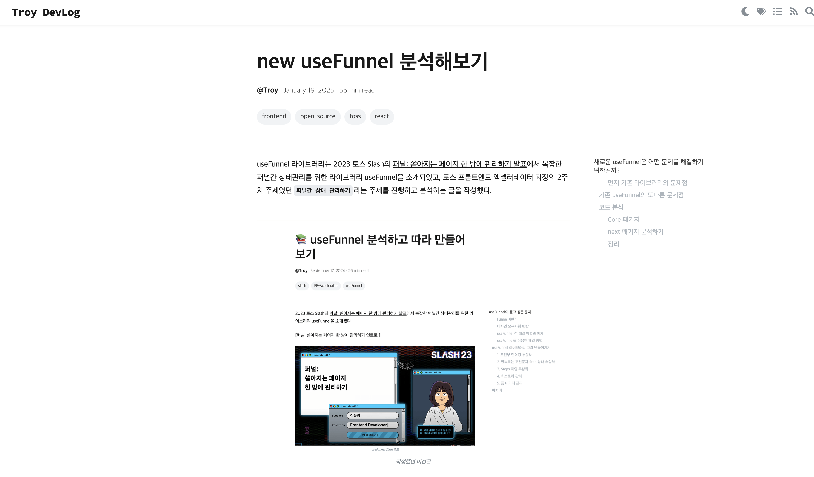

2025년이 시작되고, 새로운 업무와 새로운 환경이 시작되었다. 토스에 11월에 입사하면서 이제 3개월이 되는 달로, 바쁘게 일했던 11월, 12월을 지나 1월은 상대적으로 이번 한해를 준비하는 작업들을 진행하는 달이었다.

12월 말의 off-week 기간과 글을 쓰는 현재 설날의 긴 연휴로 인해 3개월이란 시간이 상대적으로 더 빠르게 느껴졌지만, 한달간의 업무를 정리해보고 12월에 세웠던 목표를 이루었는지 다음달에는 어떤 목표로 나아갈 지 생각해보려 한다.

## 새롭게 담당하게 된 퍼널 개선 업무

1월이 되면서 조직 개편이 있었고, 기존 토스 코어내 세금 사일로에서 토스 인컴의 퍼널 개선 사일로로 이동하게 되었다. 이에 따라 일하는 사무실도 변경되었고, 담당하는 업무도 변경되게 되었다.

기존 메이트분이 담당하시던 퍼널 관련 업무들을 이제 내가 담당하게 되어 현재 진행중인, 앞으로 내가 할 업무들에 대해 다운로드받게 되었다.

메이트 분께서 다운로드를 해주시는 내용을 들으면서, 부분부분 코드나 기술적인 건 이해가 되지만, 큰 흐름과 도메인과 관련된 부분을 이해하는데 많은 어려움이 있었다. 세금이란 도메인에 어려운 용어들이 혼재되어 있고, 관련 법률사항들이 예외케이스들이 하나하나 코드에 녹아들어있다보니 완전히 이해하는데 오랜시간이 걸렸다. `나는 내 담당 제품에 대해 너무 모르고 일해왔구나` 체감하게 되었다.

이러한 부족한 도메인 지식은 문제가 있을때 어떻게 풀어나갈 지에 대해 어려움으로 이어졌다. 예를 들어 특정 공제 내용이 잘못 적용되어 신고되는 케이스가 있다는 내용을 전달받아도 해당 공제 관련 구현에서 각 변수들의 의미는 뭔지부터 시작해 어떤게 기존에 문제가 되는지 파악도 어려웠다.

팀원분들이 내가 어려워하는 것을 이해해주셔서 디자이너분과 백엔드 개발자분이 필요한 업무에 대해 정리해주시고 문제를 뾰족하게 만들어주셨지만 이대로는 안되겠다는 생각이 많이 들었다.

메이트 분께서 다운로드를 해주시면서 담당했던 제품중에서 가장 길고 복잡한 퍼널 제품중 하나라고 말씀해주신 만큼, 퍼널을 다루는 것에 있어서 깊이가 필요하다고 생각해 자주 사용하는 새로운 `useFunnel` 라이브러리 버전으로 정리를 하면서 내부구현을 이해하고 활용해보려 했다. 아직 글을 작성하는 중이지만 조만간 정리 글을 작성해보려 한다.

두번째로 내가 모르는 도메인 관련 지식을 모르는 상태로 계속해서 두게 되면, 그때 계속해서 물어서만 일하게 되면 팀원분들의 추가적인 리소스가 드는 것 뿐 아니라 내 자신의 업무주도성이 떨어지겠다는 걱정이 많이 들었다.

2월부터는 이러한 도메인 내용들 또한 마주할 때마다 관련 법률과 용어들을 정리하고 이해하는 시간을 가지면서 업무를 진행해나가려 한다. 그리고 이러한 도메인 내용을 바탕으로 내가 기여할 수 있는 부분을 제안하는 것을 액션아이템으로 삼아보려 한다.

## 토스 생활: alignment week

토스에는 한해를 시작하면서 `alignment week`라는 이름의 행사가 있다. 이 행사는 토스 내 모든 팀들이 과거 한해를 돌아보고, 새로운 한해를 시작하면서 목표를 세우고 이를 이루기 위해 모두 모여 이야기하는 시간을 가지는 행사다.

[2023년 토스 얼라이먼트 위크](https://blog.toss.im/article/alignmentweek23-1)

다른 팀의 발표를 듣고, 우리 팀의 PM분이 발표하는 시간에 응원도 하면서 정말 많은 팀에서 다양한 문제를 풀기위해 애쓰고 있고, 토스에는 일에 열정이 가득한 사람들이 많다는 것과, 앞으로가 더 기대됨을 느낄 수 있었다.

내년에 더 큰 성과를 우리팀의 발표로 할 수 있도록 기여해보고 싶다.

## 새로운 환경과 사람들

팀의 소속이 변경되면서 인컴분들과 함께 사무실을 사용하게 되었고, 새로운 사람들과 함께하게 되었다.

기존 사일로분들이 메이트분을 제외하고 함께 옮겨지게 되었고, 간간히 함께 일했던 분들이 계셨지만 새롭게 합류한 분들이 많았다.

새롭게 합류하신 분 중에는 프론트엔드 개발자분도 계셔서 오시기전, 노션으로 기존 개발 환경, 진행중인 업무 등에 대해 정리한 문서를 작성했다. 이후에 합류 이후에 해당 문서를 전달드리고 그것을 바탕으로 함께 팀내 프론트엔드 온보딩 문서로 발전시키기도 했다. 코어에서 2년 넘게 일하셨던 분이다 보니 정리를 굉장히 잘하시고, 프로젝트의 필요한 부분을 히스토리로 남겨두는 것을 잘하셨다.

기존 메이트분의 장점은 반복업무에 대해서 굉장히 효율화 잘하시는 분이셨다. Raycast나 Shell Script, snippet을 자체적으로 만드셔서 반복된 업무에 대해 템플릿을 만들어 사용하는 것을 많이 배울 수 있었는데, 이분의 장점을 또 찾고 배워나가는 것을 기대하고 있다.

뿐만 아니라 새로운 동료분들과 이야기하면서 각자 새로운 환경에 대한 목표가 있는게 좋았고, 이분들의 장점을 찾아보고 배워나가는 것을 기대하고 있다. 함께 더 좋은 제품, 더 좋은 팀을 만들어나가기를 바래본다.

## 사내 라이브러리 개발

사내 라이브러리를 1월 중순까지 거의 10개 정도의 PR을 올렸고 길드 내 첫 마일스톤으로 잡았던 작업량을 달성할 수 있었다.

현재 남겨두고 있는 부분은 해당 라이브러리를 오픈소스로 공개하기 전 문서 작업들과 사내에서 마이그레이션 진행시 편리하게 옮길 수 있도록 codemod를 만드는 작업이 남았다. 나는 이중 codemod를 만드는 작업을 담당하게 되었고 설 연휴 동안 작업을 진행해볼 예정이다.

12월 말부터 거의 하루에 한개정도 작업을 했던 게 실제로 오픈하기 까지 얼마 남지 않은 것 같아 기대도 되고, 뿌듯하기도 했다. 계속해서 관심을 가지고 사용하시는 분들과 소통도 하면서 적극적으로 계속해서 기여해나가는 것을 목표로 하려한다.

## 토스 얼라이먼트 위크

## 이전 한달과 다음 한달의 목표

이전 한달의 목표들은 아래와 같았다.

- [] 숨은 환급액 찾기 제품 내 개선할 부분 제시하고 작업해보기 (제시까지는 못함)
- [x] 토스 프론트엔드 라이브러리 분석하기
- [x] 사내 라이브러리에 기여하기

### 숨은 환급액 찾기 제품 내 개선할 부분 제시하고 작업해보기

숨은 환급액 찾기 서비스를 이용하면서 진입시 로딩시간이 길다는 생각이 들어 실제 유저가 겪고 있는 시간이 얼마나 되는지 측정작업을 먼저 진행했다. 기존에 코어 서비스들은 측정이 되고 있었지만 인컴 제품은 계열사가 달라 따로 데이터를 쌓기위한 작업이 필요했다.

별도 작업을 하더라도 아직 데이터 인프라가 완성되지 않아 세부 데이터까지 수집해서 보기 어려운 상황이었다.

그러면 포기해야하나 할때 백엔드 엔지니어분께서 아이디어를 주셔서 간단하게 추세를 보는 방법에 대해 제안해주셨다.
제시해주신 형식에 맞게 데이터를 쌓고 그라파나라는 툴을 이용해서 대시보드를 간략하게 만드는 것까지 현재 진행할 수 있었다.

2월에는 어떤 퍼널에서 오랜시간이 걸리고 있고, 이탈을 하고 있는지 확인하며 퍼널간 전환율 개선 작업으로 진행할 수 있도록 제안해보려 한다.

### 토스 프론트엔드 라이브러리 분석하기와 사내 라이브러리 기여하기

`토스 프론트엔드 라이브러리 분석하기`를 위해 개발하는 과정에서 마주하는 다양한 유틸들의 내부 구조들을 분석하고 정리해보고 있다.

이번달은 사내 라이브러리에 기여하면서 리액트 관련 기존 구현들을 분석하고 테스트 케이스, 문서를 보완하는 작업을 진행했다.

추가로 퍼널 개선 업무를 맡으면서 기존의 작성했던 [이전 버전 useFunnel](https://choi2021.github.io/2024-09-17-useFunnel-%EB%B6%84%EC%84%9D%ED%95%B4%EB%B3%B4%EA%B8%B0/)에 이어 [새로운 버전의 useFunnel 라이브러리](https://use-funnel.slash.page/ko/docs/use-funnel)를 분석하고 정리하게 되었다.

코드들을 분석하면서 얼마나 많은 고민이 담긴 패키지인지 느낄 수 있었고, 퍼널 담당 업무를 할때 조금 더 기술적으로 이해도를 높인 상태에서 진행할 수 있겠다는 자신감도 얻을 수 있었다.

다음 한달은 개발과정에서 많이 사용하는 react-query 라이브러리를 분석하고 정리해보려 한다.

### 다음 한달의 목표

다음 한달의 목표는 이전 한달의 목표 달성 현황과 작업을 하면서 느꼈던 느낀점을 바탕으로 4가지로 정해보았다.

- 숨은 환급액 찾기 제품 내 퍼널 개선 필요 지점 제안하고 개선하기
- 세금 관련 공제 내용 정리하기
- 사내 라이브러리 기여하기
- 데이터 패칭 관련 라이브러리 분석하기

욕심이 많아 다 잘하고 싶어 계속 늘어가는 것 같지만, 더 좋은 개발자, 더 좋은 동료가 되기 위해 계속해서 발전해나가는 것을 목표로 하려 한다.

블로그를 작성하는 것을 팀원분들께 들킨(?) 이후로 한달 회고가 언제 올라오는지 놀림반, 관심반을 받고 있다.

내가 작성한 글을 누군가 읽고 있으니 더 책임감을 가지고 액션 아이템들을 이루어나가기를 바라본다.
