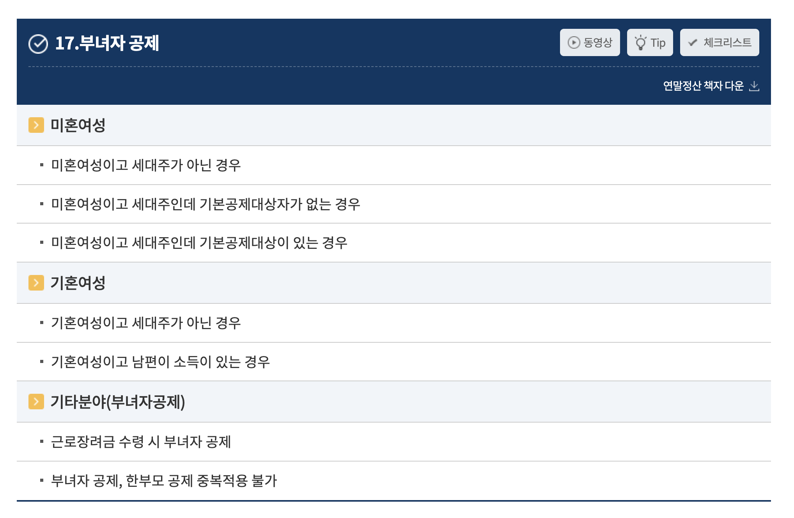

2025년 2월은 토스 인컴 오피스로 이사하고 일하는 첫 달이었다. 넓어진 새로운 공간에 쾌적하게 일하며 다양한 고민을 했던 2월이었다. 2월했던 작업들을 돌아보고 1월에 하기로 했지만 못했던 것, 새롭게 시작하게 된 것 등을 정리해보고자 한다.

## 세금 도메인 이해도 높이기

1월에 도메인에 대한 지식이 떨어져 업무 주도성이 떨어짐을 느꼈었다. 그 이후에 다행히(?)도 도메인 지식으로 인해 작업 자체가 어렵거나 한 경우는 적었지만 목표했던 공부는 하지 못했다...😞

그래도 다행히 점은 1월에 도메인 지식이 필요하다고 느끼게 만들어준(?) `부녀자 공제` 관련 문제를 조금 더 수월하게 이해하고 해결작업을 진행했다. 처음에는 `부녀자 공제`라는 단어 자체가 낯설고, 유저가 세대주/ 세대원인지 그리고 여기에 기본공제 대상자인지 아닌지 등 굉장히 많은 조건들이 얽혀있다보니 이해하는데 많은 시간이 걸렸다.

분명 앞으로도 이렇게 도메인에 대해 이해하고 작업이 필요한 경우가 있을 것이고, 퇴근하고 공부하는게 어렵지만 진짜 3월부터는 매일 조금씩 해보기로 목표로 해보려 한다.

## 토스 입사 후 첫 발표: Fast Refresh 고치기

토스 입사 후 처음으로 프론트엔드 미팅시간에 발표를 진행하게 되었다. 주제는 `Fast Refresh 고치기`로 Next의 Fast Refresh가 동작하지 않는 상황을 해결해 나간 해결 과정에 대해 발표를 진행했다. 소그룹에서 먼저 발표를 진행했던 내용을 소그룹 리더분께서 모바일 트랙 미팅에도 같은 내용으로 발표해주면 좋겠다고 제안해주셨고 감사한 기회로 발표하게 되었다.

`Fast Refresh`는 Next에서 사용하는 HMR 기능으로 개발 중인 페이지에 변경사항이 생기면 변경사항을 바로 반영해주는 기능이다. 하지만 이 기능이 동작하지 않는 상황이었기 때문에 단순 문구 수정이나 스타일 수정에도 매번 full reload가 필요했다.

해결방법은 `패키지 업그레이드`라는 아주 간단한 방법이었지만, 어떻게 패키지 업그레이드를 하면 되는지 해결방법을 도출하고, 실제 어떤 변경사항이 해당 버전에 적용되어 수정되었는지를 담은 내용으로 발표를 준비했다.

하지만 발표하는 과정에서 방송사고(?)가 발생했다. 발표가 목요일이라 수요일 밤에 퇴근 후 2시간동안 열심히 영상도 만들어서 준비했건만, 사내 자료라 생각되어 영상을 유튜브에 올리고 비공개로 해두어 발표 자료 계정에서 아무것도 재생이 안되었다...

너무 당황스러웠지만 사진과 글로만 우선 전달드리고 나중에 전체 공개로 변경한 자료를 다시 올려드렸지만 첫 발표가 이렇게 되어 아쉬움이 많이 남았다.

그래도 발표가 끝나고 `똑같이 겪고 있었던 이슈였다고 감사하다`는 챕터원분이 직접 현장에서 말씀해주셨고, 나를 추천해주셨던 멘토분께서도 `벌써 발표를 하는게 대단하다`는 말씀도 해주셔서 아예 무의미하지는 않았구나라는 생각과 함께 조금은 위안이 되었다.

다음에 또 언제 발표하게 될지는 모르겠지만 그때는 조금 더 발표자료를 열심히 체크하고 더 의미있는 작업을 공유해보고자 한다.

## 2월의 액션아이템과 다음 달을 위한 액션 아이템 정리

1월 회고에서 작성했던 2월의 액션아이템은 아래와 같다.

- [ ] 숨은 환급액 찾기 제품 내 퍼널 개선 필요 지점 제안하고 개선하기
- [x] 세금 관련 공제 내용 정리하기
- [ ] 사내 라이브러리 기여하기
- [ ] 데이터 패칭 관련 라이브러리 분석하기

종합적으로는 계획했던 부분을 많이 진행하지 못한 2월이었다.

퍼널 개선이 필요한 점을 제시하기는 했지만, 아직 작업을 진행하지는 못했다. 팀의 우선순위에 따라 3월에는 퍼널 개선 작업을 진행해보고자 한다.

세금 관련 공제 내용은 체크하기는 애매하지만 그래도 부녀자 공제 이슈를 수정하면서 한발짝 나아갔다고 생각했다. 3월에는 세금 관련 서적을 읽고 더 자세히 정리해보고자 한다.

사내라이브러리 작업은 약간 정체하게 되었다. 이미 외부에서 많이 사용하고 있는 라이브러리가 있어 우리 길드의 라이브러리를 조금 더 가다듬기 위한 목표와 방향성을 잡는데 더 많은 시간을 사용했다. 3월부터는 새롭게 잡은 목표로 적극적으로 기여를 해 프로젝트가 성공적으로 오픈될 수 있도록 해보려고한다.

Tanstack query를 분석해보려했지만, Fast Refresh 이슈를 수정하고 발표자료를 준비하면서 HMR에 대해 더 자세히 공부하고 정리해보고 있다. 평소 잘 몰랐던 분야이다보니 조금 더 시간이 걸릴 것 같지만 정리하는 글도 작성해보려 한다.

### 3월의 액션아이템

3월의 액션 아이템은 아래와 같다.

- [ ] 퍼널 개선 작업 진행하기
- [ ] 더 일을 잘하기 위해 일감을 쌓고 함께 진행하기
- [ ] 세금 도메인 관련 서적 읽고 정리하기
- [ ] 사내 라이브러리 기여하기
- [ ] HMR 관련 글 작성하기

3월에는 내가 성장하는 것 뿐 아니라 팀이 편해지고 함께 성장할 수 있는 주제들도 진행해보려 한다. 한달에 한번씩 인컴 내 프론트엔드 회의시간을 갖고 있고 팀원분께서 좋은 아이디어를 많이 제시해주고 계시기 때문에, 나도 조금 더 효율적으로 잘 일할 수 있도록 다양한 주제들을 제안하고 작업을 진행해 보고 싶다.

또한 2월에 하지 못했던 액션 아이템들을 조금 더 진행해보고, 공부하고 있던 HMR 관련 글을 작성해보려 한다.

## 성장에 대해 고민하는 2월

이번 달은 여러 일을 했지만 성장에 대해 많이 고민했던 한달이었다. 개인적으로 내가 욕심이 너무 많다는 생각이 들었다. 다 잘하는 개발자가 되고 싶지만, 시간이 한정적이다 보니 빠르게 해결하지 못하고 일은 쌓여가는 걸 보다보니 늘 부채감이 쌓이는 것 같았다. 이런 이야기를 팀원분들께 드렸을 때 `모든 걸 잘하는 개발자가 되는 것을 포기해라`고 말씀해주셨다. 시간은 한정적이니까 혼자서 다 처리하는 게 아니라 적극적으로 동료에게 지금 해야하는 일들에 대해 우선순위를 세워달라고 공유하는 게 중요하다는 말씀을 해주셨다.

내가 생각하는 좋은 개발자는 모든 문제를 척척하는 개발자, 실무가 아주 뛰어난 사람이라고 생각했구나 생각이 들었고, 팀으로 일하는 것이 어떤 것인지 조금 더 고민하는 시간이었다. 내가 못하는 걸 잡고 시간을 많이 쏟는 게 잘하는 게 아니라 가장 잘하는 분께 적절하게 위임하는 게 중요하다는 것을 느꼈다.

슈퍼 개발자보다 `팀플레이어 개발자`를 목표로 조금 더 성장하는 3월이 되기를 바란다.
